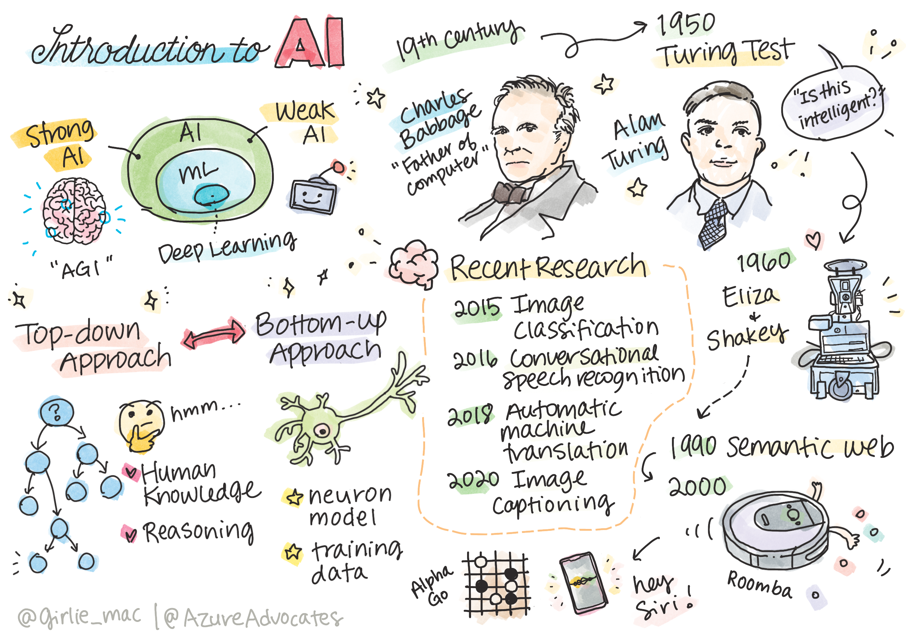
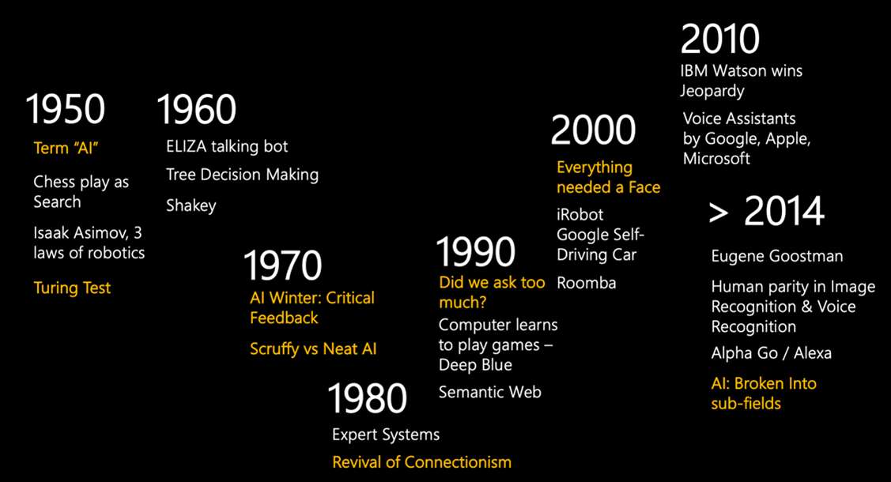

# Introduction to AI

**Artificial Intelligence** is an exciting scientific discipline that studies how we can make computers exhibit intelligent behavior, e.g. do those things that human beings are good at doing.

Originally, computers were invented by [Charles Babbage](https://en.wikipedia.org/wiki/Charles_Babbage) to operate on numbers following well-defined procedure - an algorithm. Modern computers, even though significantly more advanced than original model proposed in 19th century - still follow the same idea of controlled computations. Thus it is easy to program computer to do something if we know the exact sequence of steps that we need to do in order to achieve the goal.

 | Defining an age of a person from his/her photograph is a task that cannot be explicitly programmed, because we do not know how we come up with a number inside our head when we do it.
----|----

There are some tasks, however, that we do not explicitly know how to solve. Consider determining the age of a person from his/her photograph. We somehow learn to do it, because we have seen many examples of people of different age, but we cannot explicitly explain how we do it, nor can we program the computer to do it. This is a exactly the kind of tasks that are of interest to **Artificial Intelligence** (AI for short).

## Weak AI vs. Strong AI

The task of solving a specific human-like problem, such as determining a person's age from a photo, can be called **Weak AI**, because we are creating a system for only one task, and not a system that can solve many tasks, as a human being. Of course, developing a generally intelligent computer system is also extremely interesting from many points of view, including philosophy of consciousness. Such system would be called **Strong AI**, or **[Artificial General Intelligence](https://en.wikipedia.org/wiki/Artificial_general_intelligence)** (AGI).

## Definition of Intelligence. Turing Test.

One of the problems when dealing with the term **[Intelligence](https://en.wikipedia.org/wiki/Intelligence)** is that there is no clear definition of this term. One can argue that intelligence is connected to **abstract thinking**, or to **self-awareness**, but we cannot properly define it.

 | To see the ambiguity of a term *intelligence*, try answering a question: "Is a cat intelligent?". Different people tend to give different answer to this question, as there is not universally accepted test to prove this true or not. And if you think there is - try running your cat through an IQ test...
----|----

However, when speaking about AGI we need to have some way to tell if we have created a truly intelligent system. [Alan Turing](https://en.wikipedia.org/wiki/Alan_Turing) proposed such a way called **[Turing Test](https://en.wikipedia.org/wiki/Turing_test)**, which also acts like a definition of intelligence. The idea of such a test is that we compare our system to something inherently intelligent - a real human being. And because any automatic comparison can be easily bypassed by a computer program - we use human interrogator. So, if a human being is unable to distinguish between a real person and a computer system in text-based dialogue - the system is considered intelligent. 

> A chat-bot [Eugene Goostman](https://en.wikipedia.org/wiki/Eugene_Goostman), developed in St.Petersburg, came close to passing Turing test in 2014, but using clever personality trick. It announced upfront to be a 13-year old Ukranian boy, which would explain the lack of knowledge and some discrepancies in text. The bot convinced 30% of the judges after 5 minute dialogue, a metric that Turing believed a machines would be able to pass by 2000. However, one should understand that this does not indicate that we have created an intelligent system, or that a computer system has fooled the human interrogator - it was not a computer system, but the bot creators.

## Different Approaches to AI

If we want computer to behave like a human, we need somehow to model inside a computer our way of thinking. Consequently, we need to try to understand what makes a human being intelligent.

> To be able to program intelligence into a machine, we need to understand how our own process of taking decisions work. If you do a little self-introspection, you will realize that there are some processes that happen subconsciously – eg. we can distinguish a cat from a dog without thinking about it - while some others involve reasoning.

There are two possible approaches to this problem:

Top-down Approach (Symbolic Reasoning) | Bottom-up Approach (Neural Networks)
---------------------------------------|-------------------------------------
Modelling the way a person reasons to solve a problem. It involves extracting **knowledge** from a human being, and representing it in a computer-readable form. We also need to develop a way to model **reasoning** inside a computer. | Modelling a structure of a human brain, consisting of huge number of simplest units called **neurons**. Each neuron acts like a simple weighted average of its inputs, and we can train a network of neurons to solve useful problems by providing **training data**.

There are also some other possible approaches to intelligence:

* **Emergent**, **Synergetic** or **multi-agent approach** is based on the fact that complex intelligent behaviour can be obtained by an interaction of large number of simple agents. According to [evolutionary cybernetics](https://en.wikipedia.org/wiki/Global_brain#Evolutionary_cybernetics), intelligence can *emerge* from more simple, reactive behaviour in the process of *metasystem transition*.
* **Evolutionary approach**, or **genetic algorithms** is an optimization process based on the principles of evolution. 

We will consider those approaches later in the course, but right now we will focus on two main directions.
### Top-Down Approach

In **top-down approach**, we try to model our reasoning.  Because we can follow our thoughts when we reason, we can try to formalize this process and program it inside the computer. This is called **symbolic reasoning**. 

People tend to have some rules in their head, for example, when a doctor is diagnosing a patient, he may realize that a person has a fever, and thus there might be some inflammation going on in his body. By applying a large set of rules to a specific problem a doctor may be able to come up with the final diagnosis. 

This approach relies heavily on **knowledge representation** and **reasoning**. Extracting knowledge from a human expert might be the most difficult part, because a doctor in many cases would not know exactly why he or she is coming up with a particular diagnosis. Sometimes the solution just comes up in his/her head without explicit thinking. Some tasks, such as determining the age of a person from photograph, cannot be at all reduced to manipulating knowledge.

### Bottom-Up Approach

Alternatively, we can try to model the simplest elements inside our brain – a neuron. We can construct so-called **artificial neural network** inside a computer, and then try to teach it to solve problems by giving it examples. This process is similar to how a newborn child learns about the world around him by observations. 

A part of Artificial Intelligence that is based on computer learning to solve the problem based on some data is called **Machine Learning**. We will not consider classical machine learning in this course - we refer you to a separate [Machine Learning for Beginners](http://aka.ms/ml-for-beginners) Curriculum. | 
-----|-----

## A Brief History of AI

Artificial Intelligence was started as a field in the middle of XX century. Initially symbolic reasoning was a prevalent approach, and it led to a number of important successes, such as expert systems – computer programs that were able to act as an expert in some limited problem domain. However, it soon became obvious that such approach does not scale well. Extracting the knowledge from an expert, representing it in a computer, and keeping that knowledgebase accurate turns out to be a very complex task, and too expensive to be practical in many cases. This led to so-called [AI Winter](https://en.wikipedia.org/wiki/AI_winter) in the 1970s.

As time passed, computing resources became cheaper, and more data has become available, the neural network approaches started demonstrating great performance in competing with human beings in many areas, such as computer vision, or speech understanding. In the last decade, the term Artificial Intelligence is mostly used as a synonym for Neural Networks, because most of the AI successes that we hear about are based on them.

We can observe how the approaches changed, for example, in creating a Chess playing program:

* Early chess programs were based on search – a program explicitly tried to estimate possible moves of an opponent for a few next moves, and selected an optimal move based on the optimal position that can be achieved in a few moves. It led to the development of so-called [alpha-beta pruning](https://en.wikipedia.org/wiki/Alpha%E2%80%93beta_pruning) search algorithm.
* Search strategies work good towards the end of the game, where search space is limited by a small number of possible moves. However, in the beginning of the game the search space is huge, and the algorithm can be improved by learning from existing matches between human players. This employed so-called [case-based reasoning](https://en.wikipedia.org/wiki/Case-based_reasoning), where we are looking for cases in the knowledgebase very similar to the current position in the game.
* Modern programs that win over human players are based on neural networks and [reinforcement learning](https://en.wikipedia.org/wiki/Reinforcement_learning), where the programs learns to play solely by playing a long time with itself and learning from its own mistakes – much like human beings do when learning to play chess. However, a computer program can play many more games in much less time, and thus can learn much faster.

Similarly, we can see how the approach towards creating “talking programs” (that might pass Turing test) changed:

* Early program of this kind, [Eliza](https://en.wikipedia.org/wiki/ELIZA), was based on very simple grammatical rule and re-formulation of the input sentence into a question.
* Modern assistants, such as Cortana, Siri or Google Assistant, are all hybrid systems, that use Neural networks to convert speech into text and to recognize our intent, and then employ some reasoning or explicit algorithms to perform required actions
* In the future, we may expect complete neural-based model to handle dialogue by itself. Recent GPT and [Turing-NLG](https://turing.microsoft.com/) family of neural networks show great success in this.

## Recent AI Research

Recent huge growth in neural network research started around 2010, when large public datasets started to become available. A huge collection of images called [ImageNet](https://en.wikipedia.org/wiki/ImageNet), which contains around 14 million annotated images, gave birth to [ImageNet Large Scale Visual Recognition Challenge](https://image-net.org/challenges/LSVRC/).

In 2012, [Convolutional Neural Networks](../4-ComputerVision/07-ConvNets/README.md) were first used in image classification, which lead to significant drop in classification errors (from almost 30% to 16.4%). In 2015, ResNet architecture from Microsoft Research [achieved human-level accuracy](https://doi.org/10.1109/ICCV.2015.123).

Since then, Neural Networks demonstrated very successful behaviour in many tasks:

------|-------
Year | Human Parity in 
-----|--------
2015 | [Image Classification](https://doi.org/10.1109/ICCV.2015.123)
2016 | [Conversational Speech Recognition](https://arxiv.org/abs/1610.05256)
2018 | [Automatic Machine Translation](https://arxiv.org/abs/1803.05567) (Chinese-to-English)
2020 | [Image Captioning](https://arxiv.org/abs/2009.13682)

Last years witnessed huge successes with large language models, such as BERT and GPT-3. This happens mainly due to the fact that there is a lot of general text data available, which allows us to train models that capture the structure and meaning of texts, pre-train them on general text collections, and then specialize those models for more specific tasks. We will learn more about [Natural Language Processing](../5-NLP/README.md) later in this course.

