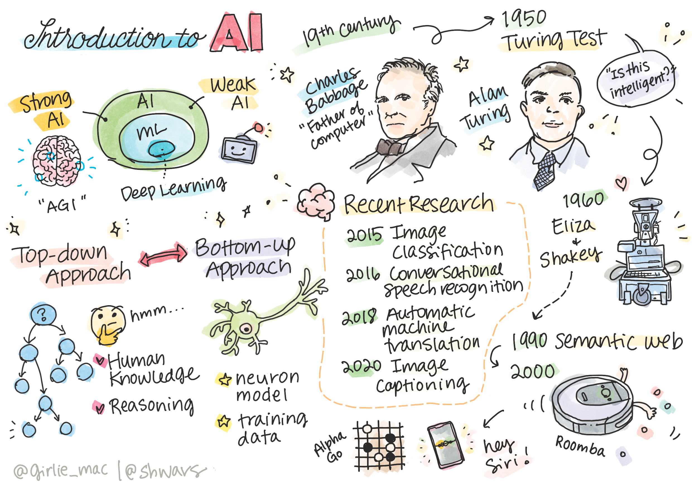
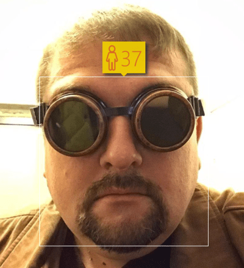
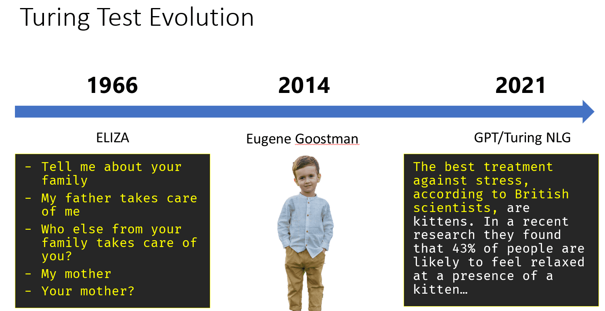

# 人工智能简介

> 速写 [Tomomi Imura](https://twitter.com/girlie_mac)

## [课前测验](https://red-field-0a6ddfd03.1.azurestaticapps.net/quiz/101)

**人工智能**是一门令人兴奋的科学学科，它研究我们如何让计算机表现出智能行为，例如做那些人类擅长做的事情。

最初，计算机是由 [Charles Babbage](https://en.wikipedia.org/wiki/Charles_Babbage) 按照明确定义的程序--算法--对数字进行运算。现代计算机虽然比 19 世纪提出的原始模型先进得多，但仍然遵循相同的受控计算理念。因此，如果我们知道实现目标所需的确切步骤顺序，就有可能对计算机进行编程。

> 摄影师 [Vickie Soshnikova](http://twitter.com/vickievalerie)

>✅ 根据照片确定一个人的年龄是一项无法明确编程的任务，因为我们不知道自己在做这件事时是如何在脑海中得出一个数字的。

---

然而，有些任务我们并不明确知道如何解决。例如，从一个人的照片判断他/她的年龄。因为我们见过很多不同年龄的人的例子，所以我们学会了这样做，但我们无法明确解释我们是如何做到的，也无法给计算机编程来做到这一点。这正是**人工智能**（简称 AI）感兴趣的任务。

✅ 想一想，你可以把哪些任务卸载给计算机，从而受益于人工智能。考虑一下金融、医学和艺术领域--这些领域如今是如何从人工智能中受益的？

## 弱人工智能 vs. 强人工智能

弱人工智能 | 强人工智能
---------------------------------------|-------------------------------------
弱人工智能指的是针对特定任务或范围较小的任务设计和训练的人工智能系统。|强人工智能或人工通用智能（AGI）是指具有人类水平的智能和理解能力的人工智能系统。
这些人工智能系统一般没有智能；它们擅长执行预定任务，但缺乏真正的理解或意识。|这些人工智能系统有能力完成人类能够完成的任何智力任务，适应不同领域，并拥有某种形式的意识或自我意识。
弱人工智能的例子包括 Siri 或 Alexa 等虚拟助手、流媒体服务使用的推荐算法，以及专为特定客户服务任务设计的聊天机器人。|实现 "强人工智能 "是人工智能研究的一个长期目标，需要开发出能够在各种任务和环境中进行推理、学习、理解和适应的人工智能系统。
弱人工智能高度专业化，不具备类似人类的认知能力或超越其狭隘领域的一般问题解决能力。|目前，强人工智能还只是一个理论概念，还没有任何人工智能系统达到这种通用智能水平。

更多信息请参阅 **[人工智能](https://en.wikipedia.org/wiki/Artificial_general_intelligence)** (AGI).
## 智力的定义和图灵测试

在处理 **[智力](https://en.wikipedia.org/wiki/Intelligence)** 一词时，其中一个问题是 这个词没有明确的定义。人们可以说智力与**抽象思维**或**自我意识**有关，但我们无法给它下一个恰当的定义。

> 由 [Amber Kipp]拍摄的[照片](https://unsplash.com/photos/75715CVEJhI) (https://unsplash.com/@sadmax) 来自 Unsplash

要想知道 "智能 "一词的歧义，可以试着回答一个问题： "猫聪明吗？对于这个问题，不同的人往往会给出不同的答案，因为并没有一个公认的测试方法来证明这一说法的真假。如果你认为有，那就试着对你的猫进行智商测试......

✅ 想一想你是如何定义智力的。能解开迷宫并获得食物的乌鸦聪明吗？孩子聪明吗？

---

在谈论 AGI 时，我们需要有一些方法来判断我们是否创造了一个真正的智能系统。 [艾伦-图灵](https://en.wikipedia.org/wiki/Alan_Turing) 提出了一种叫做 **[图灵测试](https://en.wikipedia.org/wiki/Turing_test)**方法, 这也是对智力的定义. 由于计算机程序可以绕过任何自动比较，因此我们使用了人类询问者。因此，如果人类无法在基于文本的对话中区分真人和计算机系统，那么该系统就被认为是智能系统。

> 一个叫做 [Eugene Goostman](https://en.wikipedia.org/wiki/Eugene_Goostman)的聊天机器人, 2014年，这款在圣彼得堡开发的 "机器人 "通过巧妙的人格测试，险些通过图灵测试。它事先宣布自己是一名 13 岁的乌克兰男孩，这就解释了文本中知识的缺乏和一些差异。经过 5 分钟的对话，该机器人让 30% 的评委相信它是人类，而图灵认为到 2000 年机器就能通过这一指标。不过，我们应该明白，这并不表明我们已经创造出了一个智能系统，也不表明计算机系统骗过了人类审问者--不是系统骗过了人类，而是机器人的创造者骗过了人类！

✅ 您有没有被聊天机器人骗过，以为您是在和人类交谈？它是如何说服你的？

## 人工智能的不同方法

如果我们想让计算机的行为像人一样，我们就需要以某种方式在计算机中模拟我们的思维方式。因此，我们需要了解是什么让人类变得聪明。

> 要想为机器编写智能程序，我们需要了解人类自身的决策过程。如果你稍微自我反省一下，就会发现有些过程是下意识的，比如我们可以不假思索地分辨出猫和狗，而另一些过程则涉及推理。

解决这个问题有两种可能的方法：

自上而下法（符号推理） | 自下而上法（神经网络）
---------------------------------------|-------------------------------------
自上而下的方法是模拟人解决问题的推理方式。它涉及从人的**知识中提取**，并以计算机可读的形式表示出来。我们还需要开发一种方法来模拟计算机内部的**推理**。| 自下而上的方法以人脑结构为模型，人脑由大量称为**神经元**的简单单元组成。每个神经元就像其输入的加权平均值，我们可以通过提供**训练数据**来训练神经元网络，以解决有用的问题。

还有其他一些可能的智能方法：

**新兴**、**协同**或**多代理方法**的基础是，复杂的智能行为可以通过大量简单代理的相互作用而获得。根据[进化控制论](https://en.wikipedia.org/wiki/Global_brain#Evolutionary_cybernetics)，在**元系统过渡**过程中，智能可以从较为简单的反应行为中**产生。

**进化方法**或**遗传算法**是一种基于进化原理的优化过程。

我们将在课程的稍后部分考虑这些方法，但现在我们将重点关注两个主要方向：自上而下和自下而上。

### 自上而下的方法

在**自上而下的方法**中，我们试图模拟我们的推理。 因为我们在推理时可以跟随自己的思维，所以我们可以尝试将这一过程形式化，并在计算机中进行编程。这就是**符号推理**。

人们的头脑中往往有一些规则来指导他们的决策过程。例如，当医生诊断病人时，他或她可能会意识到一个人发烧了，因此身体内部可能有一些炎症。通过将大量规则应用于特定问题，医生可能会得出最终诊断结果。

这种方法在很大程度上依赖于**知识表示**和**推理**。从人类专家那里提取知识可能是最困难的部分，因为在很多情况下，医生并不清楚自己得出特定诊断结果的确切原因。有时，他（她）不需要经过明确的思考，脑子里就会浮现出解决方案。有些任务，例如从照片上判断一个人的年龄，根本无法简化为对知识的操作。

### 自下而上法

或者，我们可以尝试模拟大脑内部最简单的元素--神经元。我们可以在计算机中构建一个所谓的**人工神经网络**，然后通过举例来教它解决问题。这个过程类似于新生儿通过观察了解周围环境的过程。

✅ 对婴儿的学习方式做一些研究。婴儿大脑的基本要素是什么？

> | 什么是机器学习? |        |
> |---------------|-----------|
> | 人工智能的一部分是基于计算机学习来解决基于某些数据的问题，这部分被称为**机器学习**。在本课程中，我们将不考虑经典的机器学习--我们建议您参考单独的[机器学习入门](http://aka.ms/ml-beginners)课程。 |  | !

## 人工智能简史

人工智能作为一个领域始于二十世纪中叶。最初，符号推理是一种流行的方法，并取得了一些重要的成功，如专家系统--能够在某些有限的问题领域充当专家的计算机程序。然而，人们很快就发现，这种方法并不能很好地扩展。从专家那里提取知识，用计算机将其表示出来，并保持知识库的准确性，是一项非常复杂的任务，而且成本太高，在很多情况下并不实用。因此，20 世纪 70 年代出现了所谓的[人工智能冬季](https://en.wikipedia.org/wiki/AI_winter)。

> 图片来自于 [Dmitry Soshnikov](http://soshnikov.com)

随着时间的推移，计算资源变得越来越便宜，可用的数据也越来越多，因此神经网络方法开始在计算机视觉或语音理解等许多领域展现出与人类竞争的卓越性能。在过去十年中，人工智能一词大多被用作神经网络的同义词，因为我们听到的大多数人工智能成功案例都是基于神经网络。

例如，在创建下棋计算机程序的过程中，我们可以观察到方法是如何变化的：

* 早期的国际象棋程序是以搜索为基础的--程序明确地尝试估计对手在给定的下一步棋数中可能走的棋步，并根据几步棋所能达到的最佳位置选择最佳棋步。这导致了所谓的[阿尔法-贝塔剪枝](https://en.wikipedia.org/wiki/Alpha%E2%80%93beta_pruning) 搜索算法的发展。
* 搜索策略在对局结束时效果很好，因为在对局结束时，搜索空间受到了少量可能棋步的限制。然而，在对局开始时，搜索空间是巨大的，可以通过学习人类棋手之间的现有对局来改进算法。随后的实验采用了所谓的[基于案例的推理](https://en.wikipedia.org/wiki/Case-based_reasoning)，即程序在知识库中寻找与当前对局位置非常相似的案例。
* 现代战胜人类棋手的程序是基于神经网络和[强化学习](https://en.wikipedia.org/wiki/Reinforcement_learning)，即程序完全通过长时间与自己对弈并从自己的错误中学习来学会下棋--就像人类学习下棋一样。不过，计算机程序可以在更短的时间内玩更多的游戏，因此学习速度更快。

✅ 稍微研究一下人工智能玩过的其他游戏。

同样，我们可以看到创建 "会说话的程序"（可能通过图灵测试）的方法是如何变化的：

* 早期的此类程序，如[Eliza](https://en.wikipedia.org/wiki/ELIZA)，基于非常简单的语法规则，并将输入的句子重新表述为一个问题。
* 现代助手，如 Cortana、Siri 或谷歌助手，都是混合系统，使用神经网络将语音转换为文本，并识别我们的意图，然后采用一些推理或明确的算法来执行所需的操作。
* 未来，我们可能会期待一个完整的基于神经网络的模型来处理对话。最近的 GPT 和 [Turing-NLG](https://turing.microsoft.com/)系列神经网络在这方面取得了巨大成功。

>图片由 Dmitry Soshnikov提供, [图片](https://unsplash.com/photos/r8LmVbUKgns) 来自于 [Marina Abrosimova](https://unsplash.com/@abrosimova_marina_foto), Unsplash

## 最新的人工智能研究

近期神经网络研究的巨大发展始于 2010 年左右，当时大型公共数据集开始可用。一个名为[ImageNet](https://en.wikipedia.org/wiki/ImageNet)的巨大图像集合包含了约 1,400 万张注释图像，它催生了[ImageNet 大规模视觉识别挑战赛](https://image-net.org/challenges/LSVRC/)。

> 图片来自于 [Dmitry Soshnikov](http://soshnikov.com)

在2012年, [卷积神经网络](../../4-ComputerVision/07-ConvNets/README.md) 首次用于图像分类，使分类错误率大幅下降（从近 30% 降至 16.4%）。2015 年，微软研究院的 ResNet 架构[达到了人类级别的准确率](https://doi.org/10.1109/ICCV.2015.123)。

从那时起，神经网络在许多任务中都表现得非常成功：

---

年份 | 人类水准
-----|--------
2015 | [图像分类](https://doi.org/10.1109/ICCV.2015.123)
2016 | [会话语音识别](https://arxiv.org/abs/1610.05256)
2018 | [自动机器翻译](https://arxiv.org/abs/1803.05567) (汉译英)
2020 | [图像字幕](https://arxiv.org/abs/2009.13682)

在过去几年中，我们见证了大型语言模型的巨大成功，如 BERT 和 GPT-3。这主要归功于有大量可用的通用文本数据，使我们可以训练模型来捕捉文本的结构和含义，在通用文本集合上对它们进行预训练，然后针对更具体的任务对这些模型进行专门化。我们将在本课程的后半部分学习更多有关 [自然语言处理](../5-NLP/README.md)的内容。

## 🚀 挑战

浏览一下互联网，看看在你看来，人工智能在哪里得到了最有效的应用。是在地图应用程序中，还是在语音转文字服务或视频游戏中？研究系统是如何构建的。

## [课后测验](https://red-field-0a6ddfd03.1.azurestaticapps.net/quiz/201)

## 回归 & 自学

通过 [this lesson]回顾机器学习的历史(https://github.com/microsoft/ML-For-Beginners/tree/main/1-Introduction/2-history-of-ML). 从这一课或这一课最前面的简笔画中选取一个元素，对其进行更深入的研究，以了解其演变的文化背景。

**任务**: [Game Jam](../assignment.md)
