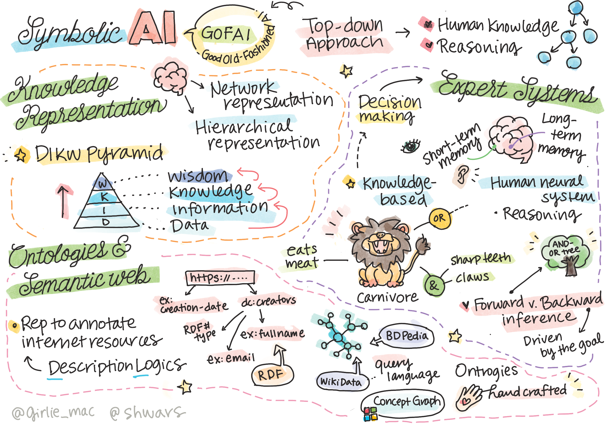
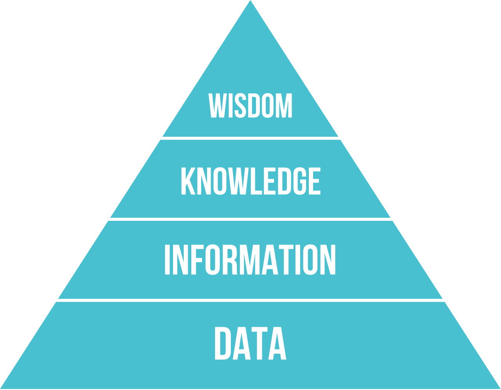
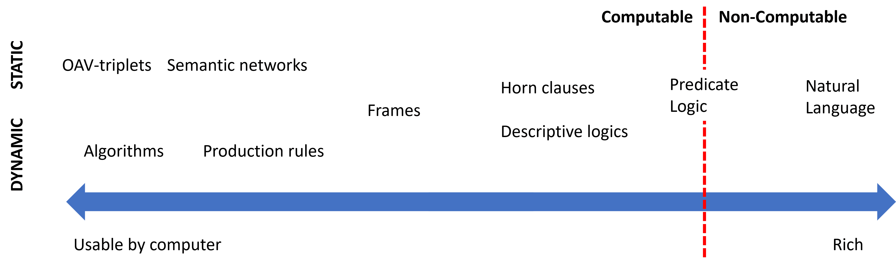
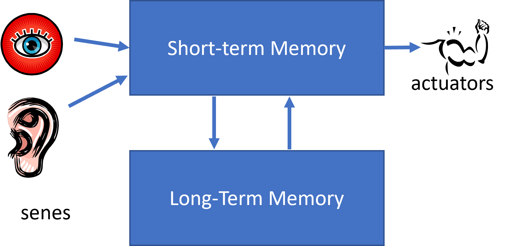
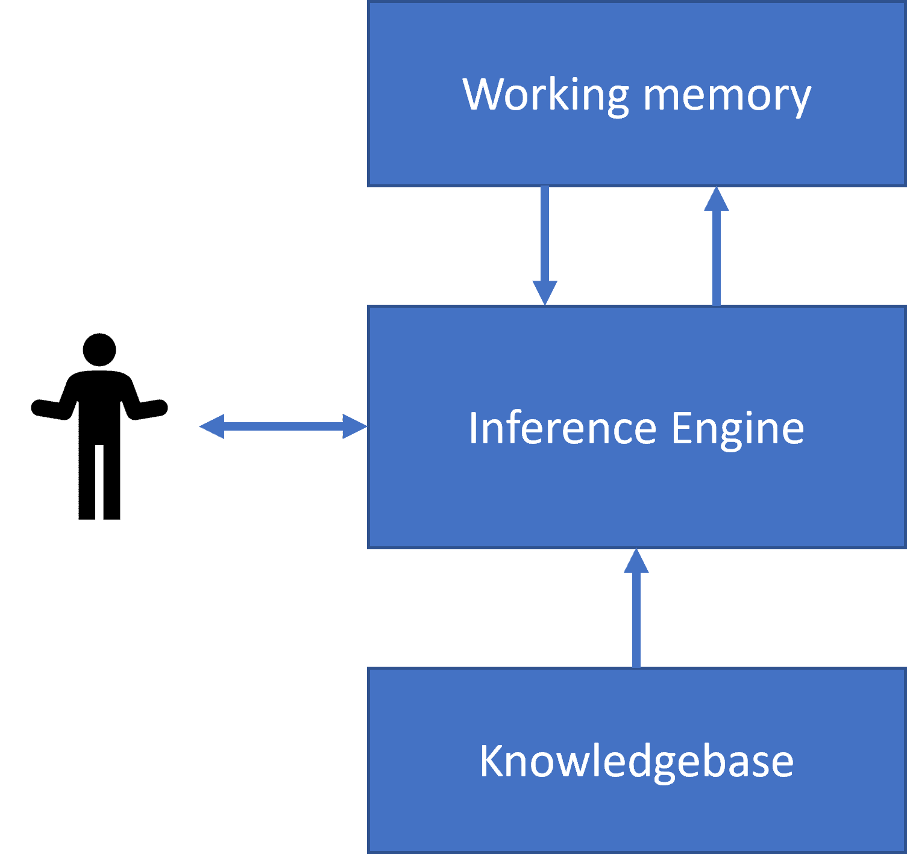
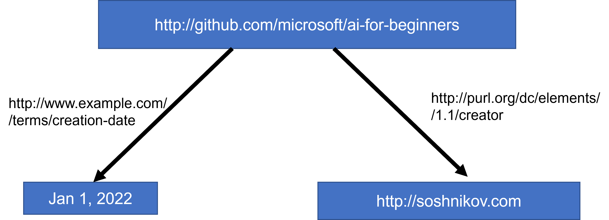
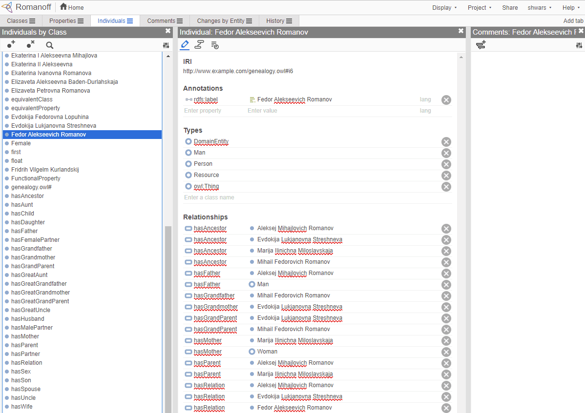

# Knowledge Representation and Expert Systems



> Sketchnote by [Tomomi Imura](https://twitter.com/girlie_mac)

The quest for artificial intelligence is based on a search for knowledge, to make sense of the world similar to how humans do. But how can you go about doing this?

## [Pre-lecture quiz](https://red-field-0a6ddfd03.1.azurestaticapps.net/quiz/102)

In the early days of AI, the top-down approach to creating intelligent systems (discussed in the previous lesson) was popular. The idea was to extract the knowledge from people into some machine-readable form, and then use it to automatically solve problems. This approach was based on two big ideas:

* Knowledge Representation
* Reasoning

## Knowledge Representation

One of the important concepts in Symbolic AI is **knowledge**. It is important to differentiate knowledge from *information* or *data*. For example, one can say that books contain knowledge, because one can study books and become an expert. However, what books contain is actually called *data*, and by reading books and integrating this data into our world model we convert this data to knowledge.

> ✅ **Knowledge** is something which is contained in our head and represents our understanding of the world. It is obtained by an active **learning** process, which integrates pieces of information that we receive into our active model of the world.

Most often, we do not strictly define knowledge, but we align it with other related concepts using [DIKW Pyramid](https://en.wikipedia.org/wiki/DIKW_pyramid). It contains the following concepts:

* **Data** is something represented in physical media, such as written text or spoken words. Data exists independently of human beings and can be passed between people.
* **Information** is how we interpret data in our head. For example, when we hear the word *computer*, we have some understanding of what it is.
* **Knowledge** is information being integrated into our world model. For example, once we learn what a computer is, we start having some ideas about how it works, how much it costs, and what it can be used for. This network of interrelated concepts forms our knowledge.
* **Wisdom** is yet one more level of our understanding of the world, and it represents *meta-knowledge*, eg. some notion on how and when the knowledge should be used.



*Image [from Wikipedia](https://commons.wikimedia.org/w/index.php?curid=37705247), By Longlivetheux - Own work, CC BY-SA 4.0*

Thus, the problem of **knowledge representation** is to find some effective way to represent knowledge inside a computer in the form of data, to make it automatically usable. This can be seen as a spectrum:



> Image by [Dmitry Soshnikov](http://soshnikov.com)

* On the left, there are very simple types of knowledge representations that can be effectively used by computers. The simplest one is algorithmic, when knowledge is represented by a computer program. This, however, is not the best way to represent knowledge, because it is not flexible. Knowledge inside our head is often non-algorithmic.
* On the right, there are representations such as natural text. It is the most powerful, but cannot be used for automatic reasoning.

> ✅ Think for a minute about how you represent knowledge in your head and convert it to notes. Is there a particular format that works well for you to aid in retention?

## Classifying Computer Knowledge Representations

We can classify different computer knowledge representation methods in the following categories:

* **Network representations** are based on the fact that we have a network of interrelated concepts inside our head. We can try to reproduce the same networks as a graph inside a computer - a so-called **semantic network**.

1. **Object-Attribute-Value triplets** or **attribute-value pairs**. Since a graph can be represented inside a computer as a list of nodes and edges, we can represent a semantic network by a list of triplets, containing objects, attributes, and values. For example, we build the following triplets about programming languages:

Object | Attribute | Value
-------|-----------|------
Python | is | Untyped-Language
Python | invented-by | Guido van Rossum
Python | block-syntax | indentation
Untyped-Language | doesn't have | type definitions

> ✅ Think how triplets can be used to represent other types of knowledge.

2. **Hierarchical representations** emphasize the fact that we often create a hierarchy of objects inside our head. For example, we know that canary is a bird, and all birds have wings. We also have some idea about what colour a canary usually is, and what is their flight speed.

   - **Frame representation** is based on representing each object or class of objects as a **frame** which contains **slots**. Slots have possible default values, value restrictions, or stored procedures that can be called to obtain the value of a slot. All frames form a hierarchy similar to an object hierarchy in object-oriented programming languages.
   - **Scenarios** are special kind of frames that represent complex situations that can unfold in time.

**Python**

Slot | Value | Default value | Interval |
-----|-------|---------------|----------|
Name | Python | | |
Is-A | Untyped-Language | | |
Variable Case | | CamelCase | |
Program Length | | | 5-5000 lines |
Block Syntax | Indent | | |

3. **Procedural representations** are based on representing knowledge by a list of actions that can be executed when a certain condition occurs.
   - Production rules are if-then statements that allow us to draw conclusions. For example, a doctor can have a rule saying that **IF** a patient has high fever **OR** high level of C-reactive protein in blood test **THEN** he has an inflammation. Once we encounter one of the conditions, we can make a conclusion about inflammation, and then use it in further reasoning.
   - Algorithms can be considered another form of procedural representation, although they are almost never used directly in knowledge-based systems.

4. **Logic** was originally proposed by Aristotle as a way to represent universal human knowledge.
   - Predicate Logic as a mathematical theory is too rich to be computable, therefore some subset of it is normally used, such as Horn clauses used in Prolog.
   - Descriptive Logic is a family of logical systems used to represent and reason about hierarchies of objects distributed knowledge representations such as *semantic web*.

## Expert Systems

One of the early successes of symbolic AI were so-called **expert systems** - computer systems that were designed to act as an expert in some limited problem domain. They were based on a **knowledge base** extracted from one or more human experts, and they contained an **inference engine** that performed some reasoning on top of it.

 | 
---------------------------------------------|------------------------------------------------
Simplified structure of a human neural system | Architecture of a knowledge-based system

Expert systems are built like the human reasoning system, which contains **short-term memory** and **long-term memory**. Similarly, in knowledge-based systems we distinguish the following components:

* **Problem memory**: contains the knowledge about the problem being currently solved, i.e. the temperature or blood pressure of a patient, whether he has inflammation or not, etc. This knowledge is also called **static knowledge**, because it contains a snapshot of what we currently know about the problem - the so-called *problem state*.
* **Knowledge base**: represents long-term knowledge about a problem domain. It is extracted manually from human experts, and does not change from consultation to consultation. Because it allows us to navigate from one problem state to another, it is also called **dynamic knowledge**.
* **Inference engine**: orchestrates the whole process of searching in the problem state space, asking questions of the user when necessary. It is also responsible for finding the right rules to be applied to each state.

As an example, let's consider the following expert system of determining an animal based on its physical characteristics:


> Image by [Dmitry Soshnikov](http://soshnikov.com)

This diagram is called an **AND-OR tree**, and it is a graphical representation of a set of production rules. Drawing a tree is useful at the beginning of extracting knowledge from the expert. To represent the knowledge inside the computer it is more convenient to use rules:

```
IF the animal eats meat
OR (animal has sharp teeth
    AND animal has claws
    AND animal has forward-looking eyes
) 
THEN the animal is a carnivore
```

You can notice that each condition on the left-hand-side of the rule and the action are essentially object-attribute-value (OAV) triplets. **Working memory** contains the set of OAV triplets that correspond to the problem currently being solved. A **rules engine** looks for rules for which a condition is satisfied and applies them, adding another triplet to the working memory.

> ✅ Write your own AND-OR tree on a topic you like!

### Forward vs. Backward Inference

The process described above is called **forward inference**. It starts with some initial data about the problem available in the working memory, and then executes the following reasoning loop:

1. If the target attribute is present in the working memory - stop and give the result
2. Look for all the rules whose condition is currently satisfied - obtain **conflict set** of rules.
3. Perform **conflict resolution** - select one rule that will be executed on this step. There could be different conflict resolution strategies:
   - Select the first applicable rule in the knowledge base
   - Select a random rule
   - Select a *more specific* rule, i.e. the one meeting the most conditions in the "left-hand-side" (LHS)
4. Apply selected rule and insert new piece of knowledge into the problem state
5. Repeat from step 1.

However, in some cases we might want to start with an empty knowledge about the problem, and ask questions that will help us arrive to the conclusion. For example, when doing medical diagnosis, we usually do not perform all medical analyses in advance before starting diagnosing the patient. We rather want to perform analyses when a decision needs to be made.

This process can be modeled using **backward inference**. It is driven by the **goal** - the attribute value that we are looking to find:

1. Select all rules that can give us the value of a goal (i.e. with the goal on the RHS ("right-hand-side")) - a conflict set
1. If there are no rules for this attribute, or there is a rule saying that we should ask the value from the user - ask for it, otherwise:
1. Use conflict resolution strategy to select one rule that we will use as *hypothesis* - we will try to prove it
1. Recurrently repeat the process for all attributes in the LHS of the rule, trying to prove them as goals
1. If at any point the process fails - use another rule at step 3.

> ✅ In which situations is forward inference more appropriate? How about backward inference?

### Implementing Expert Systems

Expert systems can be implemented using different tools:

* Programming them directly in some high level programming language. This is not the best idea, because the main advantage of a knowledge-based system is that knowledge is separated from inference, and potentially a problem domain expert should be able to write rules without understanding the details of the inference process
* Using **expert systems shell**, i.e. a system specifically designed to be populated by knowledge using some knowledge representation language.

## ✍️ Exercise: Animal Inference

See [Animals.ipynb](https://github.com/microsoft/AI-For-Beginners/blob/main/lessons/2-Symbolic/Animals.ipynb) for an example of implementing forward and backward inference expert system.

> **Note**: This example is rather simple, and only gives the idea of how an expert system looks like. Once you start creating such a system, you will only notice some *intelligent* behaviour from it once you reach certain number of rules, around 200+. At some point, rules become too complex to keep all of them in mind, and at this point you may start wondering why a system makes certain decisions. However, the important characteristics of knowledge-based systems is that you can always *explain* exactly how any of the decisions were made.

## Ontologies and the Semantic Web

At the end of 20th century there was an initiative to use knowledge representation to annotate Internet resources, so that it would be possible to find resources that correspond to very specific queries. This motion was called **Semantic Web**, and it relied on several concepts:

- A special knowledge representation based on **[description logics](https://en.wikipedia.org/wiki/Description_logic)** (DL). It is similar to frame knowledge representation, because it builds a hierarchy of objects with properties, but it has formal logical semantics and inference. There is a whole family of DLs which balance between expressiveness and algorithmic complexity of inference.
- Distributed knowledge representation, where all concepts are represented by a global URI identifier, making it possible to create knowledge hierarchies that span the internet.
- A family of XML-based languages for knowledge description: RDF (Resource Description Framework), RDFS (RDF Schema), OWL (Ontology Web Language).

A core concept in the Semantic Web is a concept of **Ontology**. It refers to a explicit specification of a problem domain using some formal knowledge representation. The simplest ontology can be just a hierarchy of objects in a problem domain, but more complex ontologies will include rules that can be used for inference.

In the semantic web, all representations are based on triplets. Each object and each relation are uniquely identified by the URI. For example, if we want to state the fact that this AI Curriculum has been developed by Dmitry Soshnikov on Jan 1st, 2022 - here are the triplets we can use:



```
http://github.com/microsoft/ai-for-beginners http://www.example.com/terms/creation-date “Jan 13, 2007”
http://github.com/microsoft/ai-for-beginners http://purl.org/dc/elements/1.1/creator http://soshnikov.com
```

> ✅ Here `http://www.example.com/terms/creation-date` and `http://purl.org/dc/elements/1.1/creator` are some well-known and universally accepted URIs to express the concepts of *creator* and *creation date*.

In a more complex case, if we want to define a list of creators, we can use some data structures defined in RDF.


> Diagrams above by [Dmitry Soshnikov](http://soshnikov.com)

The progress of building the Semantic Web was somehow slowed down by the success of search engines and natural language processing techniques, which allow extracting structured data from text. However, in some areas there are still significant efforts to maintain ontologies and knowledge bases. A few projects worth noting:

* [WikiData](https://wikidata.org/) is a collection of machine readable knowledge bases associated with Wikipedia. Most of the data is mined from Wikipedia *InfoBoxes*, pieces of structured content inside Wikipedia pages. You can [query](https://query.wikidata.org/) wikidata in SPARQL, a special query language for Semantic Web. Here is a sample query that displays most popular eye colors among humans:

```sparql
#defaultView:BubbleChart
SELECT ?eyeColorLabel (COUNT(?human) AS ?count)
WHERE
{
  ?human wdt:P31 wd:Q5.       # human instance-of homo sapiens
  ?human wdt:P1340 ?eyeColor. # human eye-color ?eyeColor
  SERVICE wikibase:label { bd:serviceParam wikibase:language "en". }
}
GROUP BY ?eyeColorLabel
```

* [DBpedia](https://www.dbpedia.org/) is another effort similar to WikiData.

> ✅ If you want to experiment with building your own ontologies, or opening existing ones, there is a great visual ontology editor called [Protégé](https://protege.stanford.edu/). Download it, or use it online.



*Web Protégé editor open with the Romanov Family ontology. Screenshot by Dmitry Soshnikov*

## ✍️ Exercise: A Family Ontology


See [FamilyOntology.ipynb](https://github.com/Ezana135/AI-For-Beginners/blob/main/lessons/2-Symbolic/FamilyOntology.ipynb) for an example of using Semantic Web techniques to reason about family relationships. We will take a family tree represented in common GEDCOM format and an ontology of family relationships and build a graph of all family relationships for given set of individuals.

## Microsoft Concept Graph

In most of the cases, ontologies are carefully created by hand. However, it is also possible to **mine** ontologies from unstructured data, for example, from natural language texts.

One such attempt was done by Microsoft Research, and resulted in [Microsoft Concept Graph](https://blogs.microsoft.com/ai/microsoft-researchers-release-graph-that-helps-machines-conceptualize/?WT.mc_id=academic-77998-cacaste).

It is a large collection of entities grouped together using `is-a` inheritance relationship. It allows answering questions like "What is Microsoft?" - the answer being something like "a company with probability 0.87, and a brand with probability 0.75".

The Graph is available either as REST API, or as a large downloadable text file that lists all entity pairs.

## ✍️ Exercise: A Concept Graph

Try the [MSConceptGraph.ipynb](https://github.com/microsoft/AI-For-Beginners/blob/main/lessons/2-Symbolic/MSConceptGraph.ipynb) notebook to see how we can use Microsoft Concept Graph to group news articles into several categories.

## Conclusion

Nowadays, AI is often considered to be a synonym for *Machine Learning* or *Neural Networks*. However, a human being also exhibits explicit reasoning, which is something currently not being handled by neural networks. In real world projects, explicit reasoning is still used to perform tasks that require explanations, or being able to modify the behavior of the system in a controlled way.

## 🚀 Challenge

In the Family Ontology notebook associated to this lesson, there is an opportunity to experiment with other family relations. Try to discover new connections between people in the family tree.

## [Post-lecture quiz](https://red-field-0a6ddfd03.1.azurestaticapps.net/quiz/202)

## Review & Self Study

Do some research on the internet to discover areas where humans have tried to quantify and codify knowledge. Take a look at Bloom's Taxonomy, and go back in history to learn how humans tried to make sense of their world. Explore the work of Linnaeus to create a taxonomy of organisms, and observe the way Dmitri Mendeleev created a way for chemical elements to be described and grouped. What other interesting examples can you find?

**Assignment**: [Build an Ontology](assignment.md)
