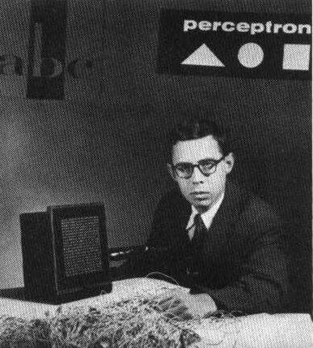
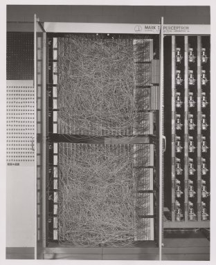
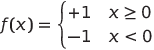

# 神经网络介绍：感知机

## [预先讲课测验](https://red-field-0a6ddfd03.1.azurestaticapps.net/quiz/103)

1957年，康奈尔航空实验室的弗兰克·罗森布拉特首次尝试了一种类似于现代神经网络的实现。这是一种名为"Mark-1"的硬件实现，旨在识别原始的几何图形，如三角形、正方形和圆形。

|      |      |
|--------------|-----------|
| | |> 图片来自[Wikipedia](https://en.wikipedia.org/wiki/Perceptron)

输入图像由一个20x20的光电池阵列表示，因此神经网络有400个输入和一个二进制输出。一个简单的网络包含一个神经元，也称为**阈值逻辑单元**。神经网络的权重就像需要在训练阶段手动调整的电位器。

> ✅ 电位器是一种允许用户调节电路阻力的设备。

当时《纽约时报》这样写关于感知器：*美国海军**期望**的是一个电子计算机的胚胎，它将能够行走、说话、看见、写字、复制自己，并且知道自己的存在。*

## 感知器模型

假设我们的模型具有N个特征，这种情况下输入向量的大小为N。感知机是一个二分类模型，也就是说它可以区分两类输入数据。我们假设对于每个输入向量x，感知机的输出将是+1或-1，取决于其所属的类别。输出将使用公式计算：

y(x) = f(w<sup>T</sup>x)

其中f是一个阶跃激活函数

<!-- img src="http://www.sciweavers.org/tex2img.php?eq=f%28x%29%20%3D%20%5Cbegin%7Bcases%7D%0A%20%20%20%20%20%20%20%20%20%2B1%20%26%20x%20%5Cgeq%200%20%5C%5C%0A%20%20%20%20%20%20%20%20%20-1%20%26%20x%20%3C%200%0A%20%20%20%20%20%20%20%5Cend%7Bcases%7D%20%5C%5C%0A&bc=White&fc=Black&im=jpg&fs=12&ff=arev&edit=0" align="center" border="0" alt="f(x) = \begin{cases} +1 & x \geq 0 \\ -1 & x < 0 \end{cases} \\" width="154" height="50" / -->


## 训练感知机训练

感知器需要找到一个权重向量w，它可以正确分类大多数值，即得到最小的错误。这个错误定义为感知器准则，具体如下：

E(w) = -&sum;w<sup>T</sup>x<sub>i</sub>t<sub>i</sub>

其中：

* 总和是计算在那些导致错误分类的训练数据点i上进行的。
* x<sub>i</sub>是输入数据，t<sub>i</sub>对于负和正的例子分别为-1或+1。

这个标准被视为权重w的函数，并且我们需要将其最小化。通常，使用一种叫做**梯度下降**的方法，我们从一些初始权重w<sup>(0)</sup>开始，然后在每一步根据以下公式更新权重：

w<sup>(t+1)</sup> = w<sup>(t)</sup> - &eta;&nabla;E(w)

这里，&eta;被称为**学习率**，&nabla;E(w)表示E的**梯度**。在计算出梯度后，我们得到

w<sup>(t+1)</sup> = w<sup>(t)</sup> + &sum;&eta;x<sub>i</sub>t<sub>i</sub>

在Python中的算法如下所示：
```python
def train(positive_examples, negative_examples, num_iterations = 100, eta = 1):

    weights = [0,0,0] # 初始化权重（几乎随机地 :)
        
    for i in range(num_iterations):
        pos = random.choice(positive_examples)
        neg = random.choice(negative_examples)

        z = np.dot(pos, weights) # 计算感知器输出
        if z < 0: # 以负数分类的正例
        weights = weights + eta*weights.shape

        z  = np.dot(neg, weights)
        if z >= 0: # 以正数分类的负例
            weights = weights - eta*weights.shape

    return weights
```

## 结论

在这节课中，你学习了感知器，它是一个二分类模型，并学会了通过使用权重向量训练它。

## 🚀 挑战

如果你想尝试构建自己的感知器，请尝试[这个 Microsoft Learn 实验](https://docs.microsoft.com/en-us/azure/machine-learning/component-reference/two-class-averaged-perceptron?WT.mc_id=academic-77998-cacaste)，它使用了[Azure ML designer](https://docs.microsoft.com/en-us/azure/machine-learning/concept-designer?WT.mc_id=academic-77998-cacaste)。

## [课后测验](https://red-field-0a6ddfd03.1.azurestaticapps.net/quiz/203)

## 复习和自学

为了了解我们如何使用感知机来解决一个玩具问题以及实际生活中的问题，并继续学习-请去[Perceptron](Perceptron.ipynb)笔记本。

这是一篇有趣的[关于感知机的文章](https://towardsdatascience.com/what-is-a-perceptron-basics-of-neural-networks-c4cfea20c590
)。

## [作业](../lab/README.zh.md)

在本课程中，我们实现了一个用于二进制分类任务的感知机，并将其用于判断两个手写数字之间的区别。在这个实验室中，你被要求完全解决数字分类问题，即确定给定图像最有可能对应哪个数字。
* [说明](../lab/README.zh.md)
* [笔记本](../lab/PerceptronMultiClass.ipynb)