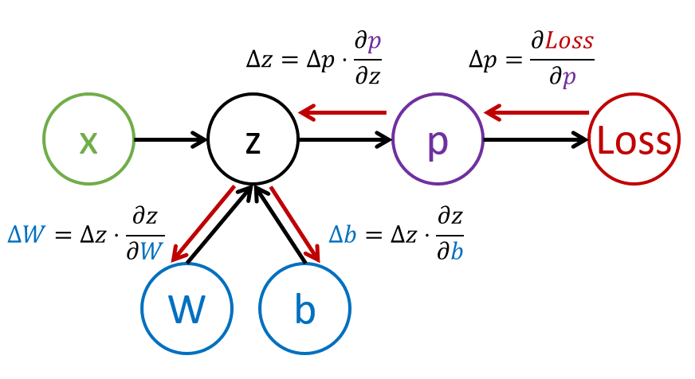

# Introducción a las Redes Neuronales. Perceptrón multicapa

En la sección anterior, aprendió sobre el modelo de red neuronal más simple: el perceptrón de una capa, un modelo de clasificación lineal de dos clases.

En esta sección ampliaremos este modelo a un marco más flexible, lo que nos permitirá:

* realizar **clasificación multiclase** además de dos clases
* resolver **problemas de regresión** además de clasificación
* clases separadas que no son linealmente separables

También desarrollaremos nuestro propio framework modular en Python que nos permitirá construir diferentes arquitecturas de redes neuronales.

## [Pre-lecture quiz](https://red-field-0a6ddfd03.1.azurestaticapps.net/quiz/104)

## Formalización del aprendizaje automático

Comencemos por formalizar el problema del aprendizaje automático. Supongamos que tenemos un conjunto de datos de entrenamiento **X** con etiquetas **Y** y necesitamos crear un modelo *f* que haga las predicciones más precisas. La calidad de las predicciones se mide mediante la **Función de pérdida** &lagran;. A menudo se utilizan las siguientes funciones de pérdida:

* Para problemas de regresión, cuando necesitamos predecir un número, podemos usar **error absoluto** &sum;i|f(x(i))-y< sup>(i)|, o **error al cuadrado** &sum;i(f(x(i))-y(i ))2
* Para la clasificación, utilizamos **pérdida 0-1** (que es esencialmente lo mismo que **precisión** del modelo) o **pérdida logística**.

Para el perceptrón de un nivel, la función *f* se definió como una función lineal *f(x)=wx+b* (aquí *w* es la matriz de peso, *x* es el vector de características de entrada y *b* es el vector de sesgo). Para diferentes arquitecturas de redes neuronales, esta función puede adoptar una forma más compleja.

> En el caso de la clasificación, a menudo es deseable obtener probabilidades de las clases correspondientes como salida de la red. Para convertir números arbitrarios en probabilidades (por ejemplo, para normalizar la salida), a menudo usamos la función **softmax** γ, y la función *f* se convierte en *f(x)=γsigma;(wx+b)*

En la definición de *f* anterior, *w* y *b* se denominan **parámetros** θ=⟨*w,b*⟩. Dado el conjunto de datos ⟨**X**,**Y**⟩, podemos calcular un error general en todo el conjunto de datos en función de los parámetros θ.

> ✅ **El objetivo del entrenamiento de redes neuronales es minimizar el error variando los parámetros θ**

## Optimización del descenso de gradiente

Existe un método bien conocido de optimización de funciones llamado **descenso de gradiente**. La idea es que podemos calcular una derivada (en el caso multidimensional llamada **gradiente**) de la función de pérdida con respecto a los parámetros y variar los parámetros de tal manera que el error disminuya. Esto se puede formalizar de la siguiente manera:

* Inicializa los parámetros con algunos valores aleatorios w(0), b(0)
*Repetir el siguiente paso muchas veces:
     - w(i+1) = w(i)-&eta;&part;&lagran;/&part;w
     - b(i+1) = b(i)-&eta;&part;&lagran;/&part;b

Durante el entrenamiento, se supone que los pasos de optimización se calculan considerando todo el conjunto de datos (recuerde que la pérdida se calcula como una suma de todas las muestras de entrenamiento). Sin embargo, en la vida real tomamos pequeñas porciones del conjunto de datos llamados **minilotes** y calculamos gradientes en función de un subconjunto de datos. Debido a que el subconjunto se toma aleatoriamente cada vez, dicho método se denomina **descenso de gradiente estocástico** (SGD).

## Perceptrones multicapa y retropropagación

La red de una capa, como hemos visto anteriormente, es capaz de clasificar clases linealmente separables. Para construir un modelo más rico, podemos combinar varias capas de la red. Matemáticamente significaría que la función *f* tendría una forma más compleja y se calcularía en varios pasos:
* z1=w1x+b1
* z2=w2&alpha;(z1)+b2
* f = &sigma;(z2)

Aquí, &alfa; es una **función de activación no lineal**, &sigma; es una función softmax y los parámetros &theta;=<*w1,b1,w2,b2*>.

El algoritmo de descenso de gradientes seguiría siendo el mismo, pero sería más difícil calcular los gradientes. Dada la regla de diferenciación de cadenas, podemos calcular las derivadas como:

* &part;&lagran;/&part;w2 = (&part;&lagran;/&part;&sigma;)(&part;&sigma;/&part;z2)(&part; z2/&part;w2)
* &part;&lagran;/&part;w1 = (&part;&lagran;/&part;&sigma;)(&part;&sigma;/&part;z2)(&part; z2/&part;&alpha;)(&part;&alpha;/&part;z1)(&part;z1/&part;w< sub>1)

> ✅ La regla de diferenciación de cadenas se utiliza para calcular las derivadas de la función de pérdida con respecto a los parámetros.

Tenga en cuenta que la parte más a la izquierda de todas esas expresiones es la misma y, por lo tanto, podemos calcular derivadas de manera efectiva comenzando desde la función de pérdida y yendo "hacia atrás" a través del gráfico computacional. Por lo tanto, el método de entrenamiento de un perceptrón de múltiples capas se llama **backpropagation** o 'backprop'.

> TODO: cita de imagen

> ✅ Cubriremos el backprop con mucho más detalle en nuestro ejemplo de cuaderno.

## Conclusión

En esta lección, hemos creado nuestra propia biblioteca de redes neuronales y la hemos utilizado para una tarea sencilla de clasificación bidimensional.

## 🚀 Desafío

En el cuaderno adjunto, implementará su propio marco para construir y entrenar perceptrones de múltiples capas. Podrás ver en detalle cómo funcionan las redes neuronales modernas.

Proceder al [OwnFramework](OwnFramework.ipynb) notebook and work through it.

## [Post-lecture quiz](https://red-field-0a6ddfd03.1.azurestaticapps.net/quiz/204)

## Revisión y autoestudio

La retropropagación es un algoritmo común utilizado en IA y ML que vale la pena estudiar [in more detail](https://wikipedia.org/wiki/Backpropagation)

## [Assignment](lab/README.md)

En esta práctica de laboratorio, se le pedirá que utilice el marco que construyó en esta lección para resolver la clasificación de dígitos escritos a mano de MNIST.

* [Instructions](lab/README.md)
* [Notebook](lab/MyFW_MNIST.ipynb)
