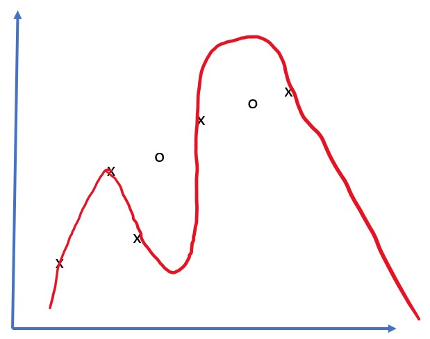

# 神经网络框架

正如我们已经学过的那样，为了能够高效地训练神经网络，我们需要做两件事情：

* 操作张量，例如进行乘法、加法，并计算一些函数，如 sigmoid 或 softmax
* 计算所有表达式的梯度，以便进行梯度下降优化

## [课前测验](https://red-field-0a6ddfd03.1.azurestaticapps.net/quiz/105)

虽然 `numpy` 库可以完成第一部分，但我们需要一些机制来计算梯度。在我们在前一部分中开发的[自己的框架](../04-自己的框架/自己的框架.ipynb)中，我们必须在 `backward` 方法中手动编写所有导数函数，该方法执行反向传播。理想情况下，框架应该能够让我们计算出我们定义的任何表达式的梯度。

另一个重要的事情是能够在GPU或其他专用计算单元上执行计算，例如[TPU](https://zh.wikipedia.org/wiki/%E5%BC%80%E6%BA%90%E6%B7%B1%E5%BA%A6%E5%AD%A6%E4%B9%A0%E5%BA%93)。深度神经网络训练需要进行*大量*的计算，能够在GPU上并行化这些计算非常重要。

> ✅ "并行化"这个术语表示将计算分布在多个设备上。

目前，最流行的两个神经网络框架是[TensorFlow](http://TensorFlow.org)和[PyTorch](https://pytorch.org/)。两者都提供了用于在CPU和GPU上操作张量的低级API。除了低级API之外，还有更高级的API，分别称为[Keras](https://keras.io/)和[PyTorch Lightning](https://pytorchlightning.ai/)。

低级API | [TensorFlow](http://TensorFlow.org) | [PyTorch](https://pytorch.org/)
--------------|-------------------------------------|--------------------------------
高级API| [Keras](https://keras.io/) | [PyTorch Lightning](https://pytorchlightning.ai/)**低级API**在两个框架中都允许您构建所谓的**计算图**。该图定义了如何使用给定的输入参数计算输出（通常是损失函数），如果可用，可以将其推送到GPU进行计算。有函数可以对这个计算图进行求导并计算梯度，然后可以用于优化模型参数。

**高级API**基本上将神经网络视为**层的序列**，并且使得构建大部分神经网络变得更加容易。训练模型通常需要准备数据，然后调用`fit`函数来完成这项工作。

高级API允许您快速构建典型的神经网络，无需担心很多细节。与此同时，低级API在训练过程中提供了更多的控制权，因此在处理新的神经网络架构时在研究中经常使用。

还要了解的重要一点是，您可以同时使用两个API，例如，您可以使用低级API开发自己的网络层架构，然后在使用高级API构建和训练的较大的网络内部使用它。或者您可以使用高级API定义一个由层序列组成的网络，然后使用自己的低级训练循环来执行优化。两个API使用相同的基本概念，并且设计得可以很好地共同使用。

## 学习

在这门课程中，我们为PyTorch和TensorFlow提供了大部分的内容。您可以选择您喜欢的框架，并只阅读对应的笔记。如果您不确定要选择哪个框架，可以在互联网上阅读一些关于**PyTorch vs. TensorFlow**的讨论。您也可以查看两个框架以更好地理解它们。

在可能的情况下，我们将使用高级API来简化操作。然而，我们认为从基础开始了解神经网络的工作原理是重要的，所以我们一开始就使用低级API和张量来工作。然而，如果您想快速上手，不想花很多时间学习这些细节，您可以跳过这些内容，直接进入高级API的笔记。

## ✍️ 练习：框架

请在以下笔记中继续学习：

|低级API | [TensorFlow+Keras Notebook](IntroKerasTF.ipynb) | [PyTorch 笔记](IntroPyTorch.ipynb)|
--------------|-------------------------------------|--------------------------------
高级API| [Keras](IntroKeras.ipynb) | *PyTorch Lightning*|

掌握了框架之后，让我们来回顾一下过拟合的概念。

# 过拟合

过拟合在机器学习中是一个非常重要的概念，因此理解它非常重要！

考虑以下近似5个点（在下面的图表中用 `x` 表示）的问题： | 
-------------------------|--------------------------
**线性模型，2个参数** | **非线性模型，7个参数**
训练误差 = 5.3 | 训练误差 = 0
验证误差 = 5.1 | 验证误差 = 20

* 在左边，我们看到了一个很好的直线逼近。因为参数的数量足够，模型能正确地理解点分布背后的原理。
* 在右边，模型太过强大。因为我们只有5个点而模型有7个参数，它可以调整自己以通过所有点，使得训练误差为0。然而，这样做阻止了模型理解数据背后的正确模式，因此验证误差非常高。在模型的丰富度（参数数量）和训练样本数量之间寻求正确的平衡非常重要。

## 过拟合的原因

  * 训练数据不足
  * 模型过于强大
  * 输入数据中噪声过多

## 如何检测过拟合

如您在上方的图表中所看到的，过拟合可以通过训练误差极低和验证误差较高来检测出来。通常在训练过程中，我们会看到训练误差和验证误差都开始下降，然后在某个点验证误差可能停止下降而开始上升。这将是过拟合的一个迹象，也是我们应该在这一点上停止训练（或至少对模型进行快照）的指示。

## 如何防止过拟合

如果您发现出现了过拟合，您可以采取以下其中一种方法：

 * 增加训练数据的数量
 * 减少模型的复杂度* 使用一些正则化技术，比如Dropout，我们将在后面考虑到。

## 过拟合和偏差-方差权衡

过拟合实际上是统计学中更一般问题称为偏差-方差权衡的一种情况。如果我们考虑模型中可能出现的误差的来源，我们可以看到有两种类型的误差：

* **偏差误差**是由于我们的算法无法正确捕捉训练数据之间的关系而引起的。这可能是由于我们的模型不够强大（欠拟合）造成的。
* **方差误差**是由于模型在输入数据中近似噪声而不是有意义的关系而引起的（过拟合）。

在训练过程中，偏差误差减小（因为我们的模型学会了逼近数据），而方差误差增加。为了防止过拟合，重要的是停止训练 - 要么手动停止（当我们检测到过拟合时），要么自动停止（通过引入正则化）。## 结论

在本课中，你学习了两种最流行的AI框架TensorFlow和PyTorch的不同API的区别。此外，你还学习了一个非常重要的主题，过拟合。

## 🚀挑战

在附带的笔记本中，你会在底部找到'tasks'；请完成笔记本中的任务。

## [课后测验](https://red-field-0a6ddfd03.1.azurestaticapps.net/quiz/205)

## 复习和自学

对以下主题进行一些研究：

- TensorFlow
- PyTorch
- 过拟合

问自己以下问题：# TensorFlow和PyTorch有什么区别？
TensorFlow和PyTorch是两个流行的深度学习框架。它们在以下几个方面有一些区别：

## [作业](../lab/README.md)

在本实验中，您将使用PyTorch或TensorFlow解决两个分类问题，其中包括单层和多层全连接网络。

- [指导说明](../lab/README.zh.md)
- [Notebook](../lab/LabFrameworks.ipynb)