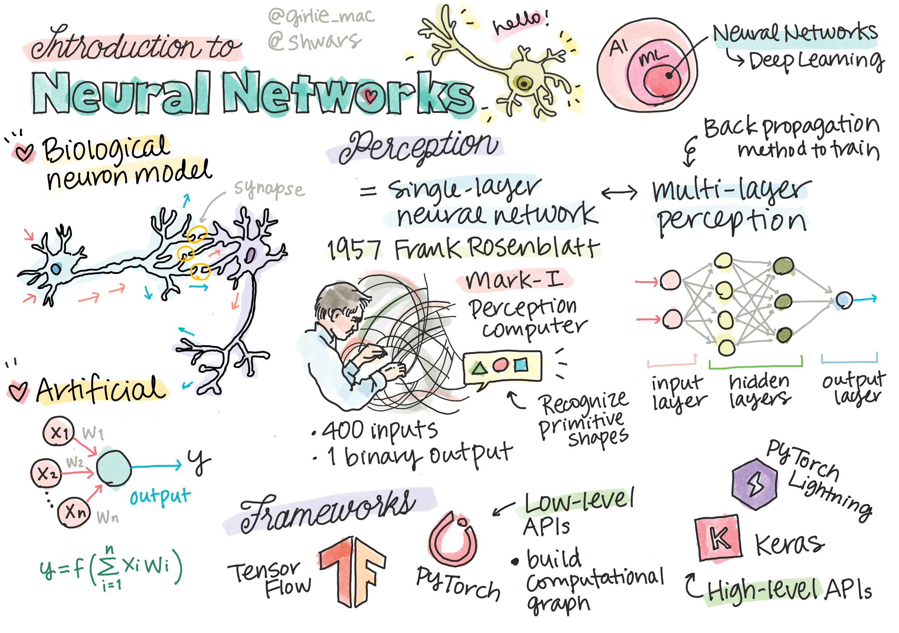
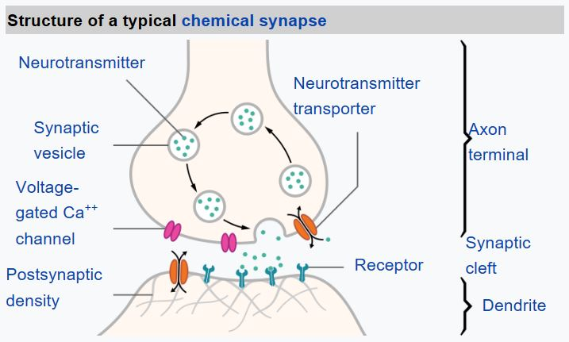
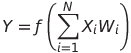

# Introduction to Neural Networks

As we discussed in the introduction, one of the ways to achieve intelligence is to train a **computer model** or an **artificial brain**. Since the middle of 20th century, researchers tried different mathematical models, until in recent years this direction proved to by hugely successful. Such mathematical models of the brain are called **neural networks**.

> Sometimes neural networks are called *Artificial Neural Networks*, ANNs, in order to indicate that we are talking about models, not real networks of neurons.

## Machine Learning

Neural Networks are a part of a larger discipline called **Machine Learning**, whose goal is to use data to train computer models that are able to solve problems. Machine Learning constitutes a large part of Artificial Intelligence, however, we do not cover classical ML in this curricula.

> Visit our separate **[Machine Learning for Beginners](http://github.com/microsoft/ml-for-beginners)** curriculum to learn more about classic Machine Learning.

In Machine Learning, we assume that we have some dataset of examples **X**, and corresponding output values **Y**. Examples are often N-dimensional vectors that consist of **features**, and outputs are called **labels**.

We will consider the two most common machine learning problems:

* **Classification**, where we need to classify an input object into two or more classes.
* **Regression**, where we need to predict a numerical number for each of the input samples.

> When representing inputs and outputs as tensors, the input dataset is a matrix of size M&times;N, where M is number of samples and N is the number of features. Output labels Y is the vector of size M.

In this curriculum, we will only focus on neural network models.

## A Model of a Neuron

From biology we know that our brain consists of neural cells, each of them having multiple "inputs" (axons), and an output (dendrite). Axons and dendrites can conduct electrical signals, and connections between axons and dendrites can exhibit different degrees of conductivity (controlled by neuromediators).

 | 
----|----
Real Neuron *([Image](https://en.wikipedia.org/wiki/Synapse#/media/File:SynapseSchematic_lines.svg) from Wikipedia)* | Artificial Neuron *(Image by Author)*

Thus, the simplest mathematical model of a neuron contains several inputs X1, ..., XN and an output Y, and a series of weights W1, ..., WN. An output is calculated as:

where f is some non-linear **activation function**.

> Early models of neuron were described in the classical paper [A logical calculus of the ideas immanent in nervous activity](https://www.cs.cmu.edu/~./epxing/Class/10715/reading/McCulloch.and.Pitts.pdf) by Warren McCullock and Walter Pitts in 1943. Donald Hebb in his book "[The Organization of Behavior: A Neuropsychological Theory](https://books.google.com/books?id=VNetYrB8EBoC)" proposed the way those networks can be trained.

## In this Section

In this section we will learn about:
* [Perceptron](03-Perceptron/README.md), one of the earliest neural network models for two-class classification
* [Multi-layered networks](04-OwnFramework/README.md) with a paired notebook [how to build our own framework](04-OwnFramework/OwnFramework.ipynb)
* [Neural Network Frameworks](05-Frameworks/README.md), with these notebooks: [PyTorch](05-Frameworks/IntroPyTorch.ipynb) and [Keras/Tensorflow](05-Frameworks/IntroKerasTF.ipynb)
* [Overfitting](05-Frameworks#overfitting)
