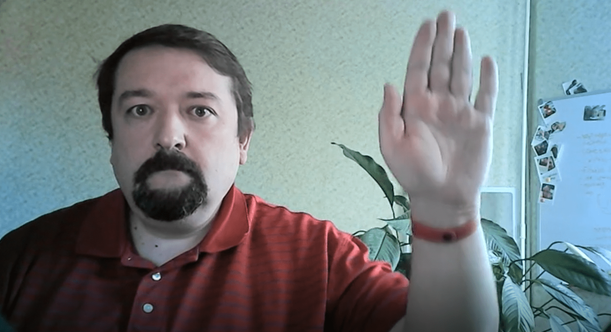

# Detecting Movements using Optical Flow

Lab Assignment from [AI for Beginners Curriculum](https://aka.ms/ai-beginners).

## Task

Consider [this video](palm-movement.mp4), in which a person's palm moves left/right/up/down on the stable background.

**Your goal** would be able to use Optical Flow to determine, which parts of video contain up/down/left/right movements.

**Stretch goal** would be to actually track the palm/finger movement using skin tone, as described [in this blog post](https://dev.to/amarlearning/finger-detection-and-tracking-using-opencv-and-python-586m) or [here](http://www.benmeline.com/finger-tracking-with-opencv-and-python/).

## Starting Notebook

Start the lab by opening [MovementDetection.ipynb](MovementDetection.ipynb)

## Takeaway

Sometimes, relatively complex tasks such as movement detection or fingertip detection can be solved purely by computer vision. Thus, it is very helpful to know what libraries like OpenCV can do.
