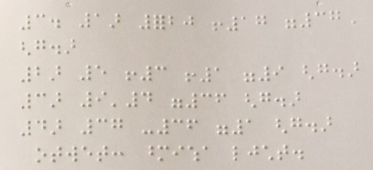
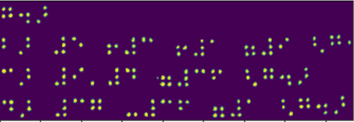
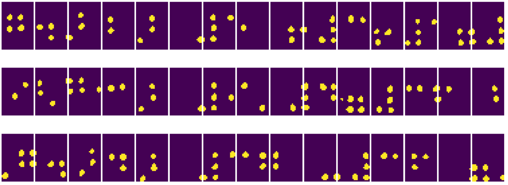
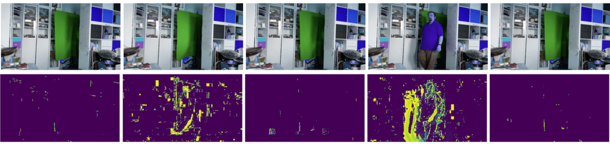
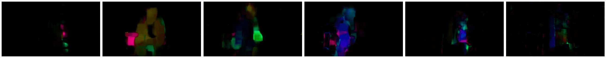

# Bilgisayarla Görmeye Giriş

[Bilgisayarla Görme](https://wikipedia.org/wiki/Computer_vision), amacı bilgisayarların dijital imgeleri üst düzeyde anlamasını sağlamak olan bir disiplindir. Bu oldukça geniş bir tanımdır, çünkü *anlamak* bir resim üzerinde bir nesne bulmak (**nesne algılama**), neler olduğunu anlamak (**olay algılama**), bir resmi metin içinde tanımlamak veya bir sahneyi 3B olarak yeniden oluşturmak dahil birçok farklı anlama gelebilir. İnsan imgeleriyle ilgili özel görevler de vardır: Yaş ve duygu tahmini, yüz algılama ve tanıma ve 3B poz tahmini bunlardan birkaçıdır.

## [Ders öncesi sınavı](https://red-field-0a6ddfd03.1.azurestaticapps.net/quiz/106)

Bilgisayarla görmenin en basit görevlerinden biri **imge sınıflandırmadır**.

Bilgisayarla görme genellikle yapay zekanın bir dalı olarak kabul edilir. Günümüzde, bilgisayarla görme görevlerinin çoğu sinir ağları kullanılarak çözülmektedir. Bu bölüm boyunca bilgisayarla görme için kullanılan özel sinir ağları türü olan [evrişimli sinir ağları](../../07-ConvNets/translations/README.tr.md) hakkında daha fazla bilgi edineceğiz.

Bununla birlikte, imgeyi bir sinir ağına aktarmadan önce, çoğu durumda imgeyi zenginleştirmek için bazı algoritmik teknikler kullanmak mantıklıdır.

İmge işleme için kullanılabilen birkaç Python kütüphanesi vardır:

* **[imageio](https://imageio.readthedocs.io/en/stable/)** farklı imge biçimlerini okumak/yazmak için kullanılabilir. Ayrıca, video karelerini imgelere dönüştürmek için kullanışlı bir araç olan ffmpeg'i de destekler.
* **[Pillow](https://pillow.readthedocs.io/en/stable/index.html)** (PIL olarak da bilinir) biraz daha güçlüdür ve ayrıca biçim değiştirme, palet ayarları ve daha birçok imge işlemlerini destekler.
* **[OpenCV](https://opencv.org/)**, imge işleme için *fiili* standart haline gelen, C++ ile yazılmış güçlü bir imge işleme kütüphanesidir. Kullanışlı bir Python arayüzüne sahiptir.
* **[dlib](http://dlib.net/)**, bazı bilgisayarlar görme algoritmaları da dahil olmak üzere birçok makine öğrenmesi algoritmasını uygulayan bir C++ kütüphanesidir. Aynı zamanda bir Python arayüzüne sahiptir ve yüz ve yüz yer işareti tespiti gibi zorlu görevler için kullanılabilir.

## OpenCV

[OpenCV](https://opencv.org/), imge işleme için *fiili* standart olarak kabul edilir. C++ ile gerçekleştirilmiş birçok faydalı algoritma içerir. OpenCV'yi Python'dan da çağırabilirsiniz.

OpenCV öğrenmek için iyi bir yer bu [OpenCV Öğren kursu](https://learnopencv.com/getting-started-with-opencv/)dur. Müfredatımızda amacımız OpenCV'yi öğrenmek değil, ne zaman ve nasıl kullanılabileceğine dair size bazı örnekler göstermektir.

### İmgeleri Yükleme

Python'daki imgeler, NumPy dizilimleriyle uygun şekilde temsil edilebilir. Örneğin, 320x200 piksel boyutundaki gri tonlamalı imgeler 200x320'lik bir dizilimde depolanacak ve aynı boyuttaki renkli imgeler 200x320x3 (3 renk kanalı için) şeklinde olacaktır. Bir imgeyi yüklemek için aşağıdaki kodu kullanabilirsiniz:

```python
import cv2
import matplotlib.pyplot as plt

im = cv2.imread('image.jpeg')
plt.imshow(im)
```

Geleneksel olarak, OpenCV, renkli imgeler için BGR (Mavi-Yeşil-Kırmızı) kodlamasını kullanırken Python araçlarının geri kalanı daha geleneksel RGB'yi (Kırmızı-Yeşil-Mavi) kullanır. İmgenin doğru görünmesi için, NumPy dizilimindeki boyutları değiştirerek veya bir OpenCV işlevini çağırarak onu RGB renk uzayına dönüştürmeniz gerekir:

```python
im = cv2.cvtColor(im,cv2.COLOR_BGR2RGB)
```

Aynı `cvtColor` işlevi, bir imgeyi gri tonlamaya veya HSV (Hue-Saturation-Value; Ton-Doygunluk-Değer) renk uzayına dönüştürmek gibi diğer renk uzayı dönüşümlerini gerçekleştirmek için kullanılabilir.

Videoyu kare kare yüklemek için OpenCV'yi de kullanabilirsiniz - [OpenCV Not Defteri](OpenCV.tr.ipynb) alıştırmasında bir örnek verilmiştir.

### İmge İşleme

Bir imgeyi sinir ağına beslemeden önce, birkaç ön işleme adımı uygulamak isteyebilirsiniz. OpenCV, aşağıdakiler dahil pek çok şey yapabilir:

* `im = cv2.resize(im, (320,200),interpolation=cv2.INTER_LANCZOS)` kullanarak imgeyi **yeniden boyutlandırma**.
* `im = cv2.medianBlur(im,3)` veya `im = cv2.GaussianBlur(im, (3,3), 0)` kullanarak imgeyi **bulanıklaştırma**.
* İmgenin **parlaklığını ve zıtlığını** değiştirme, [bu Stackoverflow notunda](https://stackoverflow.com/questions/39308030/how-do-i-increase-the-contrast-of-an-image-in-python-opencv) açıklandığı gibi NumPy dizilim işlemleri ile yapılabilir.
* Genellikle parlaklığı veya zıtlığı ayarlamak için tercih edilen `cv2.threshold`/`cv2.adaptiveThreshold` işlevlerini çağırarak [eşikleme](https://docs.opencv.org/4.x/d7/d4d/tutorial_py_thresholding.html) kullanma.
* İmgeye farklı [dönüşümler](https://docs.opencv.org/4.5.5/da/d6e/tutorial_py_geometric_transformations.html) uygulama:
    - **[Afin dönüşümler](https://docs.opencv.org/4.5.5/d4/d61/tutorial_warp_affine.html)**, imgede döndürme, yeniden boyutlandırma ve eğme işlemlerini birleştirmeniz gerekiyorsa ve imgedeki üç noktanın kaynak ve hedef konumunu biliyorsanız, yararlı olabilir. Afin dönüşümler paralel çizgileri paralel tutar.
    - **[Perspektif dönüşümleri](https://medium.com/analytics-vidhya/opencv-perspective-transformation-9edffefb2143)** imgedeki 4 noktanın kaynak ve hedef konumlarını bildiğinizde yararlı olabilir. Örneğin, bir akıllı telefon kamerasıyla dikdörtgen bir belgenin resmini belirli bir açıdan çekerseniz ve belgenin kendisinin dikdörtgen bir imgesini yapmak isterseniz.
* **[Optik akış](https://docs.opencv.org/4.5.5/d4/dee/tutorial_optical_flow.html)** kullanarak imgenin içindeki hareketi anlama.

## Bilgisayarla Görme Kullanım Örnekleri

[OpenCV Not Defterimizde](../translations/OpenCV.tr.ipynb), belirli görevleri gerçekleştirmek için bilgisayarla görmenin ne zaman kullanılabileceğine dair bazı örnekler veriyoruz:

* **Bir Braille kitabının fotoğrafını ön işleme**. Bir sinir ağı tarafından daha fazla sınıflandırma için bireysel Braille sembollerini ayırmak için eşikleme, öznitelik algılama, perspektif dönüşümü ve NumPy tahriflerini nasıl kullanabileceğimize odaklanıyoruz.

 |  | 
----|-----|-----

> [OpenCV.tr.ipynb](OpenCV.tr.ipynb)'den imge

* **Kare farkını kullanarak videodaki hareketi algılama**. Kamera sabitse, kamera beslemesindeki kareler birbirine oldukça benzer olmalıdır. Kareler dizilimler olarak temsil edildiğinden, yalnızca bu dizilimleri sonraki iki kare için çıkararak, statik kareler için düşük olması gereken ve imgede önemli bir hareket olduğunda daha yüksek olması gereken piksel farkını elde ederiz.



> [OpenCV.tr.ipynb](OpenCV.tr.ipynb)'den imge

* **Optik Akış kullanılarak hareket algılama**. [Optik akış](https://docs.opencv.org/3.4/d4/dee/tutorial_optical_flow.html), video karelerindeki tek tek piksellerin nasıl hareket ettiğini anlamamıza olanak tanır. İki tür optik akış vardır:
    - **Yoğun Optik Akış**, her pikselin nerede hareket ettiğini gösteren vektör alanını hesaplar.
    - **Seyrek Optik Akış**, imgedeki bazı ayırt edici özniteliklerin (örn. kenarlar) alınmasına ve bunların kareden kareye yörüngesinin oluşturulmasına dayanır.



> [OpenCV.tr.ipynb](OpenCV.tr.ipynb)'den imge

## ✍️ Örnek Not Defterleri: OpenCV [OpenCV'yi eylemde deneyin](OpenCV.tr.ipynb)

[OpenCV Not Defteri](OpenCV.tr.ipynb)'ni keşfederek OpenCV ile bazı deneyler yapalım.

## Vargılar

Bazen, hareket algılama veya parmak ucu algılama gibi nispeten karmaşık görevler, yalnızca bilgisayarla görme ile çözülebilir. Bu nedenle, bilgisayarla görmenin temel tekniklerini ve OpenCV gibi kütüphanelerin neler yapabileceğini bilmek çok faydalıdır.

## 🚀 Kendini Sınama

Cortic Tigers projesi hakkında bilgi edinmek ve bilgisayarla görme görevlerini bir robot aracılığıyla demokratikleştirmek için blok tabanlı bir çözümü nasıl oluşturduklarını öğrenmek için YZ gösterisinden [bu videoyu](https://docs.microsoft.com/shows/ai-show/ai-show--2021-opencv-ai-competition--grand-prize-winners--cortic-tigers--episode-32?WT.mc_id=academic-77998-cacaste) izleyin. Alana yeni öğrenenlerin katılmasına yardımcı olan bunun gibi diğer projeler hakkında biraz araştırma yapın.

## [Ders sonrası sınavı](https://red-field-0a6ddfd03.1.azurestaticapps.net/quiz/206)

## Gözden Geçirme ve Bireysel Çalışma

[Bu harika eğitimde](https://learnopencv.com/optical-flow-in-opencv/) optik akış hakkında daha fazla bilgi edinin.

## [Ödev](../lab/translations/README.tr.md)

Bu laboratuvarda basit hareketlerle bir video çekeceksiniz ve amacınız optik akışı kullanarak yukarı/aşağı/sola/sağ hareketleri çıkarmak.

