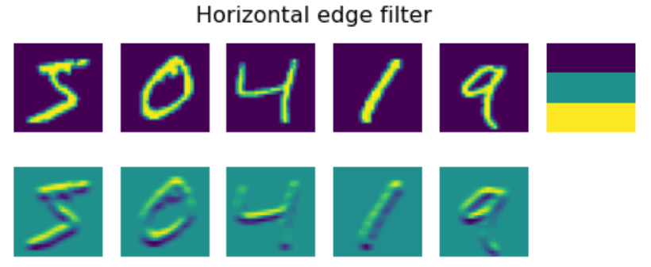
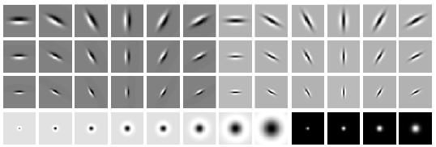
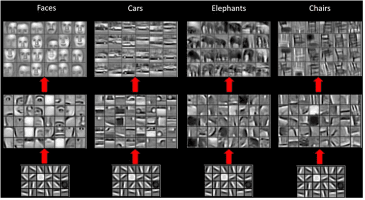
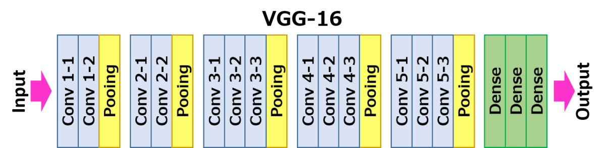

# Convolutional Neural Networks

We have seen before that neural networks are quite good at dealing with images, and even one-layer perceptron is able to recognize handwritten digits from MNIST dataset with reasonable accuracy. However, the MNIST dataset is very special, and all digits are centered inside the image, which makes the task simpler.

## [Pre-lecture quiz](https://red-field-0a6ddfd03.1.azurestaticapps.net/quiz/107)

In real life, we want to be able to recognize objects on a picture regardless of their exact location in the image. Computer vision is different from generic classification, because when we are trying to find a certain object in the picture, we are scanning the image looking for some specific **patterns** and their combinations. For example, when looking for a cat, we first may look for horizontal lines, which can form whiskers, and then certain a combination of whiskers can tell us that it is actually a picture of a cat. Relative position and presence of certain patterns is important, and not their exact position on the image.

To extract patterns, we will use the notion of **convolutional filters**. As you know, an image is represented by a 2D-matrix, or a 3D-tensor with color depth. Applying a filter means that we take relatively small **filter kernel** matrix, and for each pixel in the original image we compute the weighted average with neighboring points. We can view this like a small window sliding over the whole image, and averaging out all pixels according to the weights in the filter kernel matrix.

 | 
----|----

> Image by Dmitry Soshnikov

For example, if we apply 3x3 vertical edge and horizontal edge filters to the MNIST digits, we can get highlights (e.g. high values) where there are vertical and horizontal edges in our original image. Thus those two filters can be used to "look for" edges. Similarly, we can design different filters to look for other low-level patterns:

> Image of [Leung-Malik Filter Bank](https://www.robots.ox.ac.uk/~vgg/research/texclass/filters.html)

However, while we can design the filters to extract some patterns manually, we can also design the network in such a way that it will learn the patterns automatically. It is one of the main ideas behind the CNN.

## Main ideas behind CNN

The way CNNs work is based on the following important ideas:

* Convolutional filters can extract patterns
* We can design the network in such a way that filters are trained automatically
* We can use the same approach to find patterns in high-level features, not only in the original image. Thus CNN feature extraction work on a hierarchy of features, starting from low-level pixel combinations, up to higher level combination of picture parts.

> Image from [a paper by Hislop-Lynch](https://www.semanticscholar.org/paper/Computer-vision-based-pedestrian-trajectory-Hislop-Lynch/26e6f74853fc9bbb7487b06dc2cf095d36c9021d), based on [their research](https://dl.acm.org/doi/abs/10.1145/1553374.1553453)

## ✍️ Exercises: Convolutional Neural Networks

Let's continue exploring how convolutional neural networks work, and how we can achieve trainable filters, by working through the corresponding notebooks:

* [Convolutional Neural Networks - PyTorch](ConvNetsPyTorch.ipynb)
* [Convolutional Neural Networks - TensorFlow](ConvNetsTF.ipynb)

## Pyramid Architecture

Most of the CNNs used for image processing follow a so-called pyramid architecture. The first convolutional layer applied to the original images typically has a relatively low number of filters (8-16), which correspond to different pixel combinations, such as horizontal/vertical lines of strokes. At the next level, we reduce the spatial dimension of the network, and increase the number of filters, which corresponds to more possible combinations of simple features. With each layer, as we move towards the final classifier, spatial dimensions of the image decrease, and the number of filters grow.

As an example, let's look at the architecture of VGG-16, a network that achieved 92.7% accuracy in ImageNet's top-5 classification in 2014:

> Image from [Researchgate](https://www.researchgate.net/figure/Vgg16-model-structure-To-get-the-VGG-NIN-model-we-replace-the-2-nd-4-th-6-th-7-th_fig2_335194493)

## Best-Known CNN Architectures

[Continue your study about the best-known CNN architectures](CNN_Architectures.md)