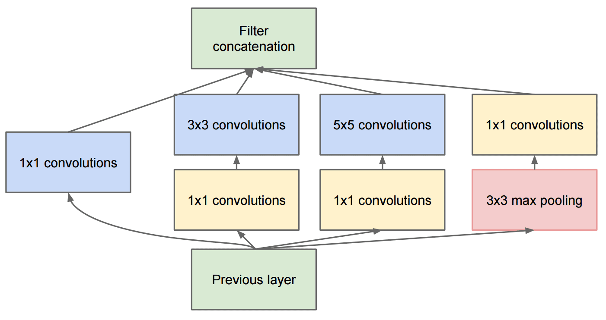

# Bilindik CNN Mimarileri

### VGG-16

VGG-16, 2014 yılında ImageNet ilk 5 sınıflandırmasında %92.7 doğruluk elde eden bir ağdır. Aşağıdaki katman yapısına sahiptir:

Gördüğünüz gibi, VGG, bir evrişim-ortaklama katmanları dizisi olan geleneksel bir piramit mimarisini izler.

> İmge [Researchgate](https://www.researchgate.net/figure/Vgg16-model-structure-To-get-the-VGG-NIN-model-we-replace-the-2-nd-4-th-6-th-7-th_fig2_335194493)'den

### ResNet

ResNet, Microsoft Research tarafından 2015 yılında önerilen bir model ailesidir. ResNet'in ana fikri **artık bloklar** kullanmaktır:

> İmge [bu makale](https://arxiv.org/pdf/1512.03385.pdf)dendir.

Birim geçişi kullanmanın nedeni, katmanımızın bir önceki katmanın sonucu ile artık bloğun çıktısı arasındaki **farkı** tahmin etmesini sağlamaktır - bu nedenle *artık* adı verilmiştir. Bu blokları eğitmek çok daha kolaydır ve bu bloklardan yüzlercesiyle ağlar inşa edilebilir (en yaygın türleri ResNet-52, ResNet-101 ve ResNet-152'dir).

Bu ağı, karmaşıklığını veri kümesine göre ayarlayabilmek olarak da düşünebilirsiniz. Başlangıçta, ağı eğitmeye başladığınızda, ağırlık değerleri küçüktür ve sinyalin çoğu geçiş birim katmanlarından geçer. Eğitim ilerledikçe ve ağırlıklar büyüdükçe, ağ parametrelerinin önemi artar ve ağlar, eğitim imgelerini doğru bir şekilde sınıflandırmak için gereken ifade gücünü barındıracak şekilde ayarlanır.

### Google Inception (Başlangıç)

Google Inception (Başlangıç) mimarisi bu fikri bir adım öteye taşır ve her ağ katmanını birkaç farklı yolun birleşimi olarak oluşturur:

> İmge [Researchgate](https://www.researchgate.net/figure/Inception-module-with-dimension-reductions-left-and-schema-for-Inception-ResNet-v1_fig2_355547454)nden

Burada 1x1 evrişimlerin rolünü vurgulamamız gerekiyor çünkü ilk başta anlam ifade etmezlar. İmgeden neden 1x1 filtre ile geçmemiz gerekiyor? Bununla birlikte, evrişim filtrelerinin birkaç derinlik kanalıyla da çalıştığını hatırlamanız gerekir (aslında - RGB renkleri, sonraki katmanlarda farklı filtreler için kanallardır) ve 1x1 evrişim, farklı eğitilebilir ağırlıklar kullanarak bu girdi kanallarını bir arada karıştırmak için kullanılır. Kanal boyutu üzerinden altörnekleme (ortaklama) olarak da görülebilir.

İşte konuyla ilgili [iyi bir blog gönderisi](https://medium.com/analytics-vidhya/talented-mr-1x1-comprehensive-look-at-1x1-convolution-in-deep-learning-f6b355825578) ve [makalenin aslı](https://arxiv.org/pdf/1312.4400.pdf).

### MobileNet

MobileNet, boyutları küçültülmüş, mobil cihazlara uygun bir model ailesidir. Kaynaklarınız yetersizse ve doğruluktan biraz ödün verebiliyorsanız bunları kullanın. Bunların arkasındaki ana fikir, evrişim filtrelerini uzamsal evrişimlerin ve derinlik kanalları üzerinden 1x1 evrişimin bileşimiyle temsil etmeye izin veren **derinlemesine ayrılabilir evrişim**'dir. Bu, parametre sayısını önemli ölçüde azaltır, ağın boyutunu küçültür ve ayrıca daha az veriyle eğitmeyi kolaylaştırır.

İşte [MobileNet hakkında güzel bir blog gönderisi](https://medium.com/analytics-vidhya/image-classification-with-mobilenet-cc6fbb2cd470).

## Vargılar

Bu ünitede, bilgisayarla görme sinir ağlarının arkasındaki ana konsepti - evrişimli ağlarını öğrendiniz. İmge sınıflandırmasına, nesne algılamaya ve hatta imge üretme ağlarına güç veren gerçek yaşam mimarilerinin tümü, yalnızca daha fazla katman ve bazı ek eğitim püf noktaları ile CNN'lere dayanmaktadır.

## 🚀 Kendini Sınama

Ekteki not defterlerinde, alt kısımda daha fazla doğruluğun nasıl elde edilebileceğine dair notlar bulunmaktadır. Daha yüksek doğruluk elde edip edemeyeceğinizi görmek için bazı deneyler yapın.

## [Ders sonrası sınavı](https://red-field-0a6ddfd03.1.azurestaticapps.net/quiz/207)

## Gözden Geçirme & Bireysel Çalışma

CNN'ler çoğunlukla Bilgisayarla Görme görevleri için kullanılsa da, genellikle sabit boyutlu örüntüleri çıkarmak için iyidirler. Örneğin, seslerle uğraşıyorsak, ses sinyalindeki bazı belirli örüntüleri aramak için CNN'leri de kullanmak isteyebiliriz - bu durumda filtreler 1 boyutlu olacaktır (ve bu CNN'ye 1B-CNN adı verilir). Ayrıca, bazen 3B-CNN, videoda meydana gelen belirli olaylar gibi çok boyutlu uzaydaki öznitelikleri çıkarmak için kullanılır - CNN, zaman içinde değişen belirli öznitelik örüntülerini yakalayabilir. CNN'lerle yapılabilecek diğer görevler hakkında biraz inceleme yapın ve kendi kendinize çalışın.

## [Ödev](../lab/translations/README.tr.md)

Bu laboratuvarda, farklı kedi ve köpek türlerini sınıflandırmakla görevlendirildiniz. Bu imgeler, MNIST veri kümesinden daha karmaşık ve daha yüksek boyutludur ve 10'dan fazla sınıf vardır.