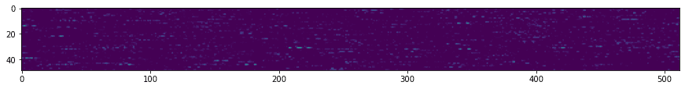
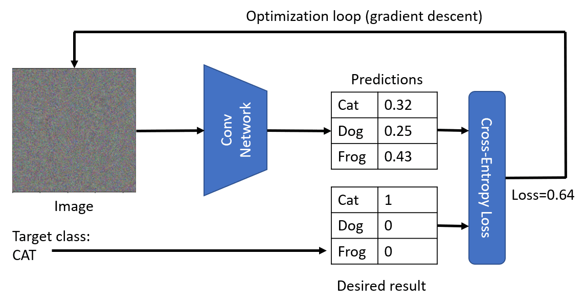
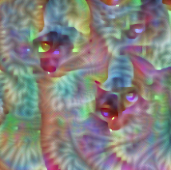
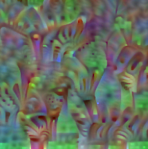
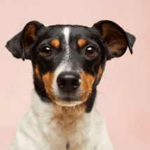

# Pre-trained Networks and Transfer Learning

Training CNNs can take a lot of time, and a lot of data is required for that task. However, much of the time is spent learning the best low-level filters that a network can use to extract patterns from images. A natural question arises - can we use a neural network trained on one dataset and adapt it to classify different images without requiring a full training process?

## [Pre-lecture quiz](https://red-field-0a6ddfd03.1.azurestaticapps.net/quiz/108)

This approach is called **transfer learning**, because we transfer some knowledge from one neural network model to another. In transfer learning, we typically start with a pre-trained model, which has been trained on some large image dataset, such as **ImageNet**. Those models can already do a good job extracting different features from generic images, and in many cases just building a classifier on top of those extracted features can yield a good result.

> ✅ Transfer Learning is a term you find in other academic fields, such as Education. It refers to the process of taking knowledge from one domain and applying it to another.

## Pre-Trained Models as Feature Extractors

The convolutional networks that we have talked about in the previous section contained a number of layers, each of which is supposed to extract some features from the image, starting from low-level pixel combinations (such as horizontal/vertical line or stroke), up to higher level combinations of features, corresponding to things like an eye of a flame. If we train CNN on sufficiently large dataset of generic and diverse images, the network should learn to extract those common features.

Both Keras and PyTorch contain functions to easily load pre-trained neural network weights for some common architectures, most of which were trained on ImageNet images. The most often used ones are described on the [CNN Architectures](../07-ConvNets/CNN_Architectures.md) page from the prior lesson. In particular, you may want to consider using one of the following:

* **VGG-16/VGG-19** which are relatively simple models that still give good accuracy. Often using VGG as a first attempt is a good choice to see how transfer learning is working.
* **ResNet** is a family of models proposed by Microsoft Research in 2015. They have more layers, and thus take more resources.
* **MobileNet** is a family of models with reduced size, suitable for mobile devices. Use them if you are short in resources and can sacrifice a little bit of accuracy.

Here are sample features extracted from a picture of a cat by VGG-16 network:

## Cats vs. Dogs Dataset

In this example, we will use a dataset of [Cats and Dogs](https://www.microsoft.com/download/details.aspx?id=54765&WT.mc_id=academic-77998-cacaste), which is very close to a real-life image classification scenario.

## ✍️ Exercise: Transfer Learning

Let's see transfer learning in action in corresponding notebooks:

* [Transfer Learning - PyTorch](TransferLearningPyTorch.ipynb)
* [Transfer Learning - TensorFlow](TransferLearningTF.ipynb)

## Visualizing Adversarial Cat

Pre-trained neural network contains different patterns inside it's *brain*, including notions of **ideal cat** (as well as ideal dog, ideal zebra, etc.). It would be interesting to somehow **visualize this image**. However, it is not simple, because patterns are spread all over the network weights, and also organized in a hierarchical structure.

One approach we can take is to start with a random image, and then try to use **gradient descent optimization** technique to adjust that image in such a way, that the network starts thinking that it's a cat. 

However, if we do this, we will receive something very similar to a random noise. This is because *there are many ways to make network think the input image is a cat*, including some that do not make sense visually. While those images contain a lot of patterns typical for a cat, there is nothing to constrain them to be visually distinctive.

To improve the result, we can add another term into the loss function, which is called **variation loss**. It is a metric that shows how similar neighboring pixels of the image are. Minimizing variation loss makes image smoother, and gets rid of noise - thus revealing more visually appealing patterns. Here is an example of such "ideal" images, that are classified as cat and as zebra with high probability:

 | 
-----|-----
 *Ideal Cat* | *Ideal Zebra*

Similar approach can be used to perform so-called **adversarial attacks** on a neural network. Suppose we want to fool a neural network and make a dog look like a cat. If we take dog's image, which is recognized by a network as a dog, we can then tweak it a little but using gradient descent optimization, until the network starts classifying it as a cat:

 | 
-----|-----
*Original picture of a dog* | *Picture of a dog classified as a cat*

See the code to reproduce the results above in the following notebook:

* [Ideal and Adversarial Cat - TensorFlow](AdversarialCat_TF.ipynb)
## Conclusion

Using transfer learning, you are able to quickly put together a classifier for a custom object classification task and achieve high accuracy. You can see that more complex tasks that we are solving now require higher computational power, and cannot be easily solved on the CPU. In the next unit, we will try to use a more lightweight implementation to train the same model using lower compute resources, which results in just slightly lower accuracy.

## 🚀 Challenge

In the accompanying notebooks, there are notes at the bottom about how transfer knowledge works best with somewhat similar training data (a new type of animal, perhaps). Do some experimentation with completely new types of images to see how well or poorly your transfer knowledge models perform.

## [Post-lecture quiz](https://red-field-0a6ddfd03.1.azurestaticapps.net/quiz/208)

## Review & Self Study

Read through [TrainingTricks.md](TrainingTricks.md) to deepen your knowledge of some other way to train your models.

## [Assignment](lab/README.md)

In this lab, we will use real-life [Oxford-IIIT](https://www.robots.ox.ac.uk/~vgg/data/pets/) pets dataset with 35 breeds of cats and dogs, and we will build a transfer learning classifier.
