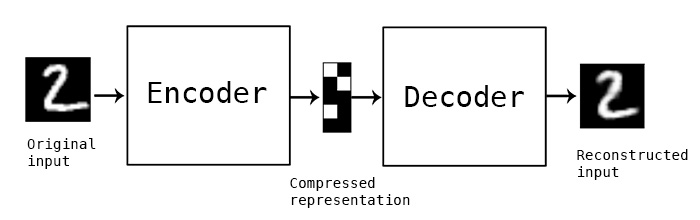
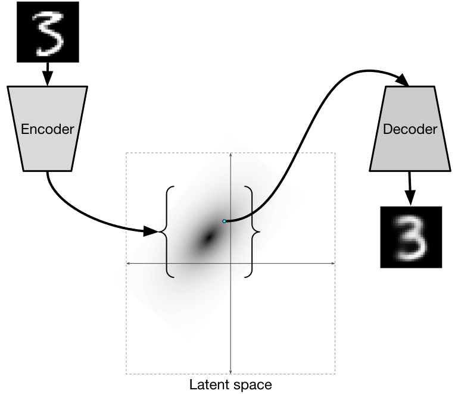
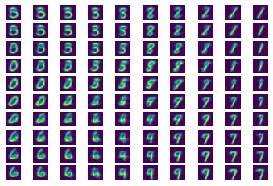
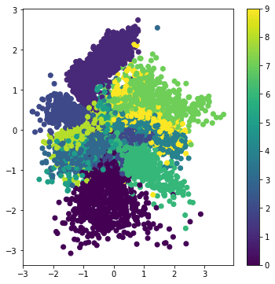

# codificadores automáticos

Al entrenar CNN, uno de los problemas es que necesitamos muchos datos etiquetados. En el caso de la clasificación de imágenes, necesitamos separar las imágenes en diferentes clases, lo cual es un esfuerzo manual.

## [Pre-lecture quiz](https://red-field-0a6ddfd03.1.azurestaticapps.net/quiz/109)

Sin embargo, es posible que deseemos utilizar datos sin procesar (sin etiquetar) para entrenar extractores de funciones de CNN, lo que se denomina **aprendizaje autosupervisado**. En lugar de etiquetas, utilizaremos imágenes de entrenamiento como entrada y salida de la red. La idea principal de **autoencoder** es que tendremos una **red codificadora** que convierte la imagen de entrada en algún **espacio latente** (normalmente es solo un vector de un tamaño más pequeño), luego el **red decodificadora**, cuyo objetivo sería reconstruir la imagen original.

> ✅ Un [autoencoder](https://wikipedia.org/wiki/Autoencoder) es "un tipo de red neuronal artificial utilizada para aprender codificaciones eficientes de datos sin etiquetar".
>
> Dado que estamos entrenando un codificador automático para capturar la mayor cantidad posible de información de la imagen original para una reconstrucción precisa, la red intenta encontrar la mejor **incrustación** de imágenes de entrada para capturar el significado.
>
> 

> Imagen de [Keras blog](https://blog.keras.io/building-autoencoders-in-keras.html)
>
> ## Escenarios para usar codificadores automáticos

Si bien la reconstrucción de imágenes originales no parece útil por sí sola, existen algunos escenarios en los que los codificadores automáticos son especialmente útiles:

* **Reducir la dimensión de las imágenes para visualización** o **entrenar incrustaciones de imágenes**. Por lo general, los codificadores automáticos dan mejores resultados que PCA porque tienen en cuenta la naturaleza espacial de las imágenes y las características jerárquicas.
* **Eliminación de ruido**, es decir, eliminación del ruido de la imagen. Debido a que el ruido transporta una gran cantidad de información inútil, el codificador automático no puede caber todo en un espacio latente relativamente pequeño y, por lo tanto, captura solo una parte importante de la imagen. Al entrenar eliminadores de ruido, comenzamos con imágenes originales y usamos imágenes con ruido agregado artificialmente como entrada para el codificador automático.
* **Superresolución**, aumentando la resolución de la imagen. Comenzamos con imágenes de alta resolución y usamos la imagen con menor resolución como entrada del codificador automático.
* **Modelos generativos**. Una vez que entrenamos el codificador automático, la parte del decodificador se puede usar para crear nuevos objetos a partir de vectores latentes aleatorios.

## Autocodificadores variacionales (VAE)

Los codificadores automáticos tradicionales reducen de alguna manera la dimensión de los datos de entrada, descubriendo las características importantes de las imágenes de entrada. Sin embargo, los vectores latentes a menudo no tienen mucho sentido. En otras palabras, tomando como ejemplo el conjunto de datos MNIST, descubrir qué dígitos corresponden a diferentes vectores latentes no es una tarea fácil, porque los vectores latentes cercanos no necesariamente corresponderían a los mismos dígitos.

Por otro lado, para entrenar modelos *generativos* es mejor tener cierto conocimiento del espacio latente. Esta idea nos lleva al **codificador automático variacional** (VAE).

VAE es el codificador automático que aprende a predecir la *distribución estadística* de los parámetros latentes, la llamada **distribución latente**. Por ejemplo, es posible que deseemos que los vectores latentes se distribuyan normalmente con alguna media zmedia y desviación estándar zsigma (tanto la media como la desviación estándar son vectores de alguna dimensionalidad d). El codificador en VAE aprende a predecir esos parámetros y luego el decodificador toma un vector aleatorio de esta distribución para reconstruir el objeto.

Para resumir:

  * A partir del vector de entrada, predecimos `z_mean` y `z_log_sigma` (en lugar de predecir la desviación estándar en sí, predecimos su logaritmo)
  * Tomamos una muestra de un vector `muestra` de la distribución N(zmean,exp(zlog\_sigma))
  * El decodificador intenta decodificar la imagen original usando `muestra` como vector de entrada

> Imagen de [this blog post](https://ijdykeman.github.io/ml/2016/12/21/cvae.html) by Isaak Dykeman

Los codificadores automáticos variacionales utilizan una función de pérdida compleja que consta de dos partes:

* **Pérdida de reconstrucción** es la función de pérdida que muestra qué tan cerca está una imagen reconstruida del objetivo (puede ser un error cuadrático medio o MSE). Es la misma función de pérdida que en los codificadores automáticos normales.
* **Pérdida de KL**, que garantiza que las distribuciones de variables latentes se mantengan cercanas a la distribución normal. Se basa en la noción de [divergencia Kullback-Leibler](https://www.countbayesie.com/blog/2017/5/9/kullback-leibler-divergence-explained), una métrica para estimar qué tan similares son dos distribuciones estadísticas. son.

Una ventaja importante de los VAE es que nos permiten generar nuevas imágenes con relativa facilidad, porque sabemos de qué distribución tomar muestras de vectores latentes. Por ejemplo, si entrenamos VAE con un vector latente 2D en MNIST, podemos variar los componentes del vector latente para obtener diferentes dígitos:

> Imagen de [Dmitry Soshnikov](http://soshnikov.com)

Observe cómo las imágenes se mezclan entre sí, a medida que comenzamos a obtener vectores latentes de las diferentes partes del espacio de parámetros latentes. También podemos visualizar este espacio en 2D:

 

> Imagen de [Dmitry Soshnikov](http://soshnikov.com)

## ✍️ Ejercicios: Autocodificadores

Obtenga más información sobre los codificadores automáticos en estos cuadernos correspondientes:

* [Autoencoders in TensorFlow](AutoencodersTF.ipynb)
* [Autoencoders in PyTorch](AutoEncodersPyTorch.ipynb)

## Propiedades de los codificadores automáticos

* **Datos específicos**: solo funcionan bien con el tipo de imágenes en las que han sido entrenados. Por ejemplo, si entrenamos una red de superresolución en flores, no funcionará bien en retratos. Esto se debe a que la red puede producir imágenes de mayor resolución al tomar detalles finos de las características aprendidas del conjunto de datos de entrenamiento.
* **Con pérdida**: la imagen reconstruida no es la misma que la imagen original. La naturaleza de la pérdida está definida por la *función de pérdida* utilizada durante el entrenamiento
* Funciona con **datos sin etiqueta**

## [Post-lecture quiz](https://red-field-0a6ddfd03.1.azurestaticapps.net/quiz/209)

## Conclusión

En esta lección, aprendió sobre los distintos tipos de codificadores automáticos disponibles para el científico de IA. Aprendiste cómo construirlos y cómo usarlos para reconstruir imágenes. También aprendió sobre VAE y cómo usarlo para generar nuevas imágenes.

## 🚀 Desafío

En esta lección, aprendió a usar codificadores automáticos para imágenes. ¡Pero también se pueden utilizar para música! Consulte el proyecto [MusicVAE](https://magenta.tensorflow.org/music-vae) del proyecto Magenta, que utiliza codificadores automáticos para aprender a reconstruir música. Realice algunos [experimentos](https://colab.research.google.com/github/magenta/magenta-demos/blob/master/colab-notebooks/Multitrack_MusicVAE.ipynb) con esta biblioteca para ver qué puede crear.

## [Post-lecture quiz](https://red-field-0a6ddfd03.1.azurestaticapps.net/quiz/208)

## Review & Self Study

For reference, read more about autoencoders in these resources:

* [Building Autoencoders in Keras](https://blog.keras.io/building-autoencoders-in-keras.html)
* [Blog post on NeuroHive](https://neurohive.io/ru/osnovy-data-science/variacionnyj-avtojenkoder-vae/)
* [Variational Autoencoders Explained](https://kvfrans.com/variational-autoencoders-explained/)
* [Conditional Variational Autoencoders](https://ijdykeman.github.io/ml/2016/12/21/cvae.html)

## Asignación

Al final de [this notebook using TensorFlow](AutoencodersTF.ipynb), encontrará una 'tarea'; utilícela como su tarea.
