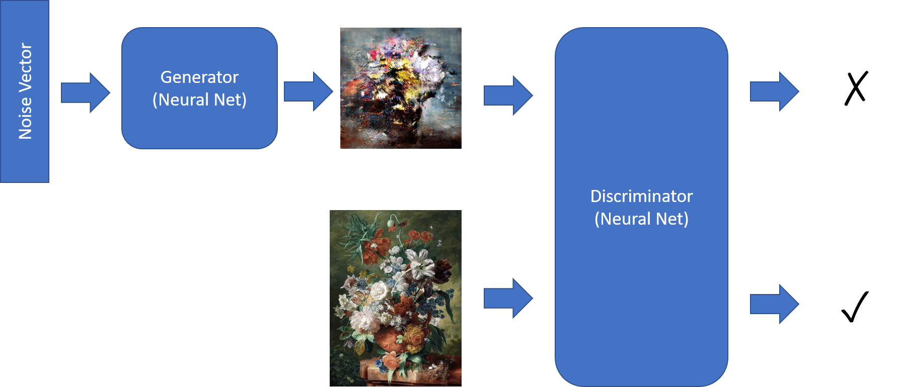
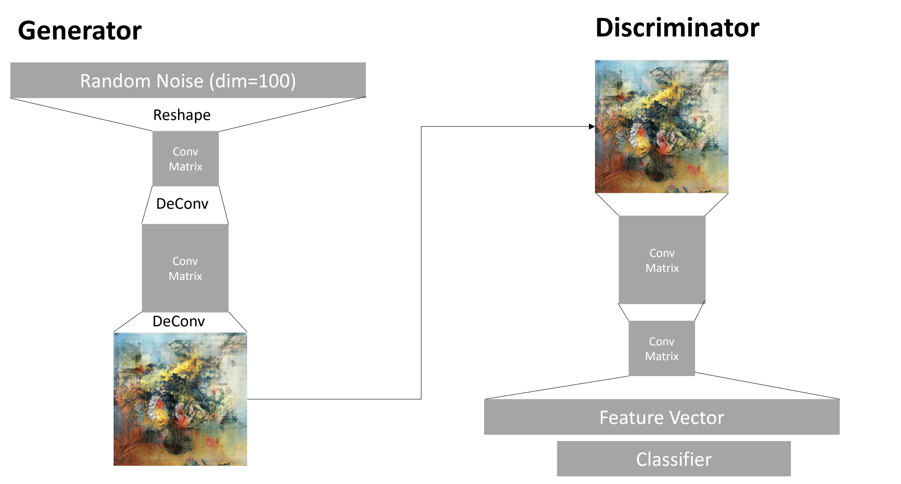

# Generative Adversarial Networks

In the previous section, we learned about **generative models**: models that can generate new images similar to the ones in the training dataset. VAE was a good example of a generative model.

## [Pre-lecture quiz](https://red-field-0a6ddfd03.1.azurestaticapps.net/quiz/110)

However, if we try to generate something really meaningful, like a painting at reasonable resolution, with VAE, we will see that training does not converge well. For this use case, we should learn about another architecture specifically targeted at generative models - **Generative Adversarial Networks**, or GANs.

The main idea of a GAN is to have two neural networks that will be trained against each other:

> Image by [Dmitry Soshnikov](http://soshnikov.com)

> ✅ A little vocabulary:
> * **Generator** is a network that takes some random vector, and produces the image as a result
> * **Discriminator** is a network that takes an image, and it should tell whether it is a real image (from training dataset), or it was generated by a generator. It is essentially an image classifier.

### Discriminator

The architecture of discriminator does not differ from an ordinary image classification network. In the simplest case it can be fully-connected classifier, but most probably it will be a [convolutional network](../07-ConvNets/README.md).

> ✅ A GAN based on convolutional networks is called a [DCGAN](https://arxiv.org/pdf/1511.06434.pdf)

A CNN discriminator consists of the following layers: several convolutions+poolings (with decreasing spatial size) and, one-or-more fully-connected layers to get "feature vector", final binary classifier.

> ✅ A 'pooling' in this context is a technique that reduces the size of the image. "Pooling layers reduce the dimensions of data by combining the outputs of neuron clusters at one layer into a single neuron in the next layer." - [source](https://wikipedia.org/wiki/Convolutional_neural_network#Pooling_layers)

### Generator

A Generator is slightly more tricky. You can consider it to be a reversed discriminator. Starting from a latent vector (in place of a feature vector), it has a fully-connected layer to convert it into the required size/shape, followed by deconvolutions+upscaling. This is similar to *decoder* part of [autoencoder](../09-Autoencoders/README.md).

> ✅ Because the convolution layer is implemented as a linear filter traversing the image, deconvolution is essentially similar to convolution, and can be implemented using the same layer logic.

> Image by [Dmitry Soshnikov](http://soshnikov.com)

### Training the GAN

GANs are called **adversarial** because there is a constant competition between the generator and the discriminator. During this competition, both generator and discriminator improve, thus the network learns to produce better and better pictures.

The training happens in two stages:

* **Training the discriminator**. This task is pretty straightforward: we generate a batch of images by the generator, labeling them 0, which stands for fake image, and taking a batch of images from the input dataset (with label 1, real image). We obtain some *discriminator loss*, and perform backprop.
* **Training the generator**. This is slightly more tricky, because we do not know the expected output for the generator directly. We take the whole GAN network consisting of a generator followed by discriminator, feed it with some random vectors, and expect the result to be 1 (corresponding to real images). We then freeze the parameters of the discriminator (we do not want it to be trained at this step), and perform the backprop.

During this process, both the generator and the discriminator losses are not going down significantly. In the ideal situation, they should oscillate, corresponding to both networks improving their performance.

## ✍️ Exercises: GANs

* [GAN Notebook in TensorFlow/Keras](GANTF.ipynb)
* [GAN Notebook in PyTorch](GANPyTorch.ipynb)

### Problems with GAN training

GANs are known to be especially difficult to train. Here are a few problems:

* **Mode Collapse**. By this term we mean that the generator learns to produce one successful image that tricks the generator, and not a variety of different images.
* **Sensitivity to hyperparameters**. Often you can see that a GAN does not converge at all, and then suddenly decreases in the learning rate leading to convergence.
* Keeping a **balance** between the generator and the discriminator. In many cases discriminator loss can drop to zero relatively quickly, which results in the generator being unable to train further. To overcome this, we can try setting different learning rates for the generator and discriminator, or skip discriminator training if the loss is already too low.
* Training for **high resolution**. Reflecting the same problem as with autoencoders, this problem is triggered because reconstructing too many layers of convolutional network leads to artifacts. This problem is typically solved with so-called **progressive growing**, when first a few layers are trained on low-res images, and then layers are "unblocked" or added. Another solution would be adding extra connections between layers and training several resolutions at once - see this [Multi-Scale Gradient GANs paper](https://arxiv.org/abs/1903.06048) for details.

## Style Transfer

GANs is a great way to generate artistic images. Another interesting technique is so-called **style transfer**, which takes one **content image**, and re-draws it in a different style, applying filters from **style image**. 

The way it works is the following:
* We start with a random noise image (or with a content image, but for the sake of understanding it is easier to start from random noise)
* Our goal would be to create such an image, that would be close to both content image and style image. This would be determined by two loss functions:
   - **Content loss** is computed based on the features extracted by the CNN at some layers from current image and content image
   - **Style loss** is computed between current image and style image in a clever way using Gram matrices (more details in the [example notebook](StyleTransfer.ipynb))
* To make the image smoother and remove noise, we also introduce **Variation loss**, which computes average distance between neighboring pixels
* The main optimization loop adjusts current image using gradient descent (or some other optimization algorithm) to minimize the total loss, which is a weighted sum of all three losses. 

## ✍️ Example: [Style Transfer](StyleTransfer.ipynb)

## [Post-lecture quiz](https://red-field-0a6ddfd03.1.azurestaticapps.net/quiz/210)

## Conclusion

In this lesson, you learned about GANS and how to train them. You also learned about the special challenges that this type of Neural Network can face, and some strategies on how to move past them.

## 🚀 Challenge

Run through the [Style Transfer notebook](StyleTransfer.ipynb) using your own images.

## Review & Self Study

For reference, read more about GANs in these resources:

* Marco Pasini, [10 Lessons I Learned Training GANs for one Year](https://towardsdatascience.com/10-lessons-i-learned-training-generative-adversarial-networks-gans-for-a-year-c9071159628)
* [StyleGAN](https://en.wikipedia.org/wiki/StyleGAN), a *de facto* GAN architecture to consider
* [Creating Generative Art using GANs on Azure ML](https://soshnikov.com/scienceart/creating-generative-art-using-gan-on-azureml/)

## Assignment

Revisit one of the two notebooks associated to this lesson and retrain the GAN on your own images. What can you create?