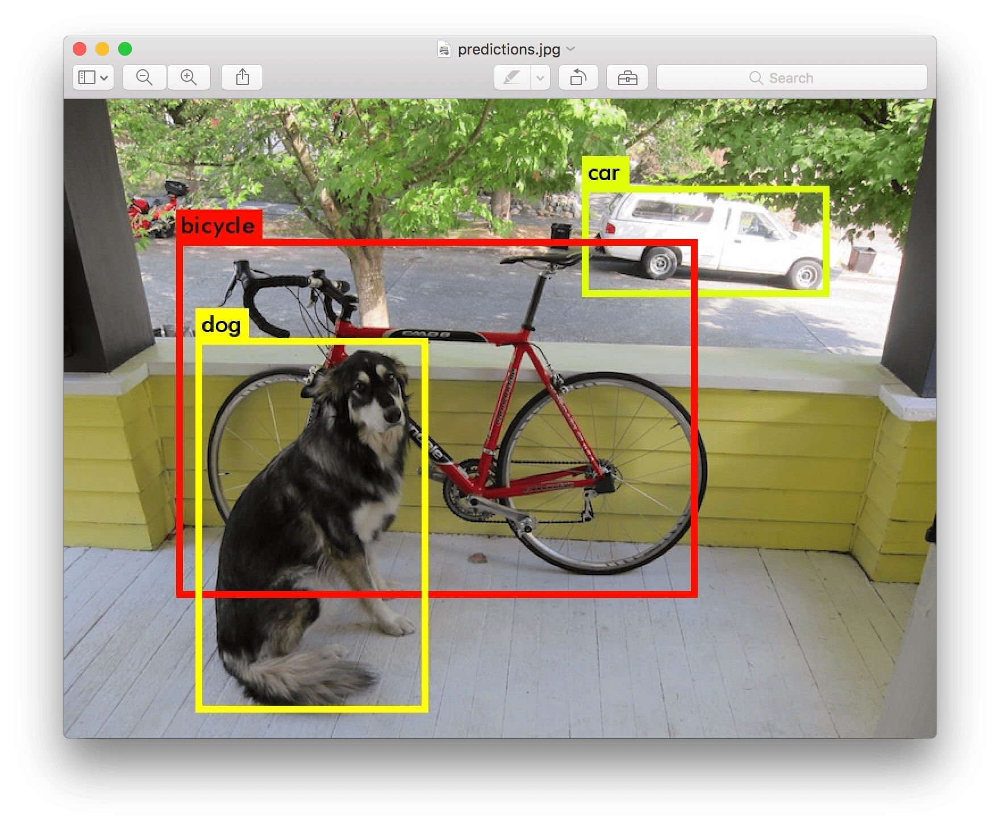
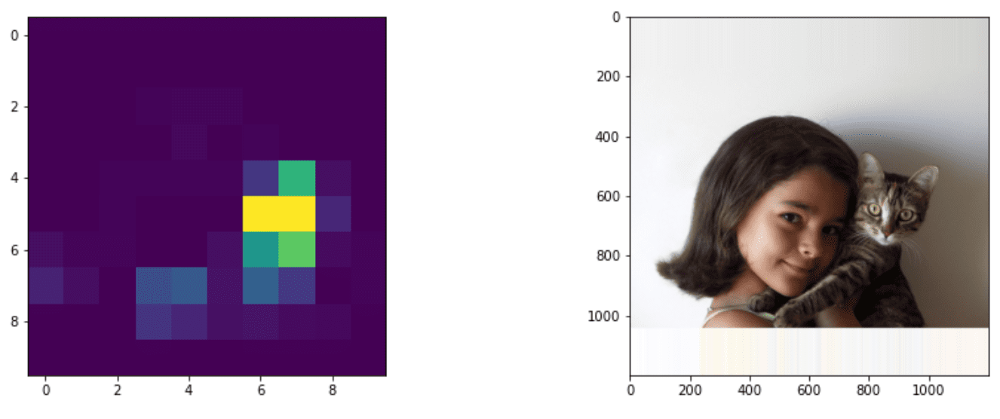
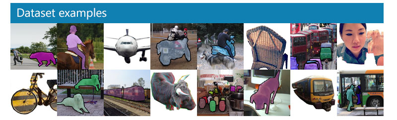
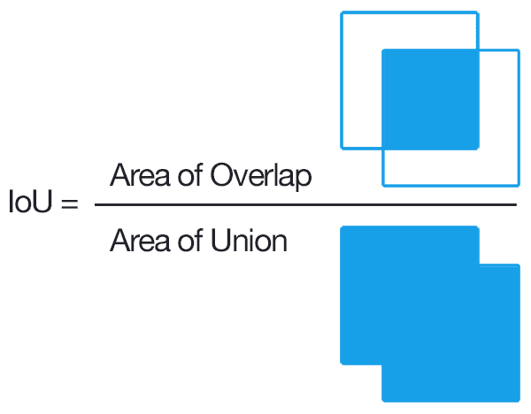
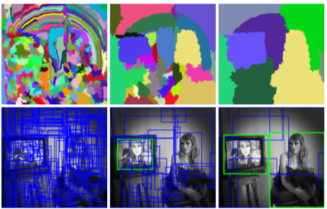
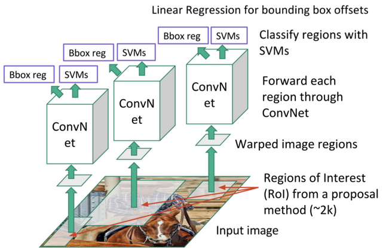
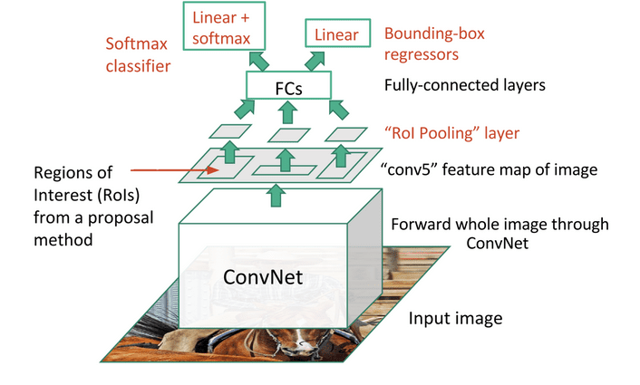
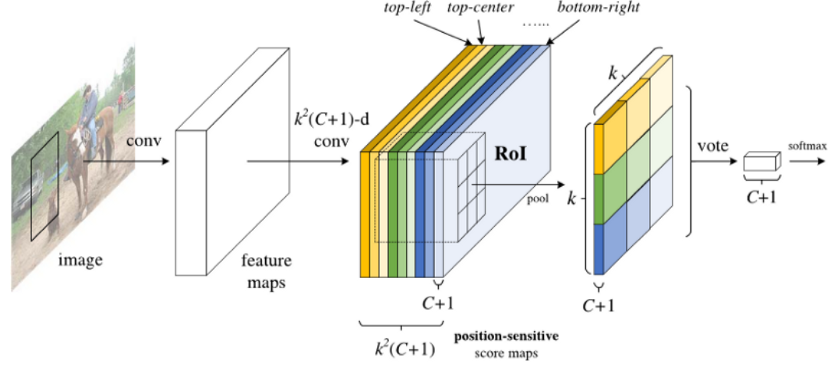
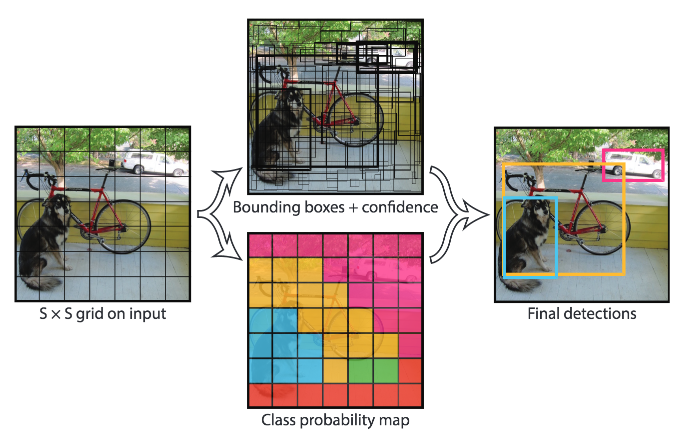

# Object Detection

The image classification models we have dealt with so far took an image and produced a categorical result, such as the class 'number' in a MNIST problem. However, in many cases we do not want just to know that a picture portrays objects - we want to be able to determine their precise location. This is exactly the point of **object detection**.

## [Pre-lecture quiz](https://red-field-0a6ddfd03.1.azurestaticapps.net/quiz/111)

> Image from [YOLO v2 web site](https://pjreddie.com/darknet/yolov2/)

## A Naive Approach to Object Detection

Assuming we wanted to find a cat on a picture, a very naive approach to object detection would be the following:

1. Break the picture down to a number of tiles
2. Run image classification on each tile.
3. Those tiles that result in sufficiently high activation can be considered to contain the object in question.

> *Image from [Exercise Notebook](ObjectDetection-TF.ipynb)*

However, this approach is far from ideal, because it only allows the algorithm to locate the object's bounding box very imprecisely. For more precise location, we need to run some sort of **regression** to predict the coordinates of bounding boxes - and for that, we need specific datasets.

## Regression for Object Detection

[This blog post](https://towardsdatascience.com/object-detection-with-neural-networks-a4e2c46b4491) has a great gentle introduction to detecting shapes.

## Datasets for Object Detection

You might run across the following datasets for this task:

* [PASCAL VOC](http://host.robots.ox.ac.uk/pascal/VOC/) - 20 classes
* [COCO](http://cocodataset.org/#home) - Common Objects in Context. 80 classes, bounding boxes and segmentation masks

## Object Detection Metrics

### Intersection over Union

While for image classification it is easy to measure how well the algorithm performs, for object detection we need to measure both the correctness of the class, as well as the precision of the inferred bounding box location. For the latter, we use the so-called **Intersection over Union** (IoU), which measures how well two boxes (or two arbitrary areas) overlap.

> *Figure 2 from [this excellent blog post on IoU](https://pyimagesearch.com/2016/11/07/intersection-over-union-iou-for-object-detection/)*

The idea is simple - we divide the area of intersection between two figures by the area of their union. For two identical areas, IoU would be 1, while for completely disjointed areas it will be 0. Otherwise it will vary from 0 to 1. We typically only consider those bounding boxes for which IoU is over a certain value.

### Average Precision

Suppose we want to measure how well a given class of objects $C$ is recognized. To measure it, we use **Average Precision** metrics, which is calculated as follows:

1. Consider Precision-Recall curve shows the accuracy depending on a detection threshold value (from 0 to 1).
2. Depending on the threshold, we will get more or less objects detected in the image, and different values of precision and recall.
3. The curve will look like this:

> *Image from [NeuroWorkshop](http://github.com/shwars/NeuroWorkshop)*

The average Precision for a given class $C$ is the area under this curve. More precisely, Recall axis is typically divided into 10 parts, and Precision is averaged over all those points:

$$
AP = {1\over11}\sum_{i=0}^{10}\mbox{Precision}(\mbox{Recall}={i\over10})
$$

### AP and IoU

We shall consider only those detections, for which IoU is above a certain value. For example, in PASCAL VOC dataset typically $\mbox{IoU Threshold} = 0.5$ is assumed, while in COCO AP is measured for different values of $\mbox{IoU Threshold}$.

> *Image from [NeuroWorkshop](http://github.com/shwars/NeuroWorkshop)*

### Mean Average Precision - mAP

The main metric for Object Detection is called **Mean Average Precision**, or **mAP**. It is the value of Average Precision, average across all object classes, and sometimes also over $\mbox{IoU Threshold}$. In more detail, the process of calculating **mAP** is described
[in this blog post](https://medium.com/@timothycarlen/understanding-the-map-evaluation-metric-for-object-detection-a07fe6962cf3)), and also [here with code samples](https://gist.github.com/tarlen5/008809c3decf19313de216b9208f3734).

## Different Object Detection Approaches

There are two broad classes of object detection algorithms:

* **Region Proposal Networks** (R-CNN, Fast R-CNN, Faster R-CNN). The main idea is to generate **Regions of Interests** (ROI) and run CNN over them, looking for maximum activation. It is a bit similar to the naive approach, with the exception that ROIs are generated in a more clever way. One of the majors drawbacks of such methods is that they are slow, because we need many passes of the CNN classifier over the image.
* **One-pass** (YOLO, SSD, RetinaNet) methods. In those architectures we design the network to predict both classes and ROIs in one pass.

### R-CNN: Region-Based CNN

[R-CNN](http://islab.ulsan.ac.kr/files/announcement/513/rcnn_pami.pdf) uses [Selective Search](http://www.huppelen.nl/publications/selectiveSearchDraft.pdf) to generate hierarchical structure of ROI regions, which are then passed through CNN feature extractors and SVM-classifiers to determine the object class, and linear regression to determine *bounding box* coordinates. [Official Paper](https://arxiv.org/pdf/1506.01497v1.pdf)

> *Image from van de Sande et al. ICCV’11*

> *Images from [this blog](https://towardsdatascience.com/r-cnn-fast-r-cnn-faster-r-cnn-yolo-object-detection-algorithms-36d53571365e)

### F-RCNN - Fast R-CNN

This approach is similar to R-CNN, but regions are defined after convolution layers have been applied.

> Image from [the Official Paper](https://www.cv-foundation.org/openaccess/content_iccv_2015/papers/Girshick_Fast_R-CNN_ICCV_2015_paper.pdf), [arXiv](https://arxiv.org/pdf/1504.08083.pdf), 2015

### Faster R-CNN

The main idea of this approach is to use neural network to predict ROIs - so-called *Region Proposal Network*. [Paper](https://arxiv.org/pdf/1506.01497.pdf), 2016

> Image from [the official paper](https://arxiv.org/pdf/1506.01497.pdf)

### R-FCN: Region-Based Fully Convolutional Network

This algorithm is even faster than Faster R-CNN. The main idea is the following:

1. We extract features using ResNet-101
1. Features are processed by **Position-Sensitive Score Map**. Each object from $C$ classes is divided by $k\times k$ regions, and we are training to predict parts of objects.
1. For each part from $k\times k$ regions all networks vote for object classes, and the object class with maximum vote is selected.

> Image from [official paper](https://arxiv.org/abs/1605.06409)

### YOLO - You Only Look Once

YOLO is a realtime one-pass algorithm. The main idea is the following:

 * Image is divided into $S\times S$ regions
 * For each region, **CNN** predicts $n$ possible objects, *bounding box* coordinates and *confidence*=*probability* * IoU.

 

> Image from [official paper](https://arxiv.org/abs/1506.02640)

### Other Algorithms

* RetinaNet: [official paper](https://arxiv.org/abs/1708.02002)
   - [PyTorch Implementation in Torchvision](https://pytorch.org/vision/stable/_modules/torchvision/models/detection/retinanet.html)
   - [Keras Implementation](https://github.com/fizyr/keras-retinanet)
   - [Object Detection with RetinaNet](https://keras.io/examples/vision/retinanet/) in Keras Samples
* SSD (Single Shot Detector): [official paper](https://arxiv.org/abs/1512.02325)

## ✍️ Exercises: Object Detection

Continue your learning in the following notebook:

[ObjectDetection.ipynb](ObjectDetection.ipynb)

## Conclusion

In this lesson you took a whirlwind tour of all the various ways that object detection can be accomplished!

## 🚀 Challenge

Read through these articles and notebooks about YOLO and try them for yourself

* [Good blog post](https://www.analyticsvidhya.com/blog/2018/12/practical-guide-object-detection-yolo-framewor-python/) describing YOLO
 * [Official site](https://pjreddie.com/darknet/yolo/)
 * Yolo: [Keras implementation](https://github.com/experiencor/keras-yolo2), [step-by-step notebook](https://github.com/experiencor/basic-yolo-keras/blob/master/Yolo%20Step-by-Step.ipynb)
 * Yolo v2: [Keras implementation](https://github.com/experiencor/keras-yolo2), [step-by-step notebook](https://github.com/experiencor/keras-yolo2/blob/master/Yolo%20Step-by-Step.ipynb)

## [Post-lecture quiz](https://red-field-0a6ddfd03.1.azurestaticapps.net/quiz/211)

## Review & Self Study

* [Object Detection](https://tjmachinelearning.com/lectures/1718/obj/) by Nikhil Sardana
* [A good comparison of object detection algorithms](https://lilianweng.github.io/lil-log/2018/12/27/object-detection-part-4.html)
* [Review of Deep Learning Algorithms for Object Detection](https://medium.com/comet-app/review-of-deep-learning-algorithms-for-object-detection-c1f3d437b852)
* [A Step-by-Step Introduction to the Basic Object Detection Algorithms](https://www.analyticsvidhya.com/blog/2018/10/a-step-by-step-introduction-to-the-basic-object-detection-algorithms-part-1/)
* [Implementation of Faster R-CNN in Python for Object Detection](https://www.analyticsvidhya.com/blog/2018/11/implementation-faster-r-cnn-python-object-detection/)

## [Assignment: Object Detection](lab/README.md)
