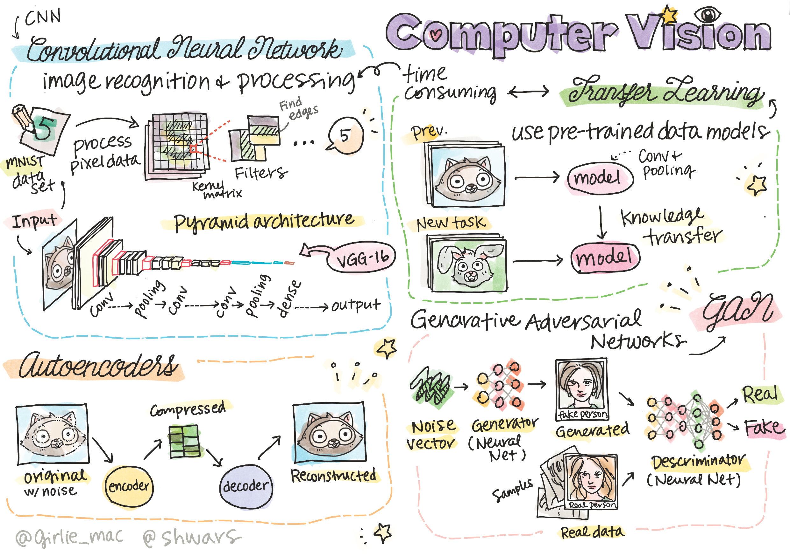

# Bilgisayarla Görme

Bu bölümde şunları öğreneceğiz:

* [Bilgisayarla Görme ve OpenCV'ye Giriş](../06-IntroCV/translations/README.tr.md)
* [Evrişimli Sinir Ağları](../07-ConvNets/translations/README.tr.md)
* [Önceden Eğitilmiş Ağlar ve Öğrenme Transferi](../08-TransferLearning/translations/README.tr.md)
* [Otokodlayıcılar](../09-Autoencoders/translations/README.tr.md)
* [Çekişmeli Üretici Ağlar](../10-GANs/translations/README.tr.md)
* [Nesne Algılama](../11-ObjectDetection/translations/README.tr.md)
* [Anlamsal Bölümleme](../12-Segmentation/translations/README.tr.md)