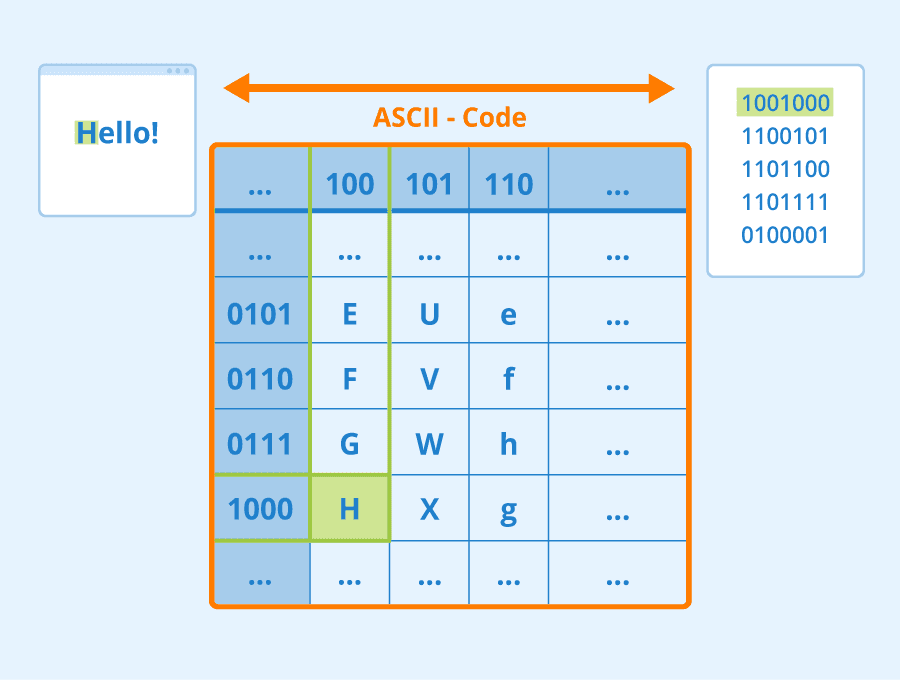

# Representing Text as Tensors

## [Pre-lecture quiz](https://red-field-0a6ddfd03.1.azurestaticapps.net/quiz/113)

## Text Classification

Throughout the first part of this section, we will focus on **text classification** task. We will use the [AG News](https://www.kaggle.com/amananandrai/ag-news-classification-dataset) Dataset, which contains news articles like the following:

* Category: Sci/Tech
* Title: Ky. Company Wins Grant to Study Peptides (AP)
* Body: AP - A company founded by a chemistry researcher at the University of Louisville won a grant to develop...

Our goal will be to classify the news item into one of the categories based on text.

## Representing text

If we want to solve Natural Language Processing (NLP) tasks with neural networks, we need some way to represent text as tensors. Computers already represent textual characters as numbers that map to fonts on your screen using encodings such as ASCII or UTF-8.

> [Image source](https://www.seobility.net/en/wiki/ASCII)

As humans, we understand what each letter **represents**, and how all characters come together to form the words of a sentence. However, computers by themselves do not have such an understanding, and neural network has to learn the meaning during training.

Therefore, we can use different approaches when representing text:

* **Character-level representation**, when we represent text by treating each character as a number. Given that we have *C* different characters in our text corpus, the word *Hello* would be represented by 5x*C* tensor. Each letter would correspond to a tensor column in one-hot encoding.
* **Word-level representation**, in which we create a **vocabulary** of all words in our text, and then represent words using one-hot encoding. This approach is somehow better, because each letter by itself does not have much meaning, and thus by using higher-level semantic concepts - words - we simplify the task for the neural network. However, given the large dictionary size, we need to deal with high-dimensional sparse tensors.

Regardless of the representation, we first need to convert the text into a sequence of **tokens**, one token being either a character, a word, or sometimes even part of a word. Then, we convert the token into a number, typically using **vocabulary**, and this number can be fed into a neural network using one-hot encoding.

## N-Grams

In natural language, precise meaning of words can only be determined in context. For example, meanings of *neural network* and *fishing network* are completely different. One of the ways to take this into account is to build our model on pairs of words, and considering word pairs as separate vocabulary tokens. In this way, the sentence *I like to go fishing* will be represented by the following sequence of tokens: *I like*, *like to*, *to go*, *go fishing*. The problem with this approach is that the dictionary size grows significantly, and combinations like *go fishing* and *go shopping* are presented by different tokens, which do not share any semantic similarity despite the same verb.  

In some cases, we may consider using tri-grams -- combinations of three words -- as well. Thus the approach is such is often called **n-grams**. Also, it makes sense to use n-grams with character-level representation, in which case n-grams will roughly correspond to different syllabi.

## Bag-of-Words and TF/IDF

When solving tasks like text classification, we need to be able to represent text by one fixed-size vector, which we will use as an input to final dense classifier. One of the simplest ways to do that is to combine all individual word representations, eg. by adding them. If we add one-hot encodings of each word, we will end up with a vector of frequencies, showing how many times each word appears inside the text. Such representation of text is called **bag of words** (BoW).

> Image by the author

A BoW essentially represents which words appear in text and in which quantities, which can indeed be a good indication of what the text is about. For example, news article on politics is likely to contains words such as *president* and *country*, while scientific publication would have something like *collider*, *discovered*, etc. Thus, word frequencies can in many cases be a good indicator of text content.

The problem with BoW is that certain common words, such as *and*, *is*, etc. appear in most of the texts, and they have highest frequencies, masking out the words that are really important. We may lower the importance of those words by taking into account the frequency at which words occur in the whole document collection. This is the main idea behind TF/IDF approach, which is covered in more detail in the notebooks attached to this lesson.

However, none of those approaches can fully take into account the **semantics** of text. We need more powerful neural networks models to do this, which we will discuss later in this section.

## ✍️ Exercises: Text Representation

Continue your learning in the following notebooks:

* [Text Representation with PyTorch](TextRepresentationPyTorch.ipynb)
* [Text Representation with TensorFlow](TextRepresentationTF.ipynb)

## Conclusion

So far, we have studied techniques that can add frequency weight to different words. They are, however, unable to represent meaning or order. As the famous linguist J. R. Firth said in 1935, "The complete meaning of a word is always contextual, and no study of meaning apart from context can be taken seriously." We will learn later in the course how to capture contextual information from text using language modeling.

## 🚀 Challenge

Try some other exercises using bag-of-words and different data models. You might be inspired by this [competition on Kaggle](https://www.kaggle.com/competitions/word2vec-nlp-tutorial/overview/part-1-for-beginners-bag-of-words)

## [Post-lecture quiz](https://red-field-0a6ddfd03.1.azurestaticapps.net/quiz/213)

## Review & Self Study

Practice your skills with text embeddings and bag-of-words techniques on [Microsoft Learn](https://docs.microsoft.com/learn/modules/intro-natural-language-processing-pytorch/?WT.mc_id=academic-77998-cacaste)

## [Assignment: Notebooks](assignment.md)
