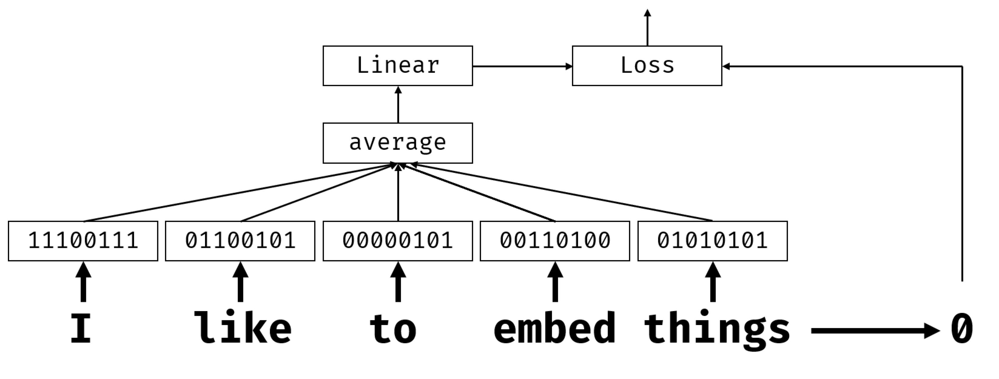
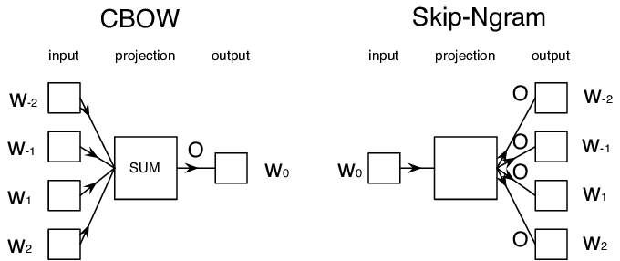

# incrustaciones

## [Pre-lecture quiz](https://red-field-0a6ddfd03.1.azurestaticapps.net/quiz/114)

Cuando entrenábamos clasificadores basados en BoW o TF/IDF, operamos con vectores de bolsa de palabras de alta dimensión con longitud "vocab_size", y convertíamos explícitamente desde vectores de representación posicional de baja dimensión a una representación única y dispersa. Sin embargo, esta representación única no es eficiente en cuanto a memoria. Además, cada palabra se trata de forma independiente entre sí, es decir, los vectores codificados en caliente no expresan ninguna similitud semántica entre palabras.

La idea de **incrustar** es representar palabras mediante vectores densos de dimensiones inferiores, que de alguna manera reflejan el significado semántico de una palabra. Más adelante discutiremos cómo crear incrustaciones de palabras significativas, pero por ahora pensemos en las incrustaciones como una forma de reducir la dimensionalidad de un vector de palabras.

Entonces, la capa de incrustación tomaría una palabra como entrada y produciría un vector de salida del `embedding_size` especificado. En cierto sentido, es muy similar a una capa "Lineal", pero en lugar de tomar un vector codificado en caliente, podrá tomar un número de palabra como entrada, lo que nos permitirá evitar la creación de grandes archivos codificados en caliente. vectores.

Al usar una capa de incrustación como primera capa en nuestra red clasificadora, podemos cambiar de una bolsa de palabras al modelo de **bolsa de incrustación**, donde primero convertimos cada palabra en nuestro texto en la incrustación correspondiente y luego calculamos algunas función agregada sobre todas esas incrustaciones, como "suma", "promedio" o "máximo".

> Imagen del autor

## ✍️ Ejercicios: Incrustaciones

Continúa tu aprendizaje en los siguientes cuadernos:
* [Embeddings with PyTorch](EmbeddingsPyTorch.ipynb)
* [Embeddings TensorFlow](EmbeddingsTF.ipynb)
  
## Incrustaciones semánticas: Word2Vec

Si bien la capa de incrustación aprendió a asignar palabras a una representación vectorial, esta representación no necesariamente tenía mucho significado semántico. Sería bueno aprender una representación vectorial de modo que palabras similares o sinónimos correspondan a vectores que estén cerca entre sí en términos de alguna distancia vectorial (por ejemplo, distancia euclidiana).

Para hacer eso, necesitamos entrenar previamente nuestro modelo de incrustación en una gran colección de texto de una manera específica. Una forma de entrenar incrustaciones semánticas se llama [Word2Vec](https://en.wikipedia.org/wiki/Word2vec). Se basa en dos arquitecturas principales que se utilizan para producir una representación distribuida de palabras:

  - **Bolsa de palabras continua** (CBoW): en esta arquitectura, entrenamos el modelo para predecir una palabra a partir del contexto circundante. Dado el ngrama $(W_{-2},W_{-1},W_0,W_1,W_2)$, el objetivo del modelo es predecir $W_0$ a partir de $(W_{-2},W_{-1} ,W_1,W_2)$.
  - **Salto continuo de gramo** es opuesto a CBoW. El modelo utiliza una ventana circundante de palabras de contexto para predecir la palabra actual.

CBoW es más rápido, mientras que skip-gram es más lento, pero representa mejor palabras poco frecuentes.

> Imagen de [this paper](https://arxiv.org/pdf/1301.3781.pdf)

Las incrustaciones previamente entrenadas de Word2Vec (así como otros modelos similares, como GloVe) también se pueden usar en lugar de la capa de incrustación en redes neuronales. Sin embargo, debemos ocuparnos de los vocabularios, porque es probable que el vocabulario utilizado para entrenar previamente Word2Vec/GloVe difiera del vocabulario de nuestro corpus de texto. Eche un vistazo a los cuadernos anteriores para ver cómo se puede resolver este problema.

## Incrustaciones contextuales

Una limitación clave de las representaciones de incrustación tradicionales previamente entrenadas, como Word2Vec, es el problema de la desambiguación del sentido de las palabras. Si bien las incrustaciones previamente entrenadas pueden capturar parte del significado de las palabras en contexto, cada significado posible de una palabra está codificado en la misma incrustación. Esto puede causar problemas en los modelos posteriores, ya que muchas palabras, como la palabra "jugar", tienen diferentes significados según el contexto en el que se utilizan.

Por ejemplo, la palabra "jugar" en esas dos oraciones diferentes tiene un significado bastante diferente:

- Fui a una **obra** en el teatro.
- John quiere **jugar** con sus amigos.

Las incrustaciones previamente entrenadas anteriores representan ambos significados de la palabra "jugar" en la misma incrustación. Para superar esta limitación, necesitamos crear incrustaciones basadas en el **modelo de lenguaje**, que se entrena en un gran corpus de texto y *sabe* cómo se pueden juntar las palabras en diferentes contextos. Hablar de incrustaciones contextuales está fuera del alcance de este tutorial, pero volveremos a ellas cuando hablemos de modelos de lenguaje más adelante en el curso.

## Conclusión

En esta lección, descubrió cómo crear y utilizar capas incrustadas en TensorFlow y Pytorch para reflejar mejor los significados semánticos de las palabras.

## 🚀 Desafío

Word2Vec se ha utilizado para algunas aplicaciones interesantes, incluida la generación de letras de canciones y poesía. Eche un vistazo a [este artículo](https://www.politetype.com/blog/word2vec-color-poems) que explica cómo el autor utilizó Word2Vec para generar poesía. Mirar [this video by Dan Shiffmann](https://www.youtube.com/watch?v=LSS_bos_TPI&ab_channel=TheCodingTrain) así como descubrir una explicación diferente de esta técnica. Luego intente aplicar estas técnicas a su propio corpus de texto, tal vez obtenido de Kaggle.

## [Post-lecture quiz](https://red-field-0a6ddfd03.1.azurestaticapps.net/quiz/214)

## Revisión y autoestudio

Lea este documento sobre Word2Vec: [Efficient Estimation of Word Representations in Vector Space](https://arxiv.org/pdf/1301.3781.pdf)

## [Assignment: Notebooks](assignment.md)

