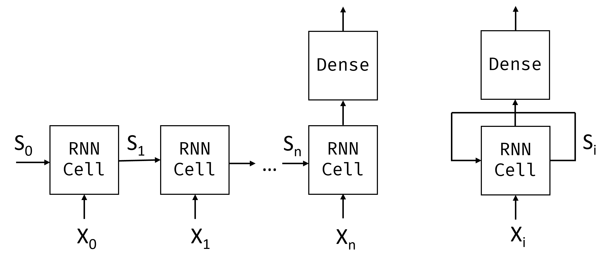
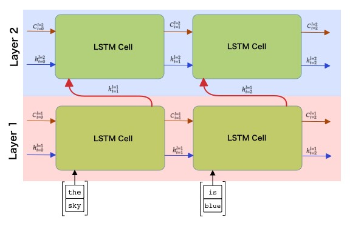

# 循环神经网络

## [课前测验](https://red-field-0a6ddfd03.1.azurestaticapps.net/quiz/116)

在之前的章节中，我们使用了富语义表示的文本和简单的线性分类器来处理这些嵌入。这种架构的作用是捕捉句子中单词的聚合含义，但它并不考虑单词的顺序，因为在嵌入之上的聚合操作将原始文本中的这些信息删除。因为这些模型无法模拟单词的顺序，所以它们无法解决更复杂或含糊的任务，比如文本生成或问题回答。

为了捕捉文本序列的含义，我们需要使用另一种神经网络架构，称为**循环神经网络**（Recurrent Neural Network，RNN）。在RNN中，我们逐个符号地将句子传递到网络中，网络会产生一些**状态**，然后我们再将这个状态与下一个符号一起传递给网络。

> 作者提供的图片

给定输入序列的标记 X0，...，Xn，RNN 创建一系列神经网络块，并使用反向传播算法将此序列端到端地进行训练。每个网络块将一对 (Xi, Si) 作为输入，并产生 Si+1 作为结果。最终状态 Sn 或 (输出 Yn) 进入线性分类器生成结果。所有的网络块共享相同的权重，并通过一次反向传播进行端到端的训练。

由于状态向量 S0，...，Sn 通过网络传递，它能够学习单词之间的顺序依赖关系。例如，当单词“not”在序列中的某个位置出现时，它可以学习对状态向量中的某些元素进行否定，从而产生否定的效果。

> ✅ 由于上图中所有RNN块的权重是共享的，同样的图可以表示为一个块（在右侧）带有一个循环反馈回路，将网络的输出状态传递回输入。

## RNN单元的解剖

让我们看看一个简单的RNN单元是如何组织的。它接受前一个状态Si-1和当前符号Xi作为输入，并且必须产生输出状态Si（有时，我们还对一些其他输出Yi感兴趣，就像在生成网络中一样）。

一个简单的RNN单元里面有两个权重矩阵：一个将输入符号进行转换（我们称之为W），另一个将输入状态进行转换（H）。在这种情况下，网络的输出计算公式为&sigma;(W&times;Xi+H&times;Si-1+b)，其中&sigma;是激活函数，b是额外的偏置。

> 图片由作者提供

在许多情况下，输入标记在进入RNN之前通过嵌入层进行降维。在这种情况下，如果输入向量的维数为*emb_size*，状态向量的大小为*hid_size* - W的大小为*emb_size*&times;*hid_size*，H的大小为*hid_size*&times;*hid_size*。## 长短期记忆（LSTM）

传统循环神经网络（RNN）的一个主要问题是所谓的**梯度消失**问题。因为RNN是通过一次反向传播进行端到端训练的，所以它很难将错误传播到网络的第一层，从而无法学习远距离标记之间的关系。为了避免这个问题，一种方法是引入**显式的状态管理**，使用所谓的**门**。这种类型有两种已知的架构：**长短期记忆**（LSTM）和**门控中继单元**（GRU）。

> 图像来源待定

LSTM网络的组织方式与RNN类似，但有两个状态从一层传递到下一层：实际状态C和隐藏向量H。在每个单元中，隐藏向量Hi与输入Xi连接在一起，通过**门**控制状态C的变化。每个门都是一个具有sigmoid激活的神经网络（输出在[0, 1]范围内），当与状态向量相乘时，可以将其看作是一个位掩码。在上面的图中，有以下门（从左到右）：
* **忘记门(forget gate)** 接收隐藏向量，并确定我们需要忘记向量C的哪些组成部分，以及需要通过哪些部分。
* **输入门(input gate)** 从输入向量和隐藏向量中提取一些信息并插入状态中。
* **输出门(output gate)** 通过带有* tanh *激活的线性层来转换状态，然后使用隐藏向量Hi选择其一些组成部分来产生新的状态Ci+1。

状态C的各个组成部分可以被看作是一些可以打开和关闭的标志。例如，当我们在序列中遇到一个名字*Alice*时，我们可能希望假设它是指一个女性角色，并在状态中提高我们有一个女性名词的标志。当我们进一步遇到短语*and Tom*时，我们将提高我们有一个复数名词的标志。因此，通过操作状态，我们可以假设地追踪句子部分的语法属性。

> ✅ 了解LSTM内部机制的一个很好的资源是Christopher Olah的这篇优秀文章[Understanding LSTM Networks](https://colah.github.io/posts/2015-08-Understanding-LSTMs/)。

## 双向和多层RNN

我们已经讨论了在一个方向上运行的循环网络，从序列的开始到结尾。这看起来很自然，因为它类似于我们阅读和听听说话的方式。然而，由于在许多实际情况下我们可以随机访问输入序列，所以以两个方向运行循环计算可能是有意义的。这样的网络被称为**双向**RNN。在处理双向网络时，我们需要两个隐藏状态向量，一个用于每个方向。

一个循环网络，无论是单向的还是双向的，都会捕捉序列中的特定模式，并将它们存储到状态向量中或传递到输出中。与卷积网络一样，我们可以在第一个网络的基础上构建另一个循环层，以捕捉更高级别的模式，并从第一层提取的低级别模式构建。这引导我们进入一个**多层RNN**的概念，它由两个或多个循环网络组成，其中上一层的输出作为下一层的输入传递。

*图片来源于[Fernando López的这篇精彩文章](https://towardsdatascience.com/from-a-lstm-cell-to-a-multilayer-lstm-network-with-pytorch-2899eb5696f3)*

## ✍️ 练习：

继续在以下笔记本中学习：

* [使用PyTorch进行RNN](../RNNPyTorch.ipynb)
* [使用TensorFlow进行RNN](../RNNTF.ipynb)

## 结论

在本单元中，我们看到RNN可以用于序列分类，但实际上，它们可以处理更多的任务，如文本生成，机器翻译等。我们将在下一单元中考虑这些任务。

## 🚀 挑战

阅读一些关于LSTM的文献，考虑其应用：

- [Grid Long Short-Term Memory](https://arxiv.org/pdf/1507.01526v1.pdf)
- [Show, Attend and Tell: Neural Image Caption Generation with Visual Attention](https://arxiv.org/pdf/1502.03044v2.pdf)

## [课后测验](https://red-field-0a6ddfd03.1.azurestaticapps.net/quiz/216)

## 复习和自学

- [理解LSTM网络](https://colah.github.io/posts/2015-08-Understanding-LSTMs/) 作者：Christopher Olah。

## [作业：笔记本](assignment.zh.md)