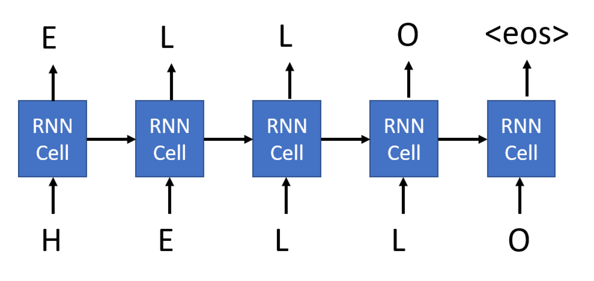
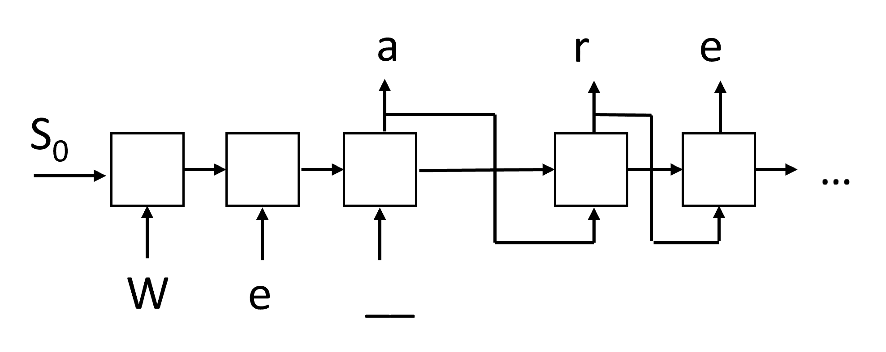

# 生成网络

## [预先讲座测验](https://red-field-0a6ddfd03.1.azurestaticapps.net/quiz/117)

循环神经网络（RNN）及其门控单元变体，如长短时记忆单元（LSTM）和门控循环单元（GRU），提供了一种语言模型的机制，它们可以学习词序并为序列中的下一个词提供预测。这样，我们就可以将RNN用于**生成任务**，例如普通文本生成、机器翻译，甚至图像标题生成。

> ✅ 回想一下你在打字时受益于文本补全等生成任务的所有时候。研究一下你最喜欢的应用程序，看看它们是否利用了RNN。

在之前的单元中我们讨论了RNN架构，每个RNN单元产生下一个隐藏状态作为输出。然而，我们还可以在每个循环单元中添加另一个输出，这样我们就可以输出一个**序列**（与原始序列长度相等）。此外，我们还可以使用在每个步骤中不接受输入的RNN单元，只需采用一些初始状态向量，然后生成一系列输出。这允许使用下图所示的不同神经网络结构：


> 图片来源于[递归神经网络的非理性有效性](http://karpathy.github.io/2015/05/21/rnn-effectiveness/)这篇博文，作者是[Andrej Karpaty](http://karpathy.github.io/)

* **一对一** 是具有一个输入和一个输出的传统神经网络
* **一对多** 是一种生成性架构，接受一个输入值，并生成一系列输出值。例如，如果我们想要训练一个**图像标题**网络，以生成一幅图片的文字描述，我们可以将图片作为输入，通过CNN获取它的隐藏状态，然后通过递归链逐字生成标题。
* **多对一** 对应于我们在前一节中描述的RNN架构，例如文本分类。
* **多对多**，或**序列对序列**对应于任务，如**机器翻译**，其中我们首先用一个RNN将所有输入序列的信息收集到隐藏状态中，然后另一个RNN链将该状态展开为输出序列。在本单元中，我们将重点关注帮助我们生成文本的简单生成模型。为了简单起见，我们将使用字符级的分词。

我们将逐步训练这个循环神经网络(RNN)来生成文本。在每一步中，我们将取一个长度为 `nchars` 的字符序列，并要求网络为每个输入字符生成下一个输出字符:



在生成文本(推断过程)时，我们从某个**提示**开始，它通过RNN单元产生中间状态，然后从该状态开始生成。我们逐个字符地生成，并将状态和生成的字符传递给另一个RNN单元来生成下一个字符，直到我们生成足够的字符。

> 作者提供的图片

## ✍️ 练习: 生成网络

请在以下笔记本中继续学习:

* [使用PyTorch的生成网络](../GenerativePyTorch.ipynb)
* [使用TensorFlow的生成网络](../GenerativeTF.ipynb)## 软文本生成和温度

每个RNN单元的输出是一个字符的概率分布。如果我们总是选择概率最高的字符作为生成文本中的下一个字符，文本往往会在相同的字符序列之间不断循环，就像这个例子中一样：

```
today of the second the company and a second the company ...
```

然而，如果我们观察下一个字符的概率分布，可能会发现最高概率之间的差异并不是很大，例如一个字符的概率可能是0.2，另一个字符的概率可能是0.19，等等。例如，在寻找序列“*play*”的下一个字符时，下一个字符可以是空格，也可以是**e**（例如单词*player*中的e）。这导致我们得出结论，选择具有更高概率的字符并不总是“公平”的，因为选择第二高的字符可能仍会导致有意义的文本。从网络输出给定的概率分布中**抽样**字符更为明智。我们还可以使用一个参数，**温度**，它可以使概率分布变得更平坦，以增加更多的随机性，或者使其更陡峭，以更多地坚持最高概率的字符。

在上述链接的笔记本中探索软文本生成是如何实现的。

## 结论

尽管文本生成在其本身已经很有用，但主要的好处来自于使用RNN从一些初始特征向量生成文本的能力。例如，文本生成被用作机器翻译的一部分（在这种情况下，来自*编码器*的状态向量被用来生成或*解码*翻译后的信息），或者生成图像的文字描述（在这种情况下，特征向量将来自CNN提取器）。

## 🚀 挑战

在这个主题上在Microsoft Learn上学习一些课程

* 使用[PyTorch](https://docs.microsoft.com/learn/modules/intro-natural-language-processing-pytorch/6-generative-networks/?WT.mc_id=academic-77998-cacaste)/[TensorFlow](https://docs.microsoft.com/learn/modules/intro-natural-language-processing-tensorflow/5-generative-networks/?WT.mc_id=academic-77998-cacaste)进行文本生成

## [课后测验](https://red-field-0a6ddfd03.1.azurestaticapps.net/quiz/217)

## 回顾与自学

以下是一些文章，可以扩展你的知识。* 使用马尔可夫链、LSTM和GPT-2进行文本生成的不同方法：[博客文章](https://towardsdatascience.com/text-generation-gpt-2-lstm-markov-chain-9ea371820e1e)
* 在[Keras文档](https://keras.io/examples/generative/lstm_character_level_text_generation/)中的文本生成示例

## [作业](../lab/README.zh.md)

我们已经看到了如何逐个字生成文本。在实验室中，您将探索逐个词的文本生成。