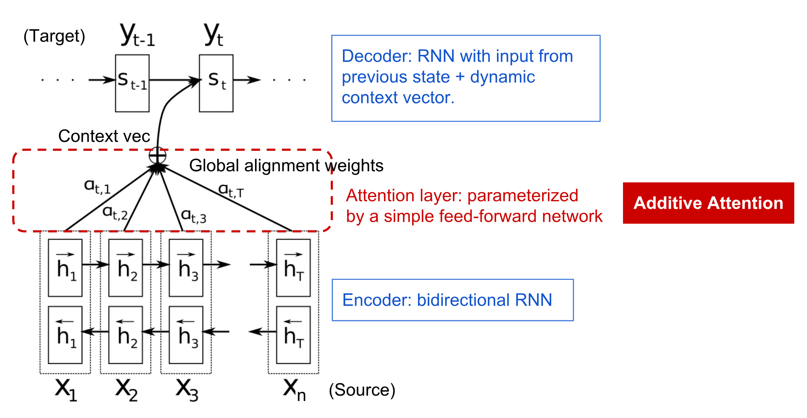
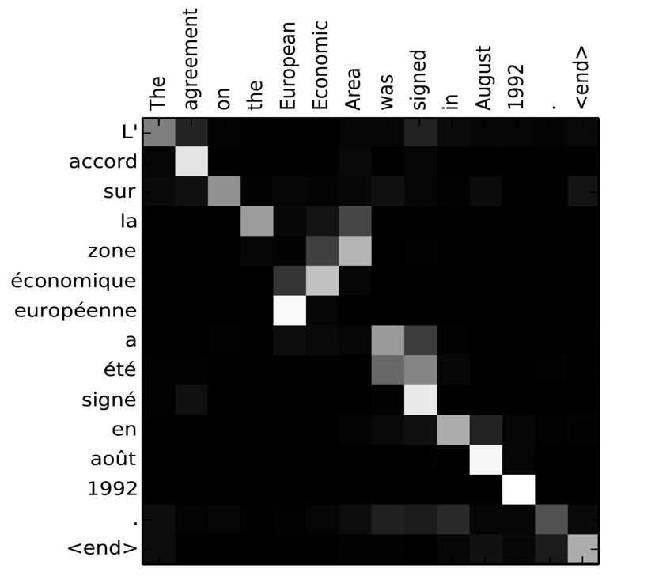
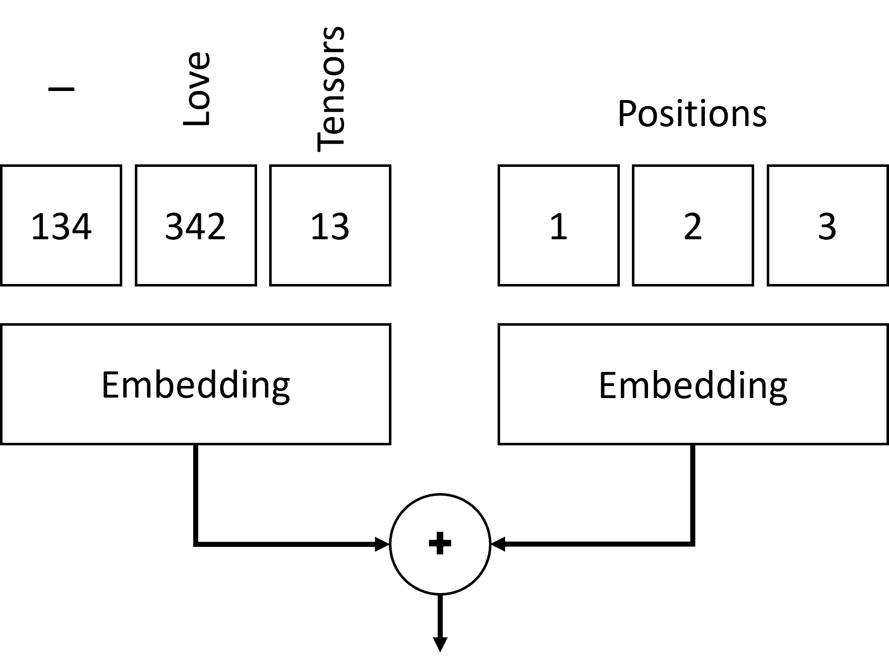
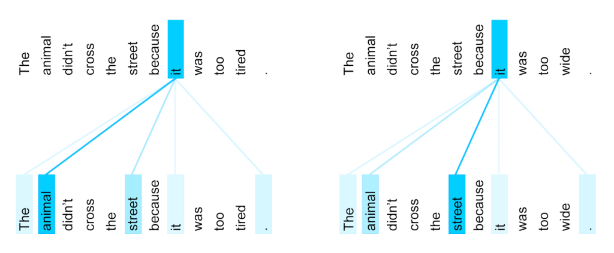
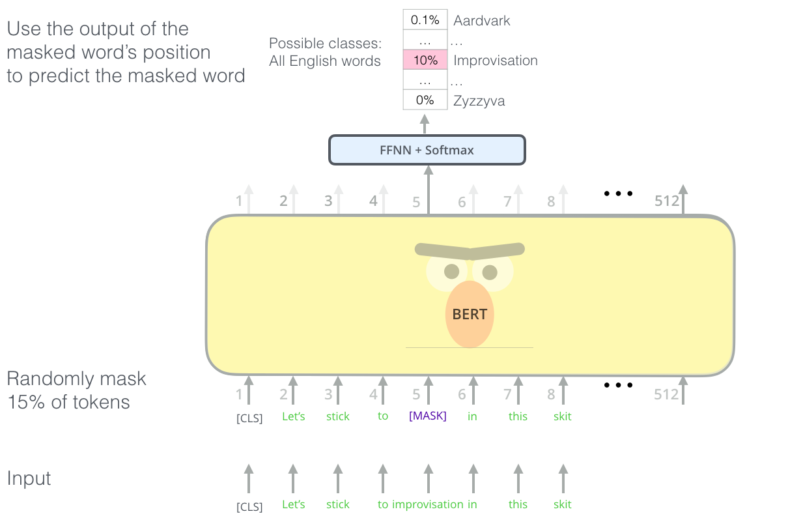

# Mecanismos de Atención y Transformadores

## [Pre-lecture quiz](https://red-field-0a6ddfd03.1.azurestaticapps.net/quiz/118)

Uno de los problemas más importantes en el ámbito de la PNL es la **traducción automática**, una tarea esencial en la que se basan herramientas como Google Translate. En esta sección, nos centraremos en la traducción automática o, más generalmente, en cualquier tarea de *secuencia a secuencia* (que también se denomina **transducción de oraciones**).

Con los RNN, la secuencia a secuencia se implementa mediante dos redes recurrentes, donde una red, el **codificador**, colapsa una secuencia de entrada en un estado oculto, mientras que otra red, el **decodificador**, desenrolla este estado oculto. en un resultado traducido. Hay un par de problemas con este enfoque:

* El estado final de la red del codificador tiene dificultades para recordar el comienzo de una oración, lo que provoca una mala calidad del modelo para oraciones largas.
* Todas las palabras de una secuencia tienen el mismo impacto en el resultado. En realidad, sin embargo, palabras específicas en la secuencia de entrada a menudo tienen más impacto que otras en las salidas secuenciales.

Los **Mecanismos de atención** proporcionan un medio para ponderar el impacto contextual de cada vector de entrada en cada predicción de salida del RNN. La forma en que se implementa es creando accesos directos entre los estados intermedios del RNN de entrada y el RNN de salida. De esta manera, al generar el símbolo de salida yt, tendremos en cuenta todos los estados ocultos de entrada hi, con diferentes coeficientes de peso αt,i< /sub>.

> El modelo codificador-decodificador con mecanismo de atención aditiva en [Bahdanau et al., 2015](https://arxiv.org/pdf/1409.0473.pdf), citado de [this blog post](https://lilianweng.github.io/lil-log/2018/06/24/attention-attention.html)

La matriz de atención {&alpha;i,j} representaría el grado que ciertas palabras de entrada juegan en la generación de una palabra determinada en la secuencia de salida. A continuación se muestra un ejemplo de dicha matriz:

> Figura de [Bahdanau et al., 2015](https://arxiv.org/pdf/1409.0473.pdf) (Fig.3)

Los mecanismos de atención son responsables de gran parte del estado actual o casi actual de la PNL. Sin embargo, agregar atención aumenta en gran medida la cantidad de parámetros del modelo, lo que generó problemas de escala con los RNN. Una limitación clave del escalamiento de RNN es que la naturaleza recurrente de los modelos dificulta el entrenamiento por lotes y paralelizado. En un RNN, cada elemento de una secuencia debe procesarse en orden secuencial, lo que significa que no se puede paralelizar fácilmente.

> Figura de [Google's Blog](https://research.googleblog.com/2016/09/a-neural-network-for-machine.html)

La adopción de mecanismos de atención combinada con esta restricción llevó a la creación de los modelos de transformadores de última generación que conocemos y utilizamos hoy, como BERT para Open-GPT3.

## Modelos de transformadores

Una de las ideas principales detrás de los transformadores es evitar la naturaleza secuencial de los RNN y crear un modelo que sea paralelizable durante el entrenamiento. Esto se logra implementando dos ideas:

* codificación posicional
* usar un mecanismo de autoatención para capturar patrones en lugar de RNN (o CNN) (por eso el artículo que presenta los transformadores se llama *[La atención es todo lo que necesitas](https://arxiv.org/abs/1706.03762)*

### Codificación/incrustación posicional

La idea de codificación posicional es la siguiente.
1. Cuando se utilizan RNN, la posición relativa de los tokens está representada por el número de pasos y, por lo tanto, no es necesario representarla explícitamente.
2. Sin embargo, una vez que pasamos a prestar atención, necesitamos conocer las posiciones relativas de las fichas dentro de una secuencia.
3. Para obtener codificación posicional, aumentamos nuestra secuencia de tokens con una secuencia de posiciones de tokens en la secuencia (es decir, una secuencia de números 0,1,...).
4. Luego mezclamos la posición del token con un vector de incrustación del token. Para transformar la posición (entero) en un vector, podemos utilizar diferentes enfoques:

* Incrustación entrenable, similar a la incrustación de tokens. Este es el enfoque que consideramos aquí. Aplicamos capas de incrustación sobre ambos tokens y sus posiciones, lo que da como resultado vectores de incrustación de las mismas dimensiones, que luego sumamos.
* Función de codificación de posición fija, como se propone en el artículo original.

> Imagen del autor

El resultado que obtenemos con la incrustación posicional incrusta tanto el token original como su posición dentro de una secuencia.

### Autoatención de múltiples cabezas

A continuación, necesitamos capturar algunos patrones dentro de nuestra secuencia. Para hacer esto, los transformadores utilizan un mecanismo de **autoatención**, que es esencialmente atención aplicada a la misma secuencia que la entrada y la salida. Aplicar la atención personal nos permite tener en cuenta el **contexto** dentro de la oración y ver qué palabras están interrelacionadas. Por ejemplo, nos permite ver a qué palabras se hace referencia mediante correferencias, como *it*, y también tener en cuenta el contexto:

> Imagen de [Google Blog](https://research.googleblog.com/2017/08/transformer-novel-neural-network.html)

En los transformadores, utilizamos **Atención de múltiples cabezales** para darle a la red el poder de capturar varios tipos diferentes de dependencias, por ejemplo. relaciones de palabras a largo plazo versus a corto plazo, correferencia versus otra cosa, etc.

[TensorFlow Notebook](TransformersTF.ipynb) contiene más detalles sobre la implementación de capas transformadoras.

### Atención codificador-decodificador

En los transformadores, la atención se utiliza en dos lugares:

* Para capturar patrones dentro del texto ingresado usando la atención propia
* Para realizar la traducción de secuencias: es la capa de atención entre el codificador y el decodificador.

La atención del codificador-decodificador es muy similar al mecanismo de atención utilizado en los RNN, como se describe al principio de esta sección. Este diagrama animado explica el papel de la atención del codificador-decodificador.

Dado que cada posición de entrada se asigna de forma independiente a cada posición de salida, los transformadores pueden paralelizarse mejor que los RNN, lo que permite modelos de lenguaje mucho más grandes y expresivos. Cada cabeza de atención se puede utilizar para aprender diferentes relaciones entre palabras, lo que mejora las tareas posteriores de procesamiento del lenguaje natural.

##BERTO

**BERT** (Representaciones de codificador bidireccional de transformadores) es una red de transformadores multicapa muy grande con 12 capas para *BERT-base* y 24 para *BERT-large*. Primero, el modelo se entrena previamente en un gran corpus de datos de texto (WikiPedia + libros) mediante entrenamiento no supervisado (predicción de palabras enmascaradas en una oración). Durante el entrenamiento previo, el modelo absorbe niveles significativos de comprensión del lenguaje que luego se pueden aprovechar con otros conjuntos de datos mediante un ajuste fino. Este proceso se llama **transferencia de aprendizaje**.

> Imagen [source](http://jalammar.github.io/illustrated-bert/)

## ✍️ Ejercicios: Transformadores

Continúa tu aprendizaje en los siguientes cuadernos:

* [Transformers in PyTorch](TransformersPyTorch.ipynb)
* [Transformers in TensorFlow](TransformersTF.ipynb)

## Conclusión

En esta lección aprendiste sobre los transformadores y los mecanismos de atención, todas herramientas esenciales en la caja de herramientas de la PNL. Existen muchas variaciones de arquitecturas Transformer, incluidas BERT, DistilBERT. BigBird, OpenGPT3 y más que se pueden ajustar. El [paquete HuggingFace](https://github.com/huggingface/) proporciona un repositorio para entrenar muchas de estas arquitecturas con PyTorch y TensorFlow.

## 🚀 Desafío

## [Post-lecture quiz](https://red-field-0a6ddfd03.1.azurestaticapps.net/quiz/218)

# Revisión y autoestudio

* [Blog post](https://mchromiak.github.io/articles/2017/Sep/12/Transformer-Attention-is-all-you-need/), explaining the classical [Attention is all you need](https://arxiv.org/abs/1706.03762) paper on transformers.
* [A series of blog posts](https://towardsdatascience.com/transformers-explained-visually-part-1-overview-of-functionality-95a6dd460452) on transformers, explaining the architecture in detail.

## [Assignment](assignment.md)

