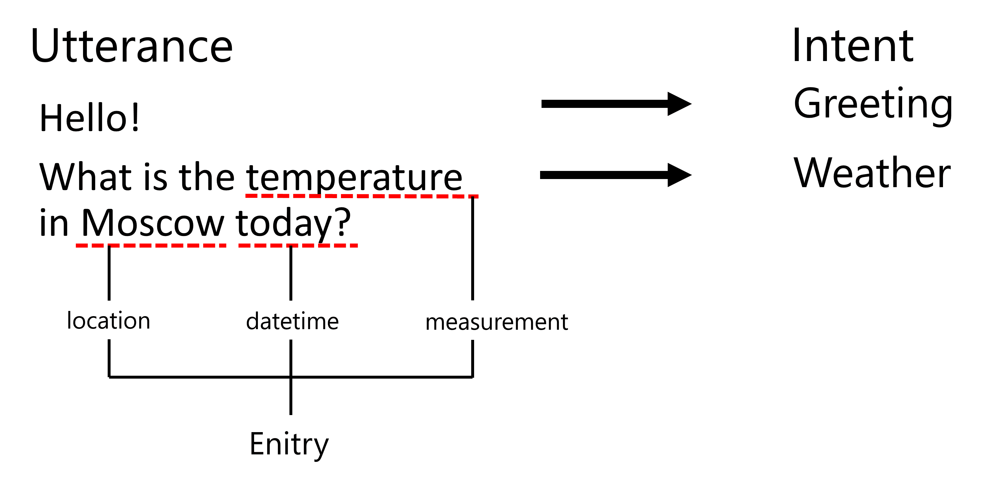

# 命名实体识别

到目前为止，我们主要关注的是一种自然语言处理任务 - 分类。然而，还有其他可以使用神经网络完成的自然语言处理任务。其中一个任务是**[命名实体识别](https://wikipedia.org/wiki/Named-entity_recognition)**（NER），它用于识别文本中的特定实体，如地点、人名、日期时间间隔、化学式等。

## [预备讲座测验](https://red-field-0a6ddfd03.1.azurestaticapps.net/quiz/119)

## 使用NER的示例

假设你想开发一个类似亚马逊Alexa或Google Assistant的自然语言聊天机器人。智能聊天机器人的工作方式是通过对输入句子进行文本分类来*理解*用户的需求。这种分类的结果被称为**意图**，它决定了聊天机器人应该做什么。

> 作者提供的图片

然而，用户可能会在短语中提供一些参数。例如，当询问天气时，她可能会指定一个地点或日期。机器人应该能够理解这些实体，并在执行操作之前填充参数插槽。这正是NER的作用所在。

> ✅ 另一个例子是[分析科学医学文章](https://soshnikov.com/science/analyzing-medical-papers-with-azure-and-text-analytics-for-health/)。我们需要查找的主要内容之一是特定的医学术语，如疾病和药物。虽然一小部分疾病可能可以使用子字符串搜索提取，但更复杂的实体，如化学化合物和药物名称，需要更复杂的方法。

## NER

作为词元分类NER模型本质上是**标记分类模型**，因为对于输入的每个标记，我们需要决定它是否属于一个实体，如果是的话，还需要确定其属于哪个实体类别。

考虑以下论文标题：

在一个新生儿中，存在 **三尖瓣反流** 和 **碳酸锂中毒**。

这里的实体有：

* 三尖瓣反流是一种疾病（`DIS`）
* 碳酸锂是一种化学物质（`CHEM`）* 毒性也是一种疾病 (`DIS`)

请注意，一个实体可能占据多个标记。并且，如本例所示，我们需要区分两个连续的实体。因此，通常对每个实体使用两个类 - 一个指定实体的第一个标记（通常使用`B-`前缀，表示**开头**），另一个指定实体的继续部分（`I-`，表示**内部**标记）。我们还使用`O`作为表示所有**其他**标记的类。这种标记标记被称为[BIO标记](https://en.wikipedia.org/wiki/Inside%E2%80%93outside%E2%80%93beginning_(tagging))（或IOB）。当标记时，我们的标题将变成这样：

标记 | 类别
------|-----
Tricuspid | B-DIS
valve | I-DIS
regurgitation | I-DIS
and | O锂|B-CHEM
碳酸盐|I-CHEM
毒性|B-DIS
在|O
新生儿|O
婴儿|O
中|O
。|O

由于我们需要在标记和类之间建立一对一的对应关系，所以我们可以从这张图片中训练一个最右侧的多对多神经网络模型：

> *图片来源于[这篇博文](http://karpathy.github.io/2015/05/21/rnn-effectiveness/)，作者是[Andrej Karpathy](http://karpathy.github.io/)。 NER标记分类模型对应于图中最右侧的网络架构。*

## 训练NER模型

由于NER模型本质上是一个标记分类模型，我们可以使用我们已经熟悉的RNN来完成此任务。在这种情况下，每个递归网络块将返回标记ID。以下示例笔记本展示了如何为标记分类训练LSTM。

## ✍️ 示例笔记本: 
继续在以下笔记本中学习NER：

* [使用TensorFlow进行NER（命名实体识别）](../NER-TF.ipynb)

## 结论

NER模型是一种**令牌分类模型**，意味着它可以用于执行令牌分类。这是NLP中非常常见的任务，可以帮助识别文本中的特定实体，包括地点、名称、日期等。

## 🚀 挑战

完成下面链接的任务，训练一个用于医学术语的命名实体识别模型，然后在不同的数据集上尝试它。

## [课后测验](https://red-field-0a6ddfd03.1.azurestaticapps.net/quiz/219)

## 复习和自学

阅读博客 [Recurrent Neural Networks的 非合理有效性](http://karpathy.github.io/2015/05/21/rnn-effectiveness/)，并按照该文章中的Further Reading部分跟随以深入了解您的知识。

## [任务](../lab/README.zh.md)

在本课程的作业中，你将需要训练一个医疗实体识别模型。你可以先按照本课程中所述的方式训练一个LSTM模型，然后再使用BERT transformer模型。阅读[说明](../lab/README.zh.md)以获取所有细节。