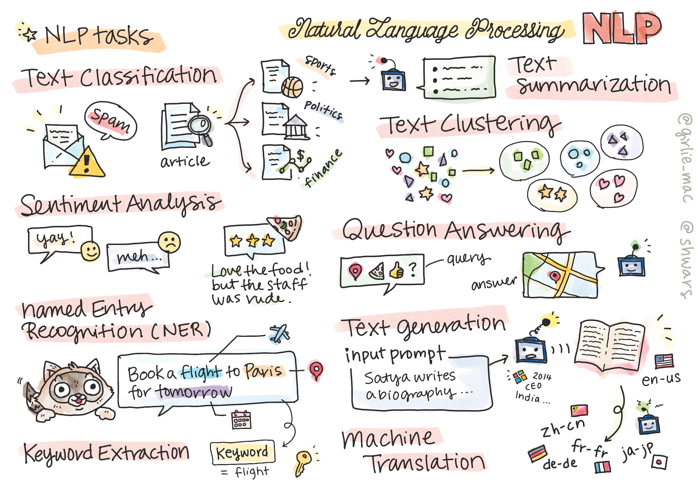

# Procesamiento natural del lenguaje



En esta sección, nos centraremos en el uso de redes neuronales para manejar tareas relacionadas con el **Procesamiento del lenguaje natural (NLP)**. Hay muchos problemas de PNL que queremos que las computadoras puedan resolver:

* **Clasificación de texto** es un problema de clasificación típico relacionado con secuencias de texto. Los ejemplos incluyen clasificar mensajes de correo electrónico como spam versus no spam, o categorizar artículos como deportes, negocios, política, etc. Además, cuando desarrollamos chatbots, a menudo necesitamos entender lo que un usuario quería decir, en este caso. Estamos tratando con **clasificación de intención**. A menudo, en la clasificación de intenciones necesitamos tratar con muchas categorías.
* **El análisis de sentimiento** es un problema de regresión típico, en el que necesitamos atribuir un número (un sentimiento) correspondiente a qué tan positivo/negativo es el significado de una oración. Una versión más avanzada del análisis de sentimientos es el **análisis de sentimientos basado en aspectos** (ABSA), donde atribuimos el sentimiento no a la oración completa, sino a diferentes partes de ella (aspectos), por ejemplo. *En este restaurante me gustó la cocina, pero el ambiente era horrible*.
* **Reconocimiento de entidades nombradas** (NER) se refiere al problema de extraer ciertas entidades del texto. Por ejemplo, es posible que debamos entender que en la frase *Necesito volar a París mañana* la palabra *mañana* se refiere a FECHA y *París* es una UBICACIÓN.
* **La extracción de palabras clave** es similar a NER, pero necesitamos extraer palabras importantes para el significado de la oración automáticamente, sin entrenamiento previo para tipos de entidades específicos.
* **La agrupación de texto** puede ser útil cuando queremos agrupar oraciones similares, por ejemplo, solicitudes similares en conversaciones de soporte técnico.
* **Respuesta a preguntas** se refiere a la capacidad de un modelo para responder una pregunta específica. El modelo recibe un pasaje de texto y una pregunta como entradas y necesita proporcionar un lugar en el texto donde esté contenida la respuesta a la pregunta (o, a veces, generar el texto de respuesta).
* **Generación de texto** es la capacidad de un modelo para generar texto nuevo. Puede considerarse como una tarea de clasificación que predice la siguiente letra/palabra basándose en algún *indicador de texto*. Los modelos avanzados de generación de texto, como GPT-3, pueden resolver otras tareas de PNL, como la clasificación, utilizando una técnica llamada [programación rápida] (https://towardsdatascience.com/software-3-0-how-prompting-will- cambiar-las-reglas-del-juego-a982fbfe1e0) o [ingeniería rápida](https://medium.com/swlh/openai-gpt-3-and-prompt-engineering-dcdc2c5fcd29)
* **Resumen de texto** es una técnica cuando queremos que una computadora "lea" un texto largo y lo resuma en unas pocas oraciones.
* **La traducción automática** puede verse como una combinación de comprensión de texto en un idioma y generación de texto en otro.

Inicialmente, la mayoría de las tareas de PNL se resolvían utilizando métodos tradicionales como las gramáticas. Por ejemplo, en la traducción automática se utilizaban analizadores para transformar la oración inicial en un árbol de sintaxis, luego se extraían estructuras semánticas de nivel superior para representar el significado de la oración y, en base a este significado y la gramática del idioma de destino, se generaba el resultado. Hoy en día, muchas tareas de PNL se resuelven de forma más eficaz mediante redes neuronales.

> Muchos métodos clásicos de PNL se implementan en [Natural Language Processing Toolkit (NLTK)](https://www.nltk.org) Biblioteca de Python. Hay un gran [NLTK Book](https://www.nltk.org/book/) disponible en línea que cubre cómo se pueden resolver diferentes tareas de PNL utilizando NLTK.

En nuestro curso, nos centraremos principalmente en el uso de redes neuronales para PNL y usaremos NLTK cuando sea necesario.

Ya hemos aprendido sobre el uso de redes neuronales para manejar datos tabulares e imágenes. La principal diferencia entre esos tipos de datos y el texto es que el texto es una secuencia de longitud variable, mientras que el tamaño de entrada en el caso de las imágenes se conoce de antemano. Si bien las redes convolucionales pueden extraer patrones de los datos de entrada, los patrones en el texto son más complejos. Por ejemplo, podemos hacer que la negación separada del sujeto sea arbitraria para muchas palabras (por ejemplo, *No me gustan las naranjas*, vs. *No me gustan esas naranjas grandes, coloridas y sabrosas*), y eso aún debería interpretarse como un patrón. Por lo tanto, para manejar el lenguaje necesitamos introducir nuevos tipos de redes neuronales, como *redes recurrentes* y *transformadores*.

## Instalar bibliotecas

Si está utilizando la instalación local de Python para ejecutar este curso, es posible que deba instalar todas las bibliotecas necesarias para PNL usando los siguientes comandos:

**Para PyTorch**
```golpecito
instalación de pip -r requisitos-torch.txt
```
**Para TensorFlow**
```golpecito
instalación de pip -r requisitos-tf.txt
```

> Puedes probar la PNL con TensorFlow activado

## Advertencia de GPU

En esta sección, en algunos de los ejemplos entrenaremos modelos bastante grandes. Es recomendable ejecutar las computadoras portátiles en una computadora con GPU para minimizar el tiempo de espera.

Cuando se ejecuta en GPU, es posible que experimente situaciones en las que se quede sin memoria de GPU. Durante el entrenamiento, la cantidad de memoria de GPU consumida depende de muchos factores, incluido el tamaño del minibatch. Si experimenta algún problema de memoria, puede intentar minimizar el tamaño del minibatch en el código.

Además, algunas versiones anteriores de TensorFlow no liberan correctamente la memoria de la GPU si entrenas varios modelos en un kernel de Python. Para utilizar la memoria de la GPU con precaución, puede configurar la opción TensorFlow para aumentar la asignación de memoria de la GPU solo cuando sea necesario. Debería incluir el siguiente código en sus cuadernos:

```pitón
dispositivos_físicos = tf.config.list_physical_devices('GPU')
si len(dispositivos_físicos)>0:
     tf.config.experimental.set_memory_growth(dispositivos_físicos[0], Verdadero)
```

Si está interesado en aprender sobre PNL desde una perspectiva clásica de ML, visite [this suite of lessons](https://github.com/microsoft/ML-For-Beginners/tree/main/6-NLP)

## In this Section
In this section we will learn about:

* [Representing text as tensors](13-TextRep/README.md)
* [Word Embeddings](14-Emdeddings/README.md)
* [Language Modeling](15-LanguageModeling/README.md)
* [Recurrent Neural Networks](16-RNN/README.md)
* [Generative Networks](17-GenerativeNetworks/README.md)
* [Transformers](18-Transformers/README.md)

