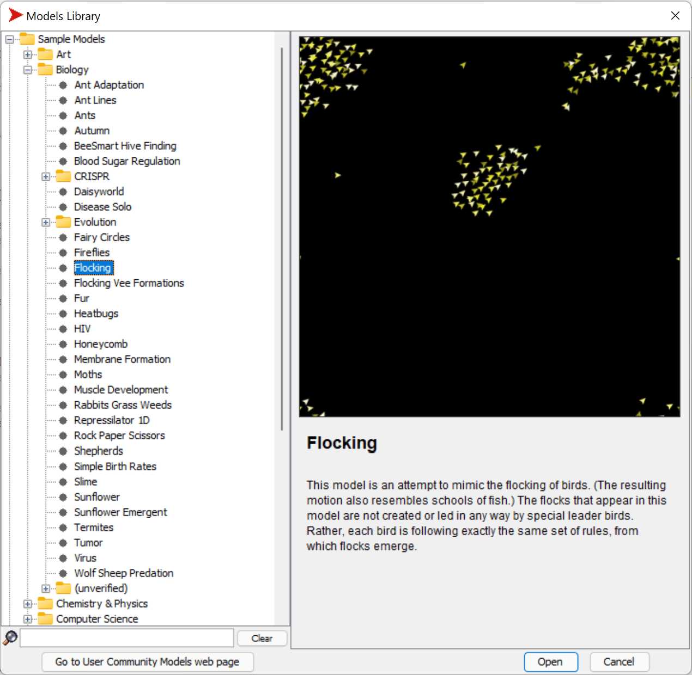
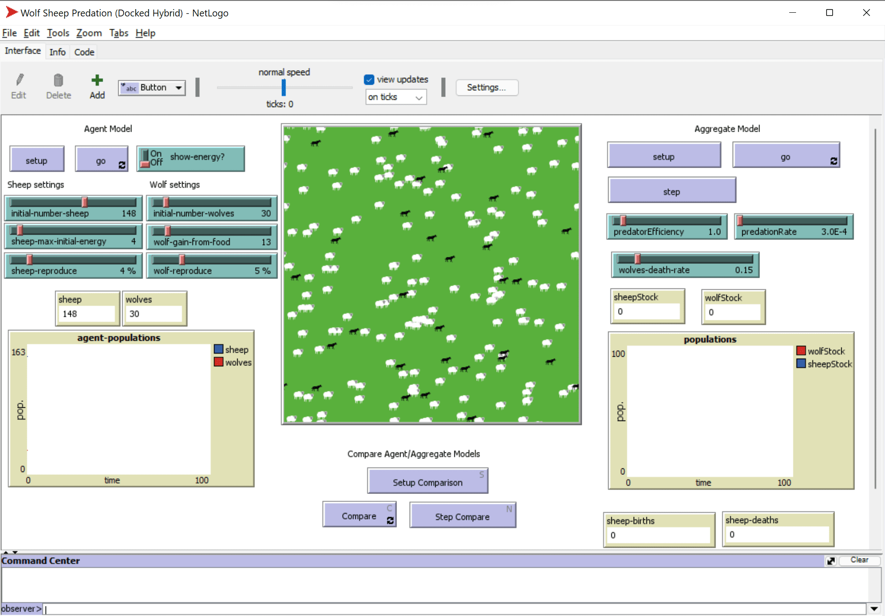

# Multi-Agent Systems

One of the possible ways of achieving intelligence is so-called **emergent** (or **synergetic**) approach, which is based on the fact that the combined behavior of many relatively simple agents can result in the overall more complex (or intelligent) behavior of the system as a whole. Theoretically, this is based on the principles of [Collective Intelligence](https://en.wikipedia.org/wiki/Collective_intelligence), [Emergentism](https://en.wikipedia.org/wiki/Global_brain) and [Evolutionary Cybernetics](https://en.wikipedia.org/wiki/Global_brain), which state that higher-level systems gain some sort of added value when being properly combined from lower-level systems (so-called *principle of metasystem transition*).

## [Pre-lecture quiz](https://red-field-0a6ddfd03.1.azurestaticapps.net/quiz/123)

The direction of **Multi-Agent Systems** has emerged in AI in 1990s as a response to growth of the Internet and distributed systems. On of the classical AI textbooks, [Artificial Intelligence: A Modern Approach](https://en.wikipedia.org/wiki/Artificial_Intelligence:_A_Modern_Approach), focuses on the view of classical AI from the point of view of Multi-agent systems.

Central to Multi-agent approach is the notion of **Agent** - an entity that lives in some **environment**, which it can perceive, and act upon. This is a very broad definition, and there could be many different types and classifications of agents:

* By their ability to reason:
   - **Reactive** agents usually have simple request-response type of behavior
   - **Deliberative** agents employ some sort of logical reasoning and/or planning capabilities
* By the place where agent execute its code:
   - **Static** agents work on a dedicated network node
   - **Mobile** agents can move their code between network nodes
* By their behavior:
   - **Passive agents** do not have specific goals. Such agents can react to external stimuli, but will not initiate any actions themselves. 
   - **Active agents** have some goals which they pursue
   - **Cognitive agents** involve complex planning and reasoning

Multi-agent systems are nowadays used in a number of applications:

* In games, many non-player characters employ some sort of AI, and can be considered to be intelligent agents
* In video production, rendering complex 3D scenes that involve crowds is typically done using multi-agent simulation
* In systems modeling, multi-agent approach is used to simulate the behavior of a complex model. For example, multi-agent approach has been successfully used to predict the spread of COVID-19 disease worldwide. Similar approach can be used to model traffic in the city, and see how it reacts to changes in traffic rules.
* In complex automation systems, each device can act as an independent agent, which makes the whole system less monolith and more robust.

We will not spend a lot of time going deep into multi-agent systems, but consider one example of **Multi-Agent Modeling**.

## NetLogo

[NetLogo](https://ccl.northwestern.edu/netlogo/) is a multi-agent modeling environment based on a modified version of the [Logo](https://en.wikipedia.org/wiki/Logo_(programming_language)) programming language. This language was developed for teaching programming concepts to kids, and it allows you to control an agent called **turtle**, which can move, leaving a trace behind. This allows creating complex geometric figures, which is a very visual way to understand the behavior of an agent.

In NetLogo, we can create many turtles by using the `create-turtles` command. We can then command all turtles to do some actions (in the example below - more 10 point forward):

```
create-turtles 10
ask turtles [
  forward 10
]
```

Of course, it is not interesting when all turtles do the same thing, so we can `ask` groups of turtles, eg. those who are in the vicinity of a certain point. We can also create turtles of different *breeds* using `breed [cats cat]` command. Here `cat` is the name of a breed, and we need to specify both singular and plural word, because different commands use different forms for clarity.

> ✅ We will not go into learning the NetLogo language itself - you can visit the brilliant [Beginner's Interactive NetLogo Dictionary](https://ccl.northwestern.edu/netlogo/bind/) resource if you are interested in learning more.

You can [download](https://ccl.northwestern.edu/netlogo/download.shtml) and install NetLogo to try it.

### Models Library

A great thing about NetLogo is that it contains a library of working models that you can try. Go to **File &rightarrow; Models Library**, and you have many categories of models to choose from.



> A screenshot of the models library by Dmitry Soshnikov

You can open one of the models, for example **Biology &rightarrow; Flocking**.

### Main Principles

After opening the model, you are taken to the main NetLogo screen. Here is a sample model that describes the population of wolves and sheep, given finite resources (grass).



> Screenshot by Dmitry Soshnikov

On this screen, you can see:

* The **Interface** section which contains:
  - The main field, where all agents live
  - Different controls: buttons, sliders, etc.
  - Graphs that you can use to display parameters of the simulation
* The **Code** tab which contains the editor, where you can type NetLogo program

In most cases, the interface would have a **Setup** button, which initializes the simulation state, and a **Go** button that starts the execution. Those are handled by corresponding handlers in the code that look like this:

```
to go [
...
]
```

NetLogo's world consists of the following objects:

* **Agents** (turtles) that can move across the field and do something. You command agents by using `ask turtles [...]` syntax, and the code in brackets is executed by all agents in *turtle mode*.
* **Patches** are square areas of the field, on which agents live. You can refer to all agents on the same patch, or you can change patch colors and some other properties. You can also `ask patches` to do something.
* **Observer** is a unique agent that controls the world. All button handlers are executed in *observer mode*.

> ✅ The beauty of a multi-agent environment is that the code that runs in turtle mode or in patch mode is executed at the same time by all agents in parallel. Thus, by writing a little code and programming the behavior of individual agent, you can create complex behavior of the simulation system as a whole.

### Flocking

As an example of multi-agent behavior, let's consider **[Flocking](https://en.wikipedia.org/wiki/Flocking_(behavior))**. Flocking is a complex pattern that is very similar to how flocks of birds fly. Watching them fly you can think that they follow some kind of collective algorithm, or that they possess some form of *collective intelligence*. However, this complex behavior arises when each individual agent (in this case, a *bird*) only observes some other agents in a short distance from it, and follows three simple rules:

* **Alignment** - it steers towards the average heading of neighboring agents
* **Cohesion** - it tries to steer towards the average position of neighbors (*long range attraction*)
* **Separation** - when getting too close to other birds, it tries to move away (*short range repulsion*)

You can run the flocking example and observe the behavior. You can also adjust parameters, such as *degree of separation*, or the *viewing range*, which defines how far each bird can see. Note that if you decrease the viewing range to 0, all birds become blind, and flocking stops. If you decrease separation to 0, all birds gather into a straight line.

> ✅ Switch to the **Code** tab and see where three rules of flocking (alignment, cohesion and separation) are implemented in code. Note how we refer only to those agents that are in sight.

### Other Models to see

There are a few more interesting models that you can experiment with:

* **Art &rightarrow; Fireworks** shows how a firework can be considered a collective behavior of individual fire streams
* **Social Science &rightarrow; Traffic Basic** and **Social Science &rightarrow; Traffic Grid** show the model of city traffic in 1D and 2D Grid with or without traffic lights. Each car in the simulation follows the following rules:
   - If the space in front of it is empty - accelerate (up to a certain max speed)
   - If it sees the obstacle in front - brake (and you can adjust how far a driver can see)
* **Social Science &rightarrow; Party** shows how people group together during a cocktail party. You can find the combination of parameters that lead to the fastest increase of happiness of the group.

As you can see from these examples, multi-agent simulations can be quite a useful way to understand the behavior of a complex system consisting of individuals that follow the same or similar logic. It can also be used to control virtual agents, such as [NPCs](https://en.wikipedia.org/wiki/NPC) in computer games, or agents in 3D animated worlds.

## Deliberative Agents

The agents described above are very simple, reacting to changes in environment using some kind of algorithm. As such they are **reactive agents**. However, sometimes agents can reason and plan their action, in which case they are called **deliberative**.

A typical example would be a personal agent that receives an instruction from a human to book a vacation tour. Suppose that there are many agents that live on the internet, who can help it. It should then contact other agents to see which flights are available, what are the hotel prices for different dates, and try to negotiate the best price. When the vacation plan is complete and confirmed by the owner, it can proceed with booking.

In order to do that, agents need to **communicate**. For successful communication they need:

* Some **standard languages to exchange knowledge**, such as [Knowledge Interchange Format](https://en.wikipedia.org/wiki/Knowledge_Interchange_Format) (KIF) and [Knowledge Query and Manipulation Language](https://en.wikipedia.org/wiki/Knowledge_Query_and_Manipulation_Language) (KQML). Those languages are designed based on [Speech Act theory](https://en.wikipedia.org/wiki/Speech_act).
* Those languages should also include some **protocols for negotiations**, based on different **auction types**.
* A **common ontology** to use, so that they refer to the same concepts knowing their semantics
* A way to **discover** what different agents can do, also based on some sort of ontology

Deliberative agents are much more complex than reactive, because they do not only react to changes in environment, they should also be able to *intiate* actions. One of the proposed architectures for deliberative agents is the so-called Belief-Desire-Intention (BDI) agent:

* **Beliefs** form a set of knowledge about an agent's environment. It can be structured as a knowledge base or set of rules that an agent can apply to a specific situation in the environment.
* **Desires** define what an agent wants to do, i.e. its goals. For example, the goal of the personal assistant agent above is to book a tour, and the goal of a hotel agent is to maximize profit.
* **Intentions** are specific actions that an agent plans to achieve its goals. Actions typically change the environment and cause communication with other agents.

There are some platforms available for building multi-agent systems, such as [JADE](https://jade.tilab.com/). [This paper](https://arxiv.org/ftp/arxiv/papers/2007/2007.08961.pdf) contains a review of multi-agent platforms, together with a brief history of multi-agent systems and their different usage scenarios.

## Conclusion

Multi-Agent systems can take very different forms and be used in many different applications. 
They all tend to focus on the simpler behavior of an individual agent, and achieve more complex behavior of the overall system due to **synergetic effect**.

## 🚀 Challenge

Take this lesson to the real world and try to conceptualize a multi-agent system that can solve a problem. What, for example, would a multi-agent system need to do to optimize a school bus route? How could it work in a bakery?

## [Post-lecture quiz](https://red-field-0a6ddfd03.1.azurestaticapps.net/quiz/223)

## Review & Self Study

Review the use of this type of system in industry. Pick a domain such as manufacturing or the video game industry and discover how multi-agent systems can be used to solve unique problems.

## [NetLogo Assignment](assignment.md)
