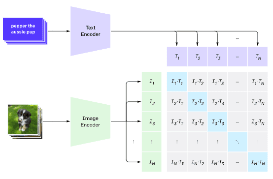
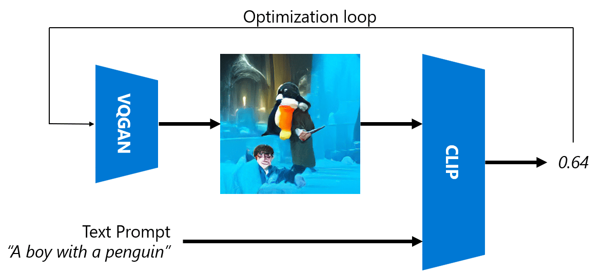
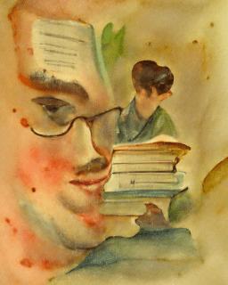
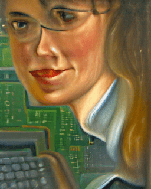
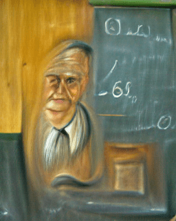

# Multi-Modal Networks

After the success of transformer models for solving NLP tasks, the same or similar architectures have been applied to computer vision tasks. There is a growing interest in building models that would *combine* vision and natural language capabilities. One of such attempts was done by OpenAI, and it is called CLIP and DALL.E.

## Contrastive Image Pre-Training (CLIP)

The main idea of CLIP is to be able to compare text prompts with an image and determine how well the image corresponds to the prompt.

> *Picture from [this blog post](https://openai.com/blog/clip/)*

The model is trained on images obtained from the Internet and their captions. For each batch, we take N pairs of (image, text), and convert them to some vector representations I1,..., IN / T1, ..., TN. Those representations are then matched together. The loss function is defined to maximize the cosine similarity between vectors corresponding to one pair (eg. Ii and Ti), and minimize cosine similarity between all other pairs. That is the reason this approach is called **contrastive**.

CLIP model/library is available from [OpenAI GitHub](https://github.com/openai/CLIP). The approach is described in [this blog post](https://openai.com/blog/clip/), and in more detail in [this paper](https://arxiv.org/pdf/2103.00020.pdf).

Once this model is pre-trained, we can give it a batch of images and a batch of text prompts, and it will return is the tensor with probabilities. CLIP can be used for several tasks:

**Image Classification**

Suppose we need to classify images between, say, cats, dogs and humans. In this case, we can give the model an image, and a series of text prompts: "*a picture of a cat*", "*a picture of a dog*", "*a picture of a human*". In the resulting vector of 3 probabilities we just need to select the index with a highest value.

> *Picture from [this blog post](https://openai.com/blog/clip/)*

**Text-Based Image Search**

We can also do the opposite. If we have a collection of images, we can pass this collection to the model, and a text prompt - this will give us the image that is most similar to a given prompt.

## ✍️ Example: [Using CLIP for Image Classification and Image Search](Clip.ipynb)

Open the [Clip.ipynb](Clip.ipynb) notebook to see CLIP in action.

## Image Generation with VQGAN+ CLIP

CLIP can also be used for **image generation** from a text prompt. In order to do this, we need a **generator model** that will be able to generate images based on some vector input. One of such models is called [VQGAN](https://compvis.github.io/taming-transformers/) (Vector-Quantized GAN).

The main ideas of VQGAN that differentiate it from ordinary [GAN](../../4-ComputerVision/10-GANs/README.md) are the following:
* Using autoregressive transformer architecture to generate a sequence of context-rich visual parts that compose the image. Those visual parts are in turn learned by [CNN](../../4-ComputerVision/07-ConvNets/README.md)
* Use sub-image discriminator that detects whether parts of the image are "real" of "fake" (unlike the "all-or-nothing" approach in traditional GAN).

Learn more about VQGAN at the [Taming Transformers](https://compvis.github.io/taming-transformers/) web site.

One of the important differences between VQGAN and traditional GAN is that the latter can produce a decent image from any input vector, while VQGAN is likely to produce an image that would not be coherent. Thus, we need to further guide the image creation process, and that can be done using CLIP. 

To generate an image corresponding to a text prompt, we start with some random encoding vector that is passed through VQGAN to produce an image. Then CLIP is used to produce a loss function that shows how well the image corresponds to the text prompt. The goal then is to minimize this loss, using back propagation to adjust the input vector parameters.

A great library that implements VQGAN+CLIP is [Pixray](http://github.com/pixray/pixray)

 |   | 
----|----|----
Picture generated from prompt *a closeup watercolor portrait of young male teacher of literature with a book* | Picture generated from prompt *a closeup oil portrait of young female teacher of computer science with a computer* | Picture generated from prompt *a closeup oil portrait of old male teacher of mathematics in front of blackboard*

> Pictures from **Artificial Teachers** collection by [Dmitry Soshnikov](http://soshnikov.com)

## DALL-E
### [DALL-E 1](https://openai.com/research/dall-e)
DALL-E is a version of GPT-3 trained to generate images from prompts. It has been trained with 12-billion parameters.

Unlike CLIP, DALL-E receives both text and image as a single stream of tokens for both images and text. Therefore, from multiple prompts, you can generate images based on the text.

### [DALL-E 2](https://openai.com/dall-e-2)
The main difference between DALL.E 1 and 2, is that it generates more realistic images and art. 

Examples of image genrations with DALL-E:
 |   | 
----|----|----
Picture generated from prompt *a closeup watercolor portrait of young male teacher of literature with a book* | Picture generated from prompt *a closeup oil portrait of young female teacher of computer science with a computer* | Picture generated from prompt *a closeup oil portrait of old male teacher of mathematics in front of blackboard*

## References

* VQGAN Paper: [Taming Transformers for High-Resolution Image Synthesis](https://compvis.github.io/taming-transformers/paper/paper.pdf)
* CLIP Paper: [Learning Transferable Visual Models From Natural Language Supervision](https://arxiv.org/pdf/2103.00020.pdf)