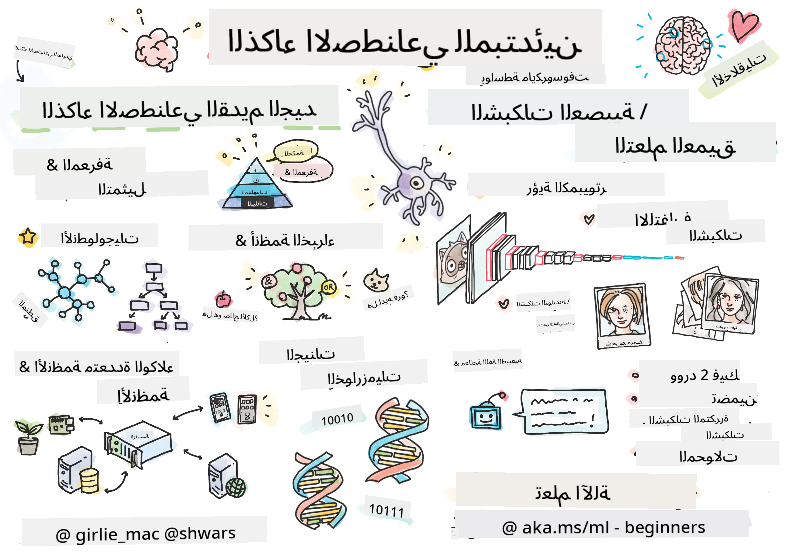

<!--
CO_OP_TRANSLATOR_METADATA:
{
  "original_hash": "c8f6fd940f684ae35bdb7646af1e9aa7",
  "translation_date": "2025-11-18T17:02:13+00:00",
  "source_file": "README.md",
  "language_code": "ar"
}
-->
  
  
  
  
  

  
  
  
  
  

  

# الذكاء الاصطناعي للمبتدئين - منهج دراسي  

||  
|:---:|  
| الذكاء الاصطناعي للمبتدئين - _رسم توضيحي بواسطة [@girlie_mac](https://twitter.com/girlie_mac)_ |  

استكشف عالم **الذكاء الاصطناعي** (AI) من خلال منهج دراسي مدته 12 أسبوعًا و24 درسًا! يتضمن دروسًا عملية، اختبارات، ومختبرات. المنهج مناسب للمبتدئين ويغطي أدوات مثل TensorFlow وPyTorch، بالإضافة إلى أخلاقيات الذكاء الاصطناعي.  

### 🌐 دعم متعدد اللغات  

#### مدعوم عبر GitHub Action (تلقائي ودائم التحديث)  

<!-- CO-OP TRANSLATOR LANGUAGES TABLE START -->  
[Arabic](./README.md) | [Bengali](../bn/README.md) | [Bulgarian](../bg/README.md) | [Burmese (Myanmar)](../my/README.md) | [Chinese (Simplified)](../zh/README.md) | [Chinese (Traditional, Hong Kong)](../hk/README.md) | [Chinese (Traditional, Macau)](../mo/README.md) | [Chinese (Traditional, Taiwan)](../tw/README.md) | [Croatian](../hr/README.md) | [Czech](../cs/README.md) | [Danish](../da/README.md) | [Dutch](../nl/README.md) | [Estonian](../et/README.md) | [Finnish](../fi/README.md) | [French](../fr/README.md) | [German](../de/README.md) | [Greek](../el/README.md) | [Hebrew](../he/README.md) | [Hindi](../hi/README.md) | [Hungarian](../hu/README.md) | [Indonesian](../id/README.md) | [Italian](../it/README.md) | [Japanese](../ja/README.md) | [Korean](../ko/README.md) | [Lithuanian](../lt/README.md) | [Malay](../ms/README.md) | [Marathi](../mr/README.md) | [Nepali](../ne/README.md) | [Nigerian Pidgin](../pcm/README.md) | [Norwegian](../no/README.md) | [Persian (Farsi)](../fa/README.md) | [Polish](../pl/README.md) | [Portuguese (Brazil)](../br/README.md) | [Portuguese (Portugal)](../pt/README.md) | [Punjabi (Gurmukhi)](../pa/README.md) | [Romanian](../ro/README.md) | [Russian](../ru/README.md) | [Serbian (Cyrillic)](../sr/README.md) | [Slovak](../sk/README.md) | [Slovenian](../sl/README.md) | [Spanish](../es/README.md) | [Swahili](../sw/README.md) | [Swedish](../sv/README.md) | [Tagalog (Filipino)](../tl/README.md) | [Tamil](../ta/README.md) | [Thai](../th/README.md) | [Turkish](../tr/README.md) | [Ukrainian](../uk/README.md) | [Urdu](../ur/README.md) | [Vietnamese](../vi/README.md)  
<!-- CO-OP TRANSLATOR LANGUAGES TABLE END -->  

**إذا كنت ترغب في دعم لغات إضافية، يمكنك الاطلاع على القائمة [هنا](https://github.com/Azure/co-op-translator/blob/main/getting_started/supported-languages.md)**  

## انضم إلى المجتمع  
  

## ما الذي ستتعلمه  

**[خريطة ذهنية للدورة](http://soshnikov.com/courses/ai-for-beginners/mindmap.html)**  

في هذا المنهج الدراسي، ستتعلم:  

* طرق مختلفة للذكاء الاصطناعي، بما في ذلك النهج الرمزي التقليدي مع **تمثيل المعرفة** والاستدلال ([GOFAI](https://en.wikipedia.org/wiki/Symbolic_artificial_intelligence)).  
* **الشبكات العصبية** و**التعلم العميق**، التي تشكل أساس الذكاء الاصطناعي الحديث. سنوضح المفاهيم وراء هذه المواضيع المهمة باستخدام الكود في اثنين من أكثر الأطر شيوعًا - [TensorFlow](http://Tensorflow.org) و[PyTorch](http://pytorch.org).  
* **الهياكل العصبية** للعمل مع الصور والنصوص. سنغطي النماذج الحديثة ولكن قد نفتقر قليلاً إلى أحدث التقنيات.  
* طرق أقل شيوعًا للذكاء الاصطناعي، مثل **الخوارزميات الجينية** و**أنظمة الوكلاء المتعددة**.  

ما لن نغطيه في هذا المنهج الدراسي:  

> [اعثر على جميع الموارد الإضافية لهذه الدورة في مجموعة Microsoft Learn الخاصة بنا](https://learn.microsoft.com/en-us/collections/7w28iy2xrqzdj0?WT.mc_id=academic-77998-bethanycheum)  

* حالات استخدام **الذكاء الاصطناعي في الأعمال**. يمكنك أخذ مسار التعلم [مقدمة إلى الذكاء الاصطناعي لمستخدمي الأعمال](https://docs.microsoft.com/learn/paths/introduction-ai-for-business-users/?WT.mc_id=academic-77998-bethanycheum) على Microsoft Learn، أو [مدرسة الأعمال للذكاء الاصطناعي](https://www.microsoft.com/ai/ai-business-school/?WT.mc_id=academic-77998-bethanycheum)، التي تم تطويرها بالتعاون مع [INSEAD](https://www.insead.edu/).  
* **التعلم الآلي الكلاسيكي**، الذي تم وصفه بشكل جيد في منهجنا الدراسي [التعلم الآلي للمبتدئين](http://github.com/Microsoft/ML-for-Beginners).  
* تطبيقات الذكاء الاصطناعي العملية المبنية باستخدام **[الخدمات المعرفية](https://azure.microsoft.com/services/cognitive-services/?WT.mc_id=academic-77998-bethanycheum)**. لهذا، نوصي بأن تبدأ مع وحدات Microsoft Learn لـ [الرؤية](https://docs.microsoft.com/learn/paths/create-computer-vision-solutions-azure-cognitive-services/?WT.mc_id=academic-77998-bethanycheum)، [معالجة اللغة الطبيعية](https://docs.microsoft.com/learn/paths/explore-natural-language-processing/?WT.mc_id=academic-77998-bethanycheum)، **[الذكاء الاصطناعي التوليدي مع خدمة Azure OpenAI](https://learn.microsoft.com/en-us/training/paths/develop-ai-solutions-azure-openai/?WT.mc_id=academic-77998-bethanycheum)** وغيرها.  
* أطر عمل السحابة الخاصة بالتعلم الآلي مثل [Azure Machine Learning](https://azure.microsoft.com/services/machine-learning/?WT.mc_id=academic-77998-bethanycheum)، [Microsoft Fabric](https://learn.microsoft.com/en-us/training/paths/get-started-fabric/?WT.mc_id=academic-77998-bethanycheum)، أو [Azure Databricks](https://docs.microsoft.com/learn/paths/data-engineer-azure-databricks?WT.mc_id=academic-77998-bethanycheum). يمكنك استخدام مسارات التعلم [بناء وتشغيل حلول التعلم الآلي باستخدام Azure Machine Learning](https://docs.microsoft.com/learn/paths/build-ai-solutions-with-azure-ml-service/?WT.mc_id=academic-77998-bethanycheum) و[بناء وتشغيل حلول التعلم الآلي باستخدام Azure Databricks](https://docs.microsoft.com/learn/paths/build-operate-machine-learning-solutions-azure-databricks/?WT.mc_id=academic-77998-bethanycheum).  
* **الذكاء الاصطناعي الحواري** و**روبوتات الدردشة**. هناك مسار تعلم منفصل [إنشاء حلول الذكاء الاصطناعي الحواري](https://docs.microsoft.com/learn/paths/create-conversational-ai-solutions/?WT.mc_id=academic-77998-bethanycheum)، ويمكنك أيضًا الرجوع إلى [هذه المقالة](https://soshnikov.com/azure/hello-bot-conversational-ai-on-microsoft-platform/) لمزيد من التفاصيل.  
* **الرياضيات العميقة** وراء التعلم العميق. لهذا، نوصي بكتاب [Deep Learning](https://www.amazon.com/Deep-Learning-Adaptive-Computation-Machine/dp/0262035618) بواسطة Ian Goodfellow، Yoshua Bengio وAaron Courville، والمتوفر أيضًا عبر الإنترنت على [https://www.deeplearningbook.org/](https://www.deeplearningbook.org/).  

للحصول على مقدمة لطيفة حول مواضيع _الذكاء الاصطناعي في السحابة_ يمكنك أخذ مسار التعلم [ابدأ مع الذكاء الاصطناعي على Azure](https://docs.microsoft.com/learn/paths/get-started-with-artificial-intelligence-on-azure/?WT.mc_id=academic-77998-bethanycheum).  

# المحتوى  

|     |                                                                 رابط الدرس                                                                  |                                           PyTorch/Keras/TensorFlow                                          | مختبر                                                            |  
| :-: | :------------------------------------------------------------------------------------------------------------------------------------------: | :---------------------------------------------------------------------------------------------: | ------------------------------------------------------------------------------ |  
| 0  |                                 [إعداد الدورة](./lessons/0-course-setup/setup.md)                                 |                      [إعداد بيئة التطوير الخاصة بك](./lessons/0-course-setup/how-to-run.md)                       |   |  
| I  |               [**مقدمة إلى الذكاء الاصطناعي**](./lessons/1-Intro/README.md)      | | |  
| 01  |       [مقدمة وتاريخ الذكاء الاصطناعي](./lessons/1-Intro/README.md)       |           -                            | -  |  
| II |              **الذكاء الاصطناعي الرمزي**              |  
| 02  |       [تمثيل المعرفة وأنظمة الخبراء](./lessons/2-Symbolic/README.md)       |            [أنظمة الخبراء](./lessons/2-Symbolic/Animals.ipynb) /  [علم الوجود](./lessons/2-Symbolic/FamilyOntology.ipynb) /[مخطط المفاهيم](./lessons/2-Symbolic/MSConceptGraph.ipynb)                             |  |  
| III |                        [**مقدمة إلى الشبكات العصبية**](./lessons/3-NeuralNetworks/README.md) |||  
| 03  |                [بيرسيبترون](./lessons/3-NeuralNetworks/03-Perceptron/README.md)                 |                       [دفتر الملاحظات](./lessons/3-NeuralNetworks/03-Perceptron/Perceptron.ipynb)                      | [مختبر](./lessons/3-NeuralNetworks/03-Perceptron/lab/README.md) |  
| 04  | [شبكة الإدراك متعددة الطبقات وإنشاء إطار عمل خاص بنا](./lessons/3-NeuralNetworks/04-OwnFramework/README.md) | [دفتر الملاحظات](./lessons/3-NeuralNetworks/04-OwnFramework/OwnFramework.ipynb) | [المختبر](./lessons/3-NeuralNetworks/04-OwnFramework/lab/README.md) |
| 05  | [مقدمة إلى الأطر (PyTorch/TensorFlow) والتجاوز](./lessons/3-NeuralNetworks/05-Frameworks/README.md) | [PyTorch](./lessons/3-NeuralNetworks/05-Frameworks/IntroPyTorch.ipynb) / [Keras](./lessons/3-NeuralNetworks/05-Frameworks/IntroKeras.ipynb) / [TensorFlow](./lessons/3-NeuralNetworks/05-Frameworks/IntroKerasTF.ipynb) | [المختبر](./lessons/3-NeuralNetworks/05-Frameworks/lab/README.md) |
| IV  | [**الرؤية الحاسوبية**](./lessons/4-ComputerVision/README.md) | [PyTorch](https://docs.microsoft.com/learn/modules/intro-computer-vision-pytorch/?WT.mc_id=academic-77998-cacaste) / [TensorFlow](https://docs.microsoft.com/learn/modules/intro-computer-vision-TensorFlow/?WT.mc_id=academic-77998-cacaste) | [استكشاف الرؤية الحاسوبية على Microsoft Azure](https://learn.microsoft.com/en-us/collections/7w28iy2xrqzdj0?WT.mc_id=academic-77998-bethanycheum) |
| 06  | [مقدمة إلى الرؤية الحاسوبية. OpenCV](./lessons/4-ComputerVision/06-IntroCV/README.md) | [دفتر الملاحظات](./lessons/4-ComputerVision/06-IntroCV/OpenCV.ipynb) | [المختبر](./lessons/4-ComputerVision/06-IntroCV/lab/README.md) |
| 07  | [الشبكات العصبية الالتفافية](./lessons/4-ComputerVision/07-ConvNets/README.md) و [هياكل الشبكات العصبية الالتفافية](./lessons/4-ComputerVision/07-ConvNets/CNN_Architectures.md) | [PyTorch](./lessons/4-ComputerVision/07-ConvNets/ConvNetsPyTorch.ipynb) / [TensorFlow](./lessons/4-ComputerVision/07-ConvNets/ConvNetsTF.ipynb) | [المختبر](./lessons/4-ComputerVision/07-ConvNets/lab/README.md) |
| 08  | [الشبكات المدربة مسبقًا والتعلم بالنقل](./lessons/4-ComputerVision/08-TransferLearning/README.md) و [حيل التدريب](./lessons/4-ComputerVision/08-TransferLearning/TrainingTricks.md) | [PyTorch](./lessons/4-ComputerVision/08-TransferLearning/TransferLearningPyTorch.ipynb) / [TensorFlow](./lessons/3-NeuralNetworks/05-Frameworks/IntroKerasTF.ipynb) | [المختبر](./lessons/4-ComputerVision/08-TransferLearning/lab/README.md) |
| 09  | [المشفرات التلقائية و VAEs](./lessons/4-ComputerVision/09-Autoencoders/README.md) | [PyTorch](./lessons/4-ComputerVision/09-Autoencoders/AutoEncodersPyTorch.ipynb) / [TensorFlow](./lessons/4-ComputerVision/09-Autoencoders/AutoencodersTF.ipynb) | |
| 10  | [الشبكات التوليدية التنافسية ونقل الأسلوب الفني](./lessons/4-ComputerVision/10-GANs/README.md) | [PyTorch](./lessons/4-ComputerVision/10-GANs/GANPyTorch.ipynb) / [TensorFlow](./lessons/4-ComputerVision/10-GANs/GANTF.ipynb) | |
| 11  | [كشف الكائنات](./lessons/4-ComputerVision/11-ObjectDetection/README.md) | [TensorFlow](./lessons/4-ComputerVision/11-ObjectDetection/ObjectDetection.ipynb) | [المختبر](./lessons/4-ComputerVision/11-ObjectDetection/lab/README.md) |
| 12  | [التجزئة الدلالية. U-Net](./lessons/4-ComputerVision/12-Segmentation/README.md) | [PyTorch](./lessons/4-ComputerVision/12-Segmentation/SemanticSegmentationPytorch.ipynb) / [TensorFlow](./lessons/4-ComputerVision/12-Segmentation/SemanticSegmentationTF.ipynb) | |
| V  | [**معالجة اللغة الطبيعية**](./lessons/5-NLP/README.md) | [PyTorch](https://docs.microsoft.com/learn/modules/intro-natural-language-processing-pytorch/?WT.mc_id=academic-77998-cacaste) / [TensorFlow](https://docs.microsoft.com/learn/modules/intro-natural-language-processing-TensorFlow/?WT.mc_id=academic-77998-cacaste) | [استكشاف معالجة اللغة الطبيعية على Microsoft Azure](https://learn.microsoft.com/en-us/collections/7w28iy2xrqzdj0?WT.mc_id=academic-77998-bethanycheum) |
| 13  | [تمثيل النصوص. Bow/TF-IDF](./lessons/5-NLP/13-TextRep/README.md) | [PyTorch](https://github.com/microsoft/AI-For-Beginners/blob/main/lessons/5-NLP/13-TextRep/TextRepresentationPyTorch.ipynb) / [TensorFlow](https://github.com/microsoft/AI-For-Beginners/blob/main/lessons/5-NLP/13-TextRep/TextRepresentationTF.ipynb) | |
| 14  | [التضمينات الدلالية للكلمات. Word2Vec و GloVe](./lessons/5-NLP/14-Embeddings/README.md) | [PyTorch](https://github.com/microsoft/AI-For-Beginners/blob/main/lessons/5-NLP/14-Embeddings/EmbeddingsPyTorch.ipynb) / [TensorFlow](https://github.com/microsoft/AI-For-Beginners/blob/main/lessons/5-NLP/14-Embeddings/EmbeddingsTF.ipynb) | |
| 15  | [نمذجة اللغة. تدريب تضميناتك الخاصة](./lessons/5-NLP/15-LanguageModeling/README.md) | [PyTorch](https://github.com/microsoft/AI-For-Beginners/blob/main/lessons/5-NLP/15-LanguageModeling/CBoW-PyTorch.ipynb) / [TensorFlow](https://github.com/microsoft/AI-For-Beginners/blob/main/lessons/5-NLP/15-LanguageModeling/CBoW-TF.ipynb) | [المختبر](./lessons/5-NLP/15-LanguageModeling/lab/README.md) |
| 16  | [الشبكات العصبية المتكررة](./lessons/5-NLP/16-RNN/README.md) | [PyTorch](https://github.com/microsoft/AI-For-Beginners/blob/main/lessons/5-NLP/16-RNN/RNNPyTorch.ipynb) / [TensorFlow](https://github.com/microsoft/AI-For-Beginners/blob/main/lessons/5-NLP/16-RNN/RNNTF.ipynb) | |
| 17  | [الشبكات العصبية التوليدية المتكررة](./lessons/5-NLP/17-GenerativeNetworks/README.md) | [PyTorch](https://github.com/microsoft/AI-For-Beginners/blob/main/lessons/5-NLP/17-GenerativeNetworks/GenerativePyTorch.ipynb) / [TensorFlow](https://github.com/microsoft/AI-For-Beginners/blob/main/lessons/5-NLP/17-GenerativeNetworks/GenerativeTF.ipynb) | [المختبر](./lessons/5-NLP/17-GenerativeNetworks/lab/README.md) |
| 18  | [المحولون. BERT.](./lessons/5-NLP/18-Transformers/README.md) | [PyTorch](https://github.com/microsoft/AI-For-Beginners/blob/main/lessons/5-NLP/18-Transformers/TransformersPyTorch.ipynb) / [TensorFlow](https://github.com/microsoft/AI-For-Beginners/blob/main/lessons/5-NLP/18-Transformers/TransformersTF.ipynb) | |
| 19  | [التعرف على الكيانات المسماة](./lessons/5-NLP/19-NER/README.md) | [TensorFlow](https://microsoft.github.io/AI-For-Beginners/lessons/5-NLP/19-NER/NER-TF.ipynb) | [المختبر](./lessons/5-NLP/19-NER/lab/README.md) |
| 20  | [نماذج اللغة الكبيرة، برمجة التوجيه والمهام قليلة الأمثلة](./lessons/5-NLP/20-LangModels/README.md) | [PyTorch](https://microsoft.github.io/AI-For-Beginners/lessons/5-NLP/20-LangModels/GPT-PyTorch.ipynb) | |
| VI | **تقنيات الذكاء الاصطناعي الأخرى** || |
| 21  | [الخوارزميات الجينية](./lessons/6-Other/21-GeneticAlgorithms/README.md) | [دفتر الملاحظات](./lessons/6-Other/21-GeneticAlgorithms/Genetic.ipynb) | |
| 22  | [التعلم العميق المعزز](./lessons/6-Other/22-DeepRL/README.md) | [PyTorch](./lessons/6-Other/22-DeepRL/CartPole-RL-PyTorch.ipynb) / [TensorFlow](./lessons/6-Other/22-DeepRL/CartPole-RL-TF.ipynb) | [المختبر](./lessons/6-Other/22-DeepRL/lab/README.md) |
| 23  | [أنظمة الوكلاء المتعددين](./lessons/6-Other/23-MultiagentSystems/README.md) | | |
| VII | **أخلاقيات الذكاء الاصطناعي** | | |
| 24  | [أخلاقيات الذكاء الاصطناعي والذكاء الاصطناعي المسؤول](./lessons/7-Ethics/README.md) | [Microsoft Learn: مبادئ الذكاء الاصطناعي المسؤول](https://docs.microsoft.com/learn/paths/responsible-ai-business-principles/?WT.mc_id=academic-77998-cacaste) | |
| IX  | **إضافات** | | |
| 25  | [الشبكات متعددة الوسائط، CLIP و VQGAN](./lessons/X-Extras/X1-MultiModal/README.md) | [دفتر الملاحظات](./lessons/X-Extras/X1-MultiModal/Clip.ipynb) | |

## تحتوي كل درس على

* مواد قراءة مسبقة
* دفاتر ملاحظات Jupyter قابلة للتنفيذ، غالبًا ما تكون خاصة بالإطار (**PyTorch** أو **TensorFlow**). يحتوي دفتر الملاحظات القابل للتنفيذ أيضًا على الكثير من المواد النظرية، لذا لفهم الموضوع يجب عليك مراجعة نسخة واحدة على الأقل من دفتر الملاحظات (إما PyTorch أو TensorFlow).
* **مختبرات** متوفرة لبعض المواضيع، والتي تمنحك فرصة لتطبيق المادة التي تعلمتها على مشكلة محددة.
* تحتوي بعض الأقسام على روابط إلى وحدات [**MS Learn**](https://learn.microsoft.com/en-us/collections/7w28iy2xrqzdj0?WT.mc_id=academic-77998-bethanycheum) التي تغطي مواضيع ذات صلة.

## البدء

### 🎯 جديد في الذكاء الاصطناعي؟ ابدأ هنا!

إذا كنت جديدًا تمامًا في الذكاء الاصطناعي وترغب في أمثلة عملية وسريعة، تحقق من [**أمثلة سهلة للمبتدئين**](./examples/README.md)! تتضمن هذه:

- 🌟 **مرحبًا بعالم الذكاء الاصطناعي** - برنامج الذكاء الاصطناعي الأول الخاص بك (التعرف على الأنماط)
- 🧠 **شبكة عصبية بسيطة** - بناء شبكة عصبية من الصفر  
- 🖼️ **مصنف الصور** - تصنيف الصور مع تعليقات مفصلة
- 💬 **مشاعر النصوص** - تحليل النصوص الإيجابية/السلبية

تم تصميم هذه الأمثلة لمساعدتك على فهم مفاهيم الذكاء الاصطناعي قبل التعمق في المنهج الكامل.

### 📚 إعداد المنهج الكامل
- لقد قمنا بإنشاء [درس إعداد](./lessons/0-course-setup/setup.md) لمساعدتك في إعداد بيئة التطوير الخاصة بك.  
- بالنسبة للمعلمين، قمنا بإنشاء [درس إعداد المناهج](./lessons/0-course-setup/for-teachers.md) لكم أيضًا!  
- كيفية [تشغيل الكود في VSCode أو Codepace](./lessons/0-course-setup/how-to-run.md)  

اتبع هذه الخطوات:  

قم بعمل Fork للمستودع: اضغط على زر "Fork" في الزاوية العلوية اليمنى من هذه الصفحة.  

قم باستنساخ المستودع: `git clone https://github.com/microsoft/AI-For-Beginners.git`  

لا تنسَ وضع نجمة (🌟) لهذا المستودع لتسهيل العثور عليه لاحقًا.  

## لقاء المتعلمين الآخرين  

انضم إلى [خادم Discord الرسمي للذكاء الاصطناعي](https://aka.ms/genai-discord?WT.mc_id=academic-105485-bethanycheum) للتواصل مع متعلمين آخرين يأخذون هذه الدورة والحصول على الدعم.  

إذا كان لديك ملاحظات حول المنتج أو أسئلة أثناء البناء، قم بزيارة [منتدى مطوري Azure AI Foundry](https://aka.ms/foundry/forum)  

## الاختبارات  

> **ملاحظة حول الاختبارات**: جميع الاختبارات موجودة في مجلد Quiz-app في etc\quiz-app، أو [عبر الإنترنت هنا](https://ff-quizzes.netlify.app/) وهي مرتبطة داخل الدروس. يمكن تشغيل تطبيق الاختبار محليًا أو نشره على Azure؛ اتبع التعليمات في مجلد `quiz-app`. يتم ترجمتها تدريجيًا.  

## مطلوب مساعدة  

هل لديك اقتراحات أو وجدت أخطاء في الكتابة أو الكود؟ قم بإنشاء قضية أو طلب سحب.  

## شكر خاص  

* **✍️ المؤلف الأساسي:** [Dmitry Soshnikov](http://soshnikov.com)، دكتوراه  
* **🔥 المحرر:** [Jen Looper](https://twitter.com/jenlooper)، دكتوراه  
* **🎨 رسام الملاحظات:** [Tomomi Imura](https://twitter.com/girlie_mac)  
* **✅ منشئ الاختبارات:** [Lateefah Bello](https://github.com/CinnamonXI)، [MLSA](https://studentambassadors.microsoft.com/)  
* **🙏 المساهمون الأساسيون:** [Evgenii Pishchik](https://github.com/Pe4enIks)  

## مناهج أخرى  

فريقنا ينتج مناهج أخرى! تحقق من:  

### Azure / Edge / MCP / Agents  
  
  
  
  

---

### سلسلة الذكاء الاصطناعي التوليدي  
  
[-9333EA?style=for-the-badge&labelColor=E5E7EB&color=9333EA)](https://github.com/microsoft/Generative-AI-for-beginners-dotnet?WT.mc_id=academic-105485-koreyst)  
[-C084FC?style=for-the-badge&labelColor=E5E7EB&color=C084FC)](https://github.com/microsoft/generative-ai-for-beginners-java?WT.mc_id=academic-105485-koreyst)  
[-E879F9?style=for-the-badge&labelColor=E5E7EB&color=E879F9)](https://github.com/microsoft/generative-ai-with-javascript?WT.mc_id=academic-105485-koreyst)  

---

### التعلم الأساسي  
  
  
  
  
  
  
  

---

### سلسلة Copilot  
  
  
  

## الحصول على المساعدة  

إذا واجهت صعوبة أو كانت لديك أسئلة حول بناء تطبيقات الذكاء الاصطناعي. انضم إلى المتعلمين الآخرين والمطورين ذوي الخبرة في مناقشات حول MCP. إنها مجتمع داعم حيث يتم الترحيب بالأسئلة ومشاركة المعرفة بحرية.  

  

إذا كان لديك ملاحظات حول المنتج أو أخطاء أثناء البناء، قم بزيارة:  

  

---

<!-- CO-OP TRANSLATOR DISCLAIMER START -->
**إخلاء المسؤولية**:  
تمت ترجمة هذا المستند باستخدام خدمة الترجمة بالذكاء الاصطناعي [Co-op Translator](https://github.com/Azure/co-op-translator). بينما نسعى لتحقيق الدقة، يرجى العلم أن الترجمات الآلية قد تحتوي على أخطاء أو عدم دقة. يجب اعتبار المستند الأصلي بلغته الأصلية المصدر الموثوق. للحصول على معلومات حاسمة، يُوصى بالترجمة البشرية الاحترافية. نحن غير مسؤولين عن أي سوء فهم أو تفسيرات خاطئة ناتجة عن استخدام هذه الترجمة.
<!-- CO-OP TRANSLATOR DISCLAIMER END -->