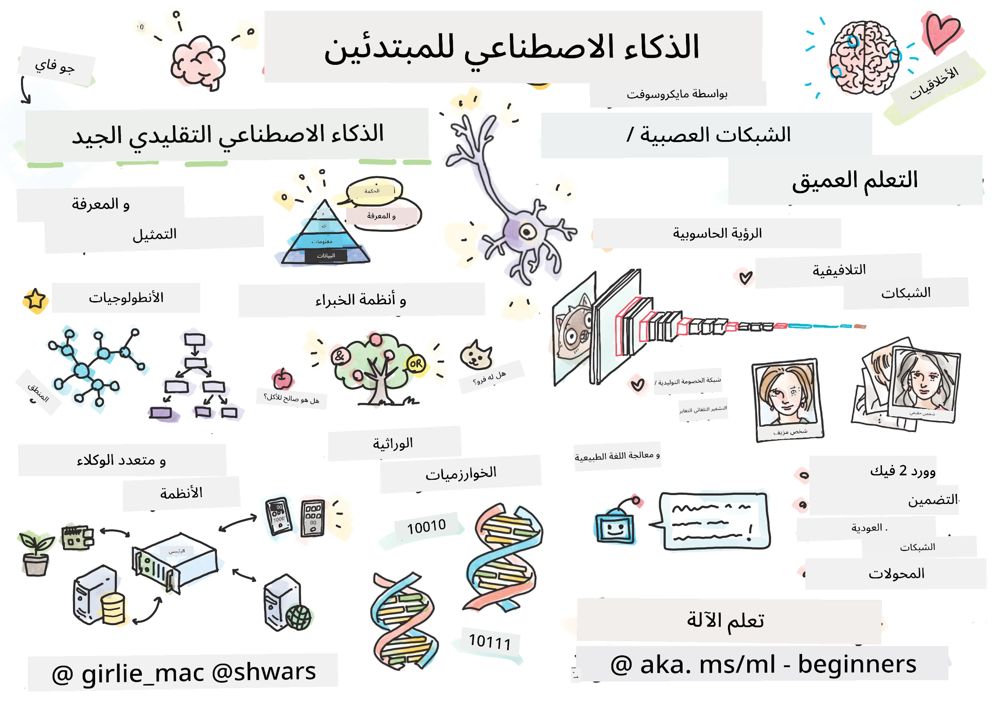

[](https://github.com/microsoft/AI-For-Beginners/blob/main/LICENSE)
[](https://GitHub.com/microsoft/AI-For-Beginners/graphs/contributors/)
[](https://GitHub.com/microsoft/AI-For-Beginners/issues/)
[](https://GitHub.com/microsoft/AI-For-Beginners/pulls/)
[](http://makeapullrequest.com)

[](https://GitHub.com/microsoft/AI-For-Beginners/watchers/)
[](https://GitHub.com/microsoft/AI-For-Beginners/network/)
[](https://GitHub.com/microsoft/AI-For-Beginners/stargazers/)
[](https://mybinder.org/v2/gh/microsoft/ai-for-beginners/HEAD)
[](https://gitter.im/Microsoft/ai-for-beginners?utm_source=badge&utm_medium=badge&utm_campaign=pr-badge)

[](https://discord.gg/nTYy5BXMWG)

# الذكاء الاصطناعي للمبتدئين - منهج دراسي

||
|:---:|
| الذكاء الاصطناعي للمبتدئين - _مذكرة رسومية بواسطة [@girlie_mac](https://twitter.com/girlie_mac)_ |

استكشف عالم **الذكاء الاصطناعي** من خلال منهجنا الدراسي الذي يمتد 12 أسبوعًا ويتضمن 24 درسًا! يشمل دروسًا عملية، اختبارات معارف، ومختبرات. المنهج مناسب للمبتدئين ويغطي أدوات مثل TensorFlow وPyTorch، بالإضافة إلى قضايا الأخلاقيات في الذكاء الاصطناعي.

### 🌐 دعم متعدد اللغات

#### مدعوم عبر GitHub Action (آلي ودائم التحديث)

<!-- CO-OP TRANSLATOR LANGUAGES TABLE START -->
[Arabic](./README.md) | [Bengali](../bn/README.md) | [Bulgarian](../bg/README.md) | [Burmese (Myanmar)](../my/README.md) | [Chinese (Simplified)](../zh-CN/README.md) | [Chinese (Traditional, Hong Kong)](../zh-HK/README.md) | [Chinese (Traditional, Macau)](../zh-MO/README.md) | [Chinese (Traditional, Taiwan)](../zh-TW/README.md) | [Croatian](../hr/README.md) | [Czech](../cs/README.md) | [Danish](../da/README.md) | [Dutch](../nl/README.md) | [Estonian](../et/README.md) | [Finnish](../fi/README.md) | [French](../fr/README.md) | [German](../de/README.md) | [Greek](../el/README.md) | [Hebrew](../he/README.md) | [Hindi](../hi/README.md) | [Hungarian](../hu/README.md) | [Indonesian](../id/README.md) | [Italian](../it/README.md) | [Japanese](../ja/README.md) | [Kannada](../kn/README.md) | [Korean](../ko/README.md) | [Lithuanian](../lt/README.md) | [Malay](../ms/README.md) | [Malayalam](../ml/README.md) | [Marathi](../mr/README.md) | [Nepali](../ne/README.md) | [Nigerian Pidgin](../pcm/README.md) | [Norwegian](../no/README.md) | [Persian (Farsi)](../fa/README.md) | [Polish](../pl/README.md) | [Portuguese (Brazil)](../pt-BR/README.md) | [Portuguese (Portugal)](../pt-PT/README.md) | [Punjabi (Gurmukhi)](../pa/README.md) | [Romanian](../ro/README.md) | [Russian](../ru/README.md) | [Serbian (Cyrillic)](../sr/README.md) | [Slovak](../sk/README.md) | [Slovenian](../sl/README.md) | [Spanish](../es/README.md) | [Swahili](../sw/README.md) | [Swedish](../sv/README.md) | [Tagalog (Filipino)](../tl/README.md) | [Tamil](../ta/README.md) | [Telugu](../te/README.md) | [Thai](../th/README.md) | [Turkish](../tr/README.md) | [Ukrainian](../uk/README.md) | [Urdu](../ur/README.md) | [Vietnamese](../vi/README.md)

> **هل تفضل الاستنساخ محليًا؟**

> يحتوي هذا المستودع على أكثر من 50 ترجمة لغوية مما يزيد بشكل كبير من حجم التنزيل. للاستنساخ بدون الترجمات، استخدم السحب الانتقائي:
> ```bash
> git clone --filter=blob:none --sparse https://github.com/microsoft/AI-For-Beginners.git
> cd AI-For-Beginners
> git sparse-checkout set --no-cone '/*' '!translations' '!translated_images'
> ```
> يتيح لك هذا كل ما تحتاجه لإكمال الدورة مع تنزيل أسرع بكثير.
<!-- CO-OP TRANSLATOR LANGUAGES TABLE END -->

**إذا كنت ترغب في دعم لغات ترجمة إضافية مدرجة [هنا](https://github.com/Azure/co-op-translator/blob/main/getting_started/supported-languages.md)**

## انضم إلى المجتمع
[](https://discord.gg/nTYy5BXMWG)

## ماذا ستتعلم

**[خريطة ذهنية للدورة](http://soshnikov.com/courses/ai-for-beginners/mindmap.html)**

في هذا المنهج الدراسي، ستتعلم:

* مناهج مختلفة للذكاء الاصطناعي، بما في ذلك النهج الرمزي "القديم الجيد" مع **تمثيل المعرفة** والاستدلال ([GOFAI](https://en.wikipedia.org/wiki/Symbolic_artificial_intelligence)).
* **الشبكات العصبية** و**التعلم العميق**، والتي تمثل جوهر الذكاء الاصطناعي الحديث. سنشرح المفاهيم وراء هذه المواضيع المهمة باستخدام أكواد في اثنين من أكثر الأطر شهرة - [TensorFlow](http://Tensorflow.org) و [PyTorch](http://pytorch.org).
* **الهياكل العصبية** للعمل مع الصور والنصوص. سنغطي النماذج الحديثة ولكن قد تكون أقل تغطية لأحدث التقنيات في المجال.
* مناهج الذكاء الاصطناعي الأقل شيوعًا، مثل **الخوارزميات الجينية** و**أنظمة متعددة الوكلاء**.

ما لن نغطيه في هذا المنهج:

> [اعثر على جميع الموارد الإضافية لهذه الدورة في مجموعتنا على Microsoft Learn](https://learn.microsoft.com/en-us/collections/7w28iy2xrqzdj0?WT.mc_id=academic-77998-bethanycheum)

* حالات الأعمال لاستخدام **الذكاء الاصطناعي في الأعمال التجارية**. فكر في أخذ مسار التعلم [مقدمة إلى الذكاء الاصطناعي لمستخدمي الأعمال](https://docs.microsoft.com/learn/paths/introduction-ai-for-business-users/?WT.mc_id=academic-77998-bethanycheum) على Microsoft Learn، أو [مدرسة أعمال الذكاء الاصطناعي](https://www.microsoft.com/ai/ai-business-school/?WT.mc_id=academic-77998-bethanycheum) المطورة بالتعاون مع [INSEAD](https://www.insead.edu/).
* **التعلم الآلي الكلاسيكي**، والذي يتم شرحه جيدًا في منهجنا [التعلم الآلي للمبتدئين](http://github.com/Microsoft/ML-for-Beginners).
* تطبيقات الذكاء الاصطناعي العملية المبنية باستخدام **[خدمات الإدراك](https://azure.microsoft.com/services/cognitive-services/?WT.mc_id=academic-77998-bethanycheum)**. لهذا، نوصي أن تبدأ مع وحدات التعلم في Microsoft Learn لـ [الرؤية الحاسوبية](https://docs.microsoft.com/learn/paths/create-computer-vision-solutions-azure-cognitive-services/?WT.mc_id=academic-77998-bethanycheum)، [معالجة اللغة الطبيعية](https://docs.microsoft.com/learn/paths/explore-natural-language-processing/?WT.mc_id=academic-77998-bethanycheum)، **[الذكاء الاصطناعي التوليدي مع خدمة Azure OpenAI](https://learn.microsoft.com/en-us/training/paths/develop-ai-solutions-azure-openai/?WT.mc_id=academic-77998-bethanycheum)** وغيرها.
* أُطُر سحابية محددة لـ ML، مثل [Azure Machine Learning](https://azure.microsoft.com/services/machine-learning/?WT.mc_id=academic-77998-bethanycheum)، [Microsoft Fabric](https://learn.microsoft.com/en-us/training/paths/get-started-fabric/?WT.mc_id=academic-77998-bethanycheum)، أو [Azure Databricks](https://docs.microsoft.com/learn/paths/data-engineer-azure-databricks?WT.mc_id=academic-77998-bethanycheum). فكر في استخدام مسارات التعلم [بناء وتشغيل حلول التعلم الآلي باستخدام Azure Machine Learning](https://docs.microsoft.com/learn/paths/build-ai-solutions-with-azure-ml-service/?WT.mc_id=academic-77998-bethanycheum) و [بناء وتشغيل حلول التعلم الآلي باستخدام Azure Databricks](https://docs.microsoft.com/learn/paths/build-operate-machine-learning-solutions-azure-databricks/?WT.mc_id=academic-77998-bethanycheum).
* **الذكاء الاصطناعي الحواري** و**الدردشة الآلية**. هناك مسار تعليمي منفصل [إنشاء حلول ذكاء اصطناعي حوارية](https://docs.microsoft.com/learn/paths/create-conversational-ai-solutions/?WT.mc_id=academic-77998-bethanycheum)، ويمكنك أيضًا الرجوع إلى [تدوينة المدونة هذه](https://soshnikov.com/azure/hello-bot-conversational-ai-on-microsoft-platform/) لمزيد من التفاصيل.
* **الرياضيات العميقة** وراء التعلم العميق. لذلك، نوصي بـ [التعلم العميق](https://www.amazon.com/Deep-Learning-Adaptive-Computation-Machine/dp/0262035618) من تأليف إيان جودفيلو، يوشوا بنجيو وآرون كورفيل، وهي متاحة أيضًا على الإنترنت على [https://www.deeplearningbook.org/](https://www.deeplearningbook.org/).

لمقدمة لطيفة في موضوعات _الذكاء الاصطناعي في السحابة_ يمكنك أخذ مسار التعلم [البدء بالذكاء الاصطناعي على أزور](https://docs.microsoft.com/learn/paths/get-started-with-artificial-intelligence-on-azure/?WT.mc_id=academic-77998-bethanycheum).

# المحتوى

|     |                                                                 رابط الدرس                                                                 |                                           PyTorch/Keras/TensorFlow                                          | المختبر                                                           |
| :-: | :----------------------------------------------------------------------------------------------------------------------------------------: | :--------------------------------------------------------------------------------------------------: | ---------------------------------------------------------------- |
| 0  |                                 [إعداد الدورة](./lessons/0-course-setup/setup.md)                                 |                      [إعداد بيئة التطوير الخاصة بك](./lessons/0-course-setup/how-to-run.md)                       |   |
| I  |               [**مقدمة في الذكاء الاصطناعي**](./lessons/1-Intro/README.md)      | | |
| 01  |       [مقدمة وتاريخ الذكاء الاصطناعي](./lessons/1-Intro/README.md)       |           -                            | -  |
| II |              **الذكاء الاصطناعي الرمزي**              |
| 02  |       [تمثيل المعرفة وأنظمة الخبراء](./lessons/2-Symbolic/README.md)       |            [أنظمة الخبراء](./lessons/2-Symbolic/Animals.ipynb) /  [تصنيف علمي](./lessons/2-Symbolic/FamilyOntology.ipynb) /[مخطط المفاهيم](./lessons/2-Symbolic/MSConceptGraph.ipynb)                             |  |
| III |                        [**مقدمة في الشبكات العصبية**](./lessons/3-NeuralNetworks/README.md) |||
| 03  |                [بيرسيبترون](./lessons/3-NeuralNetworks/03-Perceptron/README.md)                 |                       [دفتر ملاحظات](./lessons/3-NeuralNetworks/03-Perceptron/Perceptron.ipynb)                      | [مختبر](./lessons/3-NeuralNetworks/03-Perceptron/lab/README.md) |
| 04  |                   [بيرسيبترون متعدد الطبقات وإنشاء إطار العمل الخاص بنا](./lessons/3-NeuralNetworks/04-OwnFramework/README.md)                   |        [دفتر ملاحظات](./lessons/3-NeuralNetworks/04-OwnFramework/OwnFramework.ipynb)        | [مختبر](./lessons/3-NeuralNetworks/04-OwnFramework/lab/README.md) |
| 05  |            [مقدمة إلى الأُطُر (باي تورش / تنسرفلو) والامتلاء الزائد](./lessons/3-NeuralNetworks/05-Frameworks/README.md)             |           [باي تورش](./lessons/3-NeuralNetworks/05-Frameworks/IntroPyTorch.ipynb) / [كيراس](./lessons/3-NeuralNetworks/05-Frameworks/IntroKeras.ipynb) / [تنسرفلو](./lessons/3-NeuralNetworks/05-Frameworks/IntroKerasTF.ipynb)             | [مختبر](./lessons/3-NeuralNetworks/05-Frameworks/lab/README.md) |
| IV  |            [**الرؤية الحاسوبية**](./lessons/4-ComputerVision/README.md)             | [باي تورش](https://docs.microsoft.com/learn/modules/intro-computer-vision-pytorch/?WT.mc_id=academic-77998-cacaste) / [تنسرفلو](https://docs.microsoft.com/learn/modules/intro-computer-vision-TensorFlow/?WT.mc_id=academic-77998-cacaste)| [استكشاف الرؤية الحاسوبية على مايكروسوفت آزور](https://learn.microsoft.com/en-us/collections/7w28iy2xrqzdj0?WT.mc_id=academic-77998-bethanycheum) |
| 06  |            [مقدمة في الرؤية الحاسوبية. أوبن سي في](./lessons/4-ComputerVision/06-IntroCV/README.md)             |           [دفتر ملاحظات](./lessons/4-ComputerVision/06-IntroCV/OpenCV.ipynb)         | [مختبر](./lessons/4-ComputerVision/06-IntroCV/lab/README.md) |
| 07  |            [الشبكات العصبية الالتفافية](./lessons/4-ComputerVision/07-ConvNets/README.md) &  [هياكل CNN](./lessons/4-ComputerVision/07-ConvNets/CNN_Architectures.md)             |           [باي تورش](./lessons/4-ComputerVision/07-ConvNets/ConvNetsPyTorch.ipynb) /[تنسرفلو](./lessons/4-ComputerVision/07-ConvNets/ConvNetsTF.ipynb)             | [مختبر](./lessons/4-ComputerVision/07-ConvNets/lab/README.md) |
| 08  |            [الشبكات المدربة مسبقًا والتعلم الانتقالي](./lessons/4-ComputerVision/08-TransferLearning/README.md) و [حيل التدريب](./lessons/4-ComputerVision/08-TransferLearning/TrainingTricks.md)             |           [باي تورش](./lessons/4-ComputerVision/08-TransferLearning/TransferLearningPyTorch.ipynb) / [تنسرفلو](./lessons/3-NeuralNetworks/05-Frameworks/IntroKerasTF.ipynb)             | [مختبر](./lessons/4-ComputerVision/08-TransferLearning/lab/README.md) |
| 09  |            [الأوتوأينكودر والشبكات التوليدية الاحتمالية](./lessons/4-ComputerVision/09-Autoencoders/README.md)             |           [باي تورش](./lessons/4-ComputerVision/09-Autoencoders/AutoEncodersPyTorch.ipynb) / [تنسرفلو](./lessons/4-ComputerVision/09-Autoencoders/AutoencodersTF.ipynb)             |  |
| 10  |            [الشبكات التوليدية التنافسية ونقل الأسلوب الفني](./lessons/4-ComputerVision/10-GANs/README.md)             |           [باي تورش](./lessons/4-ComputerVision/10-GANs/GANPyTorch.ipynb) / [تنسرفلو](./lessons/4-ComputerVision/10-GANs/GANTF.ipynb)             |  |
| 11  |            [كشف الأشياء](./lessons/4-ComputerVision/11-ObjectDetection/README.md)             |         [تنسرفلو](./lessons/4-ComputerVision/11-ObjectDetection/ObjectDetection.ipynb)             | [مختبر](./lessons/4-ComputerVision/11-ObjectDetection/lab/README.md) |
| 12  |            [التقسيم الدلالي. يو-نت](./lessons/4-ComputerVision/12-Segmentation/README.md)             |           [باي تورش](./lessons/4-ComputerVision/12-Segmentation/SemanticSegmentationPytorch.ipynb) / [تنسرفلو](./lessons/4-ComputerVision/12-Segmentation/SemanticSegmentationTF.ipynb)             |  |
| V  |            [**معالجة اللغة الطبيعية**](./lessons/5-NLP/README.md)             | [باي تورش](https://docs.microsoft.com/learn/modules/intro-natural-language-processing-pytorch/?WT.mc_id=academic-77998-cacaste) /[تنسرفلو](https://docs.microsoft.com/learn/modules/intro-natural-language-processing-TensorFlow/?WT.mc_id=academic-77998-cacaste) | [استكشاف معالجة اللغة الطبيعية على مايكروسوفت آزور](https://learn.microsoft.com/en-us/collections/7w28iy2xrqzdj0?WT.mc_id=academic-77998-bethanycheum)|
| 13  |            [تمثيل النص. حقيبة الكلمات/TF-IDF](./lessons/5-NLP/13-TextRep/README.md)             |           [باي تورش](https://github.com/microsoft/AI-For-Beginners/blob/main/lessons/5-NLP/13-TextRep/TextRepresentationPyTorch.ipynb) / [تنسرفلو](https://github.com/microsoft/AI-For-Beginners/blob/main/lessons/5-NLP/13-TextRep/TextRepresentationTF.ipynb)             | |
| 14  |            [التضمينات الدلالية للكلمات. وورد2فك وغلوب](./lessons/5-NLP/14-Embeddings/README.md)             |           [باي تورش](https://github.com/microsoft/AI-For-Beginners/blob/main/lessons/5-NLP/14-Embeddings/EmbeddingsPyTorch.ipynb) / [تنسرفلو](https://github.com/microsoft/AI-For-Beginners/blob/main/lessons/5-NLP/14-Embeddings/EmbeddingsTF.ipynb)             |  |
| 15  |            [نمذجة اللغة. تدريب التضمينات الخاصة بك](./lessons/5-NLP/15-LanguageModeling/README.md)             |           [باي تورش](https://github.com/microsoft/AI-For-Beginners/blob/main/lessons/5-NLP/15-LanguageModeling/CBoW-PyTorch.ipynb) / [تنسرفلو](https://github.com/microsoft/AI-For-Beginners/blob/main/lessons/5-NLP/15-LanguageModeling/CBoW-TF.ipynb)             | [مختبر](./lessons/5-NLP/15-LanguageModeling/lab/README.md) |
| 16  |            [الشبكات العصبية المتكررة](./lessons/5-NLP/16-RNN/README.md)             |           [باي تورش](https://github.com/microsoft/AI-For-Beginners/blob/main/lessons/5-NLP/16-RNN/RNNPyTorch.ipynb) / [تنسرفلو](https://github.com/microsoft/AI-For-Beginners/blob/main/lessons/5-NLP/16-RNN/RNNTF.ipynb)             |  |
| 17  |            [الشبكات التوليدية المتكررة](./lessons/5-NLP/17-GenerativeNetworks/README.md)             |           [باي تورش](https://github.com/microsoft/AI-For-Beginners/blob/main/lessons/5-NLP/17-GenerativeNetworks/GenerativePyTorch.ipynb) / [تنسرفلو](https://github.com/microsoft/AI-For-Beginners/blob/main/lessons/5-NLP/17-GenerativeNetworks/GenerativeTF.ipynb)             | [مختبر](./lessons/5-NLP/17-GenerativeNetworks/lab/README.md) |
| 18  |            [المحولات. بيرت.](./lessons/5-NLP/18-Transformers/README.md)             |           [باي تورش](https://github.com/microsoft/AI-For-Beginners/blob/main/lessons/5-NLP/18-Transformers/TransformersPyTorch.ipynb) /[تنسرفلو](https://github.com/microsoft/AI-For-Beginners/blob/main/lessons/5-NLP/18-Transformers/TransformersTF.ipynb)             |  |
| 19  |            [التعرف على الكيانات المسماة](./lessons/5-NLP/19-NER/README.md)             |           [تنسرفلو](https://microsoft.github.io/AI-For-Beginners/lessons/5-NLP/19-NER/NER-TF.ipynb)             | [مختبر](./lessons/5-NLP/19-NER/lab/README.md) |
| 20  |            [نماذج اللغة الكبيرة، برمجة المطالب والمهام قليلة العينات](./lessons/5-NLP/20-LangModels/README.md)             |           [باي تورش](https://microsoft.github.io/AI-For-Beginners/lessons/5-NLP/20-LangModels/GPT-PyTorch.ipynb) | |
| VI |            **تقنيات الذكاء الاصطناعي الأخرى** || |
| 21  |            [الخوارزميات الجينية](./lessons/6-Other/21-GeneticAlgorithms/README.md)             |           [دفتر ملاحظات](./lessons/6-Other/21-GeneticAlgorithms/Genetic.ipynb) | |
| 22  |            [التعلم العميق المعزز](./lessons/6-Other/22-DeepRL/README.md)             |           [باي تورش](./lessons/6-Other/22-DeepRL/CartPole-RL-PyTorch.ipynb) /[تنسرفلو](./lessons/6-Other/22-DeepRL/CartPole-RL-TF.ipynb)             | [مختبر](./lessons/6-Other/22-DeepRL/lab/README.md) |
| 23  |            [أنظمة متعددة الوكلاء](./lessons/6-Other/23-MultiagentSystems/README.md)             |  | |
| VII |            **أخلاقيات الذكاء الاصطناعي** | | |
| 24  |            [أخلاقيات الذكاء الاصطناعي والذكاء الاصطناعي المسؤول](./lessons/7-Ethics/README.md)             |           [مايكروسوفت ليرن: مبادئ الذكاء الاصطناعي المسؤول](https://docs.microsoft.com/learn/paths/responsible-ai-business-principles/?WT.mc_id=academic-77998-cacaste) | |
| IX  |            **إضافات** | | |
| 25  |            [الشبكات متعددة الوسائط، CLIP و VQGAN](./lessons/X-Extras/X1-MultiModal/README.md)             |           [دفتر ملاحظات](./lessons/X-Extras/X1-MultiModal/Clip.ipynb)    | |

## يحتوي كل درس على

* مواد قراءة تمهيدية
* دفاتر جوبيتر التنفيذية، التي غالبًا ما تكون محددة للإطار (**باي تورش** أو **تنسرفلو**). كما يحتوي دفتر الملاحظات التنفيذي على الكثير من المواد النظرية، لذا لفهم الموضوع تحتاج إلى مراجعة إصدار واحد على الأقل من الدفتر (إما باي تورش أو تنسرفلو).
* **مختبرات** متاحة لبعض المواضيع، والتي تتيح لك فرصة تطبيق المواد التي تعلمتها على مشكلة محددة.
* تحتوي بعض الأقسام على روابط إلى وحدات [**MS Learn**](https://learn.microsoft.com/en-us/collections/7w28iy2xrqzdj0?WT.mc_id=academic-77998-bethanycheum) التي تغطي موضوعات ذات صلة.

## البدء

### 🎯 جديد في الذكاء الاصطناعي؟ ابدأ هنا!

إذا كنت جديدًا تمامًا في الذكاء الاصطناعي وتريد أمثلة عملية سريعة، تحقق من [**أمثلة للمبتدئين**](./examples/README.md)! وتشمل هذه:

- 🌟 **مرحبا بالعالم الذكاء الاصطناعي** - أول برنامج ذكاء اصطناعي خاص بك (التعرف على الأنماط)
- 🧠 **شبكة عصبية بسيطة** - بناء شبكة عصبية من الصفر  

- 🖼️ **مصنف الصور** - تصنيف الصور مع تعليقات مفصلة  
- 💬 **تحليل مشاعر النص** - تحليل النصوص الإيجابية/السلبية  

تم تصميم هذه الأمثلة لمساعدتك على فهم مفاهيم الذكاء الاصطناعي قبل الخوض في المنهج الكامل.

### 📚 إعداد المنهج الكامل

- لقد أنشأنا [درس الإعداد](./lessons/0-course-setup/setup.md) لمساعدتك في إعداد بيئة التطوير الخاصة بك. - للمعلمين، أنشأنا لك أيضًا [درس إعداد المنهج](./lessons/0-course-setup/for-teachers.md)!
- كيفية [تشغيل الكود في VSCode أو Codespace](./lessons/0-course-setup/how-to-run.md)

اتبع هذه الخطوات:

استنسخ المستودع: انقر على زر "Fork" في الزاوية العلوية اليمنى من هذه الصفحة.

انسخ المستودع: `git clone https://github.com/microsoft/AI-For-Beginners.git`

لا تنسَ أن تضع نجمة (🌟) على هذا المستودع لتجده بسهولة لاحقًا.

## تعرف على المتعلمين الآخرين

انضم إلى [خادم Discord الرسمي للذكاء الاصطناعي](https://aka.ms/genai-discord?WT.mc_id=academic-105485-bethanycheum) لتلتقي وتتواصل مع المتعلمين الآخرين الذين يأخذون هذا المساق واحصل على الدعم.

إذا كان لديك ملاحظات على المنتج أو أسئلة أثناء البناء، قم بزيارة [منتدى مطوري Azure AI Foundry](https://aka.ms/foundry/forum)

## الاختبارات القصيرة

> **ملاحظة عن الاختبارات القصيرة**: جميع الاختبارات موجودة في مجلد Quiz-app في etc\quiz-app، أو [عبر الإنترنت هنا](https://ff-quizzes.netlify.app/) مرتبطة من داخل الدروس، يمكن تشغيل تطبيق الاختبارات محليًا أو نشره على Azure؛ اتبع التعليمات في مجلد `quiz-app`. يتم تعريبها تدريجيًا.

## نحتاج مساعدتك

هل لديك اقتراحات أو وجدت أخطاء إملائية أو برمجية؟ افتح مشكلة أو أنشئ طلب سحب.

## شكر خاص

* **✍️ المؤلف الرئيسي:** [Dmitry Soshnikov](http://soshnikov.com), دكتوراه  
* **🔥 المحرر:** [Jen Looper](https://twitter.com/jenlooper), دكتوراه  
* **🎨 رسام المخططات:** [Tomomi Imura](https://twitter.com/girlie_mac)  
* **✅ منشئ الاختبارات:** [Lateefah Bello](https://github.com/CinnamonXI), [MLSA](https://studentambassadors.microsoft.com/)  
* **🙏 المساهمون الأساسيون:** [Evgenii Pishchik](https://github.com/Pe4enIks)  

## مناهج أخرى

فريقنا يقدم مناهج أخرى! اطلع على:

<!-- CO-OP TRANSLATOR OTHER COURSES START -->
### LangChain  
[](https://aka.ms/langchain4j-for-beginners)  
[](https://aka.ms/langchainjs-for-beginners?WT.mc_id=m365-94501-dwahlin)  
[](https://github.com/microsoft/langchain-for-beginners?WT.mc_id=m365-94501-dwahlin)  
---

### Azure / Edge / MCP / Agents  
[](https://github.com/microsoft/AZD-for-beginners?WT.mc_id=academic-105485-koreyst)  
[](https://github.com/microsoft/edgeai-for-beginners?WT.mc_id=academic-105485-koreyst)  
[](https://github.com/microsoft/mcp-for-beginners?WT.mc_id=academic-105485-koreyst)  
[](https://github.com/microsoft/ai-agents-for-beginners?WT.mc_id=academic-105485-koreyst)  

---

### سلسلة الذكاء الاصطناعي التوليدي  
[](https://github.com/microsoft/generative-ai-for-beginners?WT.mc_id=academic-105485-koreyst)  
[-9333EA?style=for-the-badge&labelColor=E5E7EB&color=9333EA)](https://github.com/microsoft/Generative-AI-for-beginners-dotnet?WT.mc_id=academic-105485-koreyst)  
[-C084FC?style=for-the-badge&labelColor=E5E7EB&color=C084FC)](https://github.com/microsoft/generative-ai-for-beginners-java?WT.mc_id=academic-105485-koreyst)  
[-E879F9?style=for-the-badge&labelColor=E5E7EB&color=E879F9)](https://github.com/microsoft/generative-ai-with-javascript?WT.mc_id=academic-105485-koreyst)  

---

### التعلم الأساسي  
[](https://aka.ms/ml-beginners?WT.mc_id=academic-105485-koreyst)  
[](https://aka.ms/datascience-beginners?WT.mc_id=academic-105485-koreyst)  
[](https://aka.ms/ai-beginners?WT.mc_id=academic-105485-koreyst)  
[](https://github.com/microsoft/Security-101?WT.mc_id=academic-96948-sayoung)  
[](https://aka.ms/webdev-beginners?WT.mc_id=academic-105485-koreyst)  
[](https://aka.ms/iot-beginners?WT.mc_id=academic-105485-koreyst)  
[](https://github.com/microsoft/xr-development-for-beginners?WT.mc_id=academic-105485-koreyst)  

---

### سلسلة المساعد الذكي  
[](https://aka.ms/GitHubCopilotAI?WT.mc_id=academic-105485-koreyst)  
[](https://github.com/microsoft/mastering-github-copilot-for-dotnet-csharp-developers?WT.mc_id=academic-105485-koreyst)  
[](https://github.com/microsoft/CopilotAdventures?WT.mc_id=academic-105485-koreyst)  
<!-- CO-OP TRANSLATOR OTHER COURSES END -->

## الحصول على المساعدة

إذا علقت أو كان لديك أي أسئلة حول بناء تطبيقات الذكاء الاصطناعي. انضم إلى المتعلمين الآخرين والمطورين ذوي الخبرة في مناقشات حول MCP. إنها مجتمع داعم حيث تُرحب بالأسئلة ويُشارك المعرفة بحرية.

[](https://discord.gg/nTYy5BXMWG)

إذا كان لديك ملاحظات على المنتج أو أخطاء أثناء البناء قم بزيارة:

[](https://aka.ms/foundry/forum)

---

<!-- CO-OP TRANSLATOR DISCLAIMER START -->
**إخلاء المسؤولية**:
تمت ترجمة هذا المستند باستخدام خدمة الترجمة بالذكاء الاصطناعي [Co-op Translator](https://github.com/Azure/co-op-translator). بينما نسعى لتحقيق الدقة، يرجى العلم أن الترجمات الآلية قد تحتوي على أخطاء أو عدم دقة. يجب اعتبار المستند الأصلي بلغته الأصلية المرجع الرسمي والموثوق. للمعلومات الحساسة، يُنصح بالاستعانة بالترجمة المهنية البشرية. نحن غير مسؤولين عن أي سوء فهم أو تفسير خاطئ ناتج عن استخدام هذه الترجمة.
<!-- CO-OP TRANSLATOR DISCLAIMER END -->