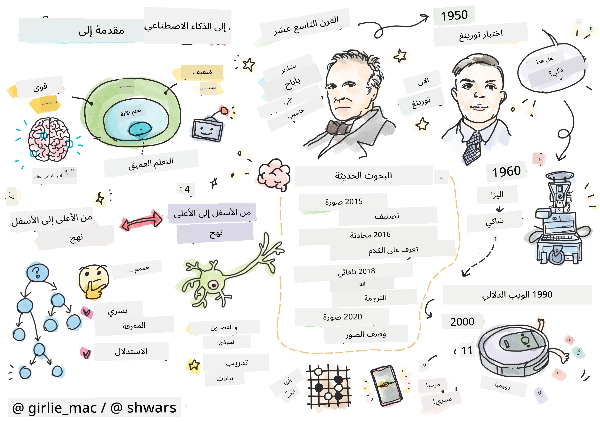
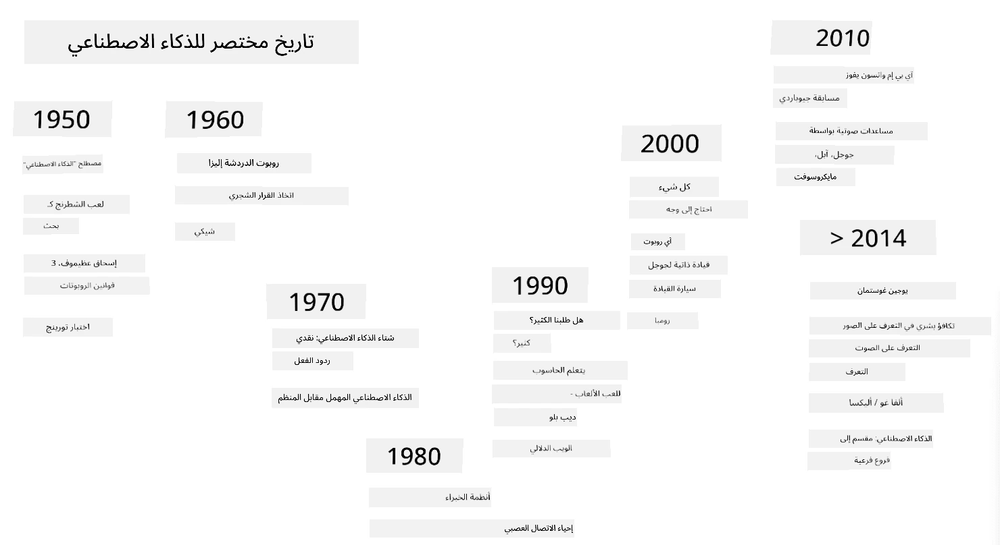
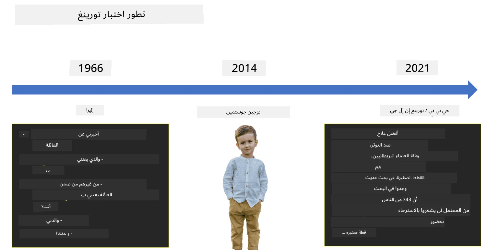

# مقدمة في الذكاء الاصطناعي

> رسم توضيحي بواسطة [تومومي إيمورا](https://twitter.com/girlie_mac)

## [اختبار ما قبل المحاضرة](https://ff-quizzes.netlify.app/en/ai/quiz/1)

**الذكاء الاصطناعي** هو مجال علمي مثير يدرس كيفية جعل أجهزة الكمبيوتر تظهر سلوكًا ذكيًا، مثل القيام بالأشياء التي يجيد البشر القيام بها.

في الأصل، اخترع [تشارلز باباج](https://en.wikipedia.org/wiki/Charles_Babbage) أجهزة الكمبيوتر لتعمل على الأرقام وفقًا لإجراءات محددة - وهو ما يُعرف بالخوارزمية. وعلى الرغم من أن أجهزة الكمبيوتر الحديثة أكثر تقدمًا بكثير من النموذج الأصلي الذي اقترح في القرن التاسع عشر، إلا أنها لا تزال تتبع نفس فكرة العمليات المحسوبة. وبالتالي، يمكن برمجة الكمبيوتر للقيام بشيء ما إذا كنا نعرف التسلسل الدقيق للخطوات التي نحتاج إلى القيام بها لتحقيق الهدف.

> صورة بواسطة [فيكي سوشنيكوفا](http://twitter.com/vickievalerie)

> ✅ تحديد عمر الشخص من صورته هو مهمة لا يمكن برمجتها بشكل صريح، لأننا لا نعرف كيف نصل إلى الرقم داخل أذهاننا عندما نقوم بذلك.

---

هناك بعض المهام التي لا نعرف كيفية حلها بشكل صريح. فكر في تحديد عمر الشخص من صورته. نحن نتعلم القيام بذلك بطريقة ما لأننا رأينا العديد من الأمثلة لأشخاص بأعمار مختلفة، لكننا لا نستطيع شرح كيفية القيام بذلك بشكل صريح، ولا يمكننا برمجة الكمبيوتر للقيام بذلك. هذه هي بالضبط نوع المهام التي تهم **الذكاء الاصطناعي** (AI).

✅ فكر في بعض المهام التي يمكنك تفويضها إلى الكمبيوتر والتي قد تستفيد من الذكاء الاصطناعي. ضع في اعتبارك مجالات مثل المالية، الطب، والفنون - كيف تستفيد هذه المجالات اليوم من الذكاء الاصطناعي؟

## الذكاء الاصطناعي الضعيف مقابل الذكاء الاصطناعي القوي

الذكاء الاصطناعي الضعيف | الذكاء الاصطناعي القوي
---------------------------------------|-------------------------------------
يشير الذكاء الاصطناعي الضعيف إلى أنظمة الذكاء الاصطناعي المصممة والمدربة لأداء مهمة محددة أو مجموعة ضيقة من المهام.|الذكاء الاصطناعي القوي، أو الذكاء الاصطناعي العام (AGI)، يشير إلى أنظمة الذكاء الاصطناعي التي تمتلك مستوى ذكاء وفهم مشابه للبشر.
هذه الأنظمة ليست ذكية بشكل عام؛ فهي تتفوق في أداء مهمة محددة مسبقًا لكنها تفتقر إلى الفهم الحقيقي أو الوعي.|هذه الأنظمة لديها القدرة على أداء أي مهمة فكرية يمكن للإنسان القيام بها، التكيف مع مجالات مختلفة، وتمتلك شكلاً من الوعي أو الإدراك الذاتي.
أمثلة على الذكاء الاصطناعي الضعيف تشمل المساعدين الافتراضيين مثل Siri أو Alexa، خوارزميات التوصية المستخدمة في خدمات البث، والروبوتات المصممة لمهام خدمة العملاء المحددة.|تحقيق الذكاء الاصطناعي القوي هو هدف طويل الأمد لأبحاث الذكاء الاصطناعي وسيتطلب تطوير أنظمة ذكاء اصطناعي يمكنها التفكير، التعلم، الفهم، والتكيف عبر مجموعة واسعة من المهام والسياقات.
الذكاء الاصطناعي الضعيف متخصص للغاية ولا يمتلك قدرات معرفية شبيهة بالبشر أو قدرات حل المشكلات العامة خارج نطاقه المحدود.|الذكاء الاصطناعي القوي هو حاليًا مفهوم نظري، ولم يصل أي نظام ذكاء اصطناعي إلى هذا المستوى من الذكاء العام.

لمزيد من المعلومات، راجع **[الذكاء الاصطناعي العام](https://en.wikipedia.org/wiki/Artificial_general_intelligence)** (AGI).

## تعريف الذكاء واختبار تورينغ

إحدى المشكلات عند التعامل مع مصطلح **[الذكاء](https://en.wikipedia.org/wiki/Intelligence)** هي أنه لا يوجد تعريف واضح لهذا المصطلح. يمكن للمرء أن يجادل بأن الذكاء مرتبط بـ **التفكير المجرد** أو بـ **الإدراك الذاتي**، لكننا لا نستطيع تعريفه بشكل صحيح.

> [صورة](https://unsplash.com/photos/75715CVEJhI) بواسطة [Amber Kipp](https://unsplash.com/@sadmax) من Unsplash

لرؤية غموض مصطلح *الذكاء*، حاول الإجابة على سؤال: "هل القطة ذكية؟". يميل الناس إلى إعطاء إجابات مختلفة لهذا السؤال، حيث لا يوجد اختبار مقبول عالميًا لإثبات صحة الادعاء أو عدمه. وإذا كنت تعتقد أن هناك - حاول إجراء اختبار ذكاء على قطتك...

✅ فكر لدقيقة في كيفية تعريفك للذكاء. هل الغراب الذي يمكنه حل متاهة للحصول على الطعام ذكي؟ هل الطفل ذكي؟

---

عند الحديث عن الذكاء الاصطناعي العام (AGI)، نحتاج إلى طريقة لمعرفة ما إذا كنا قد أنشأنا نظامًا ذكيًا حقًا. اقترح [آلان تورينغ](https://en.wikipedia.org/wiki/Alan_Turing) طريقة تُعرف بـ **[اختبار تورينغ](https://en.wikipedia.org/wiki/Turing_test)**، والتي تعمل أيضًا كتعريف للذكاء. يقارن الاختبار النظام المعطى بشيء ذكي بطبيعته - إنسان حقيقي، وبما أن أي مقارنة تلقائية يمكن تجاوزها بواسطة برنامج كمبيوتر، فإننا نستخدم محققًا بشريًا. إذا لم يتمكن الإنسان من التمييز بين شخص حقيقي ونظام كمبيوتر في حوار نصي - يُعتبر النظام ذكيًا.

> روبوت محادثة يُدعى [يوجين غوستمان](https://en.wikipedia.org/wiki/Eugene_Goostman)، تم تطويره في سانت بطرسبرغ، اقترب من اجتياز اختبار تورينغ في عام 2014 باستخدام خدعة شخصية ذكية. أعلن مقدمًا أنه صبي أوكراني يبلغ من العمر 13 عامًا، مما يفسر نقص المعرفة وبعض التناقضات في النص. أقنع الروبوت 30% من الحكام بأنه إنسان بعد حوار استمر 5 دقائق، وهو معيار اعتقد تورينغ أن الآلة ستتمكن من اجتيازه بحلول عام 2000. ومع ذلك، يجب أن نفهم أن هذا لا يشير إلى أننا قد أنشأنا نظامًا ذكيًا، أو أن نظام الكمبيوتر قد خدع المحقق البشري - لم يخدع النظام البشر، بل خدع منشئو الروبوت!

✅ هل سبق لك أن خدعك روبوت محادثة لتعتقد أنك تتحدث إلى إنسان؟ كيف أقنعك؟

## طرق مختلفة للذكاء الاصطناعي

إذا أردنا أن يتصرف الكمبيوتر مثل الإنسان، فنحن بحاجة إلى نمذجة طريقة تفكيرنا داخل الكمبيوتر. وبالتالي، نحتاج إلى محاولة فهم ما يجعل الإنسان ذكيًا.

> لكي نتمكن من برمجة الذكاء في آلة، نحتاج إلى فهم كيفية عمل عمليات اتخاذ القرار لدينا. إذا قمت ببعض التأمل الذاتي، ستدرك أن هناك بعض العمليات التي تحدث بشكل غير واعٍ - مثل قدرتنا على التمييز بين القطة والكلب دون التفكير - بينما تتطلب الأخرى التفكير.

هناك طريقتان ممكنتان لهذه المشكلة:

النهج من الأعلى إلى الأسفل (الاستدلال الرمزي) | النهج من الأسفل إلى الأعلى (الشبكات العصبية)
---------------------------------------|-------------------------------------
النهج من الأعلى إلى الأسفل يقوم بنمذجة طريقة تفكير الشخص لحل المشكلة. يتضمن استخراج **المعرفة** من الإنسان وتمثيلها في شكل يمكن قراءته بواسطة الكمبيوتر. كما نحتاج إلى تطوير طريقة لنمذجة **الاستدلال** داخل الكمبيوتر. | النهج من الأسفل إلى الأعلى يقوم بنمذجة بنية الدماغ البشري، التي تتكون من عدد كبير من الوحدات البسيطة تسمى **الخلايا العصبية**. كل خلية عصبية تعمل كمتوسط مرجح لمدخلاتها، ويمكننا تدريب شبكة من الخلايا العصبية لحل مشاكل مفيدة من خلال تقديم **بيانات تدريب**.

هناك أيضًا بعض الطرق الأخرى الممكنة للذكاء:

* النهج **الناشئ**، **التآزري** أو **الوكيل المتعدد** يعتمد على حقيقة أن السلوك الذكي المعقد يمكن الحصول عليه من خلال تفاعل عدد كبير من الوكلاء البسيطة. وفقًا لـ [السيبرنتيك التطوري](https://en.wikipedia.org/wiki/Global_brain#Evolutionary_cybernetics)، يمكن أن *ينشأ* الذكاء من سلوك أكثر بساطة وتفاعلية في عملية *الانتقال إلى نظام أعلى*.

* النهج **التطوري**، أو **الخوارزمية الجينية** هو عملية تحسين تعتمد على مبادئ التطور.

سننظر في هذه الطرق لاحقًا في الدورة، ولكن الآن سنركز على اتجاهين رئيسيين: من الأعلى إلى الأسفل ومن الأسفل إلى الأعلى.

### النهج من الأعلى إلى الأسفل

في النهج **من الأعلى إلى الأسفل**، نحاول نمذجة طريقة تفكيرنا. لأننا نستطيع متابعة أفكارنا عندما نفكر، يمكننا محاولة صياغة هذه العملية وبرمجتها داخل الكمبيوتر. يُعرف هذا بـ **الاستدلال الرمزي**.

يميل الناس إلى وجود بعض القواعد في أذهانهم التي توجه عمليات اتخاذ القرار لديهم. على سبيل المثال، عندما يقوم الطبيب بتشخيص مريض، قد يدرك أن الشخص يعاني من الحمى، وبالتالي قد يكون هناك التهاب داخل الجسم. من خلال تطبيق مجموعة كبيرة من القواعد على مشكلة معينة، قد يتمكن الطبيب من الوصول إلى التشخيص النهائي.

يعتمد هذا النهج بشكل كبير على **تمثيل المعرفة** و**الاستدلال**. استخراج المعرفة من خبير بشري قد يكون الجزء الأكثر صعوبة، لأن الطبيب في كثير من الحالات قد لا يعرف بالضبط لماذا يتوصل إلى تشخيص معين. أحيانًا تأتي الحلول فقط إلى ذهنه دون تفكير صريح. بعض المهام، مثل تحديد عمر الشخص من صورة، لا يمكن تقليلها على الإطلاق إلى معالجة المعرفة.

### النهج من الأسفل إلى الأعلى

بدلاً من ذلك، يمكننا محاولة نمذجة أبسط العناصر داخل دماغنا - الخلية العصبية. يمكننا بناء ما يُعرف بـ **الشبكة العصبية الاصطناعية** داخل الكمبيوتر، ثم محاولة تعليمها حل المشاكل من خلال إعطائها أمثلة. هذه العملية مشابهة لكيفية تعلم الطفل حديث الولادة عن محيطه من خلال الملاحظات.

✅ قم ببعض البحث حول كيفية تعلم الأطفال. ما هي العناصر الأساسية لدماغ الطفل؟

> | ماذا عن التعلم الآلي؟         |      |
> |--------------|-----------|
> | جزء من الذكاء الاصطناعي يعتمد على تعلم الكمبيوتر لحل مشكلة بناءً على بعض البيانات يُعرف بـ **التعلم الآلي**. لن نناقش التعلم الآلي التقليدي في هذه الدورة - نوجهك إلى منهج منفصل [التعلم الآلي للمبتدئين](http://aka.ms/ml-beginners). |       |

## لمحة تاريخية عن الذكاء الاصطناعي

بدأ الذكاء الاصطناعي كمجال في منتصف القرن العشرين. في البداية، كان النهج السائد هو الاستدلال الرمزي، وقد أدى إلى عدد من النجاحات المهمة، مثل الأنظمة الخبيرة - برامج الكمبيوتر التي كانت قادرة على العمل كخبير في بعض المجالات المحدودة. ومع ذلك، سرعان ما أصبح واضحًا أن هذا النهج لا يتوسع بشكل جيد. استخراج المعرفة من خبير، تمثيلها في الكمبيوتر، والحفاظ على قاعدة المعرفة دقيقة تبين أنه مهمة معقدة للغاية ومكلفة للغاية لتكون عملية في العديد من الحالات. أدى ذلك إلى ما يُعرف بـ [شتاء الذكاء الاصطناعي](https://en.wikipedia.org/wiki/AI_winter) في السبعينيات.

> صورة بواسطة [ديمتري سوشنيكوف](http://soshnikov.com)

مع مرور الوقت، أصبحت موارد الحوسبة أرخص، وأصبحت البيانات أكثر توفرًا، وبدأت طرق الشبكات العصبية تظهر أداءً رائعًا في منافسة البشر في العديد من المجالات، مثل رؤية الكمبيوتر أو فهم الكلام. في العقد الأخير، أصبح مصطلح الذكاء الاصطناعي يُستخدم بشكل أساسي كمرادف للشبكات العصبية، لأن معظم نجاحات الذكاء الاصطناعي التي نسمع عنها تعتمد عليها.

يمكننا ملاحظة كيف تغيرت الطرق، على سبيل المثال، في إنشاء برنامج لعب الشطرنج:

* كانت برامج الشطرنج المبكرة تعتمد على البحث - حيث يحاول البرنامج تقدير الحركات الممكنة للخصم لعدد معين من الحركات القادمة، ويختار الحركة المثلى بناءً على الوضع الأمثل الذي يمكن تحقيقه في بضع حركات. أدى ذلك إلى تطوير ما يُعرف بـ [خوارزمية تقليم ألفا-بيتا](https://en.wikipedia.org/wiki/Alpha%E2%80%93beta_pruning).
* تعمل استراتيجيات البحث بشكل جيد نحو نهاية اللعبة، حيث تكون مساحة البحث محدودة بعدد صغير من الحركات الممكنة. ومع ذلك، في بداية اللعبة، تكون مساحة البحث ضخمة، ويمكن تحسين الخوارزمية من خلال التعلم من المباريات الموجودة بين اللاعبين البشر. استخدمت التجارب اللاحقة ما يُعرف بـ [الاستدلال القائم على الحالات](https://en.wikipedia.org/wiki/Case-based_reasoning)، حيث يبحث البرنامج عن حالات في قاعدة المعرفة مشابهة جدًا للوضع الحالي في اللعبة.
* البرامج الحديثة التي تفوز على اللاعبين البشر تعتمد على الشبكات العصبية و[التعلم المعزز](https://en.wikipedia.org/wiki/Reinforcement_learning)، حيث تتعلم البرامج اللعب فقط من خلال اللعب لفترة طويلة ضد نفسها والتعلم من أخطائها - تمامًا كما يفعل البشر عند تعلم لعب الشطرنج. ومع ذلك، يمكن لبرنامج الكمبيوتر أن يلعب العديد من الألعاب في وقت أقل بكثير، وبالتالي يمكنه التعلم بشكل أسرع.

✅ قم ببعض البحث حول ألعاب أخرى تم لعبها بواسطة الذكاء الاصطناعي.

وبالمثل، يمكننا رؤية كيف تغير النهج نحو إنشاء "برامج محادثة" (التي قد تجتاز اختبار تورينغ):

* كانت البرامج المبكرة من هذا النوع مثل [إليزا](https://en.wikipedia.org/wiki/ELIZA)، تعتمد على قواعد نحوية بسيطة وإعادة صياغة الجملة المدخلة إلى سؤال.
* المساعدون الحديثون، مثل Cortana، Siri أو Google Assistant، جميعهم أنظمة هجينة تستخدم الشبكات العصبية لتحويل الكلام إلى نص والتعرف على نيتنا، ثم تستخدم بعض الاستدلال أو الخوارزميات الصريحة لتنفيذ الإجراءات المطلوبة.
* في المستقبل، قد نتوقع نموذجًا كاملًا يعتمد على الشبكات العصبية للتعامل مع الحوار بنفسه. تظهر عائلة الشبكات العصبية الحديثة GPT و[Turing-NLG](https://www.microsoft.com/research/blog/turing-nlg-a-17-billion-parameter-language-model-by-microsoft) نجاحًا كبيرًا في هذا المجال.

> صورة بواسطة دميتري سوشنيكوف، [الصورة](https://unsplash.com/photos/r8LmVbUKgns) بواسطة [مارينا أبروسيموفا](https://unsplash.com/@abrosimova_marina_foto)، Unsplash

## أبحاث الذكاء الاصطناعي الحديثة

بدأ النمو الكبير في أبحاث الشبكات العصبية حوالي عام 2010، عندما بدأت مجموعات البيانات العامة الكبيرة تصبح متاحة. مجموعة ضخمة من الصور تُسمى [ImageNet](https://en.wikipedia.org/wiki/ImageNet)، تحتوي على حوالي 14 مليون صورة مشروحة، أدت إلى ظهور [تحدي التعرف البصري واسع النطاق لـ ImageNet](https://image-net.org/challenges/LSVRC/).

> صورة بواسطة [دميتري سوشنيكوف](http://soshnikov.com)

في عام 2012، تم استخدام [الشبكات العصبية الالتفافية](../4-ComputerVision/07-ConvNets/README.md) لأول مرة في تصنيف الصور، مما أدى إلى انخفاض كبير في أخطاء التصنيف (من حوالي 30% إلى 16.4%). وفي عام 2015، حققت بنية ResNet من Microsoft Research [دقة بمستوى الإنسان](https://doi.org/10.1109/ICCV.2015.123).

منذ ذلك الحين، أظهرت الشبكات العصبية أداءً ناجحًا جدًا في العديد من المهام:

---

السنة | تحقيق التكافؤ مع الإنسان
-----|--------
2015 | [تصنيف الصور](https://doi.org/10.1109/ICCV.2015.123)
2016 | [التعرف على الكلام المحادثي](https://arxiv.org/abs/1610.05256)
2018 | [الترجمة الآلية التلقائية](https://arxiv.org/abs/1803.05567) (من الصينية إلى الإنجليزية)
2020 | [وصف الصور](https://arxiv.org/abs/2009.13682)

على مدى السنوات القليلة الماضية، شهدنا نجاحات كبيرة مع نماذج اللغة الكبيرة، مثل BERT وGPT-3. حدث هذا بشكل رئيسي بسبب توفر كمية كبيرة من بيانات النصوص العامة التي تسمح لنا بتدريب النماذج لفهم بنية ومعنى النصوص، وتدريبها مسبقًا على مجموعات نصوص عامة، ثم تخصيص تلك النماذج لمهام أكثر تحديدًا. سنتعلم المزيد عن [معالجة اللغة الطبيعية](../5-NLP/README.md) لاحقًا في هذه الدورة.

## 🚀 التحدي

قم بجولة على الإنترنت لتحديد المكان الذي تعتقد أن الذكاء الاصطناعي يُستخدم فيه بشكل أكثر فعالية. هل هو في تطبيق الخرائط، أو خدمة تحويل الكلام إلى نص، أو لعبة فيديو؟ ابحث عن كيفية بناء النظام.

## [اختبار ما بعد المحاضرة](https://ff-quizzes.netlify.app/en/ai/quiz/2)

## المراجعة والدراسة الذاتية

راجع تاريخ الذكاء الاصطناعي والتعلم الآلي من خلال قراءة [هذا الدرس](https://github.com/microsoft/ML-For-Beginners/tree/main/1-Introduction/2-history-of-ML). اختر عنصرًا من الرسم التوضيحي في بداية ذلك الدرس أو هذا الدرس وقم بالبحث عنه بعمق لفهم السياق الثقافي الذي أثر في تطوره.

**التكليف**: [Game Jam](assignment.md)

---

<!-- CO-OP TRANSLATOR DISCLAIMER START -->
**إخلاء المسؤولية**:  
تم ترجمة هذا المستند باستخدام خدمة الترجمة بالذكاء الاصطناعي [Co-op Translator](https://github.com/Azure/co-op-translator). بينما نسعى لتحقيق الدقة، يرجى العلم أن الترجمات الآلية قد تحتوي على أخطاء أو عدم دقة. يجب اعتبار المستند الأصلي بلغته الأصلية المصدر الموثوق. للحصول على معلومات حاسمة، يُوصى بالترجمة البشرية الاحترافية. نحن غير مسؤولين عن أي سوء فهم أو تفسيرات خاطئة تنشأ عن استخدام هذه الترجمة.
<!-- CO-OP TRANSLATOR DISCLAIMER END -->