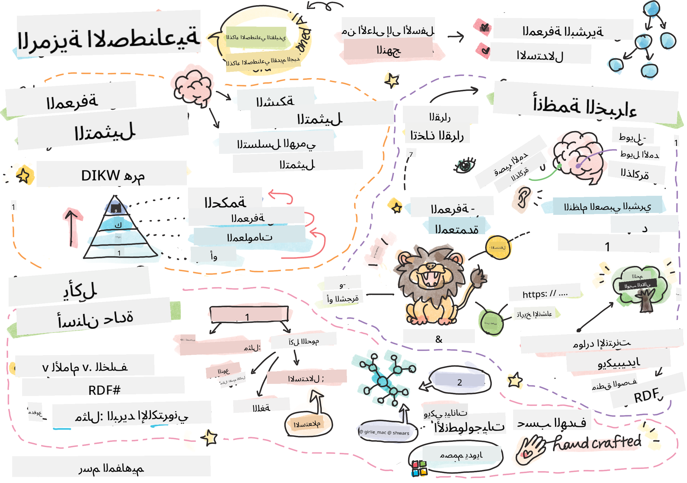

<!--
CO_OP_TRANSLATOR_METADATA:
{
  "original_hash": "7d097f7fda9166ead615e4c34552381b",
  "translation_date": "2025-09-23T06:34:29+00:00",
  "source_file": "lessons/2-Symbolic/README.md",
  "language_code": "ar"
}
-->
# تمثيل المعرفة وأنظمة الخبراء



> رسم توضيحي بواسطة [Tomomi Imura](https://twitter.com/girlie_mac)

السعي وراء الذكاء الاصطناعي يعتمد على البحث عن المعرفة لفهم العالم بطريقة مشابهة للبشر. ولكن كيف يمكن تحقيق ذلك؟

## [اختبار ما قبل المحاضرة](https://ff-quizzes.netlify.app/en/ai/quiz/3)

في الأيام الأولى للذكاء الاصطناعي، كان النهج العلوي لإنشاء أنظمة ذكية (الذي تمت مناقشته في الدرس السابق) شائعًا. الفكرة كانت استخراج المعرفة من البشر إلى شكل يمكن قراءته بواسطة الآلة، ثم استخدامها لحل المشكلات تلقائيًا. هذا النهج كان يعتمد على فكرتين رئيسيتين:

* تمثيل المعرفة  
* الاستنتاج  

## تمثيل المعرفة

أحد المفاهيم المهمة في الذكاء الاصطناعي الرمزي هو **المعرفة**. من المهم التمييز بين المعرفة و*المعلومات* أو *البيانات*. على سبيل المثال، يمكن القول إن الكتب تحتوي على معرفة، لأننا نستطيع دراسة الكتب لنصبح خبراء. ومع ذلك، ما تحتويه الكتب يُطلق عليه في الواقع *بيانات*، ومن خلال قراءة الكتب ودمج هذه البيانات في نموذجنا العقلي للعالم، نحول البيانات إلى معرفة.

> ✅ **المعرفة** هي شيء موجود في أذهاننا ويمثل فهمنا للعالم. يتم الحصول عليها من خلال عملية **تعلم** نشطة، حيث يتم دمج أجزاء المعلومات التي نتلقاها في نموذجنا العقلي للعالم.

غالبًا لا نحدد المعرفة بشكل صارم، ولكننا نربطها بمفاهيم أخرى باستخدام [هرم DIKW](https://en.wikipedia.org/wiki/DIKW_pyramid). يحتوي هذا الهرم على المفاهيم التالية:

* **البيانات** هي شيء يتم تمثيله في وسائل مادية، مثل النصوص المكتوبة أو الكلمات المنطوقة. البيانات موجودة بشكل مستقل عن البشر ويمكن نقلها بينهم.
* **المعلومات** هي كيفية تفسيرنا للبيانات في أذهاننا. على سبيل المثال، عندما نسمع كلمة *كمبيوتر*، لدينا فهم معين لما تعنيه.
* **المعرفة** هي المعلومات التي يتم دمجها في نموذجنا العقلي للعالم. على سبيل المثال، بمجرد أن نتعلم ما هو الكمبيوتر، نبدأ في تكوين أفكار حول كيفية عمله، تكلفته، وما يمكن استخدامه فيه. هذه الشبكة من المفاهيم المترابطة تشكل معرفتنا.
* **الحكمة** هي مستوى آخر من فهمنا للعالم، وتمثل *المعرفة الفوقية*، مثل فكرة حول كيفية ومتى يجب استخدام المعرفة.


*الصورة [من ويكيبيديا](https://commons.wikimedia.org/w/index.php?curid=37705247)، بواسطة Longlivetheux - عمل خاص، CC BY-SA 4.0*

لذلك، مشكلة **تمثيل المعرفة** هي إيجاد طريقة فعالة لتمثيل المعرفة داخل الكمبيوتر في شكل بيانات، لجعلها قابلة للاستخدام تلقائيًا. يمكن النظر إلى هذا على أنه طيف:


> صورة بواسطة [Dmitry Soshnikov](http://soshnikov.com)

* على الجانب الأيسر، هناك أنواع بسيطة جدًا من تمثيلات المعرفة التي يمكن استخدامها بفعالية بواسطة الكمبيوتر. أبسطها هو التمثيل الخوارزمي، حيث يتم تمثيل المعرفة بواسطة برنامج كمبيوتر. ومع ذلك، هذا ليس أفضل طريقة لتمثيل المعرفة، لأنه غير مرن. المعرفة داخل أذهاننا غالبًا ما تكون غير خوارزمية.
* على الجانب الأيمن، هناك تمثيلات مثل النصوص الطبيعية. هذا النوع هو الأقوى، ولكنه لا يمكن استخدامه للاستنتاج التلقائي.

> ✅ فكر لدقيقة حول كيفية تمثيلك للمعرفة في ذهنك وتحويلها إلى ملاحظات. هل هناك صيغة معينة تساعدك على الاحتفاظ بالمعلومات؟

## تصنيف طرق تمثيل المعرفة في الكمبيوتر

يمكننا تصنيف طرق تمثيل المعرفة المختلفة في الكمبيوتر إلى الفئات التالية:

* **تمثيلات الشبكة** تعتمد على حقيقة أن لدينا شبكة من المفاهيم المترابطة داخل أذهاننا. يمكننا محاولة إعادة إنتاج نفس الشبكات كرسوم بيانية داخل الكمبيوتر - ما يسمى بـ **الشبكة الدلالية**.

1. **ثلاثيات الكائن-السمة-القيمة** أو **أزواج السمة-القيمة**. بما أن الرسم البياني يمكن تمثيله داخل الكمبيوتر كقائمة من العقد والحواف، يمكننا تمثيل الشبكة الدلالية بقائمة من الثلاثيات التي تحتوي على الكائنات، السمات، والقيم. على سبيل المثال، يمكننا بناء الثلاثيات التالية حول لغات البرمجة:

الكائن | السمة | القيمة  
-------|-------|------  
Python | هي | لغة غير محددة النوع  
Python | اخترعها | Guido van Rossum  
Python | بناء الكتل | التراجع  
لغة غير محددة النوع | لا تحتوي على | تعريفات النوع  

> ✅ فكر كيف يمكن استخدام الثلاثيات لتمثيل أنواع أخرى من المعرفة.

2. **التمثيلات الهرمية** تركز على حقيقة أننا غالبًا ما ننشئ تسلسلًا هرميًا للكائنات داخل أذهاننا. على سبيل المثال، نعلم أن الكناري هو طائر، وكل الطيور لديها أجنحة. لدينا أيضًا فكرة عن لون الكناري عادةً، وسرعة طيرانه.

   - **تمثيل الإطار** يعتمد على تمثيل كل كائن أو فئة من الكائنات كـ **إطار** يحتوي على **فتحات**. الفتحات تحتوي على قيم افتراضية ممكنة، قيود على القيم، أو إجراءات مخزنة يمكن استدعاؤها للحصول على قيمة الفتحة. جميع الإطارات تشكل تسلسلًا هرميًا مشابهًا لتسلسل الكائنات في لغات البرمجة الكائنية.
   - **السيناريوهات** هي نوع خاص من الإطارات التي تمثل مواقف معقدة يمكن أن تتطور مع الزمن.

**Python**

الفتحة | القيمة | القيمة الافتراضية | النطاق  
-------|-------|----------------|-------  
الاسم | Python | |  
هي | لغة غير محددة النوع | |  
حالة المتغير | | CamelCase |  
طول البرنامج | | | 5-5000 سطر  
بناء الكتل | التراجع | |  

3. **التمثيلات الإجرائية** تعتمد على تمثيل المعرفة بقائمة من الإجراءات التي يمكن تنفيذها عند حدوث شرط معين.  
   - قواعد الإنتاج هي عبارات إذا-فإن التي تسمح لنا باستخلاص استنتاجات. على سبيل المثال، يمكن للطبيب أن يكون لديه قاعدة تقول **إذا** كان لدى المريض حمى شديدة **أو** مستوى مرتفع من بروتين C التفاعلي في اختبار الدم **فإن** لديه التهاب. بمجرد أن نواجه أحد الشروط، يمكننا استخلاص استنتاج حول الالتهاب، ثم استخدامه في الاستنتاجات اللاحقة.  
   - يمكن اعتبار الخوارزميات شكلًا آخر من التمثيلات الإجرائية، على الرغم من أنها نادرًا ما تُستخدم مباشرة في أنظمة المعرفة.

4. **المنطق** اقترحه أرسطو في الأصل كطريقة لتمثيل المعرفة البشرية العالمية.  
   - المنطق الحملي كنظرية رياضية غني جدًا ليكون قابلًا للحساب، لذلك يتم استخدام بعض الأجزاء منه عادةً، مثل العبارات Horn المستخدمة في Prolog.  
   - المنطق الوصفي هو عائلة من الأنظمة المنطقية المستخدمة لتمثيل واستنتاج التسلسلات الهرمية للكائنات وتمثيلات المعرفة الموزعة مثل *الويب الدلالي*.

## أنظمة الخبراء

أحد النجاحات المبكرة للذكاء الاصطناعي الرمزي كانت ما يسمى بـ **أنظمة الخبراء** - أنظمة كمبيوتر مصممة للعمل كخبير في مجال مشكلة محدودة. كانت تعتمد على **قاعدة معرفة** مستخرجة من خبير أو أكثر من البشر، وتحتوي على **محرك استنتاج** يقوم ببعض الاستنتاجات بناءً عليها.

 |   
---------------------------------------------|------------------------------------------------  
هيكل مبسط للنظام العصبي البشري | هيكل نظام قائم على المعرفة  

أنظمة الخبراء تُبنى مثل نظام الاستنتاج البشري، الذي يحتوي على **ذاكرة قصيرة المدى** و**ذاكرة طويلة المدى**. وبالمثل، في الأنظمة القائمة على المعرفة نميز بين المكونات التالية:

* **ذاكرة المشكلة**: تحتوي على المعرفة حول المشكلة التي يتم حلها حاليًا، مثل درجة الحرارة أو ضغط الدم للمريض، وما إذا كان لديه التهاب أم لا. هذه المعرفة تُسمى أيضًا **المعرفة الثابتة**، لأنها تحتوي على لقطة لما نعرفه حاليًا عن المشكلة - ما يسمى *حالة المشكلة*.  
* **قاعدة المعرفة**: تمثل المعرفة طويلة المدى حول مجال المشكلة. يتم استخراجها يدويًا من خبراء البشر، ولا تتغير من استشارة إلى أخرى. لأنها تسمح لنا بالتنقل من حالة مشكلة إلى أخرى، تُسمى أيضًا **المعرفة الديناميكية**.  
* **محرك الاستنتاج**: ينظم العملية بأكملها للبحث في فضاء حالة المشكلة، وطرح الأسئلة على المستخدم عند الضرورة. كما أنه مسؤول عن إيجاد القواعد المناسبة لتطبيقها على كل حالة.

كمثال، دعونا نأخذ نظام خبير لتحديد الحيوان بناءً على خصائصه الفيزيائية:


> صورة بواسطة [Dmitry Soshnikov](http://soshnikov.com)

هذا الرسم البياني يُسمى **شجرة AND-OR**، وهو تمثيل رسومي لمجموعة من قواعد الإنتاج. رسم الشجرة مفيد في بداية استخراج المعرفة من الخبير. لتمثيل المعرفة داخل الكمبيوتر، من الأكثر ملاءمة استخدام القواعد:

```
IF the animal eats meat
OR (animal has sharp teeth
    AND animal has claws
    AND animal has forward-looking eyes
) 
THEN the animal is a carnivore
```
  
يمكنك ملاحظة أن كل شرط على الجانب الأيسر من القاعدة والإجراء هو في الأساس ثلاثيات الكائن-السمة-القيمة (OAV). **الذاكرة العاملة** تحتوي على مجموعة من ثلاثيات OAV التي تتوافق مع المشكلة التي يتم حلها حاليًا. **محرك القواعد** يبحث عن القواعد التي يتم استيفاء شرطها ويطبقها، مضيفًا ثلاثية جديدة إلى الذاكرة العاملة.

> ✅ اكتب شجرة AND-OR خاصة بك حول موضوع تحبه!

### الاستنتاج الأمامي مقابل الاستنتاج الخلفي

العملية الموضحة أعلاه تُسمى **الاستنتاج الأمامي**. تبدأ ببعض البيانات الأولية حول المشكلة المتوفرة في الذاكرة العاملة، ثم تنفذ الحلقة الاستنتاجية التالية:

1. إذا كانت السمة المستهدفة موجودة في الذاكرة العاملة - توقف وأعطِ النتيجة  
2. ابحث عن جميع القواعد التي يتم استيفاء شرطها حاليًا - احصل على **مجموعة الصراع** من القواعد.  
3. قم بـ **حل الصراع** - اختر قاعدة واحدة سيتم تنفيذها في هذه الخطوة. يمكن أن تكون هناك استراتيجيات مختلفة لحل الصراع:  
   - اختر أول قاعدة قابلة للتطبيق في قاعدة المعرفة  
   - اختر قاعدة عشوائية  
   - اختر قاعدة *أكثر تحديدًا*، أي التي تستوفي أكبر عدد من الشروط في الجانب الأيسر (LHS)  
4. طبق القاعدة المختارة وأضف قطعة جديدة من المعرفة إلى حالة المشكلة  
5. كرر من الخطوة 1.

ومع ذلك، في بعض الحالات قد نرغب في البدء بمعرفة فارغة حول المشكلة، وطرح أسئلة تساعدنا في الوصول إلى النتيجة. على سبيل المثال، عند إجراء تشخيص طبي، عادةً لا نقوم بإجراء جميع التحاليل الطبية مسبقًا قبل بدء تشخيص المريض. بل نرغب في إجراء التحاليل عندما يكون القرار بحاجة إلى اتخاذه.

يمكن نمذجة هذه العملية باستخدام **الاستنتاج الخلفي**. يتم تحفيزه بواسطة **الهدف** - قيمة السمة التي نبحث عنها:

1. اختر جميع القواعد التي يمكن أن تعطينا قيمة الهدف (أي مع الهدف على الجانب الأيمن (RHS)) - مجموعة الصراع  
1. إذا لم تكن هناك قواعد لهذه السمة، أو كانت هناك قاعدة تقول إنه يجب أن نسأل المستخدم عن القيمة - اسأل عنها، وإلا:  
1. استخدم استراتيجية حل الصراع لاختيار قاعدة واحدة سنستخدمها كـ *فرضية* - سنحاول إثباتها  
1. كرر العملية بشكل متكرر لجميع السمات في الجانب الأيسر من القاعدة، محاولًا إثباتها كأهداف  
1. إذا فشلت العملية في أي نقطة - استخدم قاعدة أخرى في الخطوة 3.

> ✅ في أي الحالات يكون الاستنتاج الأمامي أكثر ملاءمة؟ وماذا عن الاستنتاج الخلفي؟

### تنفيذ أنظمة الخبراء

يمكن تنفيذ أنظمة الخبراء باستخدام أدوات مختلفة:

* برمجتها مباشرةً في لغة برمجة عالية المستوى. هذه ليست أفضل فكرة، لأن الميزة الرئيسية للنظام القائم على المعرفة هي أن المعرفة منفصلة عن الاستنتاج، ومن المحتمل أن يكون خبير مجال المشكلة قادرًا على كتابة القواعد دون فهم تفاصيل عملية الاستنتاج.  
* استخدام **قشرة أنظمة الخبراء**، أي نظام مصمم خصيصًا ليتم ملؤه بالمعرفة باستخدام لغة تمثيل المعرفة.

## ✍️ تمرين: استنتاج الحيوانات

راجع [Animals.ipynb](https://github.com/microsoft/AI-For-Beginners/blob/main/lessons/2-Symbolic/Animals.ipynb) للحصول على مثال حول تنفيذ نظام خبير للاستنتاج الأمامي والخلفي.

> **ملاحظة**: هذا المثال بسيط جدًا، ويعطي فقط فكرة عن شكل نظام خبير. بمجرد أن تبدأ في إنشاء مثل هذا النظام، ستلاحظ بعض السلوك *الذكي* منه فقط عندما تصل إلى عدد معين من القواعد، حوالي 200+. في مرحلة ما، تصبح القواعد معقدة جدًا بحيث يصعب الاحتفاظ بها جميعًا في الذهن، وفي هذه المرحلة قد تبدأ في التساؤل عن سبب اتخاذ النظام قرارات معينة. ومع ذلك، السمة المهمة للأنظمة القائمة على المعرفة هي أنه يمكنك دائمًا *شرح* بالضبط كيف تم اتخاذ أي من القرارات.

## الأنطولوجيات والويب الدلالي

في نهاية القرن العشرين، كانت هناك مبادرة لاستخدام تمثيل المعرفة لتوضيح موارد الإنترنت، بحيث يصبح من الممكن العثور على الموارد التي تتوافق مع استفسارات محددة جدًا. هذه الحركة كانت تُسمى **الويب الدلالي**، وكانت تعتمد على عدة مفاهيم:

- تمثيل معرفة خاص يعتمد على **[المنطق الوصفي](https://en.wikipedia.org/wiki/Description_logic)** (DL). يشبه تمثيل المعرفة بالإطار، لأنه يبني تسلسلًا هرميًا للكائنات مع الخصائص، ولكنه يحتوي على دلالات منطقية رسمية واستنتاج. هناك عائلة كاملة من DLs التي توازن بين التعبيرية وتعقيد الخوارزميات للاستنتاج.  
- تمثيل المعرفة الموزعة، حيث يتم تمثيل جميع المفاهيم بواسطة معرف URI عالمي، مما يجعل من الممكن إنشاء تسلسلات هرمية للمعرفة تمتد عبر الإنترنت.  
- عائلة من اللغات القائمة على XML لوصف المعرفة: RDF (إطار وصف الموارد)، RDFS (مخطط RDF)، OWL (لغة الويب للأنطولوجيا).

المفهوم الأساسي في الويب الدلالي هو مفهوم **الأنطولوجيا**. يشير إلى تحديد واضح لمجال المشكلة باستخدام تمثيل معرفي رسمي. يمكن أن تكون الأنطولوجيا الأبسط مجرد تسلسل هرمي للأشياء في مجال المشكلة، ولكن الأنطولوجيات الأكثر تعقيدًا ستتضمن قواعد يمكن استخدامها للاستنتاج.

في الويب الدلالي، جميع التمثيلات تعتمد على ثلاثيات. يتم تحديد كل كائن وكل علاقة بشكل فريد بواسطة URI. على سبيل المثال، إذا أردنا توضيح حقيقة أن منهج الذكاء الاصطناعي هذا تم تطويره بواسطة Dmitry Soshnikov في 1 يناير 2022 - إليك الثلاثيات التي يمكننا استخدامها:


```
http://github.com/microsoft/ai-for-beginners http://www.example.com/terms/creation-date “Jan 13, 2007”
http://github.com/microsoft/ai-for-beginners http://purl.org/dc/elements/1.1/creator http://soshnikov.com
```

> ✅ هنا `http://www.example.com/terms/creation-date` و `http://purl.org/dc/elements/1.1/creator` هما URI معروفان ومقبولان عالميًا للتعبير عن مفاهيم *المُنشئ* و *تاريخ الإنشاء*.

في حالة أكثر تعقيدًا، إذا أردنا تعريف قائمة من المُنشئين، يمكننا استخدام بعض الهياكل البيانية المحددة في RDF.


> الرسوم البيانية أعلاه بواسطة [Dmitry Soshnikov](http://soshnikov.com)

تقدم بناء الويب الدلالي تباطأ إلى حد ما بسبب نجاح محركات البحث وتقنيات معالجة اللغة الطبيعية، التي تسمح باستخراج البيانات المنظمة من النصوص. ومع ذلك، في بعض المجالات لا تزال هناك جهود كبيرة للحفاظ على الأنطولوجيات وقواعد المعرفة. بعض المشاريع الجديرة بالملاحظة:

* [WikiData](https://wikidata.org/) هي مجموعة من قواعد المعرفة القابلة للقراءة الآلية المرتبطة بـ Wikipedia. يتم استخراج معظم البيانات من *InfoBoxes* في صفحات Wikipedia، وهي أجزاء من المحتوى المنظم. يمكنك [الاستعلام](https://query.wikidata.org/) عن WikiData باستخدام SPARQL، وهي لغة استعلام خاصة بالويب الدلالي. إليك مثال على استعلام يعرض أكثر ألوان العيون شيوعًا بين البشر:

```sparql
#defaultView:BubbleChart
SELECT ?eyeColorLabel (COUNT(?human) AS ?count)
WHERE
{
  ?human wdt:P31 wd:Q5.       # human instance-of homo sapiens
  ?human wdt:P1340 ?eyeColor. # human eye-color ?eyeColor
  SERVICE wikibase:label { bd:serviceParam wikibase:language "en". }
}
GROUP BY ?eyeColorLabel
```

* [DBpedia](https://www.dbpedia.org/) هو جهد آخر مشابه لـ WikiData.

> ✅ إذا كنت ترغب في تجربة بناء أنطولوجيات خاصة بك، أو فتح أنطولوجيات موجودة، هناك محرر أنطولوجيا بصري رائع يسمى [Protégé](https://protege.stanford.edu/). قم بتنزيله، أو استخدمه عبر الإنترنت.


*محرر Web Protégé مفتوح مع أنطولوجيا عائلة رومانوف. لقطة شاشة بواسطة Dmitry Soshnikov*

## ✍️ تمرين: أنطولوجيا العائلة

راجع [FamilyOntology.ipynb](https://github.com/Ezana135/AI-For-Beginners/blob/main/lessons/2-Symbolic/FamilyOntology.ipynb) للحصول على مثال حول استخدام تقنيات الويب الدلالي للاستنتاج حول العلاقات الأسرية. سنأخذ شجرة عائلة ممثلة بتنسيق GEDCOM الشائع وأنطولوجيا للعلاقات الأسرية ونبني رسمًا بيانيًا لجميع العلاقات الأسرية لمجموعة معينة من الأفراد.

## رسم مفهوم Microsoft

في معظم الحالات، يتم إنشاء الأنطولوجيات بعناية يدويًا. ومع ذلك، من الممكن أيضًا **استخراج** الأنطولوجيات من البيانات غير المنظمة، على سبيل المثال، من النصوص الطبيعية.

تم إجراء محاولة كهذه بواسطة Microsoft Research، وأدت إلى [Microsoft Concept Graph](https://blogs.microsoft.com/ai/microsoft-researchers-release-graph-that-helps-machines-conceptualize/?WT.mc_id=academic-77998-cacaste).

إنه مجموعة كبيرة من الكيانات مجمعة معًا باستخدام علاقة الوراثة `is-a`. يسمح بالإجابة على أسئلة مثل "ما هي Microsoft؟" - الإجابة تكون شيئًا مثل "شركة باحتمالية 0.87، وعلامة تجارية باحتمالية 0.75".

الرسم البياني متاح إما كواجهة برمجية REST API، أو كملف نصي كبير قابل للتنزيل يسرد جميع أزواج الكيانات.

## ✍️ تمرين: رسم مفهوم

جرب دفتر [MSConceptGraph.ipynb](https://github.com/microsoft/AI-For-Beginners/blob/main/lessons/2-Symbolic/MSConceptGraph.ipynb) لترى كيف يمكننا استخدام Microsoft Concept Graph لتصنيف المقالات الإخبارية إلى عدة فئات.

## الخاتمة

في الوقت الحاضر، غالبًا ما يُعتبر الذكاء الاصطناعي مرادفًا لـ *التعلم الآلي* أو *الشبكات العصبية*. ومع ذلك، فإن الإنسان يظهر أيضًا استنتاجًا صريحًا، وهو شيء لا يتم التعامل معه حاليًا بواسطة الشبكات العصبية. في المشاريع الواقعية، لا يزال يتم استخدام الاستنتاج الصريح لأداء المهام التي تتطلب تفسيرات، أو القدرة على تعديل سلوك النظام بطريقة محكومة.

## 🚀 تحدي

في دفتر أنطولوجيا العائلة المرتبط بهذا الدرس، هناك فرصة لتجربة علاقات أسرية أخرى. حاول اكتشاف روابط جديدة بين الأشخاص في شجرة العائلة.

## [اختبار ما بعد المحاضرة](https://ff-quizzes.netlify.app/en/ai/quiz/4)

## المراجعة والدراسة الذاتية

قم ببعض البحث على الإنترنت لاكتشاف المجالات التي حاول فيها البشر قياس المعرفة وتشفيرها. ألقِ نظرة على تصنيف بلوم، وارجع إلى التاريخ لتتعرف على كيفية محاولة البشر فهم عالمهم. استكشف عمل لينيوس لإنشاء تصنيف للكائنات الحية، وراقب الطريقة التي أنشأ بها ديمتري مندليف طريقة لوصف العناصر الكيميائية وتصنيفها. ما هي الأمثلة الأخرى المثيرة للاهتمام التي يمكنك العثور عليها؟

**التكليف**: [بناء أنطولوجيا](assignment.md)

---

