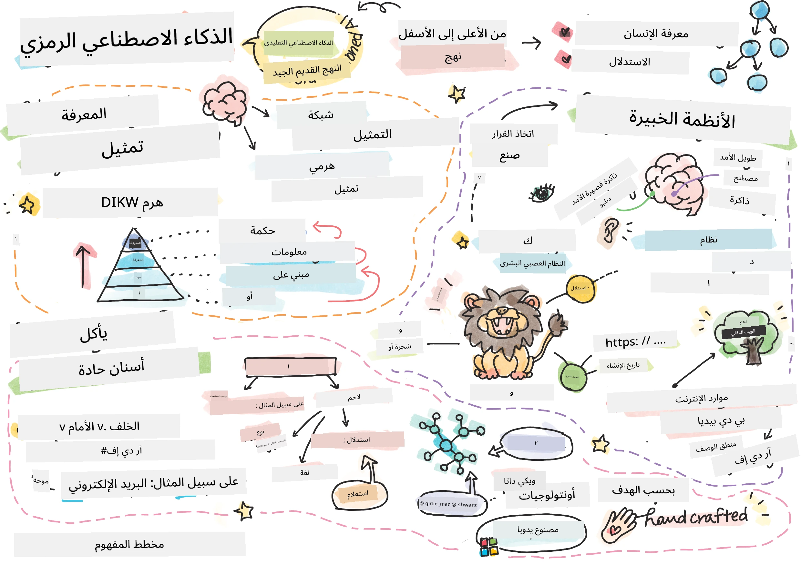
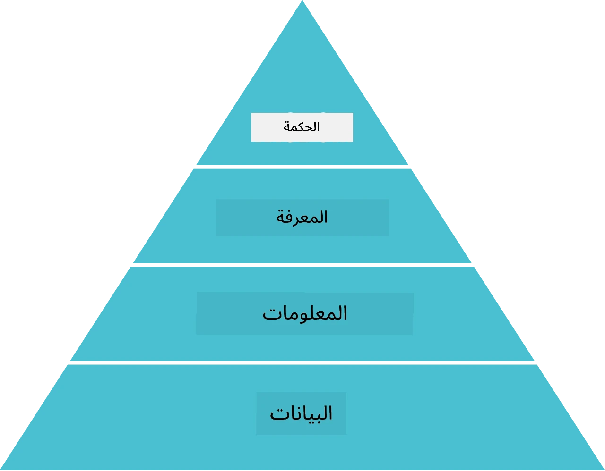
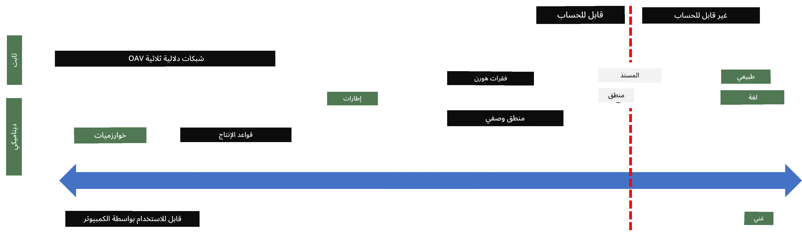
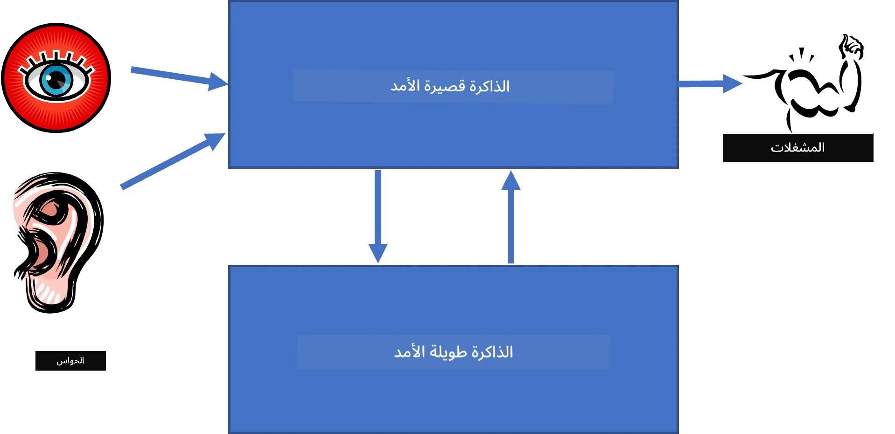
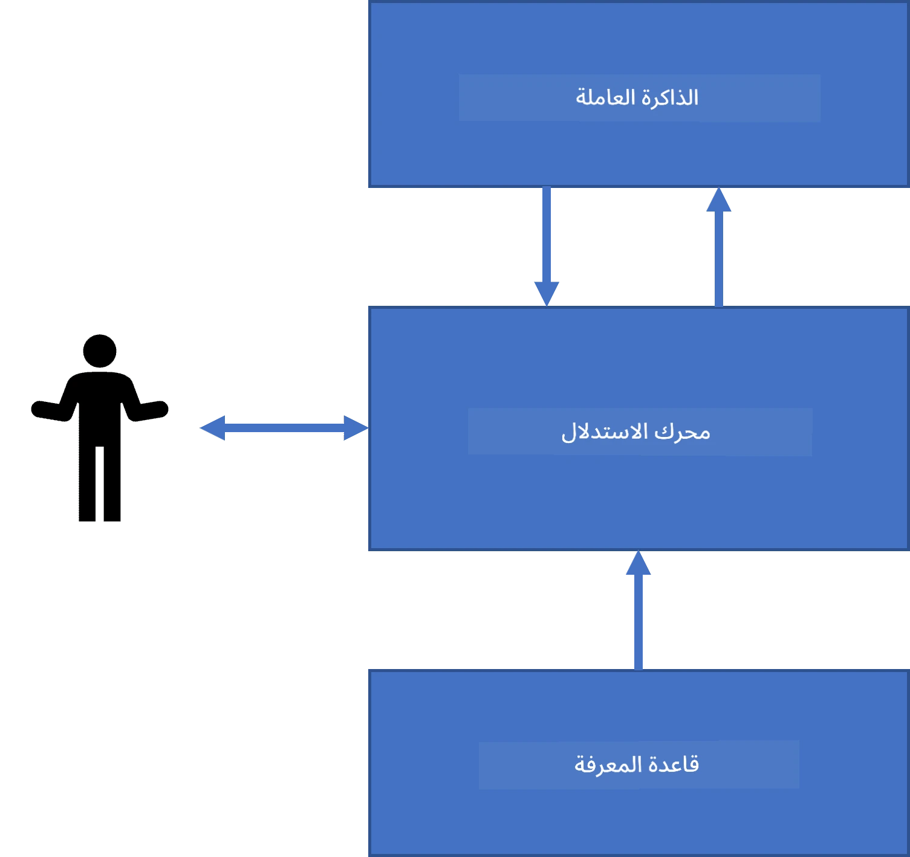
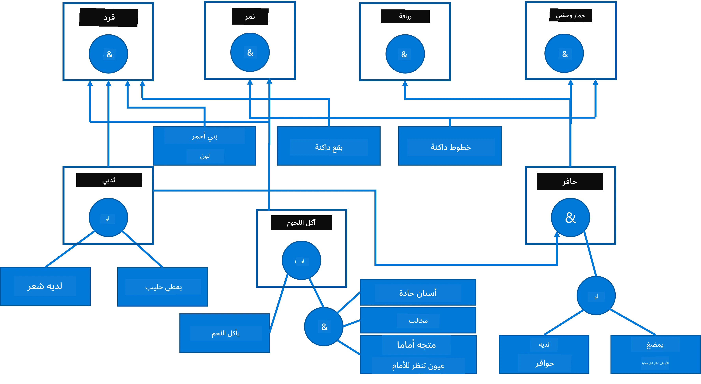
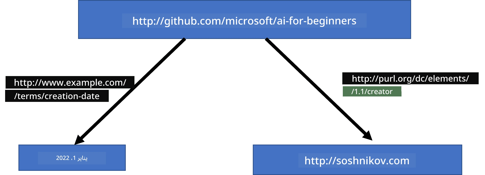
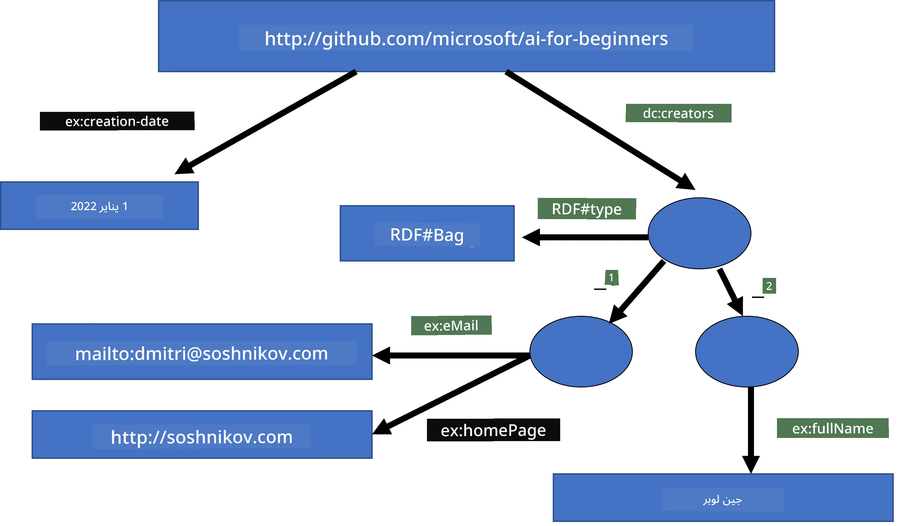
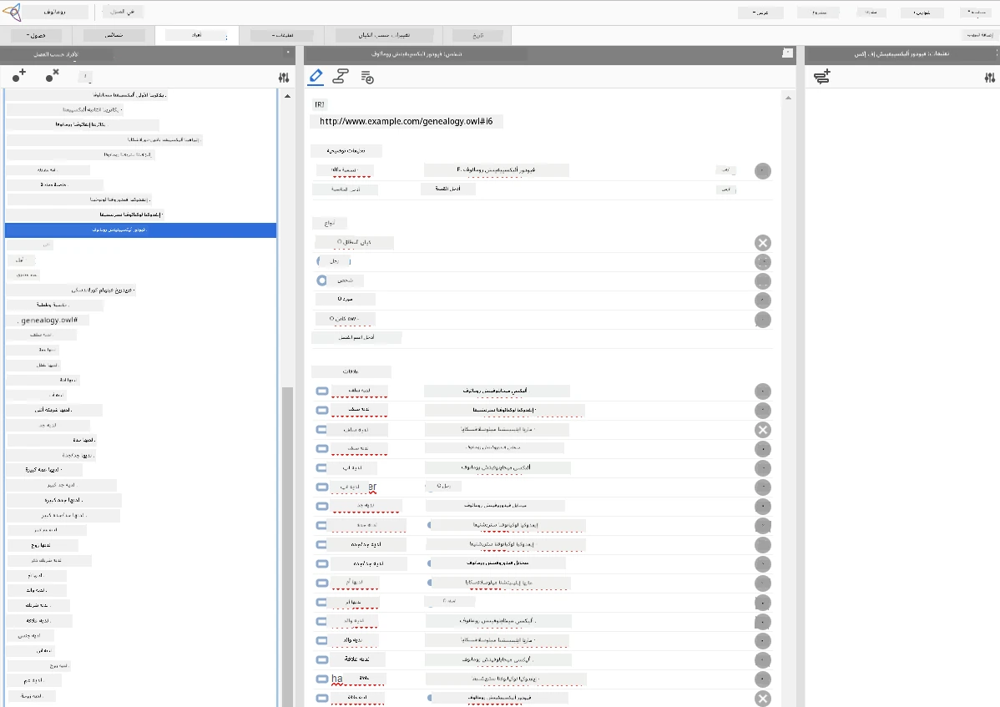

# تمثيل المعرفة والأنظمة الخبيرة



> مخطط مرسوم بواسطة [تومومي إيمورا](https://twitter.com/girlie_mac)

إن السعي نحو الذكاء الاصطناعي يستند إلى البحث عن المعرفة، لفهم العالم بطريقة مشابهة لكيفية فهم البشر له. لكن كيف يمكن القيام بذلك؟

## [اختبار قبلي للمحاضرة](https://ff-quizzes.netlify.app/en/ai/quiz/3)

في الأيام الأولى للذكاء الاصطناعي، كان النهج من الأعلى إلى الأسفل لإنشاء أنظمة ذكية (المناقش في الدرس السابق) شائعًا. الفكرة كانت استخلاص المعرفة من الأشخاص إلى شكل يمكن للآلة قراءته، ثم استخدامها تلقائيًا لحل المشكلات. هذا النهج استند إلى فكرتين كبيرتين:

* تمثيل المعرفة
* الاستدلال

## تمثيل المعرفة

أحد المفاهيم المهمة في الذكاء الاصطناعي الرمزي هو **المعرفة**. من المهم التمييز بين المعرفة وبين *المعلومات* أو *البيانات*. على سبيل المثال، يمكن القول أن الكتب تحتوي على معرفة، لأنه يمكن دراسة الكتب ويصبح المرء خبيرًا. ومع ذلك، ما تحويه الكتب في الحقيقة يسمى *بيانات*، وعن طريق قراءة الكتب ودمج هذه البيانات في نموذجنا للعالم نحول هذه البيانات إلى معرفة.

> ✅ **المعرفة** هي شيء موجود في رأسنا ويمثل فهمنا للعالم. يتم الحصول عليها من خلال عملية **تعلم** نشطة، تدمج قطع المعلومات التي نستقبلها في نموذجنا النشط للعالم.

غالبًا ما لا نحدد المعرفة بدقة، لكننا نربطها بمفاهيم أخرى ذات صلة باستخدام [هرم DIKW](https://en.wikipedia.org/wiki/DIKW_pyramid). يحتوي على المفاهيم التالية:

* **البيانات** هي شيء مُمثل في وسيط مادي، مثل نص مكتوب أو كلمات منطوقة. البيانات موجودة بشكل مستقل عن البشر ويمكن نقلها بينهم.
* **المعلومات** هي كيفية تفسيرنا للبيانات في رأسنا. على سبيل المثال، عندما نسمع كلمة *حاسوب*، يكون لدينا بعض الفهم لما هي.
* **المعرفة** هي المعلومات التي تُدمج في نموذجنا للعالم. على سبيل المثال، بمجرد أن نتعلم ما هو الحاسوب، نبدأ في تكوين بعض الأفكار عن كيفية عمله، كم يكلف، وما يمكن استخدامه له. هذه الشبكة من المفاهيم المترابطة تشكل معرفتنا.
* **الحكمة** هي مستوى آخر من فهمنا للعالم، وتمثل *المعرفة العليا*، مثل فكرة حول كيفية ومتى يجب استخدام المعرفة.



*صورة [من ويكيبيديا](https://commons.wikimedia.org/w/index.php?curid=37705247)، بواسطة Longlivetheux - عمل شخصي، رخصة CC BY-SA 4.0*

وبالتالي، مشكلة **تمثيل المعرفة** هي إيجاد طريقة فعالة لتمثيل المعرفة داخل الحاسوب في شكل بيانات، لجعلها قابلة للاستخدام تلقائيًا. يمكن رؤية هذا كمجال:



> صورة بواسطة [دميتري سوشنيكوف](http://soshnikov.com)

* إلى اليسار، هناك أنواع بسيطة جدًا من تمثيلات المعرفة التي يمكن للحواسيب استخدامها بفعالية. أبسطها هو التمثيل الخوارزمي، حيث تمثل المعرفة بواسطة برنامج حاسوبي. ومع ذلك، ليست هذه هي أفضل طريقة لتمثيل المعرفة، لأنها غير مرنة. المعرفة داخل رؤوسنا غالبًا ما تكون غير خوارزمية.
* إلى اليمين، هناك تمثيلات مثل النص الطبيعي. إنها الأقوى، لكنها لا يمكن استخدامها للاستدلال التلقائي.

> ✅ فكر للحظة في كيفية تمثيلك للمعرفة في رأسك وتحويلها إلى ملاحظات. هل هناك صيغة معينة تعمل جيدًا معك للمساعدة في التذكر؟

## تصنيف تمثيلات المعرفة الحاسوبية

يمكننا تصنيف طرق تمثيل المعرفة المختلفة في الحاسوب في الفئات التالية:

* **التمثيلات الشبكية** تعتمد على حقيقة أن لدينا شبكة من المفاهيم المترابطة داخل رأسنا. يمكننا محاولة إعادة إنتاج نفس الشبكات كرسوم بيانية داخل الحاسوب - ما يسمى **الشبكة الدلالية**.

1. **ثلاثيات الكائن-السمة-القيمة** أو **أزواج السمة والقيمة**. بما أن الرسم البياني يمكن تمثيله داخل الحاسوب كقائمة من العقد والحواف، يمكننا تمثيل شبكة دلالية كقائمة من الثلاثيات التي تحتوي على كائنات، سمات، وقيم. على سبيل المثال، نبني ثلاثيات حول لغات البرمجة كالتالي:

الكائن | السمة | القيمة  
-------|-----------|------  
Python | is | Untyped-Language  
Python | invented-by | Guido van Rossum  
Python | block-syntax | indentation  
Untyped-Language | doesn't have | type definitions  

> ✅ فكر كيف يمكن استخدام الثلاثيات لتمثيل أنواع أخرى من المعرفة.

2. **التمثيلات الهرمية** تؤكد على حقيقة أننا غالبًا ما نُنشئ تسلسلاً هرميًا للكائنات داخل رأسنا. على سبيل المثال، نعرف أن الكناري طائر، وكل الطيور لها أجنحة. لدينا أيضًا فكرة عن لون الكناري المعتاد وسرعة طيرانه.

   - **تمثيل الإطار** يعتمد على تمثيل كل كائن أو فئة من الكائنات كـ **إطار** يحتوي على **فراغات**. للفراغات قيم افتراضية محتملة، قيود على القيم، أو إجراءات مخزنة يمكن استدعاؤها للحصول على قيمة الفراغ. جميع الإطارات تشكل تسلسلًا هرميًا مشابهًا لتسلسل الكائنات في لغات البرمجة كائنية التوجه.
   - **السيناريوهات** هي نوع خاص من الإطارات تمثل مواقف معقدة يمكن أن تتطور مع الزمن.

**بايثون**

الفراغ | القيمة | القيمة الافتراضية | النطاق  
-----|-------|---------------|----------  
Name | Python | | |  
Is-A | Untyped-Language | | |  
Variable Case | | CamelCase | |  
Program Length | | | 5-5000 lines |  
Block Syntax | Indent | | |  

3. **التمثيلات الإجرائية** تعتمد على تمثيل المعرفة كقائمة من الإجراءات التي يمكن تنفيذها عند تحقق شرط معين.
   - قواعد الإنتاج هي جمل شرط-نتيجة تسمح لنا باستخلاص الاستنتاجات. على سبيل المثال، لدى الطبيب قاعدة تقول: **إذا** كان للمريض حمى مرتفعة **أو** مستوى مرتفع من البروتين C التفاعلي في اختبار الدم **فإن** لديه التهاب. بمجرد مواجهة أحد الشروط، يمكننا التوصل إلى استنتاج عن وجود الالتهاب، ثم استخدامه في استدلالات لاحقة.
   - يمكن اعتبار الخوارزميات شكلًا آخر من التمثيل الإجرائي، رغم أنها نادرًا ما تستخدم مباشرة في أنظمة المعرفة.

4. **المنطق** اقترحه أرسطو في الأصل كطريقة لتمثيل المعرفة البشرية الشاملة.
   - المنطق البروديكي باعتباره نظرية رياضية غني جدًا بحيث لا يمكن حسابه في العادة، لذلك يُستخدم عادةً مجموعة فرعية منه مثل جمل Horn المستخدمة في Prolog.
   - المنطق الوصفي هو عائلة من الأنظمة المنطقية المستخدمة لتمثيل والاستدلال حول التسلسلات الهرمية للكائنات والتمثيلات المعرفة الموزعة مثل *الويب الدلالي*.

## الأنظمة الخبيرة

كان من أوائل نجاحات الذكاء الاصطناعي الرمزي ما يسمى بـ **الأنظمة الخبيرة** - أنظمة حاسوبية صُممت لتعمل كخبير في مجال مشكلة محدد. كانت تعتمد على **قاعدة معرفة** مستخلصة من خبير واحد أو أكثر، وكانت تحتوي على **محرك استدلال** يقوم ببعض الاستدلالات فوقها.

 | 
---------------------------------------------|------------------------------------------------
الهيكل المبسط للنظام العصبي البشري | بنية نظام قائم على المعرفة

تُبنى الأنظمة الخبيرة مثل نظام الاستدلال البشري، الذي يحتوي على **ذاكرة قصيرة الأمد** و**ذاكرة طويلة الأمد**. وبالمثل، نميز في أنظمة المعرفة المكونات التالية:

* **ذاكرة المشكلة**: تحتوي على المعرفة حول المشكلة التي يتم حلها حالياً، مثل درجة حرارة أو ضغط دم المريض، أو ما إذا كان لديه التهاب أم لا، إلخ. تُسمى هذه المعرفة أيضًا **المعرفة الثابتة**، لأنها تحتوي على لقطة لما نعرفه حاليًا عن المشكلة - ما يسمى *حالة المشكلة*.
* **قاعدة المعرفة**: تمثل المعرفة طويلة الأمد حول مجال المشكلة. تستخلص يدويًا من خبراء البشر، ولا تتغير من استشارة لأخرى. لأنّها تسمح لنا بالتنقل من حالة مشكلة إلى أخرى، تُسمى أيضًا **المعرفة الديناميكية**.
* **محرك الاستدلال**: ينظم عملية البحث في فضاء حالات المشكلة، ويطرح أسئلة على المستخدم عند الضرورة. كما أنه مسؤول عن إيجاد القواعد المناسبة التي ستطبق على كل حالة.

كمثال، لننظر في النظام الخبير التالي لتحديد حيوان بناءً على خصائصه الفيزيائية:



> صورة بواسطة [دميتري سوشنيكوف](http://soshnikov.com)

تسمى هذه المخططات **شجرة AND-OR**، وهي تمثيل بياني لمجموعة من قواعد الإنتاج. رسم الشجرة مفيد في بداية استخراج المعرفة من الخبير. لتمثيل المعرفة داخل الحاسوب، من الأكثر ملاءمة استخدام القواعد:

```
IF the animal eats meat
OR (animal has sharp teeth
    AND animal has claws
    AND animal has forward-looking eyes
) 
THEN the animal is a carnivore
```

يمكنك ملاحظة أن كل شرط في جانب القاعدة الأيسر والفعل هما في الأساس ثلاثيات كائن-سمة-قيمة (OAV). تحتوي **ذاكرة العمل** على مجموعة من ثلاثيات OAV التي تتعلق بالمشكلة التي تُحل حاليًا. تبحث **محرك القواعد** عن القواعد التي تُحقق شروطها وتطبقها، مضيفة ثلاثية جديدة إلى ذاكرة العمل.

> ✅ اكتب شجرة AND-OR خاصة بك عن موضوع تحبه!

### الاستدلال الأمامي مقابل الاستدلال العكسي

العملية الموصوفة أعلاه تسمى **الاستدلال الأمامي**. تبدأ ببعض البيانات الأولية حول المشكلة المتوفرة في ذاكرة العمل، ثم تنفذ حلقة الاستدلال التالية:

1. إذا كانت السمة المستهدفة موجودة في ذاكرة العمل - توقف وأعط النتيجة
2. ابحث عن كل القواعد التي تُحقق شروطها حاليًا - استخرج **مجموعة الصراع** من القواعد.
3. قم بعملية **حل الصراعات** - اختر قاعدة واحدة ستُنفذ في هذه الخطوة. قد تكون هناك استراتيجيات مختلفة لحل الصراع:
   - اختيار أول قاعدة قابلة للتطبيق في قاعدة المعرفة
   - اختيار قاعدة عشوائية
   - اختيار قاعدة *أكثر تحديدًا*، أي التي تحقق أكبر عدد من الشروط في الجانب الأيسر (LHS)
4. طبق القاعدة المختارة وأدخل قطعة معرفة جديدة في حالة المشكلة
5. كرر من الخطوة 1.

ولكن، في بعض الحالات قد نرغب أن نبدأ بمعرفة فارغة عن المشكلة، وطرح أسئلة تساعدنا في الوصول إلى الاستنتاج. على سبيل المثال، عند التشخيص الطبي، عادةً لا نجري جميع الفحوصات الطبية مقدمًا قبل بدء التشخيص. نرغب في إجراء الفحوصات عند الحاجة لاتخاذ قرار.

يمكن تمثيل هذه العملية باستخدام **الاستدلال العكسي**. يتم تحفيزه عن طريق **الهدف** - قيمة السمة التي نريد العثور عليها:

1. اختر كل القواعد التي يمكن أن تعطي قيمة الهدف (أي مع الهدف في الجانب الأيمن (RHS)) - مجموعة صراع
2. إذا لم تكن هناك قواعد لهذه السمة، أو كانت هناك قاعدة تقول أننا يجب أن نسأل المستخدم عن القيمة - اسأل عنها، وإلا:
3. استخدم استراتيجية حل الصراع لاختيار قاعدة واحدة سنستخدمها كـ *فرضية* - سنحاول إثباتها
4. كرر العملية لكل السمات في الجانب الأيسر من القاعدة، محاولاً إثباتها كأهداف
5. إذا فشلت العملية في أي نقطة - استخدم قاعدة أخرى في الخطوة 3.

> ✅ في أي الحالات يكون الاستدلال الأمامي أكثر ملاءمة؟ ماذا عن الاستدلال العكسي؟

### تنفيذ الأنظمة الخبيرة

يمكن تنفيذ الأنظمة الخبيرة باستخدام أدوات مختلفة:

* برمجتها مباشرة في لغة برمجة عالية المستوى. هذه ليست أفضل فكرة، لأن الميزة الرئيسية لنظام قائم على المعرفة هي أن المعرفة منفصلة عن الاستدلال، ومن المحتمل أن يكون خبير مجال المشكلة قادرًا على كتابة القواعد دون فهم تفاصيل عملية الاستدلال.
* استخدام **قشرة الأنظمة الخبيرة**، أي نظام مصمم خصيصًا ليتم ملؤه بالمعرفة باستخدام لغة تمثيل المعرفة.

## ✍️ تمرين: استدلال الحيوانات

راجع [Animals.ipynb](https://github.com/microsoft/AI-For-Beginners/blob/main/lessons/2-Symbolic/Animals.ipynb) لمثال على تنفيذ نظام خبير بالاستدلال الأمامي والعكسي.

> **ملاحظة**: هذا المثال بسيط نسبيًا، ويعطي فقط فكرة عن شكل النظام الخبير. بمجرد أن تبدأ بإنشاء نظام مماثل، لاحظ أنك ستشاهد سلوكًا *ذكيًا* فقط بمجرد الوصول إلى عدد معين من القواعد، حوالي 200+. في نقطة ما، تصبح القواعد معقدة جدًا بحيث يصعب تذكرها كلها، وقد تتساءل لماذا يتخذ النظام قرارات معينة. ومع ذلك، الميزة المهمة لأنظمة المعرفة هي أنه يمكنك دائمًا *شرح* بالضبط كيف اتخذ أي قرار.

## الأنطولوجيات والويب الدلالي

في نهاية القرن العشرين، كانت هناك مبادرة لاستخدام تمثيل المعرفة لوضع تعليقات توضيحية على موارد الإنترنت، بحيث يمكن العثور على الموارد التي تتطابق مع استفسارات محددة جدًا. كانت هذه المبادرة تسمى **الويب الدلالي**، واعتمدت على عدة مفاهيم:

- تمثيل خاص للمعرفة يعتمد على **[المنطق الوصفي](https://en.wikipedia.org/wiki/Description_logic)** (DL). وهو مشابه لتمثيل المعرفة بالإطار، لأنه يبني تسلسلًا هرميًا للكائنات مع خصائص، لكنه يمتلك دلالة منطقية رسمية والاستدلال. هناك عائلة كاملة من DLs توازن بين التعبيرية والتعقيد الخوارزمي للاستدلال.
- تمثيل المعرفة الموزع، حيث تمثل جميع المفاهيم بمعرف URI عالمي، مما يجعل من الممكن إنشاء تسلسلات معرفية تمتد عبر الإنترنت.
- مجموعة من اللغات المعتمدة على XML لوصف المعرفة: RDF (إطار وصف الموارد)، RDFS (مخطط RDF)، OWL (لغة الويب للأنتولوجيا).

مفهوم أساسي في الويب الدلالي هو مفهوم **الأنتولوجيا**. يشير إلى مواصفة صريحة لمجال المشكلة باستخدام بعض تمثيلات المعرفة الرسمية. يمكن أن تكون الأبسط في الأنتولوجيا مجرد تسلسل هرمي للكائنات في مجال المشكلة، لكن الأنتولوجيات الأكثر تعقيدًا ستشمل قواعد يمكن استخدامها للاستدلال.

في الويب الدلالي، جميع التمثيلات مبنية على ثلاثيات. كل كائن وكل علاقة يتم تعريفها بشكل فريد بواسطة URI. على سبيل المثال، إذا أردنا التعبير عن حقيقة أن منهج الذكاء الاصطناعي هذا تم تطويره بواسطة ديمتري سوشنيكوف في 1 يناير 2022 - هذه هي الثلاثيات التي يمكننا استخدامها:



```
http://github.com/microsoft/ai-for-beginners http://www.example.com/terms/creation-date “Jan 1, 2022”
http://github.com/microsoft/ai-for-beginners http://purl.org/dc/elements/1.1/creator http://soshnikov.com
```

> ✅ هنا `http://www.example.com/terms/creation-date` و `http://purl.org/dc/elements/1.1/creator` هما بعض الURI المعروفة والمقبولة عالميًا للتعبير عن مفاهيم *المنشئ* و *تاريخ الإنشاء*.

في حالة أكثر تعقيدًا، إذا أردنا تعريف قائمة بالمنشئين، يمكننا استخدام بعض هياكل البيانات المعرفة في RDF.



> المخططات أعلاه بواسطة [ديمتري سوشنيكوف](http://soshnikov.com)

تقدم بناء الويب الدلالي تم تباطؤه إلى حد ما بسبب نجاح محركات البحث وتقنيات معالجة اللغة الطبيعية، التي تسمح باستخراج البيانات المُنظمة من النص. ومع ذلك، في بعض المجالات لا تزال هناك جهود كبيرة للحفاظ على الأنتولوجيات وقواعد المعرفة. بعض المشاريع التي تستحق الذكر:

* [ويكي بيانات](https://wikidata.org/) هي مجموعة من قواعد المعرفة القابلة للقراءة آليًا المرتبطة بويكيبيديا. يتم استخراج معظم البيانات من *مربعات المعلومات* داخل صفحات ويكيبيديا، وهي مقاطع ذات محتوى منظم. يمكنك [استعلام](https://query.wikidata.org/) ويكي بيانات باستخدام SPARQL، وهي لغة استعلام خاصة بالويب الدلالي. هنا استعلام نموذجي يعرض أكثر ألوان العين شيوعًا بين البشر:

```sparql
#defaultView:BubbleChart
SELECT ?eyeColorLabel (COUNT(?human) AS ?count)
WHERE
{
  ?human wdt:P31 wd:Q5.       # human instance-of homo sapiens
  ?human wdt:P1340 ?eyeColor. # human eye-color ?eyeColor
  SERVICE wikibase:label { bd:serviceParam wikibase:language "en". }
}
GROUP BY ?eyeColorLabel
```

* [دي بي ويديا](https://www.dbpedia.org/) هو جهد مشابه لويكي بيانات.

> ✅ إذا كنت تريد تجربة بناء الأنتولوجيات بنفسك، أو فتح الأنتولوجيات الموجودة، هناك محرر أونتولوجيا بصري رائع يسمى [Protégé](https://protege.stanford.edu/). قم بتحميله، أو استخدمه عبر الإنترنت.



*محرر ويب بروتيجي مفتوح مع أنتولوجيا عائلة رومانوف. لقطة شاشة بواسطة ديمتري سوشنيكوف*

## ✍️ تمرين: أنتولوجيا العائلة

انظر إلى [FamilyOntology.ipynb](https://github.com/Ezana135/AI-For-Beginners/blob/main/lessons/2-Symbolic/FamilyOntology.ipynb) كمثال على استخدام تقنيات الويب الدلالي للاستدلال حول علاقات العائلة. سنأخذ شجرة عائلية ممثلة بتنسيق GEDCOM الشائع وأنتولوجيا علاقات العائلة ونبني رسمًا بيانيًا لكل علاقات العائلة لمجموعة معينة من الأفراد.

## رسم المفاهيم من مايكروسوفت

في معظم الحالات، تُنشأ الأنتولوجيات بعناية يدويًا. ومع ذلك، من الممكن أيضًا **استخراج** الأنتولوجيات من البيانات غير المنظمة، على سبيل المثال، من النصوص الطبيعية.

تم تنفيذ محاولة من هذا النوع بواسطة أبحاث مايكروسوفت، وأسفرت عن [رسم المفاهيم من مايكروسوفت](https://blogs.microsoft.com/ai/microsoft-researchers-release-graph-that-helps-machines-conceptualize/?WT.mc_id=academic-77998-cacaste).

هو مجموعة كبيرة من الكيانات المجمعة معًا باستخدام علاقة الوراثة `is-a`. يسمح بالإجابة على أسئلة مثل "ما هو مايكروسوفت؟" - والإجابة تكون شيئًا مثل "شركة باحتمالية 0.87، وعلامة تجارية باحتمالية 0.75".

الرسم متاح إما كواجهة REST API، أو كملف نصي كبير قابل للتنزيل يسرد جميع أزواج الكيانات.

## ✍️ تمرين: رسم المفاهيم

جرب الدفتر [MSConceptGraph.ipynb](https://github.com/microsoft/AI-For-Beginners/blob/main/lessons/2-Symbolic/MSConceptGraph.ipynb) لترى كيف يمكننا استخدام رسم المفاهيم من مايكروسوفت لتجميع مقالات الأخبار في عدة فئات.

## الخاتمة

في الوقت الحاضر، غالبًا ما يُعتبر الذكاء الاصطناعي مرادفًا لـ *تعلم الآلة* أو *الشبكات العصبية*. ومع ذلك، الإنسان يظهر أيضًا استدلالًا صريحًا، وهو أمر حاليًا لا تتعامل معه الشبكات العصبية. في المشاريع الواقعية، لا يزال يتم استخدام الاستدلال الصريح لأداء المهام التي تتطلب تفسيرات، أو القدرة على تعديل سلوك النظام بطريقة محكومة.

## 🚀 تحدي

في دفتر الأنتولوجيا العائلية المرتبط بهذا الدرس، هناك فرصة للتجربة مع علاقات العائلة الأخرى. حاول اكتشاف روابط جديدة بين الأشخاص في شجرة العائلة.

## [اختبار ما بعد المحاضرة](https://ff-quizzes.netlify.app/en/ai/quiz/4)

## مراجعة ودراسة ذاتية

قم ببعض الأبحاث على الإنترنت لاكتشاف المجالات التي حاول فيها البشر قياس وترميز المعرفة. اطلع على تصنيف بلوم، وارجع في التاريخ لتتعلم كيف حاول البشر فهم عالمهم. استكشف عمل لينيوس في إنشاء تصنيف للكائنات الحية، ولاحظ الطريقة التي أنشأ بها ديمتري مندليف طريقة لوصف وتصنيف العناصر الكيميائية. ما هي الأمثلة المثيرة الأخرى التي تستطيع العثور عليها؟

**المهمة**: [بناء أنتولوجيا](assignment.md)

---

<!-- CO-OP TRANSLATOR DISCLAIMER START -->
**تنويه**:
تمت ترجمة هذا المستند باستخدام خدمة الترجمة الآلية [Co-op Translator](https://github.com/Azure/co-op-translator). بينما نسعى للدقة، يرجى العلم أن الترجمات الآلية قد تحتوي على أخطاء أو عدم دقة. يجب اعتبار المستند الأصلي بلغته الأصلية كمصدر موثوق. للمعلومات الهامة، يُنصح باستخدام ترجمة بشرية محترفة. لا نتحمل أي مسؤولية عن أي سوء فهم أو تفسير ناتج عن استخدام هذه الترجمة.
<!-- CO-OP TRANSLATOR DISCLAIMER END -->