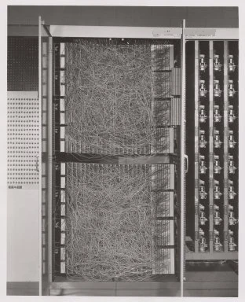
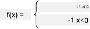

# مقدمة في الشبكات العصبية: بيرسيبترون

## [اختبار ما قبل المحاضرة](https://ff-quizzes.netlify.app/en/ai/quiz/5)

أحد المحاولات الأولى لتطوير شيء مشابه للشبكات العصبية الحديثة قام بها فرانك روزنبلات من مختبر كورنيل للطيران في عام 1957. كان ذلك عبارة عن تنفيذ مادي يسمى "Mark-1"، مصمم للتعرف على الأشكال الهندسية البدائية مثل المثلثات والمربعات والدوائر.

|      |      |
|--------------|-----------|
| | |

> الصور [من ويكيبيديا](https://en.wikipedia.org/wiki/Perceptron)

تم تمثيل الصورة المدخلة بمصفوفة خلايا ضوئية بحجم 20x20، مما يعني أن الشبكة العصبية كانت تحتوي على 400 مدخل ومخرج ثنائي واحد. كانت الشبكة البسيطة تحتوي على خلية عصبية واحدة، تُعرف أيضًا باسم **وحدة منطق العتبة**. عملت أوزان الشبكة العصبية مثل المقاومات المتغيرة التي كانت تتطلب تعديلًا يدويًا أثناء مرحلة التدريب.

> ✅ المقاومة المتغيرة هي جهاز يسمح للمستخدم بضبط مقاومة الدائرة.

> كتبت صحيفة نيويورك تايمز عن بيرسيبترون في ذلك الوقت: *جنين الكمبيوتر الإلكتروني الذي [تتوقع البحرية] أنه سيكون قادرًا على المشي، التحدث، الرؤية، الكتابة، التكاثر، وأن يكون واعيًا بوجوده.*

## نموذج بيرسيبترون

لنفترض أن لدينا N من الميزات في نموذجنا، وفي هذه الحالة سيكون المتجه المدخل بحجم N. بيرسيبترون هو نموذج **تصنيف ثنائي**، أي يمكنه التمييز بين فئتين من بيانات المدخلات. سنفترض أنه لكل متجه مدخل x سيكون مخرج بيرسيبترون إما +1 أو -1، اعتمادًا على الفئة. يتم حساب المخرج باستخدام الصيغة:

y(x) = f(w<sup>T</sup>x)

حيث f هي دالة تفعيل خطوة

<!-- img src="http://www.sciweavers.org/tex2img.php?eq=f%28x%29%20%3D%20%5Cbegin%7Bcases%7D%0A%20%20%20%20%20%20%20%20%20%2B1%20%26%20x%20%5Cgeq%200%20%5C%5C%0A%20%20%20%20%20%20%20%20%20-1%20%26%20x%20%3C%200%0A%20%20%20%20%20%20%20%5Cend%7Bcases%7D%20%5C%5C%0A&bc=White&fc=Black&im=jpg&fs=12&ff=arev&edit=0" align="center" border="0" alt="f(x) = \begin{cases} +1 & x \geq 0 \\ -1 & x < 0 \end{cases} \\" width="154" height="50" / -->


## تدريب بيرسيبترون

لتدريب بيرسيبترون، نحتاج إلى إيجاد متجه أوزان w الذي يصنف معظم القيم بشكل صحيح، أي يؤدي إلى أقل **خطأ**. يتم تعريف هذا الخطأ E بواسطة **معيار بيرسيبترون** بالطريقة التالية:

E(w) = -&sum;w<sup>T</sup>x<sub>i</sub>t<sub>i</sub>

حيث:

* يتم أخذ المجموع على نقاط بيانات التدريب i التي تؤدي إلى تصنيف خاطئ
* x<sub>i</sub> هي بيانات المدخلات، و t<sub>i</sub> إما -1 أو +1 للأمثلة السلبية والإيجابية على التوالي.

يُعتبر هذا المعيار دالة للأوزان w، ونحتاج إلى تقليلها. غالبًا ما يتم استخدام طريقة تسمى **الانحدار التدريجي**، حيث نبدأ ببعض الأوزان الأولية w<sup>(0)</sup>، ثم نقوم بتحديث الأوزان في كل خطوة وفقًا للصيغة:

w<sup>(t+1)</sup> = w<sup>(t)</sup> - &eta;&nabla;E(w)

هنا &eta; هو ما يسمى **معدل التعلم**، و &nabla;E(w) يمثل **تدرج** E. بعد حساب التدرج، نحصل على:

w<sup>(t+1)</sup> = w<sup>(t)</sup> + &sum;&eta;x<sub>i</sub>t<sub>i</sub>

يبدو الخوارزم في Python كما يلي:

```python
def train(positive_examples, negative_examples, num_iterations = 100, eta = 1):

    weights = [0,0,0] # Initialize weights (almost randomly :)
        
    for i in range(num_iterations):
        pos = random.choice(positive_examples)
        neg = random.choice(negative_examples)

        z = np.dot(pos, weights) # compute perceptron output
        if z < 0: # positive example classified as negative
            weights = weights + eta*weights.shape

        z  = np.dot(neg, weights)
        if z >= 0: # negative example classified as positive
            weights = weights - eta*weights.shape

    return weights
```


## الخاتمة

في هذه الدرس، تعلمت عن بيرسيبترون، وهو نموذج تصنيف ثنائي، وكيفية تدريبه باستخدام متجه الأوزان.

## 🚀 تحدي

إذا كنت ترغب في محاولة بناء بيرسيبترون خاص بك، جرب [هذا المختبر على Microsoft Learn](https://docs.microsoft.com/en-us/azure/machine-learning/component-reference/two-class-averaged-perceptron?WT.mc_id=academic-77998-cacaste) الذي يستخدم [مصمم Azure ML](https://docs.microsoft.com/en-us/azure/machine-learning/concept-designer?WT.mc_id=academic-77998-cacaste).

## [اختبار ما بعد المحاضرة](https://ff-quizzes.netlify.app/en/ai/quiz/6)

## المراجعة والدراسة الذاتية

لرؤية كيف يمكننا استخدام بيرسيبترون لحل مشكلة بسيطة وكذلك مشاكل الحياة الواقعية، وللمتابعة في التعلم - انتقل إلى [دفتر بيرسيبترون](Perceptron.ipynb).

إليك مقالًا مثيرًا للاهتمام عن [بيرسيبترون](https://towardsdatascience.com/what-is-a-perceptron-basics-of-neural-networks-c4cfea20c590).

## [التكليف](lab/README.md)

في هذا الدرس، قمنا بتنفيذ بيرسيبترون لمهمة تصنيف ثنائي، واستخدمناه للتصنيف بين رقمين مكتوبين بخط اليد. في هذا المختبر، يُطلب منك حل مشكلة تصنيف الأرقام بالكامل، أي تحديد الرقم الأكثر احتمالًا الذي يتوافق مع الصورة المعطاة.

* [التعليمات](lab/README.md)
* [دفتر الملاحظات](lab/PerceptronMultiClass.ipynb)

---

