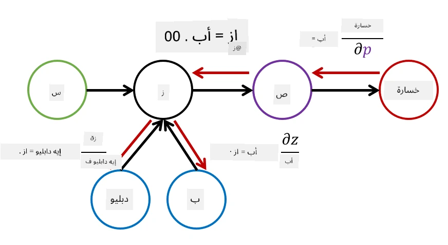

# مقدمة في الشبكات العصبية. الشبكة العصبية متعددة الطبقات

في القسم السابق، تعلمت عن أبسط نموذج للشبكات العصبية - الشبكة العصبية ذات الطبقة الواحدة، وهو نموذج تصنيف خطي ثنائي الفئات.

في هذا القسم، سنقوم بتوسيع هذا النموذج إلى إطار عمل أكثر مرونة، مما يتيح لنا:

* تنفيذ **تصنيف متعدد الفئات** بالإضافة إلى التصنيف الثنائي
* حل **مشاكل الانحدار** بالإضافة إلى التصنيف
* فصل الفئات التي لا يمكن فصلها خطيًا

سنقوم أيضًا بتطوير إطار عمل معياري خاص بنا باستخدام Python، مما يتيح لنا بناء هياكل مختلفة للشبكات العصبية.

## [اختبار ما قبل المحاضرة](https://ff-quizzes.netlify.app/en/ai/quiz/7)

## صياغة تعلم الآلة

لنبدأ بصياغة مشكلة تعلم الآلة. لنفترض أن لدينا مجموعة بيانات تدريبية **X** مع تسميات **Y**، ونحتاج إلى بناء نموذج *f* الذي يقدم توقعات دقيقة قدر الإمكان. يتم قياس جودة التوقعات باستخدام **دالة الخسارة** &lagran;. غالبًا ما تُستخدم دوال الخسارة التالية:

* بالنسبة لمشكلة الانحدار، عندما نحتاج إلى توقع رقم، يمكننا استخدام **الخطأ المطلق** &sum;i|f(x(i))-y(i)|، أو **الخطأ التربيعي** &sum;i(f(x(i))-y(i))2
* بالنسبة للتصنيف، نستخدم **خسارة 0-1** (وهي في الأساس نفس مفهوم **الدقة** للنموذج)، أو **خسارة لوجستية**.

بالنسبة للشبكة العصبية ذات الطبقة الواحدة، تم تعريف الدالة *f* كدالة خطية *f(x)=wx+b* (حيث *w* هي مصفوفة الأوزان، *x* هو متجه الميزات المدخلة، و*b* هو متجه الانحياز). بالنسبة لهياكل الشبكات العصبية المختلفة، يمكن أن تأخذ هذه الدالة شكلًا أكثر تعقيدًا.

> في حالة التصنيف، غالبًا ما يكون من المرغوب الحصول على احتمالات الفئات المقابلة كمخرجات للشبكة. لتحويل الأرقام العشوائية إلى احتمالات (على سبيل المثال لتطبيع المخرجات)، غالبًا ما نستخدم دالة **softmax** &sigma;، وتصبح الدالة *f* *f(x)=&sigma;(wx+b)*

في تعريف *f* أعلاه، تُسمى *w* و*b* **المعلمات** &theta;=⟨*w,b*⟩. بالنظر إلى مجموعة البيانات ⟨**X**,**Y**⟩، يمكننا حساب الخطأ الإجمالي على مجموعة البيانات بأكملها كدالة للمعلمات &theta;.

> ✅ **هدف تدريب الشبكة العصبية هو تقليل الخطأ عن طريق تغيير المعلمات &theta;**

## تحسين باستخدام النزول التدرجي

هناك طريقة معروفة لتحسين الدوال تُسمى **النزول التدرجي**. الفكرة هي أنه يمكننا حساب المشتقة (في الحالة متعددة الأبعاد تُسمى **التدرج**) لدالة الخسارة بالنسبة للمعلمات، وتغيير المعلمات بطريقة تقلل الخطأ. يمكن صياغة ذلك كما يلي:

* تهيئة المعلمات بقيم عشوائية w(0), b(0)
* تكرار الخطوة التالية عدة مرات:
    - w(i+1) = w(i)-&eta;&part;&lagran;/&part;w
    - b(i+1) = b(i)-&eta;&part;&lagran;/&part;b

أثناء التدريب، من المفترض أن يتم حساب خطوات التحسين بناءً على مجموعة البيانات بأكملها (تذكر أن الخسارة تُحسب كمجموع لجميع عينات التدريب). ومع ذلك، في الواقع، نأخذ أجزاء صغيرة من مجموعة البيانات تُسمى **الدفعات الصغيرة**، ونحسب التدرجات بناءً على مجموعة فرعية من البيانات. نظرًا لأن المجموعة الفرعية تُختار عشوائيًا في كل مرة، تُسمى هذه الطريقة **النزول التدرجي العشوائي** (SGD).

## الشبكات العصبية متعددة الطبقات والانتشار العكسي

الشبكة ذات الطبقة الواحدة، كما رأينا أعلاه، قادرة على تصنيف الفئات القابلة للفصل خطيًا. لبناء نموذج أكثر ثراءً، يمكننا دمج عدة طبقات في الشبكة. رياضيًا، يعني ذلك أن الدالة *f* ستأخذ شكلًا أكثر تعقيدًا، وستُحسب على عدة خطوات:
* z1=w1x+b1
* z2=w2&alpha;(z1)+b2
* f = &sigma;(z2)

هنا، &alpha; هي **دالة تنشيط غير خطية**، &sigma; هي دالة softmax، والمعلمات &theta;=<*w1,b1,w2,b2*>.

ستظل خوارزمية النزول التدرجي كما هي، ولكن سيكون حساب التدرجات أكثر صعوبة. باستخدام قاعدة التفاضل السلسلي، يمكننا حساب المشتقات كما يلي:

* &part;&lagran;/&part;w2 = (&part;&lagran;/&part;&sigma;)(&part;&sigma;/&part;z2)(&part;z2/&part;w2)
* &part;&lagran;/&part;w1 = (&part;&lagran;/&part;&sigma;)(&part;&sigma;/&part;z2)(&part;z2/&part;&alpha;)(&part;&alpha;/&part;z1)(&part;z1/&part;w1)

> ✅ تُستخدم قاعدة التفاضل السلسلي لحساب مشتقات دالة الخسارة بالنسبة للمعلمات.

لاحظ أن الجزء الأيسر من جميع هذه التعبيرات هو نفسه، وبالتالي يمكننا حساب المشتقات بشكل فعال بدءًا من دالة الخسارة والانتقال "للخلف" عبر الرسم البياني الحسابي. لذلك تُسمى طريقة تدريب الشبكة العصبية متعددة الطبقات **الانتشار العكسي** أو 'backprop'.

> TODO: مصدر الصورة

> ✅ سنغطي الانتشار العكسي بمزيد من التفصيل في مثالنا في الدفتر.

## الخاتمة

في هذه الدرس، قمنا ببناء مكتبة الشبكات العصبية الخاصة بنا، واستخدمناها في مهمة تصنيف بسيطة ثنائية الأبعاد.

## 🚀 التحدي

في الدفتر المرفق، ستقوم بتنفيذ إطار عمل خاص بك لبناء وتدريب الشبكات العصبية متعددة الطبقات. ستتمكن من رؤية كيفية عمل الشبكات العصبية الحديثة بالتفصيل.

انتقل إلى [OwnFramework](OwnFramework.ipynb) واعمل من خلاله.

## [اختبار ما بعد المحاضرة](https://ff-quizzes.netlify.app/en/ai/quiz/8)

## المراجعة والدراسة الذاتية

الانتشار العكسي هو خوارزمية شائعة تُستخدم في الذكاء الاصطناعي وتعلم الآلة، ويستحق الدراسة [بمزيد من التفصيل](https://wikipedia.org/wiki/Backpropagation)

## [التكليف](lab/README.md)

في هذا المختبر، يُطلب منك استخدام الإطار الذي أنشأته في هذا الدرس لحل مشكلة تصنيف الأرقام المكتوبة بخط اليد MNIST.

* [التعليمات](lab/README.md)
* [الدفتر](lab/MyFW_MNIST.ipynb)

---

