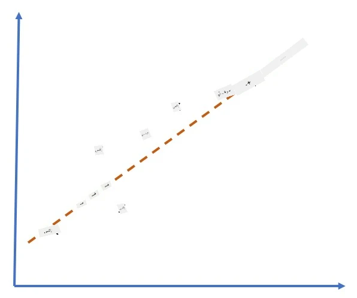
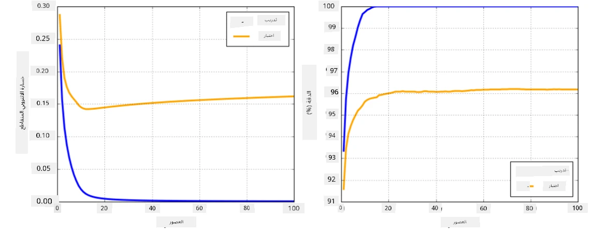

# أطر الشبكات العصبية

كما تعلمنا بالفعل، لكي نتمكن من تدريب الشبكات العصبية بكفاءة، نحتاج إلى القيام بأمرين:

* العمل على المصفوفات (tensors)، مثل الضرب، الجمع، وحساب بعض الوظائف مثل sigmoid أو softmax.
* حساب المشتقات لجميع التعبيرات، من أجل تنفيذ تحسين الانحدار التدرجي.

## [اختبار ما قبل المحاضرة](https://ff-quizzes.netlify.app/en/ai/quiz/9)

بينما يمكن لمكتبة `numpy` القيام بالجزء الأول، نحتاج إلى آلية لحساب المشتقات. في [الإطار الخاص بنا](../04-OwnFramework/OwnFramework.ipynb) الذي قمنا بتطويره في القسم السابق، كان علينا برمجة جميع وظائف المشتقات يدويًا داخل طريقة `backward`، التي تقوم بالانتشار العكسي. من الناحية المثالية، يجب أن يوفر لنا الإطار فرصة لحساب مشتقات *أي تعبير* يمكننا تعريفه.

أمر آخر مهم هو القدرة على تنفيذ العمليات على وحدة معالجة الرسومات (GPU)، أو أي وحدات معالجة متخصصة أخرى، مثل [TPU](https://en.wikipedia.org/wiki/Tensor_Processing_Unit). يتطلب تدريب الشبكات العصبية العميقة *الكثير* من العمليات الحسابية، والقدرة على توزيع هذه العمليات على وحدات معالجة الرسومات أمر بالغ الأهمية.

> ✅ مصطلح "parallelize" يعني توزيع العمليات الحسابية على أجهزة متعددة.

حاليًا، الإطاران الأكثر شهرة للشبكات العصبية هما: [TensorFlow](http://TensorFlow.org) و [PyTorch](https://pytorch.org/). كلاهما يوفر واجهة برمجية منخفضة المستوى للعمل مع المصفوفات على كل من وحدة المعالجة المركزية (CPU) ووحدة معالجة الرسومات (GPU). بالإضافة إلى الواجهة البرمجية منخفضة المستوى، هناك أيضًا واجهة برمجية عالية المستوى، تُسمى [Keras](https://keras.io/) و [PyTorch Lightning](https://pytorchlightning.ai/) على التوالي.

واجهة برمجية منخفضة المستوى | [TensorFlow](http://TensorFlow.org) | [PyTorch](https://pytorch.org/)
-----------------------------|-------------------------------------|--------------------------------
واجهة برمجية عالية المستوى | [Keras](https://keras.io/) | [PyTorch Lightning](https://pytorchlightning.ai/)

**الواجهات البرمجية منخفضة المستوى** في كلا الإطارين تسمح لك ببناء ما يُسمى **الرسوم البيانية الحسابية**. هذا الرسم البياني يحدد كيفية حساب الناتج (عادةً دالة الخسارة) مع المعطيات المدخلة، ويمكن دفعه للتنفيذ على وحدة معالجة الرسومات إذا كانت متوفرة. هناك وظائف لتفاضل هذا الرسم البياني الحسابي وحساب المشتقات، والتي يمكن استخدامها بعد ذلك لتحسين معلمات النموذج.

**الواجهات البرمجية عالية المستوى** تعتبر الشبكات العصبية بشكل كبير **تسلسلًا من الطبقات**، وتجعل بناء معظم الشبكات العصبية أسهل بكثير. عادةً ما يتطلب تدريب النموذج إعداد البيانات ثم استدعاء وظيفة `fit` للقيام بالمهمة.

تتيح لك الواجهة البرمجية عالية المستوى بناء الشبكات العصبية النموذجية بسرعة كبيرة دون القلق بشأن الكثير من التفاصيل. في الوقت نفسه، توفر الواجهة البرمجية منخفضة المستوى تحكمًا أكبر في عملية التدريب، وبالتالي تُستخدم كثيرًا في البحث العلمي، عندما تتعامل مع بنى جديدة للشبكات العصبية.

من المهم أيضًا أن تفهم أنه يمكنك استخدام كلا الواجهتين معًا، على سبيل المثال، يمكنك تطوير بنية طبقة شبكتك الخاصة باستخدام الواجهة البرمجية منخفضة المستوى، ثم استخدامها داخل شبكة أكبر تم بناؤها وتدريبها باستخدام الواجهة البرمجية عالية المستوى. أو يمكنك تعريف شبكة باستخدام الواجهة البرمجية عالية المستوى كتسلسل من الطبقات، ثم استخدام حلقة تدريب منخفضة المستوى خاصة بك لتنفيذ التحسين. كلا الواجهتين تستخدمان نفس المفاهيم الأساسية، وتم تصميمهما للعمل معًا بشكل جيد.

## التعلم

في هذه الدورة، نقدم معظم المحتوى لكل من PyTorch و TensorFlow. يمكنك اختيار الإطار المفضل لديك والمرور فقط عبر الدفاتر المقابلة. إذا لم تكن متأكدًا من الإطار الذي تختاره، اقرأ بعض المناقشات على الإنترنت حول **PyTorch مقابل TensorFlow**. يمكنك أيضًا إلقاء نظرة على كلا الإطارين للحصول على فهم أفضل.

عند الإمكان، سنستخدم الواجهات البرمجية عالية المستوى من أجل البساطة. ومع ذلك، نعتقد أنه من المهم فهم كيفية عمل الشبكات العصبية من الأساس، لذلك في البداية نبدأ بالعمل مع الواجهة البرمجية منخفضة المستوى والمصفوفات. ومع ذلك، إذا كنت ترغب في البدء بسرعة ولا تريد قضاء الكثير من الوقت في تعلم هذه التفاصيل، يمكنك تخطيها والانتقال مباشرة إلى دفاتر الواجهة البرمجية عالية المستوى.

## ✍️ تمارين: الأطر

واصل التعلم في الدفاتر التالية:

واجهة برمجية منخفضة المستوى | [دفتر TensorFlow+Keras](IntroKerasTF.ipynb) | [PyTorch](IntroPyTorch.ipynb)
-----------------------------|-------------------------------------|--------------------------------
واجهة برمجية عالية المستوى | [Keras](IntroKeras.ipynb) | *PyTorch Lightning*

بعد إتقان الأطر، دعونا نراجع مفهوم الإفراط في التكيف.

# الإفراط في التكيف

الإفراط في التكيف هو مفهوم مهم للغاية في تعلم الآلة، ومن المهم فهمه بشكل صحيح!

لننظر إلى المشكلة التالية لتقريب 5 نقاط (ممثلة بـ `x` على الرسوم البيانية أدناه):

 | 
-------------------------|--------------------------
**نموذج خطي، 2 معلمات** | **نموذج غير خطي، 7 معلمات**
خطأ التدريب = 5.3 | خطأ التدريب = 0
خطأ التحقق = 5.1 | خطأ التحقق = 20

* على اليسار، نرى تقريبًا جيدًا بخط مستقيم. لأن عدد المعلمات مناسب، النموذج يفهم توزيع النقاط بشكل صحيح.
* على اليمين، النموذج قوي جدًا. لأن لدينا فقط 5 نقاط والنموذج يحتوي على 7 معلمات، يمكنه التكيف بطريقة تمر عبر جميع النقاط، مما يجعل خطأ التدريب 0. ومع ذلك، هذا يمنع النموذج من فهم النمط الصحيح وراء البيانات، وبالتالي يكون خطأ التحقق عاليًا جدًا.

من المهم جدًا تحقيق توازن صحيح بين غنى النموذج (عدد المعلمات) وعدد عينات التدريب.

## لماذا يحدث الإفراط في التكيف؟

  * عدم وجود بيانات تدريب كافية
  * نموذج قوي جدًا
  * الكثير من الضوضاء في بيانات الإدخال

## كيفية اكتشاف الإفراط في التكيف

كما ترى من الرسم البياني أعلاه، يمكن اكتشاف الإفراط في التكيف من خلال خطأ تدريب منخفض جدًا وخطأ تحقق عالي. عادةً أثناء التدريب، سنرى كلا من أخطاء التدريب والتحقق تبدأ في الانخفاض، ثم في مرحلة ما قد يتوقف خطأ التحقق عن الانخفاض ويبدأ في الارتفاع. سيكون هذا علامة على الإفراط في التكيف، ومؤشرًا على أنه يجب علينا على الأرجح التوقف عن التدريب في هذه المرحلة (أو على الأقل أخذ لقطة للنموذج).

## كيفية منع الإفراط في التكيف

إذا لاحظت أن الإفراط في التكيف يحدث، يمكنك القيام بأحد الأمور التالية:

 * زيادة كمية بيانات التدريب
 * تقليل تعقيد النموذج
 * استخدام بعض [تقنيات التنظيم](../../4-ComputerVision/08-TransferLearning/TrainingTricks.md)، مثل [Dropout](../../4-ComputerVision/08-TransferLearning/TrainingTricks.md#Dropout)، والتي سنناقشها لاحقًا.

## الإفراط في التكيف وتوازن التحيز-التباين

الإفراط في التكيف هو في الواقع حالة من مشكلة أكثر عمومية في الإحصاء تُسمى [توازن التحيز-التباين](https://en.wikipedia.org/wiki/Bias%E2%80%93variance_tradeoff). إذا نظرنا إلى المصادر المحتملة للخطأ في نموذجنا، يمكننا رؤية نوعين من الأخطاء:

* **أخطاء التحيز**، التي تسببها عدم قدرة الخوارزمية على التقاط العلاقة بين بيانات التدريب بشكل صحيح. يمكن أن ينتج عن حقيقة أن النموذج ليس قويًا بما يكفي (**التكيف الناقص**).
* **أخطاء التباين**، التي تسببها النموذج في تقريب الضوضاء في بيانات الإدخال بدلاً من العلاقة ذات المعنى (**الإفراط في التكيف**).

أثناء التدريب، يقل خطأ التحيز (مع تعلم النموذج لتقريب البيانات)، ويزداد خطأ التباين. من المهم التوقف عن التدريب - إما يدويًا (عندما نكتشف الإفراط في التكيف) أو تلقائيًا (عن طريق إدخال التنظيم) - لمنع الإفراط في التكيف.

## الخلاصة

في هذا الدرس، تعلمت عن الفروقات بين الواجهات البرمجية المختلفة للإطارين الأكثر شهرة في الذكاء الاصطناعي، TensorFlow و PyTorch. بالإضافة إلى ذلك، تعلمت عن موضوع مهم جدًا، وهو الإفراط في التكيف.

## 🚀 التحدي

في الدفاتر المرفقة، ستجد "مهام" في الأسفل؛ اعمل من خلال الدفاتر وأكمل المهام.

## [اختبار ما بعد المحاضرة](https://ff-quizzes.netlify.app/en/ai/quiz/10)

## المراجعة والدراسة الذاتية

قم ببعض البحث حول المواضيع التالية:

- TensorFlow
- PyTorch
- الإفراط في التكيف

اسأل نفسك الأسئلة التالية:

- ما الفرق بين TensorFlow و PyTorch؟
- ما الفرق بين الإفراط في التكيف والتكيف الناقص؟

## [التكليف](lab/README.md)

في هذا المختبر، يُطلب منك حل مشكلتين تصنيفيتين باستخدام شبكات متصلة بالكامل ذات طبقة واحدة ومتعددة الطبقات باستخدام PyTorch أو TensorFlow.

* [التعليمات](lab/README.md)
* [دفتر الملاحظات](lab/LabFrameworks.ipynb)

---

