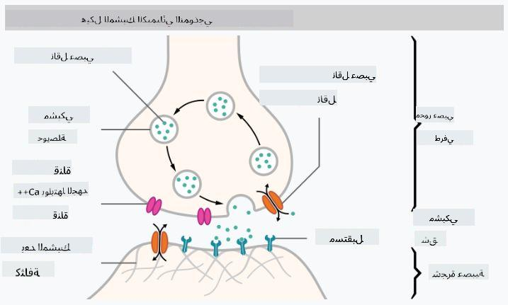

<!--
CO_OP_TRANSLATOR_METADATA:
{
  "original_hash": "1c6b8c7c1778a35fc1139b7f2aecb7b3",
  "translation_date": "2025-08-26T10:21:33+00:00",
  "source_file": "lessons/3-NeuralNetworks/README.md",
  "language_code": "ar"
}
-->
# مقدمة في الشبكات العصبية

كما ناقشنا في المقدمة، إحدى الطرق لتحقيق الذكاء هي تدريب **نموذج حاسوبي** أو **دماغ اصطناعي**. منذ منتصف القرن العشرين، حاول الباحثون استخدام نماذج رياضية مختلفة، حتى أثبت هذا الاتجاه في السنوات الأخيرة نجاحًا كبيرًا. تُعرف هذه النماذج الرياضية للدماغ باسم **الشبكات العصبية**.

> أحيانًا تُسمى الشبكات العصبية *الشبكات العصبية الاصطناعية* (Artificial Neural Networks)، أو ANNs، للإشارة إلى أننا نتحدث عن نماذج، وليس شبكات عصبية حقيقية.

## التعلم الآلي

الشبكات العصبية هي جزء من مجال أوسع يُعرف بـ **التعلم الآلي**، والذي يهدف إلى استخدام البيانات لتدريب نماذج حاسوبية قادرة على حل المشكلات. يشكل التعلم الآلي جزءًا كبيرًا من الذكاء الاصطناعي، ومع ذلك، لن نغطي التعلم الآلي التقليدي في هذا المنهج.

> قم بزيارة منهجنا المنفصل **[التعلم الآلي للمبتدئين](http://github.com/microsoft/ml-for-beginners)** لتتعرف أكثر على التعلم الآلي التقليدي.

في التعلم الآلي، نفترض أن لدينا مجموعة بيانات من الأمثلة **X**، وقيم مخرجات مقابلة **Y**. غالبًا ما تكون الأمثلة عبارة عن متجهات ذات أبعاد N تتكون من **خصائص**، وتُعرف المخرجات بـ **التصنيفات**.

سنناقش أكثر مشكلتين شيوعًا في التعلم الآلي:

* **التصنيف**، حيث نحتاج إلى تصنيف كائن مدخل إلى فئتين أو أكثر.
* **الانحدار**، حيث نحتاج إلى التنبؤ بقيمة رقمية لكل عينة من المدخلات.

> عند تمثيل المدخلات والمخرجات كموترات (tensors)، تكون مجموعة بيانات المدخلات عبارة عن مصفوفة بحجم M×N، حيث M هو عدد العينات وN هو عدد الخصائص. أما تصنيفات المخرجات Y فهي متجه بحجم M.

في هذا المنهج، سنركز فقط على نماذج الشبكات العصبية.

## نموذج الخلية العصبية

من علم الأحياء، نعلم أن دماغنا يتكون من خلايا عصبية، لكل منها عدة "مدخلات" (محاور عصبية)، ومخرج واحد (شعيرات شجرية). يمكن للمحاور والشعيرات الشجرية نقل إشارات كهربائية، ويمكن أن تُظهر الروابط بين المحاور والشعيرات الشجرية درجات مختلفة من التوصيلية (تُتحكم بها النواقل العصبية).

 | 
----|----
خلية عصبية حقيقية *([الصورة](https://en.wikipedia.org/wiki/Synapse#/media/File:SynapseSchematic_lines.svg) من ويكيبيديا)* | خلية عصبية اصطناعية *(الصورة من المؤلف)*

لذلك، فإن أبسط نموذج رياضي للخلية العصبية يحتوي على عدة مدخلات X1, ..., XN ومخرج Y، وسلسلة من الأوزان W1, ..., WN. يتم حساب المخرج كالتالي:

حيث f هي **دالة التنشيط** غير الخطية.

> تم وصف النماذج الأولى للخلية العصبية في الورقة الكلاسيكية [حساب منطقي للأفكار الكامنة في النشاط العصبي](https://www.cs.cmu.edu/~./epxing/Class/10715/reading/McCulloch.and.Pitts.pdf) بواسطة وارين مكولك ووالتر بيتس عام 1943. واقترح دونالد هيب في كتابه "[تنظيم السلوك: نظرية نفسية عصبية](https://books.google.com/books?id=VNetYrB8EBoC)" طريقة لتدريب هذه الشبكات.

## في هذا القسم

في هذا القسم سنتعلم عن:
* [Perceptron](03-Perceptron/README.md)، أحد أقدم نماذج الشبكات العصبية لتصنيف الفئتين.
* [الشبكات متعددة الطبقات](04-OwnFramework/README.md) مع دفتر ملاحظات مرفق [كيفية بناء إطار عمل خاص بنا](../../../../lessons/3-NeuralNetworks/04-OwnFramework/OwnFramework.ipynb).
* [أطر عمل الشبكات العصبية](05-Frameworks/README.md)، مع دفاتر الملاحظات التالية: [PyTorch](../../../../lessons/3-NeuralNetworks/05-Frameworks/IntroPyTorch.ipynb) و [Keras/Tensorflow](../../../../lessons/3-NeuralNetworks/05-Frameworks/IntroKerasTF.ipynb).
* [الإفراط في التخصيص](../../../../lessons/3-NeuralNetworks/05-Frameworks).

**إخلاء المسؤولية**:  
تمت ترجمة هذا المستند باستخدام خدمة الترجمة الآلية [Co-op Translator](https://github.com/Azure/co-op-translator). على الرغم من أننا نسعى لتحقيق الدقة، يرجى العلم أن الترجمات الآلية قد تحتوي على أخطاء أو عدم دقة. يجب اعتبار المستند الأصلي بلغته الأصلية هو المصدر الموثوق. للحصول على معلومات حساسة أو هامة، يُوصى بالاستعانة بترجمة بشرية احترافية. نحن غير مسؤولين عن أي سوء فهم أو تفسيرات خاطئة تنشأ عن استخدام هذه الترجمة.