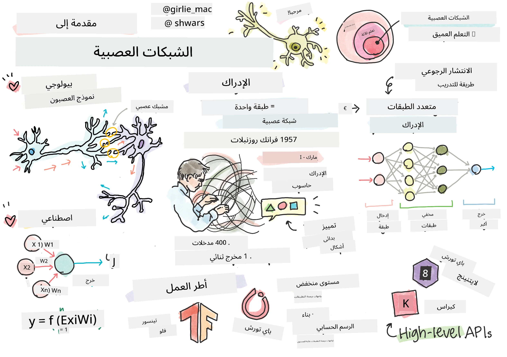
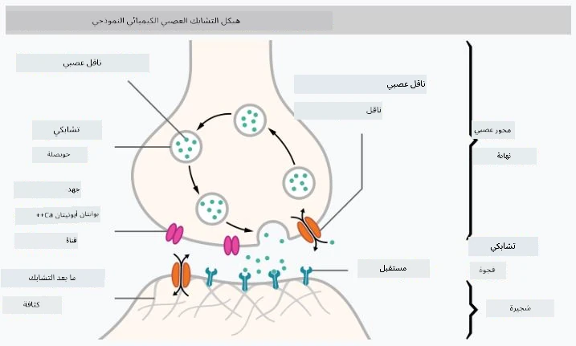
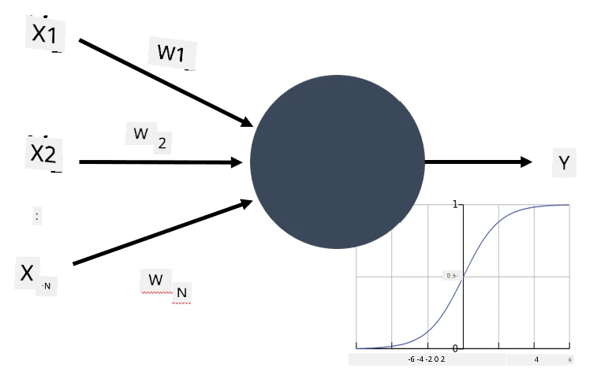

# مقدمة في الشبكات العصبية

كما ناقشنا في المقدمة، إحدى الطرق لتحقيق الذكاء هي تدريب **نموذج حاسوبي** أو **دماغ اصطناعي**. منذ منتصف القرن العشرين، حاول الباحثون استخدام نماذج رياضية مختلفة، حتى أثبت هذا الاتجاه نجاحًا كبيرًا في السنوات الأخيرة. تُعرف هذه النماذج الرياضية للدماغ باسم **الشبكات العصبية**.

> أحيانًا تُطلق على الشبكات العصبية اسم *الشبكات العصبية الاصطناعية* (Artificial Neural Networks - ANNs)، للإشارة إلى أننا نتحدث عن نماذج وليس عن شبكات حقيقية من الخلايا العصبية.

## التعلم الآلي

الشبكات العصبية هي جزء من مجال أكبر يُسمى **التعلم الآلي**، والذي يهدف إلى استخدام البيانات لتدريب نماذج حاسوبية قادرة على حل المشكلات. يشكل التعلم الآلي جزءًا كبيرًا من الذكاء الاصطناعي، ومع ذلك، لن نتناول التعلم الآلي التقليدي في هذه المناهج.

> قم بزيارة منهجنا المنفصل **[التعلم الآلي للمبتدئين](http://github.com/microsoft/ml-for-beginners)** لتتعرف على المزيد حول التعلم الآلي التقليدي.

في التعلم الآلي، نفترض أن لدينا مجموعة بيانات من الأمثلة **X**، وقيم مخرجات مقابلة **Y**. غالبًا ما تكون الأمثلة عبارة عن متجهات متعددة الأبعاد تتكون من **ميزات**، وتُسمى المخرجات **التسميات**.

سنناقش أكثر مشكلتين شيوعًا في التعلم الآلي:

* **التصنيف**، حيث نحتاج إلى تصنيف كائن الإدخال إلى فئتين أو أكثر.
* **الانحدار**، حيث نحتاج إلى التنبؤ بقيمة رقمية لكل عينة إدخال.

> عند تمثيل المدخلات والمخرجات كموترات، تكون مجموعة بيانات الإدخال عبارة عن مصفوفة بحجم M&times;N، حيث M هو عدد العينات وN هو عدد الميزات. أما تسميات المخرجات Y فهي متجه بحجم M.

في هذا المنهج، سنركز فقط على نماذج الشبكات العصبية.

## نموذج الخلية العصبية

من علم الأحياء، نعلم أن دماغنا يتكون من خلايا عصبية (الخلايا العصبية)، لكل منها عدة "مدخلات" (التشعبات) ومخرج واحد (المحور العصبي). يمكن لكل من التشعبات والمحاور العصبية نقل إشارات كهربائية، والروابط بينها — المعروفة باسم المشابك العصبية — يمكن أن تظهر درجات متفاوتة من التوصيل، والتي يتم تنظيمها بواسطة الناقلات العصبية.

 | 
----|----
خلية عصبية حقيقية *([الصورة](https://en.wikipedia.org/wiki/Synapse#/media/File:SynapseSchematic_lines.svg) من ويكيبيديا)* | خلية عصبية اصطناعية *(الصورة بواسطة المؤلف)*

لذلك، فإن أبسط نموذج رياضي للخلية العصبية يحتوي على عدة مدخلات X1, ..., XN ومخرج Y، وسلسلة من الأوزان W1, ..., WN. يتم حساب المخرج كالتالي:

حيث f هي **دالة التنشيط** غير الخطية.

> تم وصف النماذج المبكرة للخلية العصبية في الورقة الكلاسيكية [حساب منطقي للأفكار الكامنة في النشاط العصبي](https://www.cs.cmu.edu/~./epxing/Class/10715/reading/McCulloch.and.Pitts.pdf) بواسطة وارين مكولوتش ووالتر بيتس في عام 1943. واقترح دونالد هيب في كتابه "[تنظيم السلوك: نظرية نفسية عصبية](https://books.google.com/books?id=VNetYrB8EBoC)" الطريقة التي يمكن بها تدريب تلك الشبكات.

## في هذا القسم

في هذا القسم سنتعلم عن:
* [Perceptron](03-Perceptron/README.md)، أحد أقدم نماذج الشبكات العصبية لتصنيف الفئتين
* [الشبكات متعددة الطبقات](04-OwnFramework/README.md) مع دفتر ملاحظات مرفق [كيفية بناء إطار عمل خاص بنا](04-OwnFramework/OwnFramework.ipynb)
* [إطارات عمل الشبكات العصبية](05-Frameworks/README.md)، مع دفاتر الملاحظات التالية: [PyTorch](05-Frameworks/IntroPyTorch.ipynb) و [Keras/Tensorflow](05-Frameworks/IntroKerasTF.ipynb)
* [الإفراط في التكيف](../../../../lessons/3-NeuralNetworks/05-Frameworks)

---

**إخلاء المسؤولية**:  
تم ترجمة هذا المستند باستخدام خدمة الترجمة بالذكاء الاصطناعي [Co-op Translator](https://github.com/Azure/co-op-translator). بينما نسعى لتحقيق الدقة، يرجى العلم أن الترجمات الآلية قد تحتوي على أخطاء أو معلومات غير دقيقة. يجب اعتبار المستند الأصلي بلغته الأصلية المصدر الموثوق. للحصول على معلومات حاسمة، يُوصى بالاستعانة بترجمة بشرية احترافية. نحن غير مسؤولين عن أي سوء فهم أو تفسيرات خاطئة ناتجة عن استخدام هذه الترجمة.