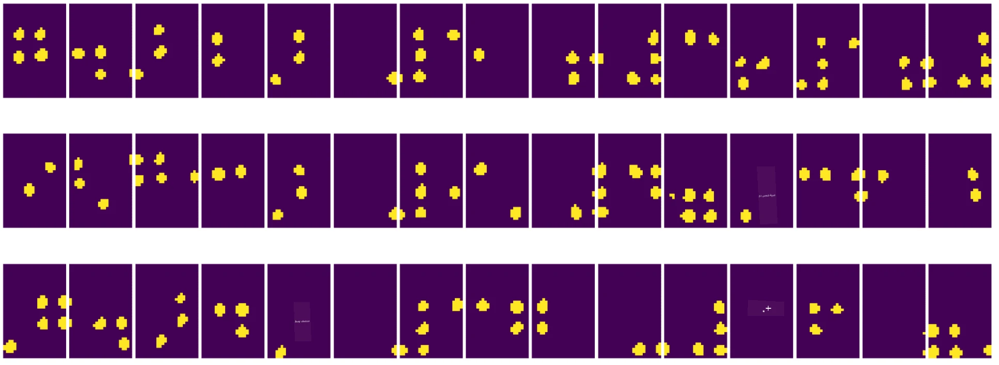
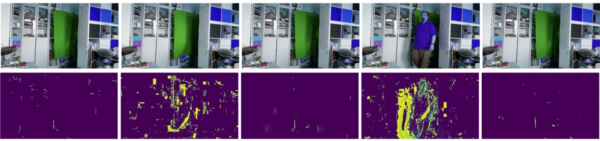

# مقدمة إلى رؤية الكمبيوتر

[رؤية الكمبيوتر](https://wikipedia.org/wiki/Computer_vision) هي مجال يهدف إلى تمكين أجهزة الكمبيوتر من فهم الصور الرقمية على مستوى عالٍ. هذا تعريف واسع جدًا، لأن *الفهم* يمكن أن يعني أشياء مختلفة، مثل العثور على كائن في صورة (**اكتشاف الكائنات**)، فهم ما يحدث (**اكتشاف الأحداث**)، وصف الصورة بالنص، أو إعادة بناء مشهد ثلاثي الأبعاد. هناك أيضًا مهام خاصة تتعلق بصور البشر: تقدير العمر والمشاعر، اكتشاف الوجه وتحديد الهوية، وتقدير الوضع ثلاثي الأبعاد، على سبيل المثال.

## [اختبار ما قبل المحاضرة](https://ff-quizzes.netlify.app/en/ai/quiz/11)

واحدة من أبسط مهام رؤية الكمبيوتر هي **تصنيف الصور**.

غالبًا ما تُعتبر رؤية الكمبيوتر فرعًا من الذكاء الاصطناعي. في الوقت الحالي، يتم حل معظم مهام رؤية الكمبيوتر باستخدام الشبكات العصبية. سنتعلم المزيد عن النوع الخاص من الشبكات العصبية المستخدمة في رؤية الكمبيوتر، [الشبكات العصبية الالتفافية](../07-ConvNets/README.md)، خلال هذا القسم.

ومع ذلك، قبل تمرير الصورة إلى الشبكة العصبية، في العديد من الحالات يكون من المنطقي استخدام بعض التقنيات الخوارزمية لتحسين الصورة.

هناك العديد من مكتبات Python المتاحة لمعالجة الصور:

* **[imageio](https://imageio.readthedocs.io/en/stable/)** يمكن استخدامها لقراءة/كتابة تنسيقات الصور المختلفة. كما تدعم ffmpeg، وهي أداة مفيدة لتحويل إطارات الفيديو إلى صور.
* **[Pillow](https://pillow.readthedocs.io/en/stable/index.html)** (المعروفة أيضًا باسم PIL) أكثر قوة، وتدعم أيضًا بعض التلاعب بالصور مثل التشويه، وضبط اللوحة، والمزيد.
* **[OpenCV](https://opencv.org/)** هي مكتبة قوية لمعالجة الصور مكتوبة بلغة C++، وأصبحت المعيار الفعلي لمعالجة الصور. لديها واجهة Python مريحة.
* **[dlib](http://dlib.net/)** هي مكتبة C++ تنفذ العديد من خوارزميات التعلم الآلي، بما في ذلك بعض خوارزميات رؤية الكمبيوتر. لديها أيضًا واجهة Python، ويمكن استخدامها لمهام صعبة مثل اكتشاف الوجه ومعالم الوجه.

## OpenCV

[OpenCV](https://opencv.org/) تُعتبر المعيار الفعلي لمعالجة الصور. تحتوي على العديد من الخوارزميات المفيدة، المطبقة بلغة C++. يمكنك استخدام OpenCV من خلال Python أيضًا.

مكان جيد لتعلم OpenCV هو [دورة تعلم OpenCV](https://learnopencv.com/getting-started-with-opencv/). في منهجنا، هدفنا ليس تعلم OpenCV، بل عرض بعض الأمثلة على كيفية استخدامها.

### تحميل الصور

يمكن تمثيل الصور في Python بسهولة باستخدام مصفوفات NumPy. على سبيل المثال، الصور الرمادية بحجم 320x200 بكسل يتم تخزينها في مصفوفة بحجم 200x320، والصور الملونة بنفس الأبعاد سيكون لها شكل 200x320x3 (لثلاث قنوات لونية). لتحميل صورة، يمكنك استخدام الكود التالي:

```python
import cv2
import matplotlib.pyplot as plt

im = cv2.imread('image.jpeg')
plt.imshow(im)
```

تقليديًا، تستخدم OpenCV ترميز BGR (أزرق-أخضر-أحمر) للصور الملونة، بينما تستخدم بقية أدوات Python الترميز التقليدي RGB (أحمر-أخضر-أزرق). لجعل الصورة تظهر بشكل صحيح، تحتاج إلى تحويلها إلى مساحة ألوان RGB، إما عن طريق تبديل الأبعاد في مصفوفة NumPy، أو عن طريق استدعاء وظيفة OpenCV:

```python
im = cv2.cvtColor(im,cv2.COLOR_BGR2RGB)
```

يمكن استخدام نفس وظيفة `cvtColor` لإجراء تحويلات أخرى لمساحة الألوان مثل تحويل الصورة إلى الرمادي أو إلى مساحة ألوان HSV (اللون-التشبع-القيمة).

يمكنك أيضًا استخدام OpenCV لتحميل إطارات الفيديو إطارًا بإطار - مثال على ذلك موجود في التمرين [دفتر OpenCV](OpenCV.ipynb).

### معالجة الصور

قبل تمرير الصورة إلى الشبكة العصبية، قد ترغب في تطبيق عدة خطوات معالجة مسبقة. يمكن لـ OpenCV القيام بالعديد من الأشياء، بما في ذلك:

* **تغيير حجم الصورة** باستخدام `im = cv2.resize(im, (320,200),interpolation=cv2.INTER_LANCZOS)`
* **تمويه الصورة** باستخدام `im = cv2.medianBlur(im,3)` أو `im = cv2.GaussianBlur(im, (3,3), 0)`
* تغيير **سطوع وتباين الصورة** يمكن القيام به من خلال التلاعب بمصفوفات NumPy، كما هو موضح [في هذه الملاحظة على Stackoverflow](https://stackoverflow.com/questions/39308030/how-do-i-increase-the-contrast-of-an-image-in-python-opencv).
* استخدام [التقسيم](https://docs.opencv.org/4.x/d7/d4d/tutorial_py_thresholding.html) عن طريق استدعاء وظائف `cv2.threshold`/`cv2.adaptiveThreshold`، وهو غالبًا ما يكون مفضلًا على تعديل السطوع أو التباين.
* تطبيق [تحويلات مختلفة](https://docs.opencv.org/4.5.5/da/d6e/tutorial_py_geometric_transformations.html) على الصورة:
    - **[التحويلات الأفينية](https://docs.opencv.org/4.5.5/d4/d61/tutorial_warp_affine.html)** يمكن أن تكون مفيدة إذا كنت بحاجة إلى دمج الدوران، تغيير الحجم، والتشويه للصورة وتعرف موقع المصدر والوجهة لثلاث نقاط في الصورة. التحويلات الأفينية تحافظ على الخطوط المتوازية.
    - **[التحويلات المنظورية](https://medium.com/analytics-vidhya/opencv-perspective-transformation-9edffefb2143)** يمكن أن تكون مفيدة عندما تعرف مواقع المصدر والوجهة لأربع نقاط في الصورة. على سبيل المثال، إذا التقطت صورة لوثيقة مستطيلة عبر كاميرا الهاتف الذكي من زاوية معينة، وترغب في إنشاء صورة مستطيلة للوثيقة نفسها.
* فهم الحركة داخل الصورة باستخدام **[التدفق البصري](https://docs.opencv.org/4.5.5/d4/dee/tutorial_optical_flow.html)**.

## أمثلة على استخدام رؤية الكمبيوتر

في [دفتر OpenCV](OpenCV.ipynb)، نقدم بعض الأمثلة على كيفية استخدام رؤية الكمبيوتر لأداء مهام محددة:

* **معالجة صورة لكتاب برايل**. نركز على كيفية استخدام التقسيم، اكتشاف الميزات، التحويل المنظوري، وتلاعبات NumPy لفصل رموز برايل الفردية لتصنيفها لاحقًا بواسطة شبكة عصبية.

 |  | 
----|-----|-----

> صورة من [OpenCV.ipynb](OpenCV.ipynb)

* **اكتشاف الحركة في الفيديو باستخدام الفرق بين الإطارات**. إذا كانت الكاميرا ثابتة، فإن الإطارات من تغذية الكاميرا يجب أن تكون متشابهة جدًا مع بعضها البعض. نظرًا لأن الإطارات تمثل كمصفوفات، فقط عن طريق طرح تلك المصفوفات لإطارين متتاليين سنحصل على الفرق بين البكسلات، والذي يجب أن يكون منخفضًا للإطارات الثابتة، ويصبح أعلى بمجرد وجود حركة كبيرة في الصورة.



> صورة من [OpenCV.ipynb](OpenCV.ipynb)

* **اكتشاف الحركة باستخدام التدفق البصري**. [التدفق البصري](https://docs.opencv.org/3.4/d4/dee/tutorial_optical_flow.html) يسمح لنا بفهم كيفية تحرك البكسلات الفردية على إطارات الفيديو. هناك نوعان من التدفق البصري:

   - **التدفق البصري الكثيف** يحسب مجال المتجه الذي يظهر لكل بكسل إلى أين يتحرك.
   - **التدفق البصري المتناثر** يعتمد على أخذ بعض الميزات المميزة في الصورة (مثل الحواف)، وبناء مسارها من إطار إلى إطار.


> صورة من [OpenCV.ipynb](OpenCV.ipynb)

## ✍️ دفاتر أمثلة: OpenCV [جرب OpenCV عمليًا](OpenCV.ipynb)

لنقم ببعض التجارب مع OpenCV من خلال استكشاف [دفتر OpenCV](OpenCV.ipynb)

## الخاتمة

في بعض الأحيان، يمكن حل مهام معقدة نسبيًا مثل اكتشاف الحركة أو اكتشاف أطراف الأصابع فقط باستخدام رؤية الكمبيوتر. لذلك، من المفيد جدًا معرفة التقنيات الأساسية لرؤية الكمبيوتر، وما يمكن أن تفعله المكتبات مثل OpenCV.

## 🚀 التحدي

شاهد [هذا الفيديو](https://docs.microsoft.com/shows/ai-show/ai-show--2021-opencv-ai-competition--grand-prize-winners--cortic-tigers--episode-32?WT.mc_id=academic-77998-cacaste) من عرض الذكاء الاصطناعي لتتعرف على مشروع Cortic Tigers وكيف قاموا ببناء حل قائم على الكتل لتعميم مهام رؤية الكمبيوتر عبر روبوت. قم ببعض البحث عن مشاريع أخرى مشابهة تساعد في إدخال المتعلمين الجدد إلى هذا المجال.

## [اختبار ما بعد المحاضرة](https://ff-quizzes.netlify.app/en/ai/quiz/12)

## المراجعة والدراسة الذاتية

اقرأ المزيد عن التدفق البصري [في هذا الدليل الرائع](https://learnopencv.com/optical-flow-in-opencv/).

## [التكليف](lab/README.md)

في هذا المختبر، ستقوم بتسجيل فيديو يحتوي على إيماءات بسيطة، وهدفك هو استخراج الحركات لأعلى/أسفل/يسار/يمين باستخدام التدفق البصري.


---

