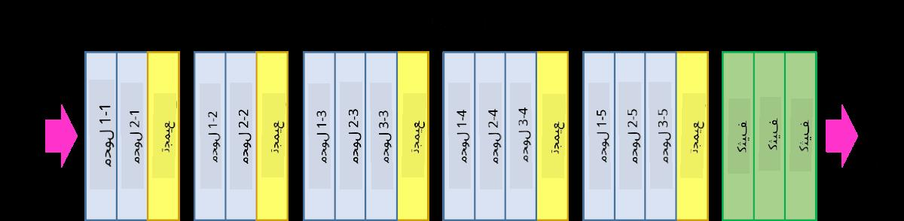

<!--
CO_OP_TRANSLATOR_METADATA:
{
  "original_hash": "2f7b97b375358cb51a1e098df306bf73",
  "translation_date": "2025-08-26T09:30:17+00:00",
  "source_file": "lessons/4-ComputerVision/07-ConvNets/CNN_Architectures.md",
  "language_code": "ar"
}
-->
# أشهر معماريات الشبكات العصبية التلافيفية (CNN)

### VGG-16

VGG-16 هي شبكة حققت دقة بنسبة 92.7% في تصنيف ImageNet ضمن أفضل 5 في عام 2014. تحتوي على الهيكل الطبقي التالي:

كما ترى، تتبع VGG هيكل الهرم التقليدي، وهو تسلسل من طبقات الالتفاف والتجميع.

> الصورة من [Researchgate](https://www.researchgate.net/figure/Vgg16-model-structure-To-get-the-VGG-NIN-model-we-replace-the-2-nd-4-th-6-th-7-th_fig2_335194493)

### ResNet

ResNet هي عائلة من النماذج التي اقترحتها Microsoft Research في عام 2015. الفكرة الرئيسية لـ ResNet هي استخدام **الكتل المتبقية**:

> الصورة من [هذه الورقة](https://arxiv.org/pdf/1512.03385.pdf)

السبب وراء استخدام المسار الهوية هو جعل الطبقة تتنبأ **بالفرق** بين نتيجة الطبقة السابقة ومخرجات الكتلة المتبقية - ومن هنا جاء اسم *المتبقية*. هذه الكتل أسهل بكثير في التدريب، ويمكن بناء شبكات تحتوي على مئات من هذه الكتل (أكثر الأنواع شيوعًا هي ResNet-52، ResNet-101 و ResNet-152).

يمكنك أيضًا التفكير في هذه الشبكة على أنها قادرة على ضبط تعقيدها وفقًا للبيانات. في البداية، عندما تبدأ تدريب الشبكة، تكون قيم الأوزان صغيرة، ومعظم الإشارة تمر عبر طبقات الهوية. مع تقدم التدريب وزيادة الأوزان، تزداد أهمية معلمات الشبكة، وتتكيف الشبكة لتلبية القوة التعبيرية المطلوبة لتصنيف الصور التدريبية بشكل صحيح.

### Google Inception

معمارية Google Inception تأخذ هذه الفكرة خطوة أبعد، وتبني كل طبقة في الشبكة كمزيج من عدة مسارات مختلفة:

> الصورة من [Researchgate](https://www.researchgate.net/figure/Inception-module-with-dimension-reductions-left-and-schema-for-Inception-ResNet-v1_fig2_355547454)

هنا، يجب أن نؤكد على دور الالتفاف 1x1، لأنه في البداية قد لا يبدو منطقيًا. لماذا نحتاج إلى تمرير الصورة عبر مرشح 1x1؟ ومع ذلك، يجب أن تتذكر أن مرشحات الالتفاف تعمل أيضًا مع عدة قنوات عمق (في الأصل - ألوان RGB، وفي الطبقات اللاحقة - قنوات لمرشحات مختلفة)، ويتم استخدام الالتفاف 1x1 لدمج تلك القنوات المدخلة معًا باستخدام أوزان قابلة للتدريب. يمكن أيضًا اعتباره كعملية تقليل (تجميع) عبر بُعد القناة.

إليك [مقالة جيدة](https://medium.com/analytics-vidhya/talented-mr-1x1-comprehensive-look-at-1x1-convolution-in-deep-learning-f6b355825578) حول هذا الموضوع، و[الورقة الأصلية](https://arxiv.org/pdf/1312.4400.pdf).

### MobileNet

MobileNet هي عائلة من النماذج ذات الحجم الصغير، المناسبة للأجهزة المحمولة. استخدمها إذا كنت تعاني من نقص في الموارد، ويمكنك التضحية بقليل من الدقة. الفكرة الرئيسية وراءها هي ما يسمى **الالتفاف القابل للفصل حسب العمق**، والذي يسمح بتمثيل مرشحات الالتفاف من خلال تركيب الالتفاف المكاني والالتفاف 1x1 عبر قنوات العمق. هذا يقلل بشكل كبير من عدد المعلمات، مما يجعل الشبكة أصغر حجمًا، وأسهل في التدريب مع بيانات أقل.

إليك [مقالة جيدة عن MobileNet](https://medium.com/analytics-vidhya/image-classification-with-mobilenet-cc6fbb2cd470).

## الخاتمة

في هذه الوحدة، تعلمت المفهوم الرئيسي وراء الشبكات العصبية للرؤية الحاسوبية - الشبكات التلافيفية. المعماريات الواقعية التي تدعم تصنيف الصور، واكتشاف الكائنات، وحتى شبكات توليد الصور كلها تعتمد على CNNs، فقط مع المزيد من الطبقات وبعض الحيل الإضافية في التدريب.

## 🚀 التحدي

في الدفاتر المرفقة، توجد ملاحظات في الأسفل حول كيفية تحقيق دقة أعلى. قم ببعض التجارب لترى ما إذا كان بإمكانك تحقيق دقة أعلى.

## [اختبار ما بعد المحاضرة](https://ff-quizzes.netlify.app/en/ai/quiz/14)

## المراجعة والدراسة الذاتية

بينما تُستخدم CNNs غالبًا لمهام الرؤية الحاسوبية، فهي عمومًا جيدة لاستخراج الأنماط ذات الحجم الثابت. على سبيل المثال، إذا كنا نتعامل مع الأصوات، فقد نرغب أيضًا في استخدام CNNs للبحث عن بعض الأنماط المحددة في الإشارة الصوتية - وفي هذه الحالة ستكون المرشحات أحادية البعد (وتسمى هذه الشبكة 1D-CNN). أيضًا، يتم أحيانًا استخدام 3D-CNN لاستخراج الميزات في الفضاء متعدد الأبعاد، مثل أحداث معينة تحدث في الفيديو - يمكن لـ CNN التقاط أنماط معينة لتغير الميزات بمرور الوقت. قم ببعض المراجعة والدراسة الذاتية حول المهام الأخرى التي يمكن القيام بها باستخدام CNNs.

## [التكليف](lab/README.md)

في هذا المختبر، تم تكليفك بتصنيف سلالات مختلفة من القطط والكلاب. هذه الصور أكثر تعقيدًا من مجموعة بيانات MNIST وأعلى في الأبعاد، وهناك أكثر من 10 فئات.

**إخلاء المسؤولية**:  
تمت ترجمة هذا المستند باستخدام خدمة الترجمة الآلية [Co-op Translator](https://github.com/Azure/co-op-translator). بينما نسعى لتحقيق الدقة، يرجى العلم أن الترجمات الآلية قد تحتوي على أخطاء أو معلومات غير دقيقة. يجب اعتبار المستند الأصلي بلغته الأصلية المصدر الموثوق. للحصول على معلومات حساسة أو هامة، يُوصى بالاستعانة بترجمة بشرية احترافية. نحن غير مسؤولين عن أي سوء فهم أو تفسيرات خاطئة تنشأ عن استخدام هذه الترجمة.