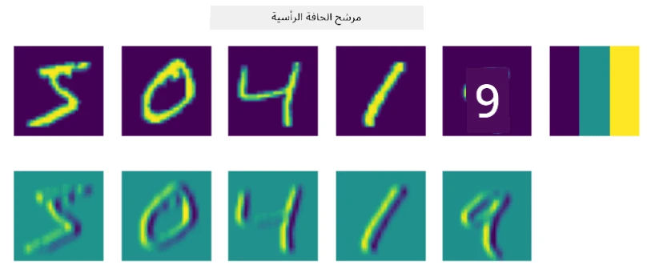
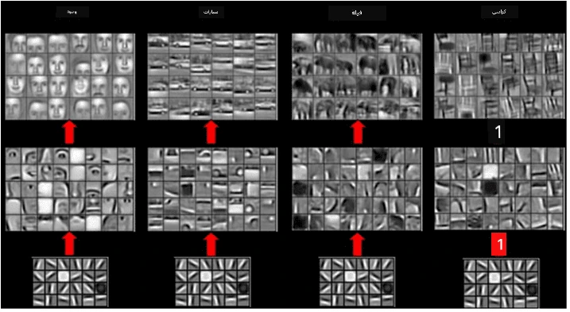
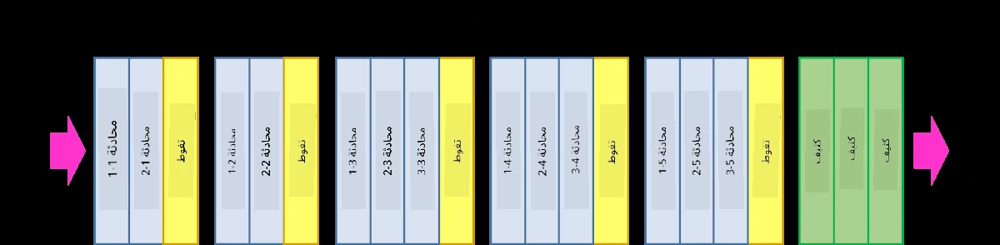
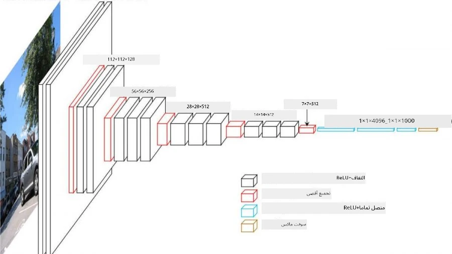

# الشبكات العصبية الالتفافية

لقد رأينا سابقًا أن الشبكات العصبية جيدة جدًا في التعامل مع الصور، وحتى الشبكة العصبية ذات الطبقة الواحدة قادرة على التعرف على الأرقام المكتوبة بخط اليد من مجموعة بيانات MNIST بدقة معقولة. ومع ذلك، فإن مجموعة بيانات MNIST مميزة جدًا، حيث يتمركز جميع الأرقام داخل الصورة، مما يجعل المهمة أسهل.

## [اختبار ما قبل المحاضرة](https://ff-quizzes.netlify.app/en/ai/quiz/13)

في الحياة الواقعية، نريد أن نكون قادرين على التعرف على الأشياء في الصورة بغض النظر عن موقعها الدقيق داخل الصورة. رؤية الكمبيوتر تختلف عن التصنيف العام، لأنه عندما نحاول العثور على كائن معين في الصورة، فإننا نقوم بمسح الصورة بحثًا عن **أنماط** محددة وتركيباتها. على سبيل المثال، عند البحث عن قطة، قد نبدأ بالبحث عن خطوط أفقية، التي يمكن أن تشكل الشوارب، ثم تركيبة معينة من الشوارب يمكن أن تخبرنا بأنها صورة لقطة بالفعل. الموقع النسبي ووجود أنماط معينة مهم، وليس موقعها الدقيق في الصورة.

لاستخراج الأنماط، سنستخدم مفهوم **المرشحات الالتفافية**. كما تعلم، يتم تمثيل الصورة بمصفوفة ثنائية الأبعاد، أو موتر ثلاثي الأبعاد مع عمق اللون. تطبيق المرشح يعني أننا نأخذ مصفوفة **نواة المرشح** صغيرة نسبيًا، ولكل بكسل في الصورة الأصلية نحسب المتوسط المرجح مع النقاط المجاورة. يمكننا تصور هذا كنافذة صغيرة تنزلق عبر الصورة بأكملها، وتقوم بتوسيط جميع البكسلات وفقًا للأوزان في مصفوفة نواة المرشح.

 | 
----|----

> الصورة بواسطة ديمتري سوشنيكوف

على سبيل المثال، إذا قمنا بتطبيق مرشحات الحافة العمودية والحافة الأفقية بحجم 3x3 على أرقام MNIST، يمكننا الحصول على تمييز (مثل القيم العالية) حيث توجد حواف عمودية وأفقية في الصورة الأصلية. وبالتالي يمكن استخدام هذين المرشحين "للبحث عن" الحواف. وبالمثل، يمكننا تصميم مرشحات مختلفة للبحث عن أنماط منخفضة المستوى أخرى:

> صورة [مجموعة مرشحات ليونغ-مالك](https://www.robots.ox.ac.uk/~vgg/research/texclass/filters.html)

ومع ذلك، بينما يمكننا تصميم المرشحات لاستخراج بعض الأنماط يدويًا، يمكننا أيضًا تصميم الشبكة بطريقة تجعلها تتعلم الأنماط تلقائيًا. هذه واحدة من الأفكار الرئيسية وراء الشبكات العصبية الالتفافية.

## الأفكار الرئيسية وراء الشبكات العصبية الالتفافية

طريقة عمل الشبكات العصبية الالتفافية تعتمد على الأفكار المهمة التالية:

* المرشحات الالتفافية يمكنها استخراج الأنماط
* يمكننا تصميم الشبكة بطريقة تجعل المرشحات تُدرَّب تلقائيًا
* يمكننا استخدام نفس النهج للعثور على الأنماط في الميزات عالية المستوى، وليس فقط في الصورة الأصلية. وبالتالي، تعمل عملية استخراج الميزات في الشبكات العصبية الالتفافية على تسلسل هرمي للميزات، بدءًا من تركيبات البكسلات منخفضة المستوى، وصولًا إلى تركيبات أعلى مستوى لأجزاء الصورة.

> صورة من [ورقة بحثية بواسطة هيسلوب-لينش](https://www.semanticscholar.org/paper/Computer-vision-based-pedestrian-trajectory-Hislop-Lynch/26e6f74853fc9bbb7487b06dc2cf095d36c9021d)، بناءً على [أبحاثهم](https://dl.acm.org/doi/abs/10.1145/1553374.1553453)

## ✍️ تمارين: الشبكات العصبية الالتفافية

لنواصل استكشاف كيفية عمل الشبكات العصبية الالتفافية، وكيف يمكننا تحقيق مرشحات قابلة للتدريب، من خلال العمل على دفاتر الملاحظات التالية:

* [الشبكات العصبية الالتفافية - PyTorch](ConvNetsPyTorch.ipynb)
* [الشبكات العصبية الالتفافية - TensorFlow](ConvNetsTF.ipynb)

## بنية الهرم

معظم الشبكات العصبية الالتفافية المستخدمة في معالجة الصور تتبع ما يسمى بنية الهرم. الطبقة الالتفافية الأولى المطبقة على الصور الأصلية تحتوي عادةً على عدد قليل نسبيًا من المرشحات (8-16)، والتي تتوافق مع تركيبات مختلفة من البكسلات، مثل الخطوط الأفقية/العمودية أو الضربات. في المستوى التالي، نقوم بتقليل البعد المكاني للشبكة، وزيادة عدد المرشحات، مما يتوافق مع المزيد من التركيبات الممكنة للميزات البسيطة. مع كل طبقة، بينما نتحرك نحو المصنف النهائي، تقل الأبعاد المكانية للصورة، ويزداد عدد المرشحات.

كمثال، دعونا نلقي نظرة على بنية VGG-16، وهي شبكة حققت دقة 92.7% في تصنيف ImageNet ضمن أفضل 5 في عام 2014:

> صورة من [Researchgate](https://www.researchgate.net/figure/Vgg16-model-structure-To-get-the-VGG-NIN-model-we-replace-the-2-nd-4-th-6-th-7-th_fig2_335194493)

## أشهر بنى الشبكات العصبية الالتفافية

[تابع دراستك حول أشهر بنى الشبكات العصبية الالتفافية](CNN_Architectures.md)

---

