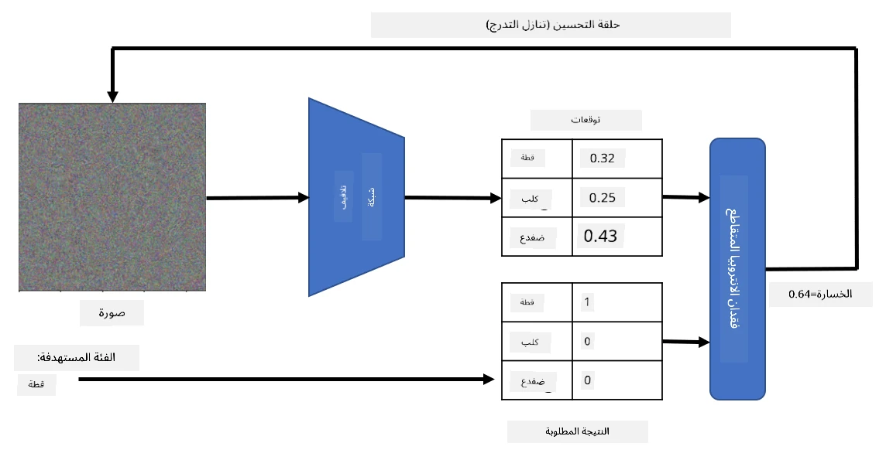

# الشبكات المدربة مسبقًا والتعلم بالنقل

تدريب الشبكات العصبية الالتفافية (CNNs) يمكن أن يستغرق وقتًا طويلًا، ويتطلب كمية كبيرة من البيانات. ومع ذلك، يتم قضاء معظم الوقت في تعلم أفضل المرشحات منخفضة المستوى التي يمكن للشبكة استخدامها لاستخراج الأنماط من الصور. يبرز سؤال طبيعي - هل يمكننا استخدام شبكة عصبية مدربة على مجموعة بيانات واحدة وتكييفها لتصنيف صور مختلفة دون الحاجة إلى عملية تدريب كاملة؟

## [اختبار ما قبل المحاضرة](https://ff-quizzes.netlify.app/en/ai/quiz/15)

تُعرف هذه الطريقة بـ **التعلم بالنقل**، لأنها تعتمد على نقل بعض المعرفة من نموذج شبكة عصبية إلى آخر. في التعلم بالنقل، نبدأ عادةً بنموذج مدرب مسبقًا، والذي تم تدريبه على مجموعة بيانات صور كبيرة مثل **ImageNet**. هذه النماذج قادرة بالفعل على استخراج ميزات مختلفة من الصور العامة، وفي كثير من الحالات، يمكن أن يؤدي بناء مصنف فوق هذه الميزات المستخرجة إلى نتائج جيدة.

> ✅ التعلم بالنقل هو مصطلح موجود في مجالات أكاديمية أخرى، مثل التعليم. يشير إلى عملية أخذ المعرفة من مجال معين وتطبيقها في مجال آخر.

## النماذج المدربة مسبقًا كمستخرج للميزات

الشبكات الالتفافية التي تحدثنا عنها في القسم السابق تحتوي على عدد من الطبقات، كل منها مصمم لاستخراج ميزات معينة من الصورة، بدءًا من تركيبات البكسل منخفضة المستوى (مثل الخطوط الأفقية/العمودية أو الضربات)، وصولًا إلى تركيبات أعلى مستوى من الميزات، مثل عين اللهب. إذا قمنا بتدريب شبكة عصبية على مجموعة بيانات كبيرة ومتنوعة من الصور العامة، يجب أن تتعلم الشبكة استخراج هذه الميزات المشتركة.

كل من Keras وPyTorch يحتويان على وظائف لتحميل أوزان الشبكات العصبية المدربة مسبقًا بسهولة لبعض الهياكل الشائعة، معظمها تم تدريبه على صور ImageNet. النماذج الأكثر استخدامًا موصوفة في صفحة [هياكل الشبكات الالتفافية](../07-ConvNets/CNN_Architectures.md) من الدرس السابق. على وجه الخصوص، قد ترغب في استخدام أحد النماذج التالية:

* **VGG-16/VGG-19** وهي نماذج بسيطة نسبيًا لكنها تقدم دقة جيدة. غالبًا ما يكون استخدام VGG كمحاولة أولى خيارًا جيدًا لمعرفة كيفية عمل التعلم بالنقل.
* **ResNet** هي عائلة من النماذج التي اقترحتها Microsoft Research في عام 2015. تحتوي على طبقات أكثر، وبالتالي تتطلب موارد أكبر.
* **MobileNet** هي عائلة من النماذج ذات الحجم المخفض، مناسبة للأجهزة المحمولة. استخدمها إذا كنت تعاني من نقص في الموارد ويمكنك التضحية بقليل من الدقة.

فيما يلي ميزات مستخرجة من صورة قطة بواسطة شبكة VGG-16:

## مجموعة بيانات القطط مقابل الكلاب

في هذا المثال، سنستخدم مجموعة بيانات [القطط والكلاب](https://www.microsoft.com/download/details.aspx?id=54765&WT.mc_id=academic-77998-cacaste)، وهي قريبة جدًا من سيناريو تصنيف الصور في الحياة الواقعية.

## ✍️ تمرين: التعلم بالنقل

لنرى التعلم بالنقل عمليًا في الدفاتر المرفقة:

* [التعلم بالنقل - PyTorch](TransferLearningPyTorch.ipynb)
* [التعلم بالنقل - TensorFlow](TransferLearningTF.ipynb)

## تصور القطة المثالية

تحتوي الشبكة العصبية المدربة مسبقًا على أنماط مختلفة داخل "دماغها"، بما في ذلك مفاهيم **القطة المثالية** (وكذلك الكلب المثالي، الحمار الوحشي المثالي، إلخ). سيكون من المثير للاهتمام محاولة **تصور هذه الصورة**. ومع ذلك، ليس الأمر بسيطًا، لأن الأنماط منتشرة في جميع أنحاء أوزان الشبكة، وأيضًا منظمة في هيكل هرمي.

أحد الأساليب التي يمكننا اتخاذها هو البدء بصورة عشوائية، ثم محاولة استخدام تقنية **تحسين الانحدار التدرجي** لتعديل تلك الصورة بطريقة تجعل الشبكة تبدأ في الاعتقاد بأنها قطة.

ومع ذلك، إذا قمنا بذلك، سنحصل على شيء مشابه جدًا للضوضاء العشوائية. هذا لأن *هناك العديد من الطرق لجعل الشبكة تعتقد أن الصورة المدخلة هي قطة*، بما في ذلك بعض الطرق التي لا معنى لها بصريًا. بينما تحتوي تلك الصور على الكثير من الأنماط النموذجية للقطة، لا يوجد شيء يقيدها لتكون مميزة بصريًا.

لتحسين النتيجة، يمكننا إضافة مصطلح آخر إلى دالة الخسارة، يسمى **خسارة التباين**. إنه مقياس يظهر مدى تشابه البكسلات المجاورة للصورة. تقليل خسارة التباين يجعل الصورة أكثر نعومة، ويتخلص من الضوضاء - مما يكشف عن أنماط أكثر جاذبية بصريًا. فيما يلي مثال على هذه الصور "المثالية"، التي يتم تصنيفها كقطة وكحمار وحشي باحتمالية عالية:

 | 
-----|-----
 *القطة المثالية* | *الحمار الوحشي المثالي*

يمكن استخدام نهج مشابه لتنفيذ ما يسمى بـ **الهجمات العدائية** على الشبكة العصبية. لنفترض أننا نريد خداع الشبكة العصبية وجعل الكلب يبدو كأنه قطة. إذا أخذنا صورة كلب، والتي يتم التعرف عليها من قبل الشبكة ككلب، يمكننا تعديلها قليلاً باستخدام تحسين الانحدار التدرجي، حتى تبدأ الشبكة في تصنيفها كقطة:

 | 
-----|-----
*الصورة الأصلية للكلب* | *صورة كلب مصنفة كقطة*

راجع الكود لإعادة إنتاج النتائج أعلاه في الدفتر التالي:

* [القطة المثالية والعدائية - TensorFlow](AdversarialCat_TF.ipynb)

## الخاتمة

باستخدام التعلم بالنقل، يمكنك بسرعة إنشاء مصنف لمهمة تصنيف كائنات مخصصة وتحقيق دقة عالية. يمكنك أن ترى أن المهام الأكثر تعقيدًا التي نقوم بحلها الآن تتطلب قوة حسابية أعلى، ولا يمكن حلها بسهولة على وحدة المعالجة المركزية. في الوحدة التالية، سنحاول استخدام تنفيذ أخف لتدريب نفس النموذج باستخدام موارد حسابية أقل، مما يؤدي إلى انخفاض طفيف فقط في الدقة.

## 🚀 تحدي

في الدفاتر المرفقة، توجد ملاحظات في الأسفل حول كيفية عمل نقل المعرفة بشكل أفضل مع بيانات تدريب متشابهة إلى حد ما (نوع جديد من الحيوانات، ربما). قم ببعض التجارب مع أنواع جديدة تمامًا من الصور لترى مدى جودة أو سوء أداء نماذج نقل المعرفة الخاصة بك.

## [اختبار ما بعد المحاضرة](https://ff-quizzes.netlify.app/en/ai/quiz/16)

## المراجعة والدراسة الذاتية

اقرأ [TrainingTricks.md](TrainingTricks.md) لتعميق معرفتك ببعض الطرق الأخرى لتدريب نماذجك.

## [التكليف](lab/README.md)

في هذا المختبر، سنستخدم مجموعة بيانات الحيوانات الأليفة الحقيقية [Oxford-IIIT](https://www.robots.ox.ac.uk/~vgg/data/pets/) التي تحتوي على 35 سلالة من القطط والكلاب، وسنبني مصنفًا باستخدام التعلم بالنقل.

---

