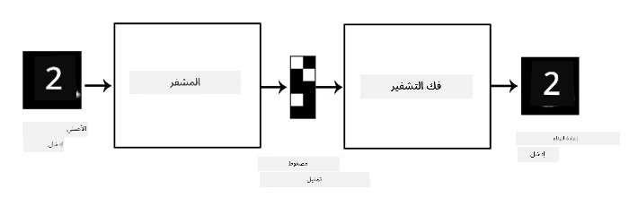
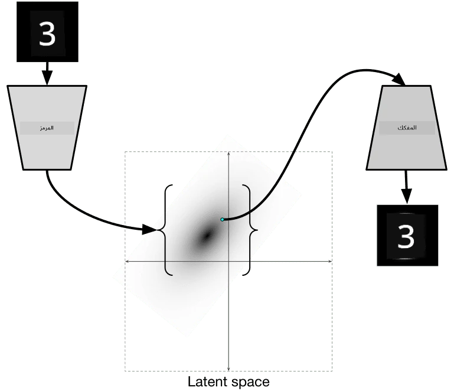

# الشبكات العصبية التلقائية (Autoencoders)

عند تدريب الشبكات العصبية الالتفافية (CNNs)، واحدة من المشاكل هي أننا نحتاج إلى كمية كبيرة من البيانات الموصوفة. في حالة تصنيف الصور، نحتاج إلى فصل الصور إلى فئات مختلفة، وهو جهد يدوي.

## [اختبار ما قبل المحاضرة](https://ff-quizzes.netlify.app/en/ai/quiz/17)

ومع ذلك، قد نرغب في استخدام البيانات الخام (غير الموصوفة) لتدريب مستخلصات ميزات CNN، وهو ما يسمى **التعلم الذاتي الإشراف**. بدلاً من استخدام التصنيفات، سنستخدم صور التدريب كمدخلات ومخرجات للشبكة. الفكرة الرئيسية لـ **الشبكة العصبية التلقائية** هي أننا سنمتلك **شبكة تشفير** تقوم بتحويل الصورة المدخلة إلى **فضاء كامن** (عادةً ما يكون مجرد متجه بحجم أصغر)، ثم **شبكة فك التشفير**، التي يكون هدفها إعادة بناء الصورة الأصلية.

> ✅ [الشبكة العصبية التلقائية](https://wikipedia.org/wiki/Autoencoder) هي "نوع من الشبكات العصبية الاصطناعية تُستخدم لتعلم ترميز فعال للبيانات غير الموصوفة."

بما أننا نقوم بتدريب الشبكة العصبية التلقائية لالتقاط أكبر قدر ممكن من المعلومات من الصورة الأصلية لإعادة البناء بدقة، تحاول الشبكة العثور على أفضل **تمثيل** للصور المدخلة لالتقاط المعنى.

> الصورة من [مدونة Keras](https://blog.keras.io/building-autoencoders-in-keras.html)

## سيناريوهات استخدام الشبكات العصبية التلقائية

بينما قد لا يبدو إعادة بناء الصور الأصلية مفيدًا بحد ذاته، هناك بعض السيناريوهات التي تكون فيها الشبكات العصبية التلقائية مفيدة بشكل خاص:

* **تقليل أبعاد الصور للتصور** أو **تدريب تمثيلات الصور**. عادةً ما تقدم الشبكات العصبية التلقائية نتائج أفضل من تحليل المكونات الرئيسية (PCA)، لأنها تأخذ في الاعتبار الطبيعة المكانية للصور والميزات الهرمية.
* **إزالة الضوضاء**، أي إزالة الضوضاء من الصورة. نظرًا لأن الضوضاء تحمل الكثير من المعلومات غير المفيدة، فإن الشبكة العصبية التلقائية لا يمكنها استيعابها بالكامل في الفضاء الكامن الصغير نسبيًا، وبالتالي تلتقط فقط الجزء المهم من الصورة. عند تدريب أدوات إزالة الضوضاء، نبدأ بالصور الأصلية، ونستخدم الصور التي أُضيفت إليها ضوضاء بشكل مصطنع كمدخلات للشبكة العصبية التلقائية.
* **زيادة دقة الصور**، أي تحسين دقة الصورة. نبدأ بالصور عالية الدقة، ونستخدم الصورة ذات الدقة المنخفضة كمدخلات للشبكة العصبية التلقائية.
* **النماذج التوليدية**. بمجرد تدريب الشبكة العصبية التلقائية، يمكن استخدام جزء فك التشفير لإنشاء كائنات جديدة بدءًا من متجهات كامنة عشوائية.

## الشبكات العصبية التلقائية التباينية (VAE)

الشبكات العصبية التلقائية التقليدية تقلل أبعاد البيانات المدخلة بطريقة ما، وتحدد الميزات المهمة للصور المدخلة. ومع ذلك، غالبًا ما تكون المتجهات الكامنة غير مفهومة. بمعنى آخر، إذا أخذنا مجموعة بيانات MNIST كمثال، فإن تحديد الأرقام التي تتوافق مع المتجهات الكامنة المختلفة ليس مهمة سهلة، لأن المتجهات الكامنة القريبة قد لا تتوافق بالضرورة مع نفس الأرقام.

من ناحية أخرى، لتدريب النماذج التوليدية، من الأفضل أن يكون لدينا فهم للفضاء الكامن. هذه الفكرة تقودنا إلى **الشبكة العصبية التلقائية التباينية** (VAE).

VAE هي شبكة تلقائية تتعلم التنبؤ بـ *التوزيع الإحصائي* للمعلمات الكامنة، ما يسمى بـ **التوزيع الكامن**. على سبيل المثال، قد نرغب في أن تكون المتجهات الكامنة موزعة بشكل طبيعي مع متوسط zmean وانحراف معياري zsigma (كلاهما متجهات ذات أبعاد معينة d). يتعلم المشفر في VAE التنبؤ بهذه المعلمات، ثم يأخذ فك التشفير متجهًا عشوائيًا من هذا التوزيع لإعادة بناء الكائن.

لتلخيص:

 * من المتجه المدخل، نتنبأ بـ `z_mean` و `z_log_sigma` (بدلاً من التنبؤ بالانحراف المعياري نفسه، نتنبأ باللوغاريتم الخاص به)
 * نأخذ عينة `sample` من التوزيع N(zmean,exp(zlog\_sigma))
 * يحاول فك التشفير فك تشفير الصورة الأصلية باستخدام `sample` كمتجه مدخل

 

> الصورة من [هذه المدونة](https://ijdykeman.github.io/ml/2016/12/21/cvae.html) بواسطة Isaak Dykeman

تستخدم الشبكات العصبية التلقائية التباينية وظيفة خسارة معقدة تتكون من جزئين:

* **خسارة إعادة البناء** هي وظيفة الخسارة التي تظهر مدى قرب الصورة المعاد بناؤها من الهدف (يمكن أن تكون متوسط الخطأ التربيعي، أو MSE). وهي نفس وظيفة الخسارة المستخدمة في الشبكات التلقائية العادية.
* **خسارة KL**، التي تضمن أن تظل توزيعات المتغيرات الكامنة قريبة من التوزيع الطبيعي. وهي تعتمد على مفهوم [تباعد كولباك-ليبلر](https://www.countbayesie.com/blog/2017/5/9/kullback-leibler-divergence-explained) - وهو مقياس لتقدير مدى تشابه توزيعين إحصائيين.

ميزة مهمة للشبكات العصبية التلقائية التباينية هي أنها تتيح لنا إنشاء صور جديدة بسهولة نسبية، لأننا نعرف التوزيع الذي يمكننا أخذ عينات منه للمتجهات الكامنة. على سبيل المثال، إذا قمنا بتدريب VAE مع متجه كامن ثنائي الأبعاد على MNIST، يمكننا بعد ذلك تغيير مكونات المتجه الكامن للحصول على أرقام مختلفة:

> الصورة بواسطة [Dmitry Soshnikov](http://soshnikov.com)

لاحظ كيف تمتزج الصور مع بعضها البعض، حيث نبدأ في الحصول على متجهات كامنة من أجزاء مختلفة من فضاء المعلمات الكامنة. يمكننا أيضًا تصور هذا الفضاء في بعدين:

 

> الصورة بواسطة [Dmitry Soshnikov](http://soshnikov.com)

## ✍️ تمارين: الشبكات العصبية التلقائية

تعرف على المزيد حول الشبكات العصبية التلقائية في دفاتر الملاحظات التالية:

* [الشبكات العصبية التلقائية باستخدام TensorFlow](AutoencodersTF.ipynb)
* [الشبكات العصبية التلقائية باستخدام PyTorch](AutoEncodersPyTorch.ipynb)

## خصائص الشبكات العصبية التلقائية

* **محددة البيانات** - تعمل بشكل جيد فقط مع نوع الصور التي تم تدريبها عليها. على سبيل المثال، إذا قمنا بتدريب شبكة لتحسين الدقة على صور الزهور، فلن تعمل بشكل جيد على صور الأشخاص. السبب هو أن الشبكة يمكنها إنتاج صورة ذات دقة أعلى من خلال أخذ التفاصيل الدقيقة من الميزات التي تعلمتها من مجموعة البيانات التدريبية.
* **فقدان البيانات** - الصورة المعاد بناؤها ليست مطابقة للصورة الأصلية. طبيعة الفقد تُحدد بواسطة *وظيفة الخسارة* المستخدمة أثناء التدريب.
* تعمل على **البيانات غير الموصوفة**

## [اختبار ما بعد المحاضرة](https://ff-quizzes.netlify.app/en/ai/quiz/18)

## الخاتمة

في هذه الدرس، تعلمت عن الأنواع المختلفة من الشبكات العصبية التلقائية المتاحة للعلماء في مجال الذكاء الاصطناعي. تعلمت كيفية بنائها، وكيفية استخدامها لإعادة بناء الصور. كما تعلمت عن VAE وكيفية استخدامها لإنشاء صور جديدة.

## 🚀 تحدي

في هذا الدرس، تعلمت عن استخدام الشبكات العصبية التلقائية للصور. ولكن يمكن استخدامها أيضًا للموسيقى! تحقق من مشروع Magenta [MusicVAE](https://magenta.tensorflow.org/music-vae)، الذي يستخدم الشبكات العصبية التلقائية لتعلم إعادة بناء الموسيقى. قم ببعض [التجارب](https://colab.research.google.com/github/magenta/magenta-demos/blob/master/colab-notebooks/Multitrack_MusicVAE.ipynb) باستخدام هذه المكتبة لترى ما يمكنك إنشاؤه.

## [اختبار ما بعد المحاضرة](https://ff-quizzes.netlify.app/en/ai/quiz/16)

## المراجعة والدراسة الذاتية

للمراجعة، اقرأ المزيد عن الشبكات العصبية التلقائية في هذه الموارد:

* [بناء الشبكات العصبية التلقائية باستخدام Keras](https://blog.keras.io/building-autoencoders-in-keras.html)
* [مقالة في مدونة NeuroHive](https://neurohive.io/ru/osnovy-data-science/variacionnyj-avtojenkoder-vae/)
* [شرح الشبكات العصبية التلقائية التباينية](https://kvfrans.com/variational-autoencoders-explained/)
* [الشبكات العصبية التلقائية التباينية الشرطية](https://ijdykeman.github.io/ml/2016/12/21/cvae.html)

## الواجب

في نهاية [دفتر الملاحظات باستخدام TensorFlow](AutoencodersTF.ipynb)، ستجد "مهمة" - استخدمها كواجبك.

---

