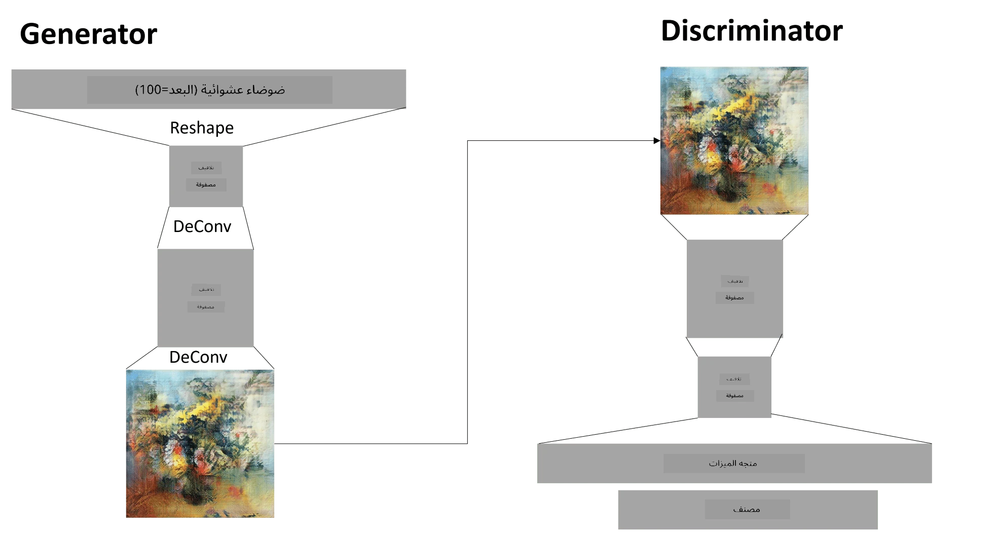

# الشبكات التوليدية التنافسية

في القسم السابق، تعلمنا عن **النماذج التوليدية**: وهي نماذج يمكنها إنشاء صور جديدة مشابهة لتلك الموجودة في مجموعة بيانات التدريب. كان VAE مثالًا جيدًا على نموذج توليدي.

## [اختبار ما قبل المحاضرة](https://ff-quizzes.netlify.app/en/ai/quiz/19)

ومع ذلك، إذا حاولنا إنشاء شيء ذو معنى حقيقي، مثل لوحة بدقة معقولة باستخدام VAE، سنلاحظ أن التدريب لا يتقارب بشكل جيد. لهذا الاستخدام، يجب أن نتعلم عن بنية أخرى مخصصة للنماذج التوليدية - وهي **الشبكات التوليدية التنافسية** أو GANs.

الفكرة الرئيسية لـ GAN هي وجود شبكتين عصبيتين يتم تدريبهما ضد بعضهما البعض:

> الصورة بواسطة [Dmitry Soshnikov](http://soshnikov.com)

> ✅ بعض المصطلحات:
> * **المولد** هو شبكة تأخذ متجهًا عشوائيًا وتنتج صورة كنتيجة.
> * **المميز** هو شبكة تأخذ صورة ويجب أن تحدد ما إذا كانت صورة حقيقية (من مجموعة بيانات التدريب) أو تم إنشاؤها بواسطة المولد. وهو في الأساس مصنف صور.

### المميز

لا تختلف بنية المميز عن شبكة تصنيف الصور العادية. في أبسط الحالات، يمكن أن تكون مصنفًا متصلًا بالكامل، ولكن غالبًا ما تكون شبكة [التلافيف](../07-ConvNets/README.md).

> ✅ يُطلق على GAN المستندة إلى شبكات التلافيف اسم [DCGAN](https://arxiv.org/pdf/1511.06434.pdf)

يتكون مميز CNN من الطبقات التالية: عدة طبقات تلافيف+تجميع (مع تقليل الحجم المكاني)، وطبقة أو أكثر متصلة بالكامل للحصول على "متجه الميزات"، ومصنف ثنائي نهائي.

> ✅ "التجميع" في هذا السياق هو تقنية تقلل من حجم الصورة. "تقلل طبقات التجميع أبعاد البيانات عن طريق دمج مخرجات مجموعات الخلايا العصبية في طبقة واحدة في خلية عصبية واحدة في الطبقة التالية." - [المصدر](https://wikipedia.org/wiki/Convolutional_neural_network#Pooling_layers)

### المولد

المولد أكثر تعقيدًا قليلاً. يمكن اعتباره مميزًا معكوسًا. بدءًا من متجه كامن (بدلاً من متجه الميزات)، يحتوي على طبقة متصلة بالكامل لتحويله إلى الحجم/الشكل المطلوب، متبوعة بتلافيف عكسية+تصعيد. هذا مشابه لجزء *المفكك* في [المشفّر التلقائي](../09-Autoencoders/README.md).

> ✅ نظرًا لأن طبقة التلافيف تُنفذ كمرشح خطي يعبر الصورة، فإن التلافيف العكسية تشبه التلافيف ويمكن تنفيذها باستخدام نفس منطق الطبقة.

> الصورة بواسطة [Dmitry Soshnikov](http://soshnikov.com)

### تدريب GAN

تُسمى GANs **تنافسية** لأن هناك منافسة مستمرة بين المولد والمميز. خلال هذه المنافسة، يتحسن كل من المولد والمميز، وبالتالي تتعلم الشبكة إنتاج صور أفضل وأفضل.

يحدث التدريب على مرحلتين:

* **تدريب المميز**. هذه المهمة مباشرة جدًا: نقوم بإنشاء دفعة من الصور بواسطة المولد، ونضع لها تصنيف 0، والذي يمثل صورة مزيفة، ونأخذ دفعة من الصور من مجموعة بيانات الإدخال (بتصنيف 1، صورة حقيقية). نحصل على *خسارة المميز*، وننفذ التراجع الخلفي.
* **تدريب المولد**. هذا أكثر تعقيدًا قليلاً، لأننا لا نعرف النتيجة المتوقعة للمولد مباشرة. نأخذ شبكة GAN كاملة تتكون من مولد متبوع بمميز، ونغذيها ببعض المتجهات العشوائية، ونتوقع أن تكون النتيجة 1 (تشير إلى صور حقيقية). ثم نقوم بتجميد معلمات المميز (لا نريد تدريبه في هذه الخطوة)، وننفذ التراجع الخلفي.

خلال هذه العملية، لا تنخفض خسائر المولد والمميز بشكل كبير. في الوضع المثالي، يجب أن تتذبذب، مما يشير إلى تحسن أداء الشبكتين.

## ✍️ تمارين: GANs

* [دفتر GAN في TensorFlow/Keras](GANTF.ipynb)
* [دفتر GAN في PyTorch](GANPyTorch.ipynb)

### مشاكل تدريب GAN

تُعرف GANs بأنها صعبة التدريب بشكل خاص. إليك بعض المشاكل:

* **انهيار النمط**. يشير هذا المصطلح إلى أن المولد يتعلم إنتاج صورة واحدة ناجحة تخدع المميز، وليس مجموعة متنوعة من الصور المختلفة.
* **الحساسية للمعلمات الفائقة**. غالبًا ما ترى أن GAN لا يتقارب على الإطلاق، ثم فجأة يؤدي انخفاض معدل التعلم إلى التقارب.
* الحفاظ على **التوازن** بين المولد والمميز. في كثير من الحالات، يمكن أن تنخفض خسارة المميز إلى الصفر بسرعة نسبية، مما يؤدي إلى عدم قدرة المولد على التدريب أكثر. للتغلب على ذلك، يمكننا محاولة ضبط معدلات تعلم مختلفة للمولد والمميز، أو تخطي تدريب المميز إذا كانت الخسارة منخفضة جدًا بالفعل.
* التدريب على **الدقة العالية**. يعكس نفس المشكلة كما هو الحال مع المشفرات التلقائية، حيث يتم تشغيل هذه المشكلة لأن إعادة بناء العديد من طبقات شبكة التلافيف يؤدي إلى تشوهات. يتم حل هذه المشكلة عادةً باستخدام ما يسمى **النمو التدريجي**، حيث يتم تدريب الطبقات الأولى على صور منخفضة الدقة، ثم يتم "إلغاء حظر" الطبقات أو إضافتها. حل آخر هو إضافة اتصالات إضافية بين الطبقات وتدريب عدة دقات في وقت واحد - انظر هذه الورقة [Multi-Scale Gradient GANs](https://arxiv.org/abs/1903.06048) للحصول على التفاصيل.

## نقل الأسلوب

GANs هي طريقة رائعة لإنشاء صور فنية. تقنية أخرى مثيرة للاهتمام هي ما يسمى **نقل الأسلوب**، والتي تأخذ صورة **محتوى** واحدة، وتعيد رسمها بأسلوب مختلف، باستخدام مرشحات من صورة **أسلوب**.

طريقة عملها كالتالي:
* نبدأ بصورة ضوضاء عشوائية (أو بصورة محتوى، ولكن لفهم الطريقة من الأسهل البدء بضوضاء عشوائية)
* هدفنا هو إنشاء صورة تكون قريبة من صورة المحتوى وصورة الأسلوب. يتم تحديد ذلك بواسطة وظيفتي خسارة:
   - **خسارة المحتوى** تُحسب بناءً على الميزات المستخرجة بواسطة CNN عند بعض الطبقات من الصورة الحالية وصورة المحتوى
   - **خسارة الأسلوب** تُحسب بين الصورة الحالية وصورة الأسلوب بطريقة ذكية باستخدام مصفوفات Gram (المزيد من التفاصيل في [دفتر المثال](StyleTransfer.ipynb))
* لجعل الصورة أكثر سلاسة وإزالة الضوضاء، نقدم أيضًا **خسارة التباين**، التي تحسب متوسط المسافة بين البكسلات المجاورة
* يقوم حلقة التحسين الرئيسية بتعديل الصورة الحالية باستخدام الانحدار التدرجي (أو بعض خوارزميات التحسين الأخرى) لتقليل الخسارة الإجمالية، وهي مجموع موزون لجميع الخسائر الثلاثة.

## ✍️ مثال: [نقل الأسلوب](StyleTransfer.ipynb)

## [اختبار ما بعد المحاضرة](https://ff-quizzes.netlify.app/en/ai/quiz/20)

## الخاتمة

في هذه الدرس، تعلمت عن GANs وكيفية تدريبها. كما تعلمت عن التحديات الخاصة التي يمكن أن تواجهها هذه النوعية من الشبكات العصبية، وبعض الاستراتيجيات لتجاوزها.

## 🚀 التحدي

قم بتشغيل [دفتر نقل الأسلوب](StyleTransfer.ipynb) باستخدام صورك الخاصة.

## المراجعة والدراسة الذاتية

للمراجعة، اقرأ المزيد عن GANs في هذه الموارد:

* Marco Pasini، [10 دروس تعلمتها أثناء تدريب GANs لمدة عام](https://towardsdatascience.com/10-lessons-i-learned-training-generative-adversarial-networks-gans-for-a-year-c9071159628)
* [StyleGAN](https://en.wikipedia.org/wiki/StyleGAN)، بنية GAN يجب أخذها بعين الاعتبار
* [إنشاء فن توليدي باستخدام GANs على Azure ML](https://soshnikov.com/scienceart/creating-generative-art-using-gan-on-azureml/)

## الواجب

راجع أحد الدفاتر المرتبطة بهذا الدرس وأعد تدريب GAN باستخدام صورك الخاصة. ماذا يمكنك أن تنشئ؟

---

