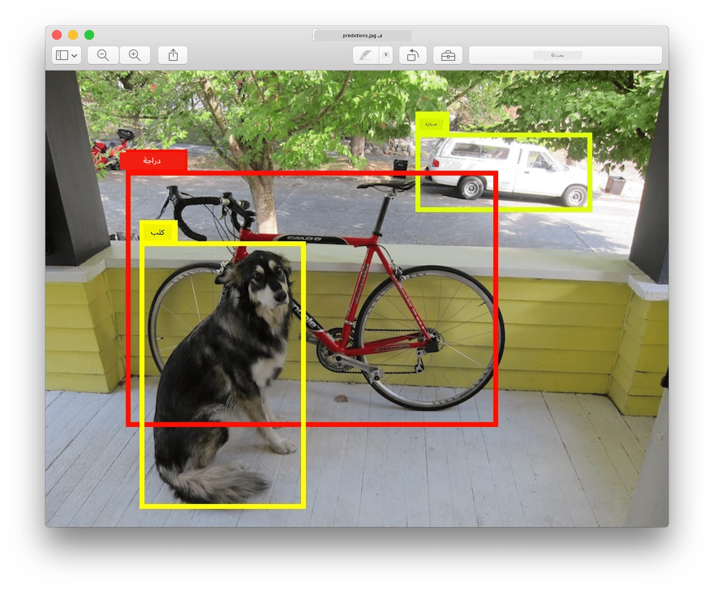
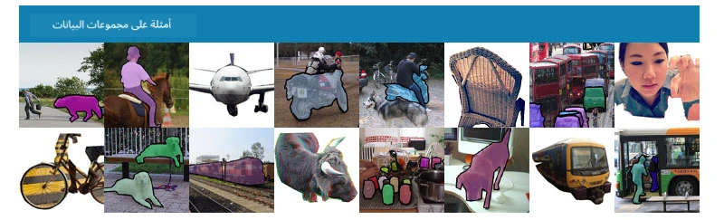
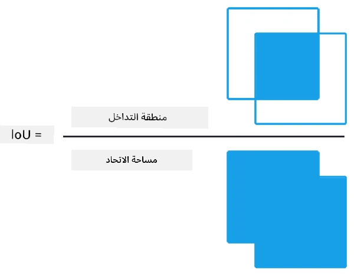
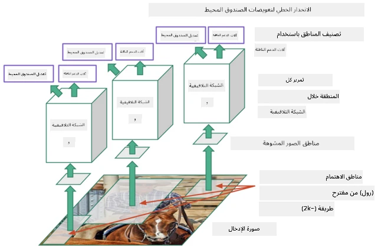
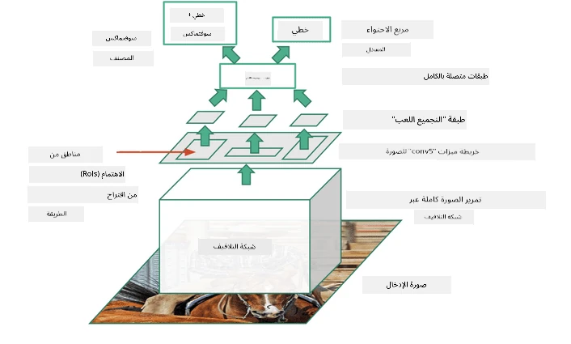
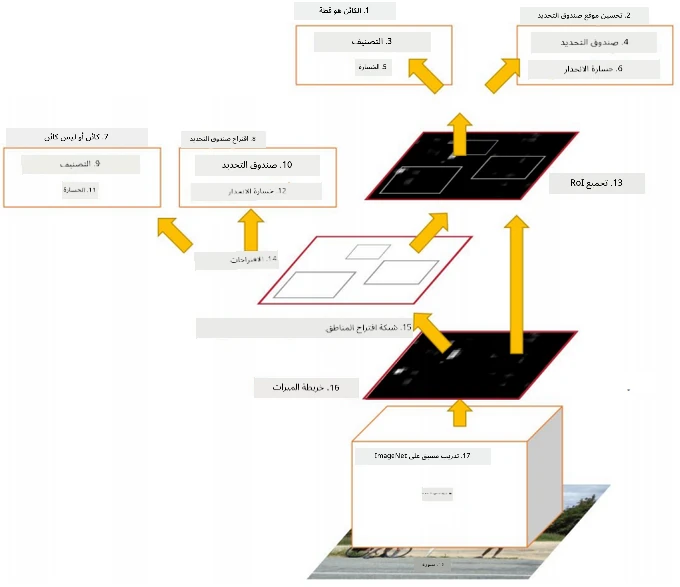
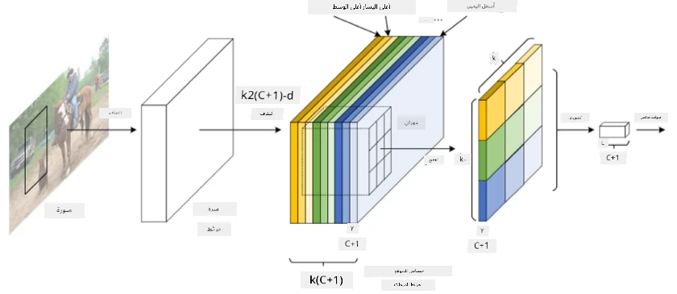
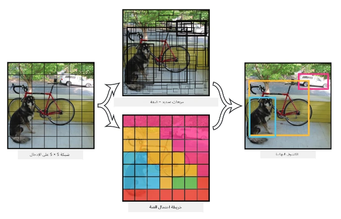

# الكشف عن الكائنات

النماذج التي تعاملنا معها لتصنيف الصور حتى الآن كانت تأخذ صورة وتنتج نتيجة تصنيفية، مثل فئة "الرقم" في مشكلة MNIST. ومع ذلك، في العديد من الحالات، لا نريد فقط معرفة أن الصورة تحتوي على كائنات - بل نريد تحديد موقعها بدقة. وهذا هو الهدف من **الكشف عن الكائنات**.

## [اختبار ما قبل المحاضرة](https://ff-quizzes.netlify.app/en/ai/quiz/21)

> الصورة من [موقع YOLO v2](https://pjreddie.com/darknet/yolov2/)

## نهج بسيط للكشف عن الكائنات

إذا أردنا العثور على قطة في صورة، فإن نهجًا بسيطًا جدًا للكشف عن الكائنات سيكون كالتالي:

1. تقسيم الصورة إلى عدد من المربعات.
2. تشغيل تصنيف الصور على كل مربع.
3. يمكن اعتبار المربعات التي تؤدي إلى تنشيط عالي بما يكفي أنها تحتوي على الكائن المطلوب.

> *الصورة من [دفتر التمارين](ObjectDetection-TF.ipynb)*

ومع ذلك، هذا النهج بعيد عن المثالية، لأنه يسمح فقط للخوارزمية بتحديد موقع الصندوق المحيط بالكائن بشكل غير دقيق. للحصول على موقع أكثر دقة، نحتاج إلى تشغيل نوع من **الانحدار** للتنبؤ بإحداثيات الصناديق المحيطة - وللقيام بذلك، نحتاج إلى مجموعات بيانات محددة.

## الانحدار للكشف عن الكائنات

[هذه المقالة](https://towardsdatascience.com/object-detection-with-neural-networks-a4e2c46b4491) تقدم مقدمة رائعة للكشف عن الأشكال.

## مجموعات البيانات للكشف عن الكائنات

قد تصادف مجموعات البيانات التالية لهذه المهمة:

* [PASCAL VOC](http://host.robots.ox.ac.uk/pascal/VOC/) - 20 فئة
* [COCO](http://cocodataset.org/#home) - الكائنات الشائعة في السياق. 80 فئة، صناديق محيطة وأقنعة تقسيم

## مقاييس الكشف عن الكائنات

### التقاطع على الاتحاد

بينما من السهل قياس أداء الخوارزمية في تصنيف الصور، فإن الكشف عن الكائنات يتطلب قياس صحة الفئة وكذلك دقة موقع الصندوق المحيط المستنتج. بالنسبة للأخير، نستخدم ما يسمى **التقاطع على الاتحاد** (IoU)، الذي يقيس مدى تداخل صندوقين (أو منطقتين عشوائيتين).

> *الشكل 2 من [هذه المقالة الممتازة عن IoU](https://pyimagesearch.com/2016/11/07/intersection-over-union-iou-for-object-detection/)*

الفكرة بسيطة - نقسم مساحة التقاطع بين شكلين على مساحة اتحادهما. بالنسبة لمنطقتين متطابقتين، سيكون IoU = 1، بينما بالنسبة لمنطقتين منفصلتين تمامًا سيكون 0. بخلاف ذلك، سيتراوح بين 0 و1. عادةً ما نعتبر فقط تلك الصناديق المحيطة التي يكون فيها IoU أعلى من قيمة معينة.

### الدقة المتوسطة

لنفترض أننا نريد قياس مدى جودة التعرف على فئة معينة من الكائنات $C$. لقياس ذلك، نستخدم مقاييس **الدقة المتوسطة**، التي تُحسب كالتالي:

1. يتم النظر في منحنى الدقة-الاستدعاء الذي يظهر الدقة بناءً على قيمة عتبة الكشف (من 0 إلى 1).
2. بناءً على العتبة، سنحصل على عدد أكبر أو أقل من الكائنات المكتشفة في الصورة، وقيم مختلفة للدقة والاستدعاء.
3. سيبدو المنحنى كالتالي:

> *الصورة من [NeuroWorkshop](http://github.com/shwars/NeuroWorkshop)*

الدقة المتوسطة لفئة معينة $C$ هي المساحة تحت هذا المنحنى. بشكل أكثر دقة، يتم تقسيم محور الاستدعاء عادةً إلى 10 أجزاء، ويتم حساب متوسط الدقة على جميع هذه النقاط:

$$
AP = {1\over11}\sum_{i=0}^{10}\mbox{Precision}(\mbox{Recall}={i\over10})
$$

### AP و IoU

نعتبر فقط تلك الاكتشافات التي يكون فيها IoU أعلى من قيمة معينة. على سبيل المثال، في مجموعة بيانات PASCAL VOC عادةً ما يُفترض أن $\mbox{IoU Threshold} = 0.5$، بينما في COCO يتم قياس AP لقيم مختلفة من $\mbox{IoU Threshold}$.

> *الصورة من [NeuroWorkshop](http://github.com/shwars/NeuroWorkshop)*

### الدقة المتوسطة الإجمالية - mAP

المقياس الرئيسي للكشف عن الكائنات يُسمى **الدقة المتوسطة الإجمالية** أو **mAP**. وهو قيمة الدقة المتوسطة، محسوبة عبر جميع فئات الكائنات، وأحيانًا أيضًا عبر $\mbox{IoU Threshold}$. يتم وصف عملية حساب **mAP** بالتفصيل
[في هذه المقالة](https://medium.com/@timothycarlen/understanding-the-map-evaluation-metric-for-object-detection-a07fe6962cf3)، وأيضًا [هنا مع أمثلة على الكود](https://gist.github.com/tarlen5/008809c3decf19313de216b9208f3734).

## طرق مختلفة للكشف عن الكائنات

هناك فئتان رئيسيتان من خوارزميات الكشف عن الكائنات:

* **شبكات اقتراح المناطق** (R-CNN، Fast R-CNN، Faster R-CNN). الفكرة الرئيسية هي إنشاء **مناطق اهتمام** (ROI) وتشغيل CNN عليها، بحثًا عن أقصى تنشيط. يشبه هذا النهج إلى حد ما النهج البسيط، باستثناء أن مناطق الاهتمام يتم إنشاؤها بطريقة أكثر ذكاءً. أحد العيوب الرئيسية لهذه الطرق هو أنها بطيئة، لأننا نحتاج إلى العديد من تمريرات مصنف CNN عبر الصورة.
* **المرور الواحد** (YOLO، SSD، RetinaNet). في هذه البُنى، نصمم الشبكة للتنبؤ بالفئات ومناطق الاهتمام في مرور واحد.

### R-CNN: الشبكة العصبية القائمة على المناطق

[R-CNN](http://islab.ulsan.ac.kr/files/announcement/513/rcnn_pami.pdf) تستخدم [البحث الانتقائي](http://www.huppelen.nl/publications/selectiveSearchDraft.pdf) لإنشاء هيكل هرمي لمناطق الاهتمام (ROI)، التي يتم تمريرها بعد ذلك عبر مستخلصات ميزات CNN ومصنفات SVM لتحديد فئة الكائن، وانحدار خطي لتحديد إحداثيات *الصندوق المحيط*. [المقالة الرسمية](https://arxiv.org/pdf/1506.01497v1.pdf)

> *الصورة من van de Sande et al. ICCV’11*

> *الصور من [هذه المقالة](https://towardsdatascience.com/r-cnn-fast-r-cnn-faster-r-cnn-yolo-object-detection-algorithms-36d53571365e)*

### F-RCNN - Fast R-CNN

هذا النهج مشابه لـ R-CNN، لكن المناطق يتم تحديدها بعد تطبيق طبقات الالتفاف.

> الصورة من [المقالة الرسمية](https://www.cv-foundation.org/openaccess/content_iccv_2015/papers/Girshick_Fast_R-CNN_ICCV_2015_paper.pdf)، [arXiv](https://arxiv.org/pdf/1504.08083.pdf)، 2015

### Faster R-CNN

الفكرة الرئيسية لهذا النهج هي استخدام الشبكة العصبية للتنبؤ بمناطق الاهتمام - ما يسمى *شبكة اقتراح المناطق*. [المقالة](https://arxiv.org/pdf/1506.01497.pdf)، 2016

> الصورة من [المقالة الرسمية](https://arxiv.org/pdf/1506.01497.pdf)

### R-FCN: الشبكة العصبية القائمة على المناطق بالكامل

هذا الخوارزم أسرع حتى من Faster R-CNN. الفكرة الرئيسية هي كالتالي:

1. نستخرج الميزات باستخدام ResNet-101.
2. يتم معالجة الميزات بواسطة **خريطة النقاط الحساسة للموقع**. يتم تقسيم كل كائن من $C$ الفئات إلى مناطق $k\times k$، وندرب الشبكة للتنبؤ بأجزاء الكائنات.
3. لكل جزء من مناطق $k\times k$، تصوت جميع الشبكات لفئات الكائنات، ويتم اختيار فئة الكائن ذات التصويت الأعلى.

> الصورة من [المقالة الرسمية](https://arxiv.org/abs/1605.06409)

### YOLO - You Only Look Once

YOLO هو خوارزمية مرور واحد في الوقت الفعلي. الفكرة الرئيسية هي كالتالي:

 * يتم تقسيم الصورة إلى مناطق $S\times S$.
 * لكل منطقة، **CNN** تتنبأ بـ $n$ كائنات محتملة، *إحداثيات الصندوق المحيط* و *الثقة*=*الاحتمالية* * IoU.

 

> الصورة من [المقالة الرسمية](https://arxiv.org/abs/1506.02640)

### خوارزميات أخرى

* RetinaNet: [المقالة الرسمية](https://arxiv.org/abs/1708.02002)
   - [تنفيذ PyTorch في Torchvision](https://pytorch.org/vision/stable/_modules/torchvision/models/detection/retinanet.html)
   - [تنفيذ Keras](https://github.com/fizyr/keras-retinanet)
   - [الكشف عن الكائنات باستخدام RetinaNet](https://keras.io/examples/vision/retinanet/) في أمثلة Keras
* SSD (الكاشف ذو اللقطة الواحدة): [المقالة الرسمية](https://arxiv.org/abs/1512.02325)

## ✍️ تمارين: الكشف عن الكائنات

واصل تعلمك في الدفتر التالي:

[ObjectDetection.ipynb](ObjectDetection.ipynb)

## الخاتمة

في هذه الدرس، أخذت جولة سريعة حول الطرق المختلفة التي يمكن من خلالها تحقيق الكشف عن الكائنات!

## 🚀 التحدي

اقرأ هذه المقالات والدفاتر عن YOLO وجربها بنفسك:

* [مقالة جيدة](https://www.analyticsvidhya.com/blog/2018/12/practical-guide-object-detection-yolo-framewor-python/) تصف YOLO
 * [الموقع الرسمي](https://pjreddie.com/darknet/yolo/)
 * YOLO: [تنفيذ Keras](https://github.com/experiencor/keras-yolo2)، [دفتر خطوة بخطوة](https://github.com/experiencor/basic-yolo-keras/blob/master/Yolo%20Step-by-Step.ipynb)
 * YOLO v2: [تنفيذ Keras](https://github.com/experiencor/keras-yolo2)، [دفتر خطوة بخطوة](https://github.com/experiencor/keras-yolo2/blob/master/Yolo%20Step-by-Step.ipynb)

## [اختبار ما بعد المحاضرة](https://ff-quizzes.netlify.app/en/ai/quiz/22)

## المراجعة والدراسة الذاتية

* [الكشف عن الكائنات](https://tjmachinelearning.com/lectures/1718/obj/) بواسطة نيكيل ساردانا
* [مقارنة جيدة لخوارزميات الكشف عن الكائنات](https://lilianweng.github.io/lil-log/2018/12/27/object-detection-part-4.html)
* [مراجعة لخوارزميات التعلم العميق للكشف عن الكائنات](https://medium.com/comet-app/review-of-deep-learning-algorithms-for-object-detection-c1f3d437b852)
* [مقدمة خطوة بخطوة لخوارزميات الكشف عن الكائنات الأساسية](https://www.analyticsvidhya.com/blog/2018/10/a-step-by-step-introduction-to-the-basic-object-detection-algorithms-part-1/)
* [تنفيذ Faster R-CNN في Python للكشف عن الكائنات](https://www.analyticsvidhya.com/blog/2018/11/implementation-faster-r-cnn-python-object-detection/)

## [التكليف: الكشف عن الكائنات](lab/README.md)

---

