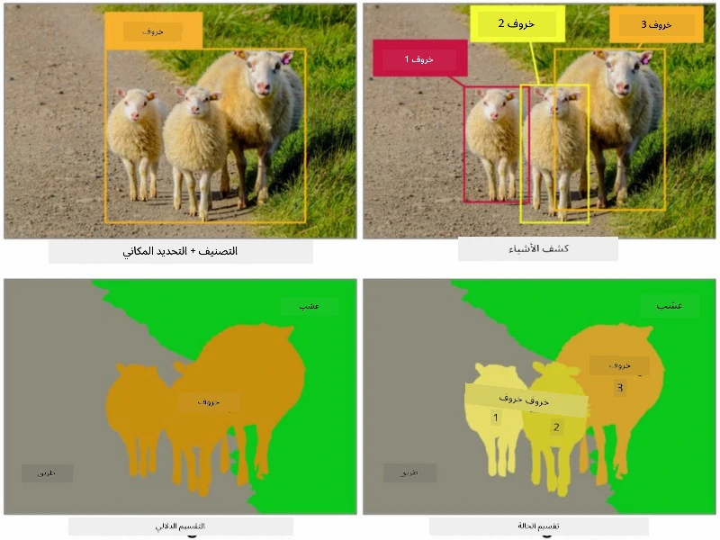
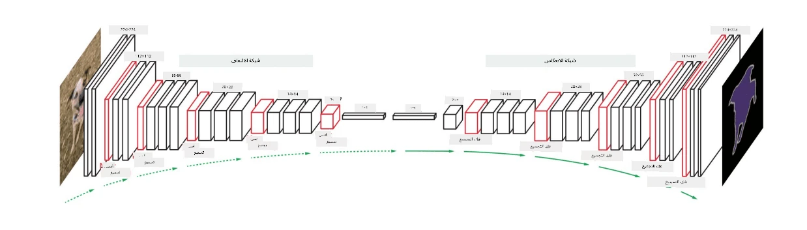
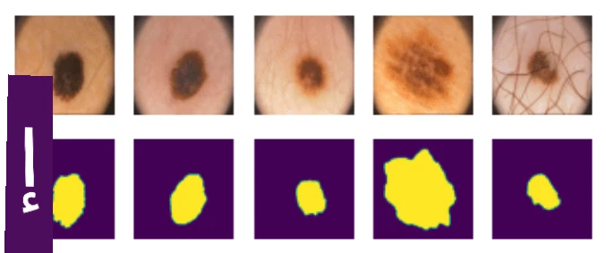

# التجزئة

لقد تعلمنا سابقًا عن اكتشاف الكائنات، الذي يسمح لنا بتحديد مواقع الكائنات في الصورة من خلال التنبؤ بـ *الصناديق المحيطة*. ومع ذلك، لبعض المهام، لا نحتاج فقط إلى الصناديق المحيطة، بل نحتاج أيضًا إلى تحديد مواقع الكائنات بدقة أكبر. تُعرف هذه المهمة بـ **التجزئة**.

## [اختبار ما قبل المحاضرة](https://ff-quizzes.netlify.app/en/ai/quiz/23)

يمكن اعتبار التجزئة على أنها **تصنيف البكسل**، حيث يجب علينا التنبؤ بفئة **كل** بكسل في الصورة (*الخلفية* تكون إحدى الفئات). هناك نوعان رئيسيان من خوارزميات التجزئة:

* **التجزئة الدلالية** تخبرنا فقط بفئة البكسل، ولا تميز بين الكائنات المختلفة من نفس الفئة.
* **تجزئة الكائنات** تقسم الفئات إلى كائنات مختلفة.

على سبيل المثال، في تجزئة الكائنات، تُعتبر هذه الأغنام كائنات مختلفة، ولكن في التجزئة الدلالية، تُعتبر جميع الأغنام ممثلة بفئة واحدة.

> الصورة مأخوذة من [هذه المقالة](https://nirmalamurali.medium.com/image-classification-vs-semantic-segmentation-vs-instance-segmentation-625c33a08d50)

هناك العديد من الهياكل العصبية للتجزئة، لكنها جميعًا تتبع نفس الهيكل. بطريقة ما، تشبه المشفر التلقائي الذي تعلمت عنه سابقًا، ولكن بدلاً من تفكيك الصورة الأصلية، هدفنا هو تفكيك **القناع**. وبالتالي، تحتوي شبكة التجزئة على الأجزاء التالية:

* **المشفّر** يستخرج الميزات من الصورة المدخلة.
* **المفكّك** يحوّل تلك الميزات إلى **صورة القناع**، بنفس الحجم وعدد القنوات التي تتوافق مع عدد الفئات.

> الصورة مأخوذة من [هذا المنشور](https://arxiv.org/pdf/2001.05566.pdf)

يجب أن نذكر بشكل خاص دالة الخسارة المستخدمة في التجزئة. عند استخدام المشفرات التلقائية التقليدية، نحتاج إلى قياس التشابه بين صورتين، ويمكننا استخدام متوسط الخطأ التربيعي (MSE) لتحقيق ذلك. في التجزئة، يمثل كل بكسل في صورة القناع الهدف رقم الفئة (مشفّر بطريقة one-hot على البعد الثالث)، لذلك نحتاج إلى استخدام دوال خسارة خاصة بالتصنيف - خسارة الانتروبيا المتقاطعة، ويتم حساب متوسطها على جميع البكسلات. إذا كان القناع ثنائيًا - يتم استخدام **خسارة الانتروبيا المتقاطعة الثنائية** (BCE).

> ✅ الترميز بطريقة one-hot هو طريقة لترميز تسمية الفئة في متجه بطول يساوي عدد الفئات. ألقِ نظرة على [هذه المقالة](https://datagy.io/sklearn-one-hot-encode/) حول هذه التقنية.

## التجزئة في التصوير الطبي

في هذا الدرس، سنرى التجزئة عمليًا من خلال تدريب الشبكة على التعرف على الشامات البشرية (المعروفة أيضًا بالوحمة) في الصور الطبية. سنستخدم <a href="https://www.fc.up.pt/addi/ph2%20database.html">قاعدة بيانات PH2</a> لصور الجلد كمصدر للصور. تحتوي هذه المجموعة على 200 صورة من ثلاث فئات: وحمة نموذجية، وحمة غير نموذجية، وسرطان الجلد. تحتوي جميع الصور أيضًا على **قناع** يحدد حدود الوحمة.

> ✅ هذه التقنية مناسبة بشكل خاص لهذا النوع من التصوير الطبي، ولكن ما هي التطبيقات الواقعية الأخرى التي يمكنك تخيلها؟

> الصورة مأخوذة من قاعدة بيانات PH2

سنقوم بتدريب نموذج لتجزئة أي وحمة من الخلفية.

## ✍️ تمارين: التجزئة الدلالية

افتح دفاتر الملاحظات أدناه لتتعرف أكثر على هياكل التجزئة الدلالية المختلفة، وتتمرن على العمل معها، وترى كيفية عملها.

* [التجزئة الدلالية باستخدام Pytorch](SemanticSegmentationPytorch.ipynb)
* [التجزئة الدلالية باستخدام TensorFlow](SemanticSegmentationTF.ipynb)

## [اختبار ما بعد المحاضرة](https://ff-quizzes.netlify.app/en/ai/quiz/24)

## الخاتمة

التجزئة هي تقنية قوية جدًا لتصنيف الصور، حيث تتجاوز الصناديق المحيطة إلى تصنيف على مستوى البكسل. تُستخدم هذه التقنية في التصوير الطبي، بالإضافة إلى تطبيقات أخرى.

## 🚀 التحدي

تجزئة الجسم هي واحدة فقط من المهام الشائعة التي يمكننا القيام بها باستخدام صور الأشخاص. تشمل المهام المهمة الأخرى **اكتشاف الهيكل العظمي** و**اكتشاف الوضعية**. جرّب مكتبة [OpenPose](https://github.com/CMU-Perceptual-Computing-Lab/openpose) لترى كيف يمكن استخدام اكتشاف الوضعية.

## المراجعة والدراسة الذاتية

تقدم [مقالة ويكيبيديا](https://wikipedia.org/wiki/Image_segmentation) نظرة عامة جيدة على التطبيقات المختلفة لهذه التقنية. تعرّف بنفسك على المجالات الفرعية لتجزئة الكائنات وتجزئة البانوراما في هذا المجال.

## [التكليف](lab/README.md)

في هذا المختبر، جرّب **تجزئة جسم الإنسان** باستخدام [مجموعة بيانات Segmentation Full Body MADS](https://www.kaggle.com/datasets/tapakah68/segmentation-full-body-mads-dataset) من Kaggle.

---

