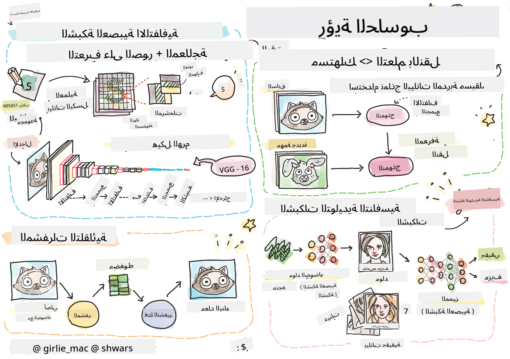

<!--
CO_OP_TRANSLATOR_METADATA:
{
  "original_hash": "58a52f000089c1d8906a4daa4ab1169b",
  "translation_date": "2025-08-26T09:02:20+00:00",
  "source_file": "lessons/4-ComputerVision/README.md",
  "language_code": "ar"
}
-->
# رؤية الحاسوب

في هذا القسم سنتعلم عن:

* [مقدمة في رؤية الحاسوب و OpenCV](06-IntroCV/README.md)
* [الشبكات العصبية الالتفافية](07-ConvNets/README.md)
* [الشبكات المدربة مسبقًا والتعلم بالنقل](08-TransferLearning/README.md) 
* [المشفّرات التلقائية](09-Autoencoders/README.md)
* [الشبكات التوليدية الخصامية](10-GANs/README.md)
* [كشف الكائنات](11-ObjectDetection/README.md)
* [التقسيم الدلالي](12-Segmentation/README.md)

**إخلاء المسؤولية**:  
تم ترجمة هذا المستند باستخدام خدمة الترجمة الآلية [Co-op Translator](https://github.com/Azure/co-op-translator). بينما نسعى لتحقيق الدقة، يرجى العلم أن الترجمات الآلية قد تحتوي على أخطاء أو معلومات غير دقيقة. يجب اعتبار المستند الأصلي بلغته الأصلية هو المصدر الموثوق. للحصول على معلومات حساسة أو هامة، يُوصى بالاستعانة بترجمة بشرية احترافية. نحن غير مسؤولين عن أي سوء فهم أو تفسيرات خاطئة ناتجة عن استخدام هذه الترجمة.