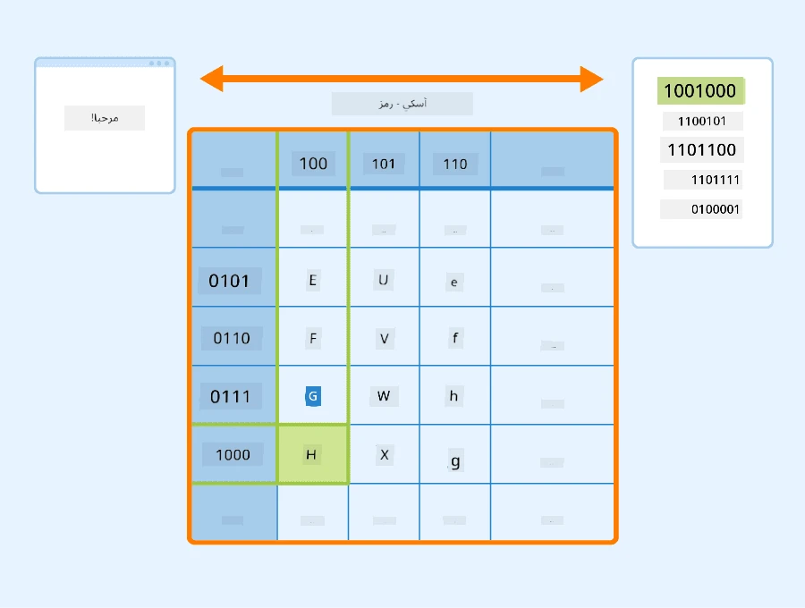
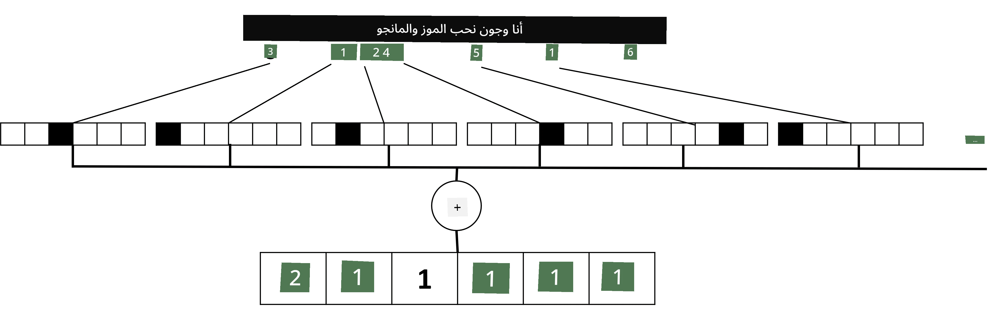

# تمثيل النصوص كموترات

## [اختبار ما قبل المحاضرة](https://ff-quizzes.netlify.app/en/ai/quiz/25)

## تصنيف النصوص

خلال الجزء الأول من هذا القسم، سنركز على مهمة **تصنيف النصوص**. سنستخدم مجموعة بيانات [AG News](https://www.kaggle.com/amananandrai/ag-news-classification-dataset)، التي تحتوي على مقالات إخبارية مثل المثال التالي:

* الفئة: العلوم/التكنولوجيا  
* العنوان: شركة في كنتاكي تفوز بمنحة لدراسة الببتيدات (AP)  
* النص: AP - شركة أسسها باحث في الكيمياء بجامعة لويفيل فازت بمنحة لتطوير...

هدفنا سيكون تصنيف الخبر إلى واحدة من الفئات بناءً على النص.

## تمثيل النصوص

إذا أردنا حل مهام معالجة اللغة الطبيعية (NLP) باستخدام الشبكات العصبية، نحتاج إلى طريقة لتمثيل النصوص كموترات. الحواسيب بالفعل تمثل الأحرف النصية كأرقام تُعرض كخطوط على الشاشة باستخدام ترميزات مثل ASCII أو UTF-8.

> [مصدر الصورة](https://www.seobility.net/en/wiki/ASCII)

كمستخدمين، نفهم ما يمثله كل حرف، وكيف تتجمع جميع الأحرف لتشكل كلمات الجملة. ومع ذلك، الحواسيب بحد ذاتها لا تمتلك هذا الفهم، والشبكة العصبية يجب أن تتعلم المعنى أثناء التدريب.

لذلك، يمكننا استخدام طرق مختلفة لتمثيل النصوص:

* **تمثيل على مستوى الحروف**، حيث نمثل النص بمعاملة كل حرف كرقم. بالنظر إلى أن لدينا *C* أحرف مختلفة في مجموعة النصوص، فإن كلمة *Hello* سيتم تمثيلها بموتر بحجم 5x*C*. كل حرف سيقابل عمودًا في الموتر باستخدام الترميز الواحد (one-hot encoding).  
* **تمثيل على مستوى الكلمات**، حيث ننشئ **قاموسًا** لجميع الكلمات في النصوص، ثم نمثل الكلمات باستخدام الترميز الواحد. هذه الطريقة أفضل إلى حد ما، لأن كل حرف بمفرده لا يحمل الكثير من المعنى، وبالتالي باستخدام مفاهيم دلالية أعلى - الكلمات - نبسط المهمة للشبكة العصبية. ومع ذلك، نظرًا لحجم القاموس الكبير، نحتاج إلى التعامل مع موترات عالية الأبعاد ومتناثرة.

بغض النظر عن الطريقة، يجب أولاً تحويل النص إلى سلسلة من **الرموز**، حيث يكون كل رمز إما حرفًا، كلمة، أو حتى جزءًا من كلمة. ثم نحول الرمز إلى رقم، عادة باستخدام **قاموس**، ويمكن إدخال هذا الرقم إلى الشبكة العصبية باستخدام الترميز الواحد.

## N-Grams

في اللغة الطبيعية، المعنى الدقيق للكلمات يمكن تحديده فقط في السياق. على سبيل المثال، معاني *neural network* و*fishing network* مختلفة تمامًا. إحدى الطرق لأخذ ذلك في الاعتبار هي بناء النموذج على أزواج الكلمات، واعتبار أزواج الكلمات كرموز منفصلة في القاموس. بهذه الطريقة، الجملة *I like to go fishing* سيتم تمثيلها بسلسلة الرموز التالية: *I like*, *like to*, *to go*, *go fishing*. المشكلة في هذه الطريقة هي أن حجم القاموس ينمو بشكل كبير، وتركيبات مثل *go fishing* و*go shopping* يتم تمثيلها برموز مختلفة، والتي لا تشترك في أي تشابه دلالي رغم استخدام نفس الفعل.

في بعض الحالات، يمكننا التفكير في استخدام tri-grams - تركيبات من ثلاث كلمات - أيضًا. وبالتالي، تُعرف هذه الطريقة غالبًا باسم **n-grams**. كما أنه من المنطقي استخدام n-grams مع التمثيل على مستوى الحروف، حيث ستقابل n-grams تقريبًا مقاطع مختلفة.

## حقيبة الكلمات (Bag-of-Words) وTF/IDF

عند حل مهام مثل تصنيف النصوص، نحتاج إلى تمثيل النص بواسطة متجه ثابت الحجم، والذي سنستخدمه كمدخل للمصنف النهائي الكثيف. إحدى أبسط الطرق للقيام بذلك هي دمج جميع تمثيلات الكلمات الفردية، على سبيل المثال، عن طريق جمعها. إذا جمعنا الترميزات الواحد لكل كلمة، سنحصل على متجه ترددات، يظهر عدد مرات ظهور كل كلمة داخل النص. يُعرف هذا التمثيل للنص باسم **حقيبة الكلمات** (BoW).

> صورة من المؤلف

تمثل حقيبة الكلمات الكلمات التي تظهر في النص وكمياتها، والتي يمكن أن تكون مؤشرًا جيدًا لما يدور حوله النص. على سبيل المثال، المقال الإخباري عن السياسة من المحتمل أن يحتوي على كلمات مثل *president* و*country*، بينما المنشور العلمي قد يحتوي على كلمات مثل *collider* و*discovered*، إلخ. وبالتالي، يمكن أن تكون ترددات الكلمات في كثير من الحالات مؤشرًا جيدًا لمحتوى النص.

المشكلة في حقيبة الكلمات هي أن بعض الكلمات الشائعة، مثل *and* و*is*، تظهر في معظم النصوص، ولديها أعلى الترددات، مما يخفي الكلمات التي تكون مهمة حقًا. يمكننا تقليل أهمية هذه الكلمات من خلال أخذ تردد ظهور الكلمات في مجموعة النصوص بأكملها في الاعتبار. هذه هي الفكرة الرئيسية وراء طريقة TF/IDF، التي يتم تناولها بمزيد من التفصيل في الدفاتر المرفقة مع هذا الدرس.

ومع ذلك، لا يمكن لأي من هذه الطرق أن تأخذ في الاعتبار **الدلالات** الكاملة للنص. نحن بحاجة إلى نماذج شبكات عصبية أكثر قوة للقيام بذلك، والتي سنناقشها لاحقًا في هذا القسم.

## ✍️ تمارين: تمثيل النصوص

واصل تعلمك في الدفاتر التالية:

* [تمثيل النصوص باستخدام PyTorch](TextRepresentationPyTorch.ipynb)  
* [تمثيل النصوص باستخدام TensorFlow](TextRepresentationTF.ipynb)  

## الخاتمة

حتى الآن، درسنا تقنيات يمكنها إضافة وزن التردد إلى الكلمات المختلفة. ومع ذلك، فهي غير قادرة على تمثيل المعنى أو الترتيب. كما قال اللغوي الشهير ج. ر. فيرث في عام 1935: "المعنى الكامل للكلمة دائمًا سياقي، ولا يمكن أخذ أي دراسة للمعنى بعيدًا عن السياق على محمل الجد." سنتعلم لاحقًا في الدورة كيفية التقاط المعلومات السياقية من النصوص باستخدام نمذجة اللغة.

## 🚀 تحدي

جرب بعض التمارين الأخرى باستخدام حقيبة الكلمات ونماذج بيانات مختلفة. قد تستلهم من هذه [المسابقة على Kaggle](https://www.kaggle.com/competitions/word2vec-nlp-tutorial/overview/part-1-for-beginners-bag-of-words)

## [اختبار ما بعد المحاضرة](https://ff-quizzes.netlify.app/en/ai/quiz/26)

## المراجعة والدراسة الذاتية

مارس مهاراتك في تضمين النصوص وتقنيات حقيبة الكلمات على [Microsoft Learn](https://docs.microsoft.com/learn/modules/intro-natural-language-processing-pytorch/?WT.mc_id=academic-77998-cacaste)

## [التكليف: دفاتر الملاحظات](assignment.md)

---

