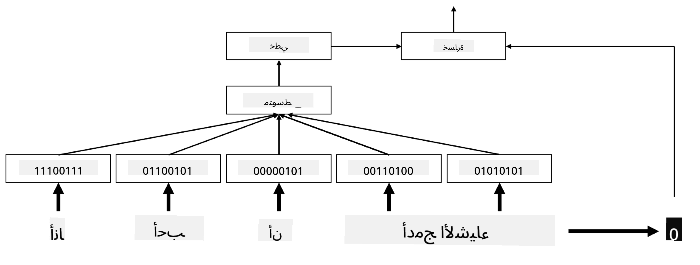

<!--
CO_OP_TRANSLATOR_METADATA:
{
  "original_hash": "e40b47ac3fd48f71304ede1474e66293",
  "translation_date": "2025-08-26T08:13:38+00:00",
  "source_file": "lessons/5-NLP/14-Embeddings/README.md",
  "language_code": "ar"
}
-->
# التضمينات

## [اختبار ما قبل المحاضرة](https://red-field-0a6ddfd03.1.azurestaticapps.net/quiz/114)

عند تدريب المصنفات بناءً على BoW أو TF/IDF، كنا نعمل على متجهات حقيبة الكلمات عالية الأبعاد بطول `vocab_size`، وكنا نقوم بتحويل المتجهات التمثيلية ذات الأبعاد المنخفضة إلى تمثيل نادر باستخدام الترميز الواحد. ومع ذلك، فإن هذا التمثيل الواحد ليس فعالًا من حيث الذاكرة. بالإضافة إلى ذلك، يتم التعامل مع كل كلمة بشكل مستقل عن الأخرى، أي أن المتجهات المشفرة بالترميز الواحد لا تعبر عن أي تشابه دلالي بين الكلمات.

فكرة **التضمين** هي تمثيل الكلمات بواسطة متجهات كثيفة ذات أبعاد أقل، والتي تعكس بطريقة ما المعنى الدلالي للكلمة. سنناقش لاحقًا كيفية بناء تضمينات كلمات ذات معنى، ولكن في الوقت الحالي دعونا نفكر في التضمينات كطريقة لتقليل أبعاد متجه الكلمة.

لذلك، ستأخذ طبقة التضمين كلمة كمدخل، وتنتج متجهًا مخرجيًا بحجم `embedding_size` المحدد. بمعنى ما، هي مشابهة جدًا لطبقة `Linear`، ولكن بدلًا من أخذ متجه مشفر بالترميز الواحد، ستكون قادرة على أخذ رقم الكلمة كمدخل، مما يسمح لنا بتجنب إنشاء متجهات مشفرة كبيرة.

باستخدام طبقة التضمين كطبقة أولى في شبكة المصنف الخاصة بنا، يمكننا الانتقال من نموذج حقيبة الكلمات إلى نموذج **حقيبة التضمينات**، حيث نقوم أولاً بتحويل كل كلمة في النص إلى التضمين المقابل لها، ثم نحسب دالة تجميعية مثل `sum` أو `average` أو `max` لجميع هذه التضمينات.

> الصورة بواسطة المؤلف

## ✍️ تمارين: التضمينات

واصل التعلم من خلال دفاتر الملاحظات التالية:
* [التضمينات باستخدام PyTorch](../../../../../lessons/5-NLP/14-Embeddings/EmbeddingsPyTorch.ipynb)
* [التضمينات باستخدام TensorFlow](../../../../../lessons/5-NLP/14-Embeddings/EmbeddingsTF.ipynb)

## التضمينات الدلالية: Word2Vec

بينما تعلمت طبقة التضمين كيفية تحويل الكلمات إلى تمثيل متجه، إلا أن هذا التمثيل لم يكن بالضرورة ذا معنى دلالي كبير. سيكون من الجيد تعلم تمثيل متجه بحيث تكون الكلمات المتشابهة أو المرادفات قريبة من بعضها البعض من حيث مسافة المتجه (مثل المسافة الإقليدية).

للقيام بذلك، نحتاج إلى تدريب نموذج التضمين مسبقًا على مجموعة كبيرة من النصوص بطريقة محددة. إحدى الطرق لتدريب التضمينات الدلالية تُسمى [Word2Vec](https://en.wikipedia.org/wiki/Word2vec). وهي تعتمد على بنيتين رئيسيتين تُستخدمان لإنتاج تمثيل موزع للكلمات:

- **حقيبة الكلمات المستمرة** (CBoW) — في هذه البنية، نقوم بتدريب النموذج للتنبؤ بالكلمة من السياق المحيط. بالنظر إلى النغرام $(W_{-2},W_{-1},W_0,W_1,W_2)$، هدف النموذج هو التنبؤ بـ $W_0$ من $(W_{-2},W_{-1},W_1,W_2)$.
- **التخطي المستمر** (Skip-Gram) — وهو عكس CBoW. يستخدم النموذج نافذة السياق المحيطة للتنبؤ بالكلمة الحالية.

CBoW أسرع، بينما Skip-Gram أبطأ ولكنه يقوم بتمثيل الكلمات النادرة بشكل أفضل.

> الصورة مأخوذة من [هذه الورقة البحثية](https://arxiv.org/pdf/1301.3781.pdf)

يمكن استخدام تضمينات Word2Vec المدربة مسبقًا (وكذلك نماذج مشابهة مثل GloVe) بدلاً من طبقة التضمين في الشبكات العصبية. ومع ذلك، نحتاج إلى التعامل مع المفردات، لأن المفردات المستخدمة لتدريب Word2Vec/GloVe مسبقًا قد تختلف عن المفردات في نصوصنا. ألقِ نظرة على دفاتر الملاحظات أعلاه لمعرفة كيفية حل هذه المشكلة.

## التضمينات السياقية

أحد القيود الرئيسية لتمثيلات التضمين المدربة مسبقًا مثل Word2Vec هو مشكلة تمييز معاني الكلمات. بينما يمكن للتضمينات المدربة مسبقًا أن تلتقط بعض معاني الكلمات في السياق، يتم ترميز كل المعاني الممكنة للكلمة في نفس التضمين. يمكن أن يسبب هذا مشاكل في النماذج اللاحقة، حيث أن العديد من الكلمات مثل كلمة "play" لها معانٍ مختلفة اعتمادًا على السياق الذي تُستخدم فيه.

على سبيل المثال، كلمة "play" في الجملتين التاليتين لها معانٍ مختلفة تمامًا:

- ذهبت إلى **عرض مسرحي** في المسرح.
- جون يريد أن **يلعب** مع أصدقائه.

التضمينات المدربة مسبقًا تمثل كلا المعنيين لكلمة "play" في نفس التضمين. للتغلب على هذا القيد، نحتاج إلى بناء تضمينات تعتمد على **نموذج اللغة**، الذي يتم تدريبه على مجموعة كبيرة من النصوص، ويعرف كيف يمكن للكلمات أن تتجمع في سياقات مختلفة. مناقشة التضمينات السياقية خارج نطاق هذا الدرس، ولكننا سنعود إليها عند الحديث عن نماذج اللغة لاحقًا في الدورة.

## الخاتمة

في هذا الدرس، اكتشفت كيفية بناء واستخدام طبقات التضمين في TensorFlow و PyTorch لتعكس بشكل أفضل المعاني الدلالية للكلمات.

## 🚀 تحدي

تم استخدام Word2Vec في بعض التطبيقات المثيرة للاهتمام، بما في ذلك إنشاء كلمات الأغاني والشعر. ألقِ نظرة على [هذه المقالة](https://www.politetype.com/blog/word2vec-color-poems) التي تشرح كيف استخدم المؤلف Word2Vec لإنشاء الشعر. شاهد [هذا الفيديو بواسطة Dan Shiffmann](https://www.youtube.com/watch?v=LSS_bos_TPI&ab_channel=TheCodingTrain) أيضًا لاكتشاف تفسير مختلف لهذه التقنية. ثم حاول تطبيق هذه التقنيات على نصوصك الخاصة، ربما من مصادر مثل Kaggle.

## [اختبار ما بعد المحاضرة](https://red-field-0a6ddfd03.1.azurestaticapps.net/quiz/214)

## المراجعة والدراسة الذاتية

اقرأ هذه الورقة البحثية عن Word2Vec: [Efficient Estimation of Word Representations in Vector Space](https://arxiv.org/pdf/1301.3781.pdf)

## [التكليف: دفاتر الملاحظات](assignment.md)

**إخلاء المسؤولية**:  
تم ترجمة هذا المستند باستخدام خدمة الترجمة بالذكاء الاصطناعي [Co-op Translator](https://github.com/Azure/co-op-translator). بينما نسعى لتحقيق الدقة، يرجى العلم أن الترجمات الآلية قد تحتوي على أخطاء أو معلومات غير دقيقة. يجب اعتبار المستند الأصلي بلغته الأصلية هو المصدر الموثوق. للحصول على معلومات حاسمة، يُوصى بالاستعانة بترجمة بشرية احترافية. نحن غير مسؤولين عن أي سوء فهم أو تفسيرات خاطئة ناتجة عن استخدام هذه الترجمة.