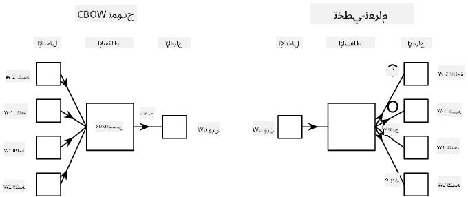

<!--
CO_OP_TRANSLATOR_METADATA:
{
  "original_hash": "31b46ba1f3aa78578134d4829f88be53",
  "translation_date": "2025-08-26T08:29:14+00:00",
  "source_file": "lessons/5-NLP/15-LanguageModeling/README.md",
  "language_code": "ar"
}
-->
# نمذجة اللغة

التضمينات الدلالية، مثل Word2Vec وGloVe، هي في الواقع خطوة أولى نحو **نمذجة اللغة** - إنشاء نماذج *تفهم* (أو *تمثل*) طبيعة اللغة بطريقة ما.

## [اختبار قبل المحاضرة](https://red-field-0a6ddfd03.1.azurestaticapps.net/quiz/115)

الفكرة الرئيسية وراء نمذجة اللغة هي تدريب النماذج على مجموعات بيانات غير معنونة بطريقة غير خاضعة للإشراف. هذا مهم لأن لدينا كميات هائلة من النصوص غير المعنونة المتاحة، بينما كمية النصوص المعنونة ستكون دائمًا محدودة بكمية الجهد الذي يمكننا إنفاقه على التوسيم. غالبًا ما يمكننا بناء نماذج لغة يمكنها **توقع الكلمات المفقودة** في النص، لأن إخفاء كلمة عشوائية في النص واستخدامها كعينة تدريب هو أمر سهل.

## تدريب التضمينات

في أمثلتنا السابقة، استخدمنا تضمينات دلالية مدربة مسبقًا، ولكن من المثير للاهتمام أن نرى كيف يمكن تدريب هذه التضمينات. هناك عدة أفكار يمكن استخدامها:

* **نمذجة اللغة باستخدام N-Gram**، حيث نتوقع رمزًا معينًا من خلال النظر إلى N من الرموز السابقة (N-gram).
* **كيس الكلمات المستمر** (CBoW)، حيث نتوقع الرمز الأوسط $W_0$ في تسلسل الرموز $W_{-N}$, ..., $W_N$.
* **Skip-gram**، حيث نتوقع مجموعة من الرموز المجاورة {$W_{-N},\dots, W_{-1}, W_1,\dots, W_N$} من الرمز الأوسط $W_0$.

> صورة من [هذه الورقة البحثية](https://arxiv.org/pdf/1301.3781.pdf)

## ✍️ دفاتر أمثلة: تدريب نموذج CBoW

واصل التعلم من خلال الدفاتر التالية:

* [تدريب Word2Vec باستخدام CBoW مع TensorFlow](../../../../../lessons/5-NLP/15-LanguageModeling/CBoW-TF.ipynb)
* [تدريب Word2Vec باستخدام CBoW مع PyTorch](../../../../../lessons/5-NLP/15-LanguageModeling/CBoW-PyTorch.ipynb)

## الخاتمة

في الدرس السابق رأينا أن تضمينات الكلمات تعمل كالسحر! الآن نعلم أن تدريب تضمينات الكلمات ليس مهمة معقدة جدًا، ويجب أن نكون قادرين على تدريب تضميناتنا الخاصة لنصوص متخصصة إذا لزم الأمر.

## [اختبار بعد المحاضرة](https://red-field-0a6ddfd03.1.azurestaticapps.net/quiz/215)

## المراجعة والدراسة الذاتية

* [البرنامج التعليمي الرسمي لـ PyTorch حول نمذجة اللغة](https://pytorch.org/tutorials/beginner/nlp/word_embeddings_tutorial.html).
* [البرنامج التعليمي الرسمي لـ TensorFlow حول تدريب نموذج Word2Vec](https://www.TensorFlow.org/tutorials/text/word2vec).
* استخدام إطار العمل **gensim** لتدريب التضمينات الأكثر استخدامًا في بضع أسطر من الكود موضح [في هذا التوثيق](https://pytorch.org/tutorials/beginner/nlp/word_embeddings_tutorial.html).

## 🚀 [مهمة: تدريب نموذج Skip-Gram](lab/README.md)

في المختبر، نتحداك لتعديل الكود من هذا الدرس لتدريب نموذج Skip-Gram بدلاً من CBoW. [اقرأ التفاصيل](lab/README.md)

**إخلاء المسؤولية**:  
تم ترجمة هذا المستند باستخدام خدمة الترجمة بالذكاء الاصطناعي [Co-op Translator](https://github.com/Azure/co-op-translator). بينما نسعى لتحقيق الدقة، يرجى العلم أن الترجمات الآلية قد تحتوي على أخطاء أو معلومات غير دقيقة. يجب اعتبار المستند الأصلي بلغته الأصلية المصدر الموثوق. للحصول على معلومات حاسمة، يُوصى بالاستعانة بترجمة بشرية احترافية. نحن غير مسؤولين عن أي سوء فهم أو تفسيرات خاطئة ناتجة عن استخدام هذه الترجمة.