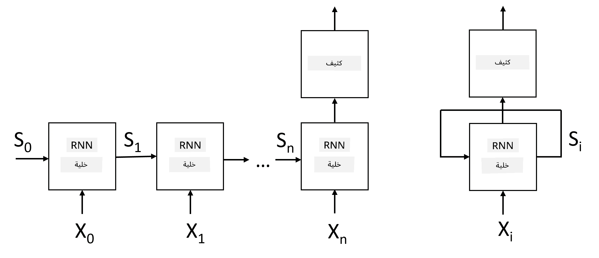
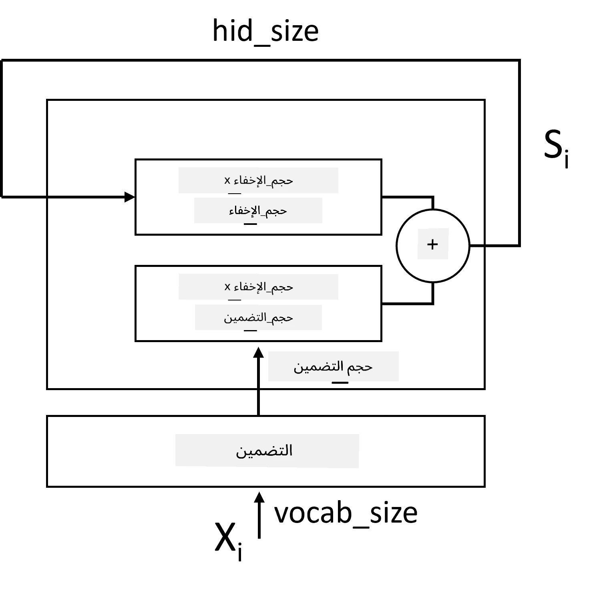
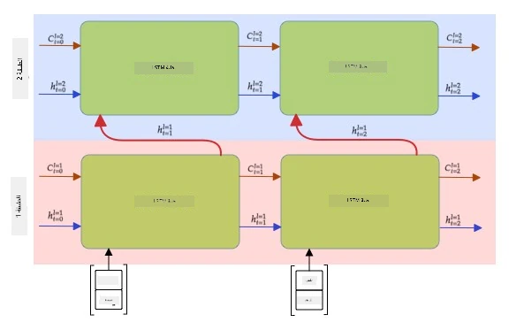

# الشبكات العصبية المتكررة

## [اختبار ما قبل المحاضرة](https://ff-quizzes.netlify.app/en/ai/quiz/31)

في الأقسام السابقة، كنا نستخدم تمثيلات دلالية غنية للنصوص مع مصنف خطي بسيط فوق التضمينات. ما تقوم به هذه البنية هو التقاط المعنى المجمع للكلمات في الجملة، لكنها لا تأخذ بعين الاعتبار **ترتيب** الكلمات، لأن عملية التجميع فوق التضمينات تزيل هذه المعلومات من النص الأصلي. وبسبب عدم قدرة هذه النماذج على نمذجة ترتيب الكلمات، فإنها لا تستطيع حل المهام الأكثر تعقيدًا أو الغموض مثل توليد النصوص أو الإجابة على الأسئلة.

للتقاط معنى تسلسل النصوص، نحتاج إلى استخدام بنية شبكة عصبية أخرى تُسمى **الشبكة العصبية المتكررة** أو RNN. في RNN، نقوم بتمرير الجملة عبر الشبكة رمزًا واحدًا في كل مرة، وتنتج الشبكة **حالة** معينة، والتي نمررها مرة أخرى إلى الشبكة مع الرمز التالي.

> الصورة من إعداد المؤلف

بالنظر إلى تسلسل المدخلات من الرموز X0,...,Xn، تقوم RNN بإنشاء تسلسل من كتل الشبكة العصبية، وتدرب هذا التسلسل من البداية إلى النهاية باستخدام الانتشار العكسي. كل كتلة شبكة تأخذ زوجًا (Xi,Si) كمدخل، وتنتج Si+1 كنتيجة. الحالة النهائية Sn أو (المخرج Yn) يتم تمريرها إلى مصنف خطي لإنتاج النتيجة. جميع كتل الشبكة تشترك في نفس الأوزان، ويتم تدريبها من البداية إلى النهاية باستخدام تمرير واحد للانتشار العكسي.

نظرًا لأن متجهات الحالة S0,...,Sn يتم تمريرها عبر الشبكة، فإنها تكون قادرة على تعلم الاعتماديات التسلسلية بين الكلمات. على سبيل المثال، عندما تظهر كلمة *not* في مكان ما في التسلسل، يمكنها تعلم نفي عناصر معينة داخل متجه الحالة، مما يؤدي إلى النفي.

> ✅ نظرًا لأن أوزان جميع كتل RNN في الصورة أعلاه مشتركة، يمكن تمثيل نفس الصورة ككتلة واحدة (على اليمين) مع حلقة تغذية راجعة متكررة، والتي تمرر حالة المخرج للشبكة مرة أخرى إلى المدخل.

## تشريح خلية RNN

دعونا نرى كيف يتم تنظيم خلية RNN بسيطة. تقبل الحالة السابقة Si-1 والرمز الحالي Xi كمدخلات، ويجب أن تنتج حالة المخرج Si (وفي بعض الأحيان، نهتم أيضًا بمخرج آخر Yi، كما هو الحال مع الشبكات التوليدية).

تحتوي خلية RNN بسيطة على مصفوفتين وزنيتين داخليًا: واحدة تحول رمز المدخل (دعونا نسميها W)، والأخرى تحول حالة المدخل (H). في هذه الحالة يتم حساب مخرج الشبكة كـ &sigma;(W&times;Xi+H&times;Si-1+b)، حيث &sigma; هي دالة التنشيط وb هو انحياز إضافي.

> الصورة من إعداد المؤلف

في كثير من الحالات، يتم تمرير رموز المدخل عبر طبقة تضمين قبل دخولها إلى RNN لتقليل الأبعاد. في هذه الحالة، إذا كان بُعد متجهات المدخل هو *emb_size*، ومتجه الحالة هو *hid_size* - فإن حجم W هو *emb_size*&times;*hid_size*، وحجم H هو *hid_size*&times;*hid_size*.

## الذاكرة طويلة وقصيرة المدى (LSTM)

إحدى المشاكل الرئيسية في RNN التقليدية هي مشكلة **تلاشي التدرجات**. نظرًا لأن RNN يتم تدريبها من البداية إلى النهاية في تمرير واحد للانتشار العكسي، فإنها تواجه صعوبة في نشر الخطأ إلى الطبقات الأولى من الشبكة، وبالتالي لا يمكن للشبكة تعلم العلاقات بين الرموز البعيدة. إحدى الطرق لتجنب هذه المشكلة هي إدخال **إدارة حالة صريحة** باستخدام ما يسمى بـ **البوابات**. هناك بنيتان معروفتان جيدًا من هذا النوع: **الذاكرة طويلة وقصيرة المدى** (LSTM) و**وحدة الترحيل ذات البوابات** (GRU).

> مصدر الصورة TBD

يتم تنظيم شبكة LSTM بطريقة مشابهة لـ RNN، ولكن هناك حالتان يتم تمريرهما من طبقة إلى أخرى: الحالة الفعلية C، والمتجه المخفي H. في كل وحدة، يتم دمج المتجه المخفي Hi مع المدخل Xi، ويتحكمان فيما يحدث للحالة C عبر **البوابات**. كل بوابة هي شبكة عصبية مع تنشيط سيجمويد (المخرج في النطاق [0,1])، والتي يمكن اعتبارها قناعًا بتًا عند ضربها في متجه الحالة. هناك البوابات التالية (من اليسار إلى اليمين في الصورة أعلاه):

* **بوابة النسيان** تأخذ المتجه المخفي وتحدد أي مكونات من المتجه C نحتاج إلى نسيانها وأيها نمررها.
* **بوابة الإدخال** تأخذ بعض المعلومات من المدخلات والمتجهات المخفية وتدخلها في الحالة.
* **بوابة المخرج** تحول الحالة عبر طبقة خطية مع تنشيط *tanh*، ثم تختار بعض مكوناتها باستخدام المتجه المخفي Hi لإنتاج حالة جديدة Ci+1.

يمكن اعتبار مكونات الحالة C كعلامات يمكن تشغيلها وإيقافها. على سبيل المثال، عندما نواجه اسم *Alice* في التسلسل، قد نرغب في افتراض أنه يشير إلى شخصية أنثوية، ونرفع العلامة في الحالة بأن لدينا اسمًا أنثويًا في الجملة. عندما نواجه لاحقًا عبارة *and Tom*، سنرفع العلامة بأن لدينا اسمًا جمعًا. وبالتالي من خلال التلاعب بالحالة يمكننا تتبع الخصائص النحوية لأجزاء الجملة.

> ✅ مورد ممتاز لفهم التفاصيل الداخلية لـ LSTM هو هذه المقالة الرائعة [Understanding LSTM Networks](https://colah.github.io/posts/2015-08-Understanding-LSTMs/) بواسطة Christopher Olah.

## الشبكات العصبية المتكررة ثنائية الاتجاه ومتعددة الطبقات

لقد ناقشنا الشبكات المتكررة التي تعمل في اتجاه واحد، من بداية التسلسل إلى نهايته. يبدو هذا طبيعيًا، لأنه يشبه الطريقة التي نقرأ بها ونستمع إلى الكلام. ومع ذلك، نظرًا لأننا في العديد من الحالات العملية لدينا وصول عشوائي إلى تسلسل المدخلات، فقد يكون من المنطقي تشغيل الحساب المتكرر في كلا الاتجاهين. تُسمى هذه الشبكات **الشبكات العصبية المتكررة ثنائية الاتجاه**. عند التعامل مع الشبكة ثنائية الاتجاه، سنحتاج إلى متجهين للحالة المخفية، واحد لكل اتجاه.

الشبكة المتكررة، سواء كانت أحادية الاتجاه أو ثنائية الاتجاه، تلتقط أنماطًا معينة داخل التسلسل، ويمكنها تخزينها في متجه الحالة أو تمريرها إلى المخرج. كما هو الحال مع الشبكات الالتفافية، يمكننا بناء طبقة متكررة أخرى فوق الأولى لالتقاط أنماط ذات مستوى أعلى والبناء من الأنماط ذات المستوى المنخفض المستخرجة بواسطة الطبقة الأولى. يؤدي هذا إلى مفهوم **الشبكة العصبية المتكررة متعددة الطبقات** التي تتكون من شبكتين متكررتين أو أكثر، حيث يتم تمرير مخرج الطبقة السابقة إلى الطبقة التالية كمدخل.

*الصورة من [هذا المنشور الرائع](https://towardsdatascience.com/from-a-lstm-cell-to-a-multilayer-lstm-network-with-pytorch-2899eb5696f3) بواسطة Fernando López*

## ✍️ تمارين: التضمينات

واصل تعلمك في الدفاتر التالية:

* [RNNs مع PyTorch](RNNPyTorch.ipynb)
* [RNNs مع TensorFlow](RNNTF.ipynb)

## الخاتمة

في هذه الوحدة، رأينا أن RNNs يمكن استخدامها لتصنيف التسلسلات، ولكن في الواقع، يمكنها التعامل مع العديد من المهام الأخرى، مثل توليد النصوص، الترجمة الآلية، والمزيد. سنناقش هذه المهام في الوحدة التالية.

## 🚀 تحدي

اقرأ بعض الأدبيات حول LSTMs وفكر في تطبيقاتها:

- [Grid Long Short-Term Memory](https://arxiv.org/pdf/1507.01526v1.pdf)
- [Show, Attend and Tell: Neural Image Caption
Generation with Visual Attention](https://arxiv.org/pdf/1502.03044v2.pdf)

## [اختبار ما بعد المحاضرة](https://ff-quizzes.netlify.app/en/ai/quiz/32)

## المراجعة والدراسة الذاتية

- [Understanding LSTM Networks](https://colah.github.io/posts/2015-08-Understanding-LSTMs/) بواسطة Christopher Olah.

## [التكليف: دفاتر الملاحظات](assignment.md)

---

