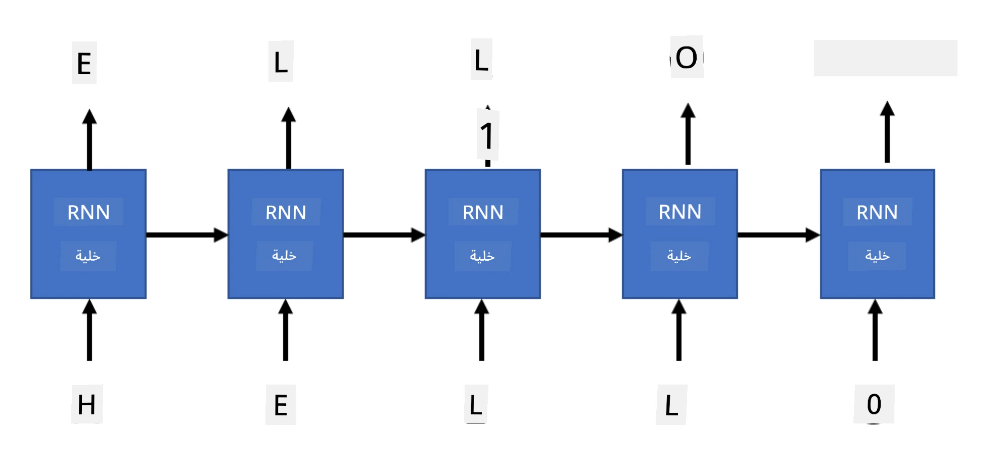

# الشبكات التوليدية

## [اختبار ما قبل المحاضرة](https://ff-quizzes.netlify.app/en/ai/quiz/33)

توفر الشبكات العصبية المتكررة (RNNs) ونسخها ذات الخلايا المغلقة مثل خلايا الذاكرة طويلة وقصيرة المدى (LSTMs) ووحدات التكرار المغلقة (GRUs) آلية لنمذجة اللغة، حيث يمكنها تعلم ترتيب الكلمات وتقديم توقعات للكلمة التالية في التسلسل. هذا يسمح لنا باستخدام RNNs في **المهام التوليدية**، مثل توليد النصوص العادية، الترجمة الآلية، وحتى وصف الصور.

> ✅ فكر في كل الأوقات التي استفدت فيها من المهام التوليدية مثل إكمال النص أثناء الكتابة. قم ببعض البحث حول تطبيقاتك المفضلة لترى ما إذا كانت تعتمد على RNNs.

في بنية RNN التي ناقشناها في الوحدة السابقة، كل وحدة RNN تنتج الحالة المخفية التالية كمخرج. ومع ذلك، يمكننا أيضًا إضافة مخرج آخر لكل وحدة متكررة، مما يسمح لنا بإنتاج **تسلسل** (يساوي في الطول التسلسل الأصلي). علاوة على ذلك، يمكننا استخدام وحدات RNN التي لا تقبل إدخالًا في كل خطوة، بل تأخذ فقط متجه حالة أولية، ثم تنتج تسلسلًا من المخرجات.

هذا يسمح ببنيات عصبية مختلفة كما هو موضح في الصورة أدناه:


> الصورة مأخوذة من منشور المدونة [Unreasonable Effectiveness of Recurrent Neural Networks](http://karpathy.github.io/2015/05/21/rnn-effectiveness/) بواسطة [Andrej Karpaty](http://karpathy.github.io/)

* **واحد إلى واحد** هو شبكة عصبية تقليدية مع إدخال واحد ومخرج واحد.
* **واحد إلى متعدد** هو بنية توليدية تقبل قيمة إدخال واحدة، وتنتج تسلسلًا من قيم المخرجات. على سبيل المثال، إذا أردنا تدريب شبكة **وصف الصور** التي تنتج وصفًا نصيًا للصورة، يمكننا إدخال صورة، تمريرها عبر CNN للحصول على حالتها المخفية، ثم استخدام سلسلة متكررة لتوليد الوصف كلمة بكلمة.
* **متعدد إلى واحد** يتوافق مع بنى RNN التي وصفناها في الوحدة السابقة، مثل تصنيف النصوص.
* **متعدد إلى متعدد** أو **تسلسل إلى تسلسل** يتوافق مع مهام مثل **الترجمة الآلية**، حيث تقوم أول سلسلة RNN بجمع كل المعلومات من تسلسل الإدخال في الحالة المخفية، وتقوم سلسلة RNN أخرى بفك هذه الحالة إلى تسلسل المخرجات.

في هذه الوحدة، سنركز على نماذج توليدية بسيطة تساعدنا في توليد النصوص. وللتبسيط، سنستخدم الترميز على مستوى الحروف.

سنقوم بتدريب RNN لتوليد النصوص خطوة بخطوة. في كل خطوة، سنأخذ تسلسلًا من الحروف بطول `nchars`، ونطلب من الشبكة توليد الحرف التالي لكل حرف إدخال:



عند توليد النصوص (أثناء الاستدلال)، نبدأ ببعض **المحفزات**، التي تمر عبر خلايا RNN لتوليد حالتها الوسيطة، ومن هذه الحالة يبدأ التوليد. نقوم بتوليد حرف واحد في كل مرة، ونمرر الحالة والحرف المُولد إلى خلية RNN أخرى لتوليد الحرف التالي، حتى يتم توليد عدد كافٍ من الحروف.


> الصورة بواسطة المؤلف

## ✍️ تمارين: الشبكات التوليدية

واصل التعلم في دفاتر الملاحظات التالية:

* [الشبكات التوليدية باستخدام PyTorch](GenerativePyTorch.ipynb)
* [الشبكات التوليدية باستخدام TensorFlow](GenerativeTF.ipynb)

## توليد النصوص الناعمة ودرجة الحرارة

مخرج كل خلية RNN هو توزيع احتمالي للحروف. إذا اخترنا دائمًا الحرف ذو الاحتمالية الأعلى كالحرف التالي في النص المُولد، غالبًا ما يصبح النص "متكررًا" بين نفس تسلسلات الحروف مرارًا وتكرارًا، كما في هذا المثال:

```
today of the second the company and a second the company ...
```

ومع ذلك، إذا نظرنا إلى توزيع الاحتمالات للحرف التالي، قد يكون الفرق بين أعلى الاحتمالات ليس كبيرًا، على سبيل المثال، قد يكون احتمال حرف 0.2، وآخر 0.19، وهكذا. على سبيل المثال، عند البحث عن الحرف التالي في التسلسل '*play*'، يمكن أن يكون الحرف التالي بنفس الاحتمالية إما مسافة أو **e** (كما في كلمة *player*).

هذا يقودنا إلى استنتاج أنه ليس من "العادل" دائمًا اختيار الحرف ذو الاحتمالية الأعلى، لأن اختيار الثاني الأعلى قد يؤدي أيضًا إلى نص ذو معنى. من الأفضل **أخذ عينات** من توزيع الاحتمالات الذي تقدمه الشبكة. يمكننا أيضًا استخدام معلمة، **درجة الحرارة**، لتسطيح توزيع الاحتمالات إذا أردنا إضافة المزيد من العشوائية، أو جعله أكثر انحدارًا إذا أردنا الالتزام أكثر بالحروف ذات الاحتمالية الأعلى.

استكشف كيف يتم تنفيذ هذا التوليد الناعم للنصوص في دفاتر الملاحظات المرتبطة أعلاه.

## الخاتمة

بينما قد يكون توليد النصوص مفيدًا بحد ذاته، تأتي الفوائد الرئيسية من القدرة على توليد النصوص باستخدام RNNs من بعض المتجهات الأولية. على سبيل المثال، يتم استخدام توليد النصوص كجزء من الترجمة الآلية (تسلسل إلى تسلسل، في هذه الحالة يتم استخدام متجه الحالة من *المشفّر* لتوليد أو *فك تشفير* الرسالة المترجمة)، أو توليد وصف نصي للصورة (وفي هذه الحالة يأتي متجه الميزات من مستخرج CNN).

## 🚀 تحدي

خذ بعض الدروس على Microsoft Learn حول هذا الموضوع

* توليد النصوص باستخدام [PyTorch](https://docs.microsoft.com/learn/modules/intro-natural-language-processing-pytorch/6-generative-networks/?WT.mc_id=academic-77998-cacaste)/[TensorFlow](https://docs.microsoft.com/learn/modules/intro-natural-language-processing-tensorflow/5-generative-networks/?WT.mc_id=academic-77998-cacaste)

## [اختبار ما بعد المحاضرة](https://ff-quizzes.netlify.app/en/ai/quiz/34)

## المراجعة والدراسة الذاتية

إليك بعض المقالات لتوسيع معرفتك

* طرق مختلفة لتوليد النصوص باستخدام سلسلة ماركوف، LSTM و GPT-2: [منشور مدونة](https://towardsdatascience.com/text-generation-gpt-2-lstm-markov-chain-9ea371820e1e)
* مثال لتوليد النصوص في [توثيق Keras](https://keras.io/examples/generative/lstm_character_level_text_generation/)

## [التكليف](lab/README.md)

لقد رأينا كيف يتم توليد النصوص حرفًا بحرف. في المختبر، ستستكشف توليد النصوص على مستوى الكلمات.

---

