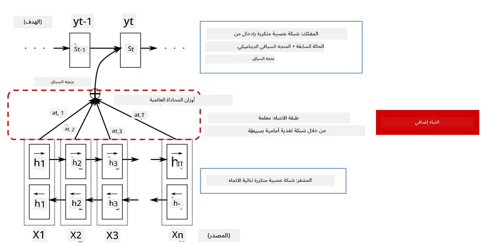
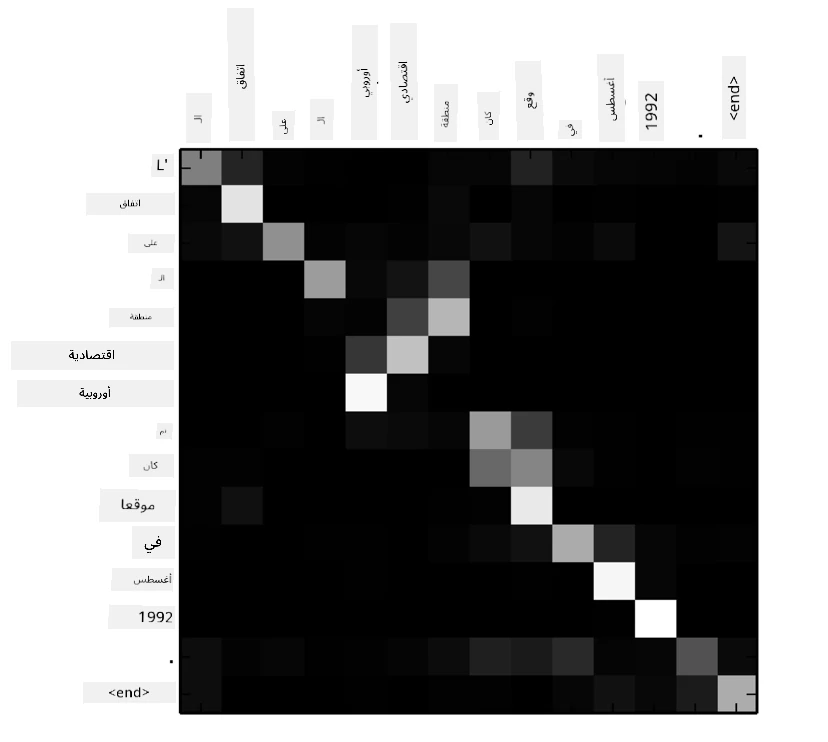
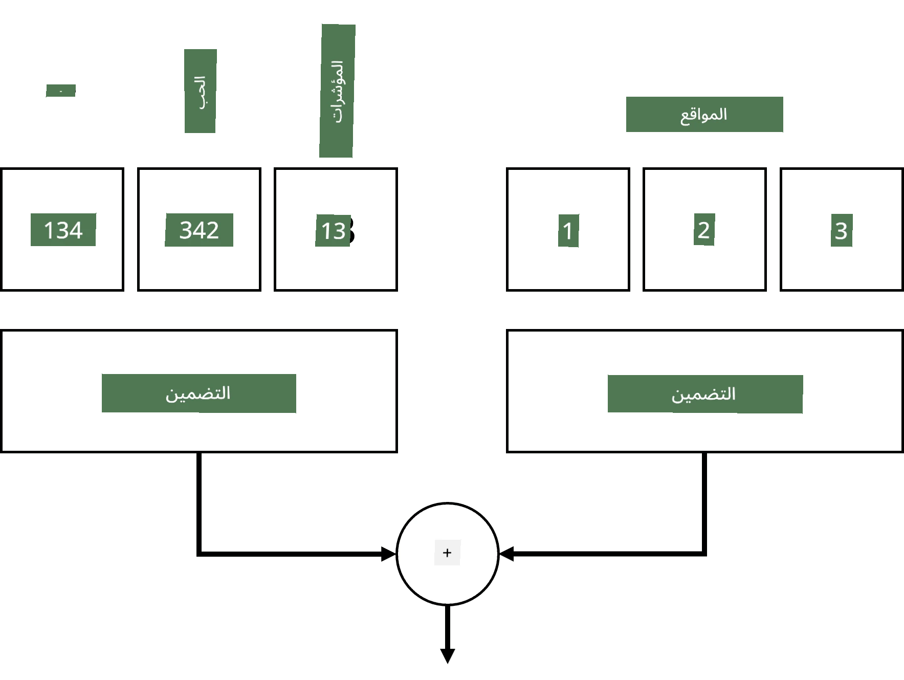
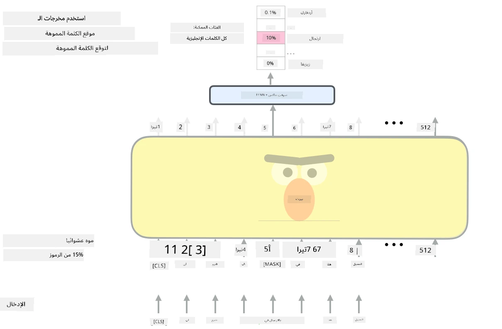

# آليات الانتباه ونماذج المحولات

## [اختبار ما قبل المحاضرة](https://ff-quizzes.netlify.app/en/ai/quiz/35)

إحدى أهم المشكلات في مجال معالجة اللغة الطبيعية (NLP) هي **الترجمة الآلية**، وهي مهمة أساسية تعتمد عليها أدوات مثل Google Translate. في هذا القسم، سنركز على الترجمة الآلية، أو بشكل عام، على أي مهمة *تحويل تسلسل إلى تسلسل* (والتي تُعرف أيضًا بـ **تحويل الجمل**).

مع الشبكات العصبية المتكررة (RNNs)، يتم تنفيذ تحويل التسلسل إلى تسلسل باستخدام شبكتين متكررتين، حيث تقوم إحدى الشبكات، وهي **المشفّر**، بضغط تسلسل الإدخال إلى حالة مخفية، بينما تقوم الشبكة الأخرى، وهي **المفكّك**، بفك هذه الحالة المخفية إلى نتيجة مترجمة. هناك بعض المشكلات في هذا النهج:

* الحالة النهائية لشبكة المشفّر تواجه صعوبة في تذكر بداية الجملة، مما يؤدي إلى ضعف جودة النموذج للجمل الطويلة.
* جميع الكلمات في التسلسل لها نفس التأثير على النتيجة. ومع ذلك، في الواقع، غالبًا ما يكون لبعض الكلمات في تسلسل الإدخال تأثير أكبر على المخرجات المتسلسلة مقارنة بغيرها.

**آليات الانتباه** توفر وسيلة لتحديد وزن تأثير كل متجه إدخال على كل توقع مخرجات للشبكة العصبية المتكررة. يتم تنفيذ ذلك من خلال إنشاء اختصارات بين الحالات الوسيطة لشبكة الإدخال وشبكة المخرجات. بهذه الطريقة، عند إنشاء رمز المخرجات yt، سنأخذ في الاعتبار جميع الحالات المخفية للإدخال hi، مع معاملات وزن مختلفة &alpha;t,i.

> نموذج المشفّر-المفكّك مع آلية انتباه إضافية في [Bahdanau et al., 2015](https://arxiv.org/pdf/1409.0473.pdf)، مقتبس من [هذه المقالة](https://lilianweng.github.io/lil-log/2018/06/24/attention-attention.html)

مصفوفة الانتباه {&alpha;i,j} تمثل درجة تأثير كلمات الإدخال على إنشاء كلمة معينة في تسلسل المخرجات. أدناه مثال على مثل هذه المصفوفة:

> الشكل من [Bahdanau et al., 2015](https://arxiv.org/pdf/1409.0473.pdf) (الشكل 3)

آليات الانتباه مسؤولة عن الكثير من الحالة الحالية أو القريبة من الحالة الحالية في معالجة اللغة الطبيعية. ومع ذلك، إضافة الانتباه يزيد بشكل كبير من عدد معلمات النموذج مما أدى إلى مشكلات في التوسع مع الشبكات العصبية المتكررة. أحد القيود الرئيسية لتوسيع الشبكات العصبية المتكررة هو أن الطبيعة المتكررة للنماذج تجعل من الصعب تجميع وتوازي التدريب. في الشبكات العصبية المتكررة، يجب معالجة كل عنصر من عناصر التسلسل بترتيب متسلسل مما يعني أنه لا يمكن توازيته بسهولة.

> الشكل من [مدونة Google](https://research.googleblog.com/2016/09/a-neural-network-for-machine.html)

اعتماد آليات الانتباه مع هذا القيد أدى إلى إنشاء نماذج المحولات التي أصبحت الآن الحالة الفنية المتقدمة مثل BERT و Open-GPT3.

## نماذج المحولات

إحدى الأفكار الرئيسية وراء المحولات هي تجنب الطبيعة المتسلسلة للشبكات العصبية المتكررة وإنشاء نموذج يمكن توازيته أثناء التدريب. يتم تحقيق ذلك من خلال تنفيذ فكرتين:

* تشفير المواضع
* استخدام آلية الانتباه الذاتي لالتقاط الأنماط بدلاً من الشبكات العصبية المتكررة (RNNs) أو الشبكات العصبية الالتفافية (CNNs) (لهذا السبب الورقة التي تقدم المحولات تُسمى *[Attention is all you need](https://arxiv.org/abs/1706.03762)*)

### تشفير/تضمين المواضع

فكرة تشفير المواضع هي كالتالي:
1. عند استخدام الشبكات العصبية المتكررة، يتم تمثيل الموضع النسبي للرموز بعدد الخطوات، وبالتالي لا يحتاج إلى تمثيل صريح.
2. ومع ذلك، بمجرد التحول إلى الانتباه، نحتاج إلى معرفة المواضع النسبية للرموز داخل التسلسل.
3. للحصول على تشفير المواضع، نقوم بتعزيز تسلسل الرموز بتسلسل مواضع الرموز في التسلسل (أي تسلسل الأرقام 0، 1، ...).
4. ثم نمزج موضع الرمز مع متجه تضمين الرمز. لتحويل الموضع (عدد صحيح) إلى متجه، يمكننا استخدام طرق مختلفة:

* تضمين قابل للتدريب، مشابه لتضمين الرموز. هذا هو النهج الذي نعتبره هنا. نطبق طبقات التضمين على كل من الرموز ومواضعها، مما ينتج عنه متجهات تضمين بنفس الأبعاد، والتي نضيفها معًا.
* وظيفة تشفير المواضع الثابتة، كما هو مقترح في الورقة الأصلية.

> الصورة بواسطة المؤلف

النتيجة التي نحصل عليها مع تضمين المواضع تضمّن كل من الرمز الأصلي وموضعه داخل التسلسل.

### الانتباه الذاتي متعدد الرؤوس

بعد ذلك، نحتاج إلى التقاط بعض الأنماط داخل تسلسلنا. لتحقيق ذلك، تستخدم المحولات آلية **الانتباه الذاتي**، وهي في الأساس انتباه يتم تطبيقه على نفس التسلسل كمدخلات ومخرجات. تطبيق الانتباه الذاتي يسمح لنا بأخذ **السياق** داخل الجملة في الاعتبار، ورؤية الكلمات التي ترتبط ببعضها البعض. على سبيل المثال، يسمح لنا برؤية الكلمات التي تشير إليها الإشارات المرجعية مثل *it*، وأيضًا أخذ السياق في الاعتبار:

> الصورة من [مدونة Google](https://research.googleblog.com/2017/08/transformer-novel-neural-network.html)

في المحولات، نستخدم **الانتباه متعدد الرؤوس** لمنح الشبكة القدرة على التقاط عدة أنواع مختلفة من العلاقات، مثل العلاقات طويلة الأمد مقابل قصيرة الأمد بين الكلمات، الإشارات المرجعية مقابل شيء آخر، إلخ.

[دفتر TensorFlow](TransformersTF.ipynb) يحتوي على المزيد من التفاصيل حول تنفيذ طبقات المحولات.

### انتباه المشفّر-المفكّك

في المحولات، يتم استخدام الانتباه في مكانين:

* لالتقاط الأنماط داخل النص المدخل باستخدام الانتباه الذاتي
* لتنفيذ ترجمة التسلسل - وهي طبقة الانتباه بين المشفّر والمفكّك.

انتباه المشفّر-المفكّك مشابه جدًا لآلية الانتباه المستخدمة في الشبكات العصبية المتكررة، كما هو موضح في بداية هذا القسم. يشرح هذا الرسم المتحرك دور انتباه المشفّر-المفكّك.

نظرًا لأن كل موضع إدخال يتم تحويله بشكل مستقل إلى كل موضع إخراج، يمكن للمحولات التوازي بشكل أفضل من الشبكات العصبية المتكررة، مما يتيح نماذج لغة أكبر وأكثر تعبيرًا. يمكن استخدام كل رأس انتباه لتعلم علاقات مختلفة بين الكلمات مما يحسن مهام معالجة اللغة الطبيعية.

## BERT

**BERT** (تمثيلات المشفّر ثنائية الاتجاه من المحولات) هو شبكة محولات متعددة الطبقات كبيرة جدًا تحتوي على 12 طبقة لـ *BERT-base*، و24 طبقة لـ *BERT-large*. يتم تدريب النموذج أولاً على مجموعة كبيرة من بيانات النصوص (ويكيبيديا + الكتب) باستخدام التدريب غير المراقب (توقع الكلمات المخفية في الجملة). أثناء التدريب الأولي، يمتص النموذج مستويات كبيرة من فهم اللغة التي يمكن استخدامها لاحقًا مع مجموعات بيانات أخرى باستخدام التخصيص. تُعرف هذه العملية بـ **التعلم بالنقل**.

> الصورة [المصدر](http://jalammar.github.io/illustrated-bert/)

## ✍️ تمارين: المحولات

واصل تعلمك في الدفاتر التالية:

* [المحولات في PyTorch](TransformersPyTorch.ipynb)
* [المحولات في TensorFlow](TransformersTF.ipynb)

## الخاتمة

في هذه الدرس، تعلمت عن المحولات وآليات الانتباه، وهي أدوات أساسية في صندوق أدوات معالجة اللغة الطبيعية. هناك العديد من التعديلات على بنية المحولات بما في ذلك BERT، DistilBERT، BigBird، OpenGPT3 والمزيد التي يمكن تخصيصها. حزمة [HuggingFace](https://github.com/huggingface/) توفر مستودعًا لتدريب العديد من هذه البنى باستخدام PyTorch وTensorFlow.

## 🚀 التحدي

## [اختبار ما بعد المحاضرة](https://ff-quizzes.netlify.app/en/ai/quiz/36)

## المراجعة والدراسة الذاتية

* [مقالة](https://mchromiak.github.io/articles/2017/Sep/12/Transformer-Attention-is-all-you-need/)، تشرح الورقة الكلاسيكية [Attention is all you need](https://arxiv.org/abs/1706.03762) حول المحولات.
* [سلسلة من المقالات](https://towardsdatascience.com/transformers-explained-visually-part-1-overview-of-functionality-95a6dd460452) حول المحولات، تشرح البنية بالتفصيل.

## [التكليف](assignment.md)

---

